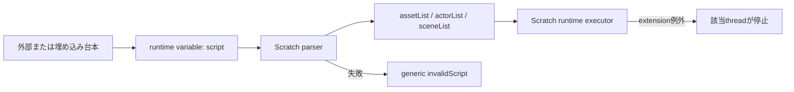
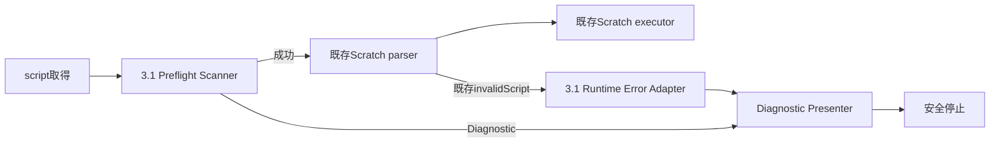
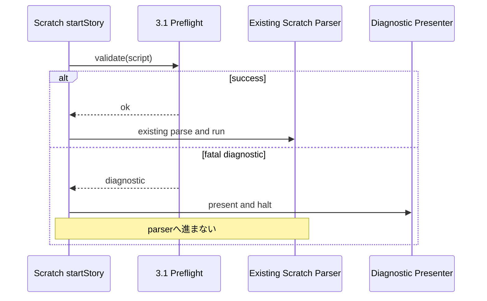

# DSL 3.1 台本診断・安全停止 設計レビュー

Copyright © 2026 Hiroya Kubo. この文書は[CC BY-SA 4.0](https://creativecommons.org/licenses/by-sa/4.0/)で提供します。

## 文書の位置付け

- 対象Issue: [#201](https://github.com/kubohiroya/tmpose-kamishibai/issues/201)
- 実装Issue: [#198](https://github.com/kubohiroya/tmpose-kamishibai/issues/198)
- 親Issue: [#200](https://github.com/kubohiroya/tmpose-kamishibai/issues/200)
- 状態: 2026-08-03承認済み。本文の「提案」は#198の実装仕様として採用する
- 対象バージョン: kamishibai DSL 3.1

この文書は、#198ですでに存在する未コミット差分を含め、DSL 3.1の台本診断をどこまでJavaScript機能拡張へ担当させるかを実装前に決めるためのものです。

## 1. 解決する問題

現在のDSL 3.1では、Scratchで実装されたパーサーが台本を処理します。正常な台本は実行できますが、異常な台本では次の問題があります。

- 未知のコマンドが検出されない、または後続処理で間接的に失敗する
- Asset ManagerやRuntime Expressionの例外で、そのScratch threadだけが終了することがある
- 台本の物理行番号と原文が失われ、利用者が修正位置を特定できない
- 一部のloopや入力listenerが残り、停止したことが画面から分かりにくい
- `invalidScript`表示は原因を区別せず、開発者向け情報も不足する

#198では、少なくとも次の6種類を詳しく表示して安全に停止する必要があります。

1. 非対応のkamishibaiバージョン
2. 非対応のトップレベルコマンド・アクションコマンド
3. `asset=`で指定したproject-localアセットアドレスを解決できない場合
4. `setSkin`、`pose`などから未定義アセット名を参照した場合
5. 未定義シーンへの遷移
6. Runtime Expressionで評価する式の文法エラー

## 2. 非目標

DSL 3.1安定化では、次を行いません。

- ScratchパーサーをJavaScriptで全面的に置き換える
- DSL 3.1の構文やコマンドを追加・変更する
- 4.0用の`StoryDocument`、Object Store、Iteratorを先行実装する
- 複数エラーの回復処理や、エラー後の途中再開を実装する
- 汎用Diagnostic Overlayの公開APIを#198の中で確定する
- 外部URLのネットワーク障害、カメラ権限拒否など、今回の6種類以外を網羅する

3.1用実装は、3.1の寿命を安全に延ばす互換パッチです。4.0のパーサー基盤には流用しません。

## 3. 現在の処理境界

現在は、`startStory`を受けたStageのScratch scriptがTemporary Variablesの`script`を読み、Scratchのlistとcustom blockを使って次の処理を行います。



Scratchパーサーは実行用listを作るための正本です。しかし、各行をlistへ変換した後には物理行番号が残りません。

## 4. 選択肢

| 選択肢                                                    | 長所                                          | 短所                                                      | 評価                |
| --------------------------------------------------------- | --------------------------------------------- | --------------------------------------------------------- | ------------------- |
| A. Scratchパーサーへ行番号と診断を追加                    | 文法の正本が一つ                              | 多数のblock変更が必要。行番号伝播が冗長で回帰範囲が大きい | 3.1パッチとして過大 |
| B. JavaScriptで3.1パーサーを全面再実装                    | テストしやすく詳しい診断を作れる              | 実行構造まで二重化し、4.0移行前に新しい処理系を抱える     | 採用しない          |
| C. JavaScriptの限定preflightと既存Scratchパーサーを直列化 | 行番号を保持でき、Scratch実装への変更が小さい | コマンド名と参照位置について限定的な重複が残る            | 提案                |
| D. 例外表示だけ追加し事前検証しない                       | 二重化が最小                                  | 未知コマンド、未定義参照、正確な行番号を検出できない      | 要件不足            |

## 5. 提案する全体構成

JavaScript側は「実行用データを生成しない限定preflight」とします。正常時の実行は、従来どおりScratchパーサーだけが担当します。



### 5.1 JavaScript側が担当すること

- 物理行単位の読み取り
- 空行、コメント、`---`の読み飛ばし
- 最初の`=`だけを区切りとするトップレベルcommandの抽出
- 3.1 version、command名、action名の照合
- asset、actor、scene、branchの宣言名収集
- 今回対象となるasset・scene参照の二段階検証
- 外部パッケージのsyntax-only APIを介した式・asset address検証
- 最初のfatal diagnosticの生成

### 5.2 JavaScript側が担当しないこと

- `sceneList`、`commandList`、`actionList`の生成
- action引数の実行用正規化
- scene実行順の決定
- actor cloneの生成
- Scratch custom blockの呼出し
- 台本の自動修復

### 5.3 Scratch側が引き続き担当すること

- 正常な台本から実行用listを生成すること
- scene/actionの実行
- actor、pose、input、transitionのライフサイクル
- feature flag OFF時の既存3.1動作

## 6. Diagnosticのデータモデル

3.1では最初のfatal errorを一つだけ返します。小学生の利用者へ同時に多数のエラーを表示しないためです。修正後に再実行すると、次のエラーを表示します。

```js
{
  severity: 'fatal',
  code: 'K31-SCENE-REF-001',
  phase: 'preflight',
  messageKey: 'diagnostic.undefinedScene',
  args: {scene: 'missing-scene'},
  source: {
    line: 12,
    column: 1,
    text: 'action=keyInputToChangeScene:ArrowRight:missing-scene'
  },
  technicalDetail: 'scene label was not found in the declaration pass'
}
```

### 6.1 必須フィールド

| フィールド        | 用途                                                   |
| ----------------- | ------------------------------------------------------ |
| `severity`        | 3.1では`fatal`固定                                     |
| `code`            | 言語に依存しない安定識別子                             |
| `phase`           | `preflight`、`parse`、`runtime`のどこで検出したか      |
| `messageKey`      | 日本語・英語表示用キー                                 |
| `args`            | アセット名、シーン名などの置換値                       |
| `source.line`     | 1始まりの物理行番号                                    |
| `source.column`   | 3.1では原則1。式parserが位置を返す場合は式内位置を加算 |
| `source.text`     | 元台本の該当行。表示前にXML escapeする                 |
| `technicalDetail` | テスト・開発者用。画面にはそのまま表示しない           |

### 6.2 診断コード案

| コード                  | 意味                                      |
| ----------------------- | ----------------------------------------- |
| `K31-VERSION-001`       | version指定なし・非対応version            |
| `K31-COMMAND-001`       | `key=value`形式ではない                   |
| `K31-COMMAND-002`       | 非対応トップレベルcommand                 |
| `K31-ACTION-001`        | 非対応actionまたはactor action            |
| `K31-ASSET-ADDRESS-001` | project-local asset addressを解決できない |
| `K31-ASSET-REF-001`     | actionなどから未定義asset名を参照した     |
| `K31-SCENE-REF-001`     | 未定義scene labelを参照した               |
| `K31-EXPRESSION-001`    | Runtime Expressionの文法エラー            |
| `K31-INTERNAL-001`      | 想定外の診断処理内部エラー                |

## 7. 限定的な二重化の管理

限定preflightでも、Scratchパーサーと次の情報が重複します。

- トップレベルcommand名
- global action名
- actor action名
- 各actionのどの引数がasset・scene参照か

この重複を隠してはいけません。3.1では次の制約を設けます。

1. `dsl31Contract`という一つの宣言表へcommand/action/ref位置を集約する
2. scannerの条件分岐へcommand名を直接散在させない
3. 全対応command/actionの正常fixtureを用意する
4. Scratch runtimeがfixtureを実行でき、preflightも同じfixtureを受理することを検証する
5. コマンドリファレンスに存在する名前とcontractの差分をテストする
6. 3.1で新しいcommandを追加する場合、contractとfixtureの更新をDoDへ含める

このcontractは実行用ASTを定義しません。4.0のschemaへ発展させない、3.1専用の互換表です。

## 8. 外部機能拡張との境界

### 8.1 Asset Manager

現在の未コミット案は、`costume:`、`backdrop:`、`sound:`を独自に分解し、TurboWarp runtime targetを直接検索します。この方法はAsset Managerのshorthand、曖昧性、将来のaddress形式とずれる可能性があります。

提案は、Asset Manager側へ副作用のないsyntax／project-local resolution APIを用意し、Kamishibai側はadapter経由で利用することです。

```js
validateProjectAssetAddress({name, resourceId});
// => {ok: true, normalized}
// => {ok: false, type, label, message}
```

このAPIはassetを登録せず、外部URLをfetchせず、cacheを変更しません。#198でAsset Managerの内部registryを直接参照しません。

もし3.1パッチで上流API追加を行わない場合は、現在の独自address parserを「3.1で使用中の4形式だけ」に限定し、Asset Managerと同じfixtureを双方のリポジトリで実行する必要があります。このfallbackを恒久APIにはしません。

### 8.2 Runtime Expression

現在の未コミット案は、`runtimeCondition` opcodeを呼び、実際に式を評価して文法を検証します。現実装は評価前に式全体をparseしますが、syntax-onlyとruntime evaluationの責務がAPI上で区別されません。

提案は、Runtime Expression側へsyntax-only APIを追加することです。

```js
validateConditionSyntax(expression);
// => {ok: true}
// => {ok: false, position, message}
```

このAPIはTemporary Variablesを読み書きせず、式を評価しません。Kamishibai側は返された`position`を台本行内columnへ変換します。

### 8.3 Temporary Variables

DSL 3.1はすでにTemporary Variablesへ依存しているため、台本文字列の取得には既存runtime variable `script`を使います。ただし、汎用Diagnosticや4.0 Object Storeの実装をTemporary Variables上へ構築する判断にはつなげません。

## 9. 実行タイミングと副作用

preflightは`startStory`を受け、既存のcontext削除、asset登録、actor生成、camera開始より前に一度だけ実行します。



preflightは次の副作用を禁止します。

- Scratch list、runtime variable、Stage variableの変更
- asset登録・削除
- network access
- cache access
- broadcast
- clone生成
- renderer skin生成

SVG skin生成と停止処理は、validation成功・失敗が確定した後のPresenterだけが行います。

## 10. feature flag

起動時固定のStage variable `featureDetailedScriptErrors`を使用し、既定値は`false`とします。

| flag | 動作                                                                      |
| ---- | ------------------------------------------------------------------------- |
| OFF  | preflightを実行せず、3.1.7と同じScratch parser／`invalidScript`経路を使う |
| ON   | Scratch parserより前にpreflightを実行し、fatalなら表示・停止する          |

値は最初の`startStory`時に一度だけ読み、そのproject実行中は固定します。再読込またはgreen flagより前の値変更だけを反映します。

## 11. 表示と安全停止

### 11.1 表示

- 480×360のStage全体を覆うSVG
- 日本語・英語をviewer languageに応じて切り替える
- 見出し、診断種別、行番号、利用者向け説明、該当行を表示する
- codeを小さく併記し、Issue報告で利用できるようにする
- 原文と置換値を必ずXML escapeする
- stack trace、ローカルpath、内部objectは表示しない
- 長い原文は省略表示し、完全な原文はDiagnosticデータに保持する

既存の`prompt` spriteを表示先として利用できますが、spriteがない場合を黙って無視してはいけません。Stage rendererへ表示できない場合は、既存の`invalidScript`テキスト表示へfallbackします。

### 11.2 停止順序

1. Diagnosticをextension内部の`lastDiagnostic`へ保存する
2. `runtime.stopAll()`でScratch threadを停止する
3. `PROJECT_STOP_ALL`によりAsync InputとAsset Managerのbackground処理が停止したことを確認する
4. PresenterがSVG skinを生成し、`prompt`へ直接適用する
5. error表示だけをvisibleにする

今回のpreflightはcamera開始前に実行するため、TMPose cameraの個別停止を通常は必要としません。将来runtime中エラーを同じPresenterへ渡す場合は、camera停止を別途契約化します。

### 11.3 再実行とcleanup

現在の未コミット案には、前回のerror状態を正常な再実行前に消去する明確な処理がありません。実装では次を必須とします。

- 各project start前に`lastDiagnostic`をclearする
- 前回生成したextension-owned SVG skinを破棄する
- promptを通常のskin・表示状態へ戻す
- error用runtime variableを互換目的で作る場合も全てclearする
- 連続して異なる異常台本を実行しても、一つ前の行番号や本文が残らない

## 12. 現在の未コミット案に対する評価

| 要素                                      | 評価               | 必要な変更                                                   |
| ----------------------------------------- | ------------------ | ------------------------------------------------------------ |
| 物理行を保持するscanner                   | 採用候補           | Diagnostic codeとcolumnを追加する                            |
| 最初の`=`だけで分割                       | 採用候補           | 正常fixtureで既存parserとの一致を確認する                    |
| command/actionの`Set`                     | 条件付き採用       | `dsl31Contract`へ統合し同期テストを追加する                  |
| 全台本を二段階で参照検証                  | 採用候補           | 今回対象の参照だけに限定する                                 |
| Asset Managerと別のaddress parser         | そのまま採用しない | 純粋API、または共有fixtureによる限定fallbackへ変更する       |
| `runtimeCondition`を実評価してsyntax確認  | そのまま採用しない | syntax-only APIへ変更する                                    |
| `runtime.stopAll()`後にrendererで直接表示 | 採用候補           | cleanup、fallback、日本語・英語、表示失敗テストを追加する    |
| error runtime variable群                  | 再検討             | extension内部状態を正本とし、必要なscalarだけ互換公開する    |
| app-local unsandboxed extensionの追加     | レビュー対象       | 3.1専用であること、追加許可回数、4.0で廃止することを確認する |
| 起動時固定・既定OFFのflag                 | 採用候補           | project start境界とテストを明記する                          |

## 13. テスト方針

### 13.1 純粋scannerテスト

- LF、CRLF、CRの行番号
- 空行、コメント、`---`
- 値に`=`が含まれる行
- 6種類の対象エラー
- source textとcolumn
- XML escape対象文字
- 連続実行時のdiagnostic clear

### 13.2 contract同期テスト

- 全トップレベルcommand正常fixture
- 全global action正常fixture
- 全actor action正常fixture
- command referenceとの名前一致
- preflight受理後にScratch parserが同じfixtureを処理できること

### 13.3 VM統合テスト

- flag OFFで既存動作が変わらない
- flag ONでScratch parserの副作用前に停止する
- SVGが表示される
- runtime threadが残らない
- Async Input bindingとactor animationが残らない
- 日本語・英語表示
- error修正後の再実行で前回表示が残らない

### 13.4 実TurboWarpスモークテスト

#205の手順に、flag OFF／ON、非サンドボックス許可回数、異常台本表示を追加します。

## 14. ロールバック

- feature flag OFFで3.1.7相当の経路へ即時に戻せる
- app-local extensionとhidden blockを小粒PRでrevertできる
- Asset Manager／Runtime Expressionへ追加するsyntax-only APIは後方互換の追加APIとし、Kamishibai側revert後も既存blockへ影響させない
- 3.1.8公開後に重大な問題が見つかった場合は、3.1.8を上書きせずdeprecateし、修正版を新しいpatch versionで公開する

## 15. レビュー結果

2026-08-03に次の8項目を承認しました。この決定をもって#201のレビューゲートを解除し、#198は以下の制約内で再開できます。

| #   | 判断                                                           | 承認結果                                                                                                                                                    |
| --- | -------------------------------------------------------------- | ----------------------------------------------------------------------------------------------------------------------------------------------------------- |
| 1   | 選択肢C「限定preflight + 既存Scratch parser」                  | 採用する。JavaScript側は実行用データを生成しない                                                                                                            |
| 2   | 最初のfatal diagnostic一つだけを表示                           | 採用する。修正後の再実行で次のerrorを表示する                                                                                                               |
| 3   | command/action/ref位置の限定的重複                             | `dsl31Contract`と同期テストを条件に許容する                                                                                                                 |
| 4   | Asset Managerのproject-local address検証                       | 独立したAsset Managerモジュールへ副作用のないAPIを追加する。Kamishibai内の独自parserを恒久採用せず、共有fixture付きfallbackも今回の正規経路にはしない       |
| 5   | Runtime Expressionのsyntax検証                                 | 独立したRuntime Expressionモジュールへsyntax-only APIを追加する。式を実評価する検証は採用しない                                                             |
| 6   | 3.1専用app-local extension `kubohiroyakamishibairuntime`の追加 | 許容する。既定OFFの起動時固定flagで導入し、4.0の汎用基盤には流用しない                                                                                      |
| 7   | error表示言語                                                  | 日本語・英語の両方を提供する                                                                                                                                |
| 8   | 現在の#198未コミット差分の扱い                                 | 修正ベースとして利用する。表12の採用候補だけを残し、独自asset address parser、式の実評価、cleanup不足、散在するcommand/action定義は承認済み設計へ置き換える |

実装中にこの責務境界を変更する必要が生じた場合は、#198へ理由と代替案を記録し、実装を進める前に本設計を再レビューします。
