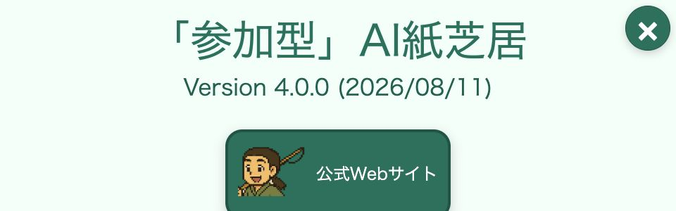
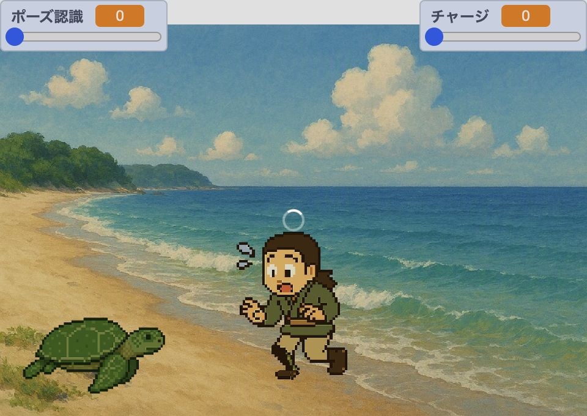

# DSL 4.0固定実装のローカル追試

Copyright © 2026 Hiroya Kubo. この文書は[CC BY-SA 4.0](https://creativecommons.org/licenses/by-sa/4.0/)で提供します。

文書状態: DSL 4.0リリース前の開発者向け追試手順\
管理Issue: [#103](https://github.com/kubohiroya/tmpose-kamishibai-docs/issues/103)\
対象: 固定実装の動作と文書を追試する人\
想定時間: 20〜30分

この手順では、固定したruntimeと浦島太郎サンプルをローカルでbuildし、タイトル、プレイ、
ポーズ待機までをブラウザーで確認します。最後に同じYAMLを検証し、入力と成果物のSHA-256を照合します。

これは正式公開プレイヤーの操作説明ではありません。画面内の`Version 4.0.0`は固定成果物の実装
メタデータです。GitHub Releaseとnpmの`latest`は、この記録時点では3.2.3です。公開後の初心者向け手順と
スクリーンショットは、[紙芝居を遊ぶ](../tutorials/play.md)と
[紙芝居を作る](../tutorials/create.md)で別に完成させます。

## 完了するとできること

- 二つのrepositoryを検証済みcommitへ固定できる
- 浦島太郎DSL 4.0 Web成果物を同じ入力から再生成できる
- localhostでタイトル、プレイ、ポーズfeedbackを確認できる
- production frontendでYAMLを副作用なしに検証できる
- YAML、SB3、Web成果物のSHA-256を記録値と照合できる

## 0. 再現基準を確認する

| 項目     | 固定値                                                                          |
| -------- | ------------------------------------------------------------------------------- |
| runtime  | `kubohiroya/tmpose-kamishibai@8ea06bfd100b106f559cb25a280fab5570e42919`         |
| sample   | `kubohiroya/tmpose-kamishibai-samples@dc9f6626de9ef85ca71312402fd139082922b867` |
| source   | `stories/urashima/urashima.k4.yml`                                              |
| SB3      | `stories/urashima/urashima-4.0.sb3`                                             |
| Web      | `dist/stories/urashima/web-4.0/index.html`                                      |
| Packager | `@turbowarp/packager@3.13.0`                                                    |

sample commitはDraft PR
[`tmpose-kamishibai-samples#91`](https://github.com/kubohiroya/tmpose-kamishibai-samples/pull/91)の
headです。公開URLや正式starterを表す値ではありません。

## 1. 固定commitを取得する

作業用directoryで二つのrepositoryを隣り合わせにcloneします。既存checkoutへ上書きしないでください。

```bash
mkdir dsl4-implementation-walkthrough
cd dsl4-implementation-walkthrough
git clone https://github.com/kubohiroya/tmpose-kamishibai.git
git clone https://github.com/kubohiroya/tmpose-kamishibai-samples.git
git -C tmpose-kamishibai checkout 8ea06bfd100b106f559cb25a280fab5570e42919
git -C tmpose-kamishibai-samples checkout dc9f6626de9ef85ca71312402fd139082922b867
```

checkout結果を確認します。

```bash
git -C tmpose-kamishibai rev-parse HEAD
git -C tmpose-kamishibai-samples rev-parse HEAD
```

二行が表のruntime、sample commitと完全に一致したときだけ先へ進みます。

## 2. 依存を固定してbuildする

Node.js 22.12.0以上とCorepackを使用します。各repositoryの`packageManager`に記録されたpnpmを使い、
lockfileを更新せずに依存を導入します。

```bash
(cd tmpose-kamishibai && corepack pnpm install --frozen-lockfile)
(cd tmpose-kamishibai-samples && corepack pnpm install --frozen-lockfile)
```

sample siteをbuildします。

```bash
(cd tmpose-kamishibai-samples && corepack pnpm build)
```

このbuildは、隣接する固定runtimeから浦島太郎DSL 4.0のSB3とWeb版を生成し、同じ入力から二回生成した
byte列、artifact lock、Web artifact lockが一致することを検証します。runtimeまたはsample checkoutが
dirtyな場合は、意図しない入力を成果物へ混ぜないため停止します。

## 3. localhostでWeb版を開く

生成した`dist/`をlocalhostだけで配信します。

```bash
cd tmpose-kamishibai-samples
python3 -m http.server 4173 --directory dist
```

ブラウザーで次を開きます。

```text
http://127.0.0.1:4173/stories/urashima/web-4.0/
```

タイトル上部に作品名、`Version 4.0.0`、公式Webサイトボタン、右上の閉じるボタンが表示されます。



この画像は個人情報を含む下部を撮影範囲から外した実装スナップショットです。正式チュートリアル用の
`P-02`ではありません。

## 4. プレイを開始する

右上の閉じるボタンでタイトルを閉じ、物語を開始します。浜辺、浦島太郎、亀が表示され、吹き出しが
進むことを確認します。

## 5. ポーズfeedbackを確認する

`Urashima.pose`へ到達すると、画面上端にポーズ認識度とチャージが表示されます。



中央の円形表示は、撮影時にポーズモデルを準備していた`progressbar`です。画面を整えるために消した
表示ではなく、同じ実行sessionで観測した状態です。

この追試ではcamera映像を撮影しません。実際にポーズを成立させる場合は、camera利用に同意した成人が、
背景と映り込みを確認したうえで現在のlocalhostへcameraを許可します。拒否したままでも、物語画面を
維持してポーズ待機へ到達するところまでは確認できます。

## 6. YAMLを検証する

配信serverは`Ctrl-C`で終了します。その後、sample repository rootで固定runtimeのproduction frontendを
使ってYAMLを検証します。

```bash
node ../tmpose-kamishibai/bin/tmpose-kamishibai.mjs validate-dsl4 \
  --input stories/urashima/urashima.k4.yml \
  --max-source-bytes 262144 \
  --format pretty
```

正常な固定入力では次を表示し、終了statusは`0`です。

```text
urashima.k4.yml: valid
```

このcommandは台本だけを検証し、SB3やWeb成果物を書き換えません。

## 7. SHA-256を照合する

Node.jsだけで三つのfileを照合できます。

```bash
node --input-type=module -e 'import {createHash} from "node:crypto"; import {readFileSync} from "node:fs"; for (const file of process.argv.slice(1)) console.log(`${createHash("sha256").update(readFileSync(file)).digest("hex")}  ${file}`);' \
  stories/urashima/urashima.k4.yml \
  stories/urashima/urashima-4.0.sb3 \
  dist/stories/urashima/web-4.0/index.html
```

| file                 | SHA-256                                                            |
| -------------------- | ------------------------------------------------------------------ |
| `urashima.k4.yml`    | `9ff92d07fb6851ddb07cc6f13d20fc9023b2c90605d2533fec89cb9fdbb1faa2` |
| `urashima-4.0.sb3`   | `a198352ed1785261fe41ba1b0333914664ca33434da1a9bf3ba9dc56ba81de1a` |
| `web-4.0/index.html` | `6a458145f63df77a80258c5ec2956f0608a1b7e2cedd290db0267e1328dc5ae1` |

一致しない場合は、両repositoryのHEAD、dirty file、Node.jsとpnpm、lockfile、生成先が同じかを確認します。
値を合わせるために成果物を手で編集しないでください。

## 完了チェック

- [ ] runtimeとsampleのHEADを固定commitへ合わせた
- [ ] lockfileを変更せず依存を導入した
- [ ] `pnpm build`がartifact lockとWeb artifact lockを検証した
- [ ] localhostでタイトルとプレイ画面を確認した
- [ ] ポーズ認識度とチャージの表示へ到達した
- [ ] `validate-dsl4`が`urashima.k4.yml: valid`を返した
- [ ] YAML、SB3、Web HTMLのSHA-256がすべて一致した

## 正式チュートリアルへの引き継ぎ

本ページの2画像には`P-01`〜`P-08`または`C-01`〜`C-13`を割り当てません。正式release、公開starter、
公開URL、最終UI、撮影環境が固定された後、
[スクリーンショット台帳](../tutorials/screenshots.json)のgateを満たす画像を別に取得します。
実装スナップショットの撮影条件とlicenseは
[DSL 4.0実装ビジュアル記録](../../DSL4-IMPLEMENTATION-VISUALS.md)を参照してください。
