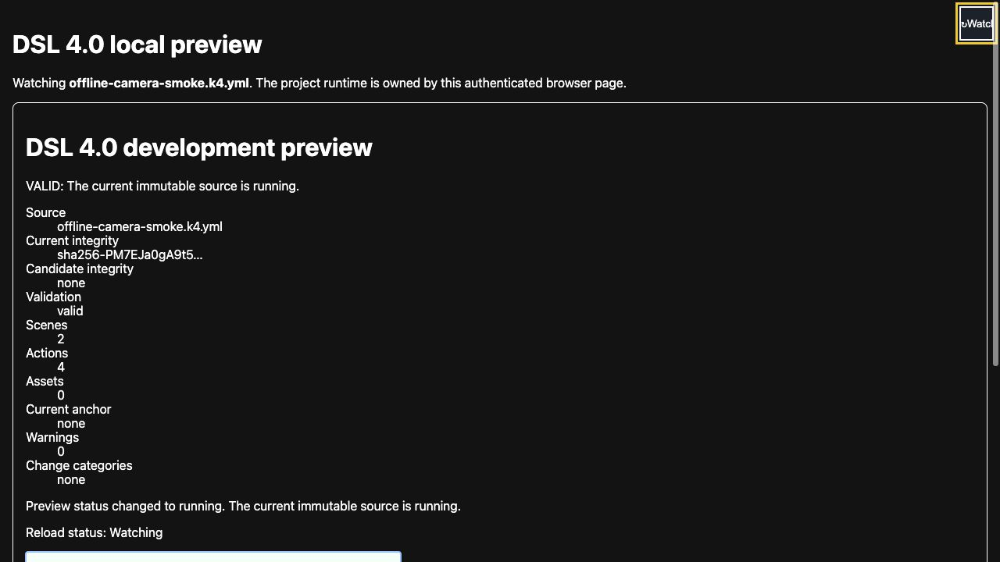
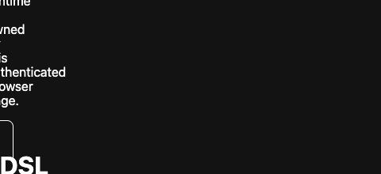
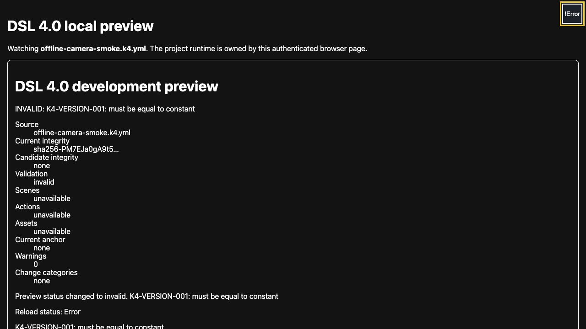

# DSL 4.0 rc.8実装のローカル追試

Copyright © 2026 Hiroya Kubo. この文書は[CC BY-SA 4.0](https://creativecommons.org/licenses/by-sa/4.0/)で提供します。

文書状態: 公開プレリリース`4.0.0-rc.8`の開発者向け追試手順\
管理Issue: [#157](https://github.com/kubohiroya/tmpose-kamishibai-docs/issues/157)\
対象: rc.8の実動作、live reload、内部仕様を確認する人\
想定時間: 15〜25分

この手順では、`tmpose-kamishibai@4.0.0-rc.8`と公開rc.8 SB3を固定し、任意のDSL 4 projectを
development-only local previewで実行します。正常稼働、タイトルversion、invalid保存時の診断、復旧を
同じbrowser sessionで確認します。`tmpose-kamishibai-samples`は取得・build・変更しません。

`4.0.0-rc.8`は公開済みのrelease candidateですが、安定版`4.0.0`ではありません。画面は作者向け
local previewであり、配布作品の通常再生画面とは役割が異なります。

## 完了すると確認できること

- runtime、tag、公開SB3の同一性
- immutable source generationが実TurboWarp runtimeで稼働していること
- `Version 4.0.0-rc.8`がbase runtimeのタイトルへ反映されていること
- invalid candidateがcurrent integrityを置き換えないこと
- source、runtime、port、live reload、asset transactionを結ぶ実装図

## 0. 再現基準

| 項目             | 固定値                                                             |
| ---------------- | ------------------------------------------------------------------ |
| runtime tag      | `v4.0.0-rc.8`                                                      |
| runtime commit   | `29c0deadcb98badf94a0244c479ca896dc71f842`                         |
| npm channel      | `@kubohiroya/tmpose-kamishibai@4.0.0-rc.8`（`next`）               |
| 公開base SB3     | `kamishibai-4.0.0-rc.8.sb3`                                        |
| base SB3 SHA-256 | `91d7f594aaf922450fba359a90c7c26e7c1dfda51cf002534cb4605dbb0d7041` |
| browser surface  | Codex In-app Browser、1280×720 CSS px                              |

## 1. runtimeを固定する

Node.js 22.12.0以上とCorepackを使用します。既存checkoutを上書きしない作業用directoryで実行します。

```bash
git clone https://github.com/kubohiroya/tmpose-kamishibai.git
cd tmpose-kamishibai
git switch --detach v4.0.0-rc.8
corepack pnpm install --frozen-lockfile
git rev-parse HEAD
node bin/tmpose-kamishibai.mjs --version
```

最後の二行が固定commitと`4.0.0-rc.8`を返すことを確認します。

公開SB3は[GitHub prerelease](https://github.com/kubohiroya/tmpose-kamishibai/releases/tag/v4.0.0-rc.8)または
[Pagesのダウンロード画面](https://kubohiroya.github.io/tmpose-kamishibai/downloads/)から取得し、
SHA-256を照合します。

```bash
shasum -a 256 /path/to/kamishibai-4.0.0-rc.8.sb3
```

## 2. 追試用projectを用意する

既存projectを使う場合は、作業用copyを用意してください。最小projectは次の2fileです。

```json
{
  "formatVersion": 1,
  "mode": "external",
  "sourceId": "main",
  "path": "story.k4.yml"
}
```

```yaml
kamishibai: '4.0'
scenes:
  opening: []
```

上をそれぞれ`project.source.json`、`story.k4.yml`として同じdirectoryへ保存します。実際の撮影では、
runtime repositoryの作業用camera smoke projectを一時copyし、2 scenes／4 actionsのsourceを使いました。
撮影用projectは文書repositoryとsamples repositoryの外に置き、cameraは許可していません。

## 3. local previewを起動する

runtime repository rootで次を実行します。`PROJECT_ROOT`と`BASE_SB3`は自分の絶対pathへ置き換えます。

```bash
node bin/tmpose-kamishibai.mjs preview-dsl4 --watch \
  --base BASE_SB3 \
  --project-root PROJECT_ROOT \
  --source-manifest project.source.json \
  --control-profile production \
  --channel bundled \
  --max-source-bytes 65536 \
  --max-asset-file-bytes 8388608 \
  --max-asset-files 16 \
  --max-total-asset-bytes 16777216 \
  --replace-existing
```

commandはloopbackだけへbindし、一回限りの認証情報を持つbrowser pageを開きます。raw YAML、絶対path、tokenは
runtime generationのwire payloadへ含めません。正常時は`VALID: The current immutable source is running.`、
`Reload status: Watching`を表示します。



_撮影時のrc.5実画面。2 scenes、4 actions、0 warnings、candidate integrityなしのcurrent generationを表示しています。操作位置の歴史的証跡として残し、rc.8のversion確認には使いません。_

舞台のタイトルにはbase runtimeのversionが表示されます。連絡先を含む下側は撮影範囲から外しています。



## 4. invalid candidateと復旧を確認する

追試用copyの`kamishibai: '4.0'`を一時的に`kamishibai: '4.1'`へ変えて保存します。rc.8 frontendは
`K4-VERSION-001: must be equal to constant`を表示し、reload statusを`Error`にします。



このときcurrent integrityは正常時と同じ`sha256-PM7E…`のままで、candidate integrityは`none`です。
つまりinvalid candidateはcurrent runtimeを置き換えていません。`4.0`へ戻して保存すると、同じbrowser sessionが
再び`VALID`、`Watching`、2 scenes／4 actions／0 warningsへ復旧することを確認しました。

## 5. 実装図と照合する

[紙芝居アプリ4.0内部仕様書](internal-specification-4.0.md)では、固定commitの実装を次の図へ対応させています。

- Source Graphからplatform adapterまでのアーキテクチャ
- source buildの検証シーケンス
- RuntimeStatusの状態遷移と通常action実行シーケンス
- live reload sessionの状態遷移とsource generation transaction
- asset generationのprepare・activate・acknowledge・releaseシーケンス

`RuntimeStatus`とlive reload statusは同じ状態を言い換えた図ではありません。前者は一つのgenerationの
再生状態、後者はcurrentとcandidateの更新調停状態です。上のinvalid画面は、内側のruntimeが`running`のまま、
外側のreloadだけが`invalid`になった組合せです。併記する理由と代表的な組合せは、内部仕様書の
「`RuntimeStatus`との読み分け」で確認できます。

実装を変更した場合は図だけを更新せず、各図の追跡表に示すsource fileとtestを同時に確認してください。

## 完了チェック

- [ ] runtime HEADが`29c0deadcb98badf94a0244c479ca896dc71f842`
- [ ] 公開base SB3のSHA-256が固定値と一致
- [ ] 正常sourceで`VALID`、`Watching`を確認
- [ ] タイトルで`Version 4.0.0-rc.8`を確認
- [ ] invalid candidateで`K4-VERSION-001`とcurrent integrity維持を確認
- [ ] `4.0`へ戻した後、同じsessionが正常状態へ復旧
- [ ] 終了時にpreview commandを`Ctrl-C`で停止

撮影条件、各画像のbyte hash、実装図の作成根拠は
[DSL 4.0実装ビジュアル記録](../../DSL4-IMPLEMENTATION-VISUALS.md)を参照してください。
