# TM紙芝居 3.2 機能拡張ガイド

Copyright © 2026 Hiroya Kubo. この文書は[CC BY-SA 4.0](https://creativecommons.org/licenses/by-sa/4.0/)で提供します。引用図版には各出典の条件が適用されます。

全34ページ。16個の機能拡張を、1拡張につき2ページの見開きで図解する

<section><strong>左ページ・青</strong>機能拡張そのもの<small>公式ドキュメントに基づく動作・入力・出力・制約</small></section><section><strong>右ページ・橙</strong>TMPose 紙芝居での利用例<small>なぜ必要か、実プロジェクトのどこでどう使うか</small></section>

`kamishibai=3.1`と`kamishibai=3.2`の台本を動かす3.2.xアプリは、次の16機能拡張を利用します。
読む順番は実行時の読込順ではなく、**Gallery由来 → TurboWarp標準 → 外部埋め込み → アプリ内蔵**です。

<nav class="extension-index-grid" aria-label="機能拡張一覧">
<a href="#extension-consoles"><strong>Consoles</strong><code>sipcconsole</code>Gallery｜consoleへ実行記録</a>
<a href="#extension-temporary-variables"><strong>Temporary Variables</strong><code>lmsTempVars2</code>Gallery｜処理中の状態を共有</a>
<a href="#extension-text-operators"><strong>Text</strong><code>strings</code>Gallery｜台本文字列を解析</a>
<a href="#extension-local-storage"><strong>Local Storage</strong><code>localstorage</code>Gallery｜台本と設定を保存</a>
<a href="#extension-more-timers"><strong>More Timers</strong><code>lmsTimers</code>Gallery｜複数timerを計測</a>
<a href="#extension-files"><strong>Files</strong><code>files</code>Gallery｜TXT台本を選択</a>
<a href="#extension-animated-text"><strong>Animated Text</strong><code>text</code>Gallery｜文字を描画・演出</a>
<a href="#extension-translate"><strong>Translate</strong><code>translate</code>TurboWarp標準｜表示言語を取得</a>
<a href="#extension-asset-manager"><strong>Asset Manager</strong><code>kubohiroyaassetmanager</code>外部埋め込み｜assetとLoading</a>
<a href="#extension-tmpose"><strong>TMPose</strong><code>tmpose</code>外部埋め込み｜pose認識</a>
<a href="#extension-text-lines"><strong>Text Lines</strong><code>kubohiroyatextlines</code>外部埋め込み｜台本を行へ分割</a>
<a href="#extension-runtime-expression"><strong>Runtime Expression</strong><code>kubohiroyaruntimeexpression</code>外部埋め込み｜分岐条件を評価</a>
<a href="#extension-svg-text"><strong>SVG Text</strong><code>kubohiroyasvgtext</code>npm埋め込み｜相対サイズの文字表示</a>
<a href="#extension-async-input"><strong>Async Input</strong><code>kubohiroyaasyncinput</code>外部埋め込み｜key・touch入力</a>
<a href="#extension-kamishibai-runtime"><strong>Kamishibai Runtime</strong><code>kubohiroyakamishibairuntime</code>アプリ内蔵｜台本を事前検査</a>
<a href="#extension-web-link"><strong>Web Link</strong><code>kubohiroyaweblink</code>アプリ内蔵｜公式URLを開く</a>
</nav>

<strong>2種類の数え方:</strong> このガイドは保守するソース単位で16個を説明します。一方、bundle版SB3では、そのうち4個を<code>tmposebundle</code>という1個のIDにまとめます。詳しくは次ページを参照してください。

右ページの実画面例はTurboWarp Editorを高解像度で撮影し、SVG Textだけは公開済み図解ガイドを撮影しています。詳しい呼出し関係は<a href="internal-specification.md">内部仕様書</a>、更新手順は<a href="developer-guide.md">メンテナンスガイド</a>を参照してください。

## 4拡張を1つのIDへまとめる {#extension-bundle .extension-sheet .extension-bundle-sheet}

2 / 34　sb3-toolchainのbundle

生成時の変換<code>tmposebundle</code>4 components → 1 ID

このガイドで説明する16個は、更新・検査する**論理上の機能拡張**です。
sb3-toolchainでbundle版SB3を生成すると、相互に動的opcode参照を行う4個だけを、**1個の複合機能拡張**へまとめます。

<strong>保守する4個のソース</strong><code>kubohiroyaassetmanager</code> Asset Manager<code>text</code> Animated Text<code>kubohiroyakamishibairuntime</code> Kamishibai Runtime<code>kubohiroyasvgtext</code> SVG Text

<b>sb3-toolchain</b>build時だけ変換<strong>→</strong>

<small>bundle版SB3で見えるID</small><strong>tmposebundle</strong>1 embedded data URL1 register()1 permission unit

<section><small>このガイド／source</small><strong>16</strong>論理上の機能拡張</section><b>→</b><section><small>bundle版SB3</small><strong>13</strong>読込ID</section>
bundle外12個 + <code>tmposebundle</code> 1個

<section>
sourceは展開したまま
<ul><li>4拡張を個別に更新・検査</li><li>GitHub／npmの固定由来を保持</li><li><code>check</code>／<code>sync</code>も個別に実行</li></ul></section><section>
生成物だけを集約
<ul><li>opcodeとstorageをmember別にnamespace化</li><li>member間の動的opcode参照も変換</li><li>復元用capsuleにより展開可能</li></ul></section>

<strong>重要:</strong> 16個の機能が13個へ減るわけではありません。実装を統合するのではなく、配布するSB3の読込・登録単位だけをまとめる仕組みです。依存のないGallery拡張、Translate、TMPoseなど12個はbundleの外に残ります。

<figure class="extension-dependency-map"><figcaption><strong>実行時の直接依存関係</strong>矢印の先の拡張APIを呼び出す。bundleへの所属とは別の関係です。</figcaption>

Kamishibai Runtime<b>→</b>
Asset ManagerRuntime ExpressionTemporary VariablesTranslate<small>言語fallback</small>Animated Text<small>SVG失敗時</small>

Asset Manager<b>→</b>
Temporary VariablesAnimated Text

Runtime Expression<b>→</b>
Temporary Variables

Async Input<b>→</b>
Temporary VariablesTMPose<small>poseInputは現在OFF</small>

実線: 現行アプリの利用経路で必要破線: fallback／既定OFFの任意経路

Consoles、Text、Local Storage、More Timers、Files、Text Lines、TMPose、SVG Text、Web Linkは、他拡張を直接呼ばず、Stageのblockとruntime変数を介して連携します。
</figure>

出典: <a href="https://github.com/kubohiroya/sb3-toolchain/blob/b3f4b9aa3ed3ede363700be815fe522f6a47df0b/docs/extension-bundles.md">sb3-toolchain: Extension bundles</a>、<a href="https://github.com/kubohiroya/tm-kamishibai/blob/d1624c9ce9464bf696b4bb97851dce9154a09ee6/app/embedded-extensions.json">Version 3.2.0 埋め込みmanifest</a>、<a href="https://github.com/kubohiroya/tm-kamishibai/tree/d1624c9ce9464bf696b4bb97851dce9154a09ee6/app/extensions">依存APIの実装</a>

## Consoles — ログ・警告・エラー・計測結果をブラウザーコンソールへ出力する {#extension-consoles .extension-sheet .extension-sheet-left}

Gallery 1 / 7　機能拡張そのもの 1 / 2

Gallery<code>sipcconsole</code>開発支援

ブラウザーの開発者ツールにあるJavaScript consoleへ、値をlog、warn、errorなどの種類で出力する拡張です。
group、経過時間の計測、consoleの消去もblockから操作でき、実行中の処理をまとまりと時系列で追跡できます。

<figure class="extension-gallery-banner"></figure>

<figure class="extension-flow"><figcaption>配布ソースの機能要約：記録の種類とconsole上の整理</figcaption>
log / info warn / error<b>→</b>group・timerで整理<b>→</b>browser console
</figure>

<section>
記録する
<ul><li>通常値、情報、warning、error</li><li>複数値の結合と整形</li><li>開発者ツールへ即時出力</li></ul></section><section>
追跡する
<ul><li>処理をgroup化</li><li>timerの開始・終了</li><li>前回のconsoleを消去</li></ul></section>

出典: <a href="https://github.com/TurboWarp/extensions/blob/9c0ae4f045dfb021cf329ea1ea6e595502c56a8a/images/-SIPC-/consoles.svg">Galleryバナー</a>、<a href="https://github.com/TurboWarp/extensions/blob/9c0ae4f045dfb021cf329ea1ea6e595502c56a8a/extensions/-SIPC-/consoles.js">配布ソース</a>

## Consolesで台本の実行状況をログへ記録し、停止した処理を突き止める {#extension-consoles-example .extension-sheet .extension-sheet-right}

Gallery 1 / 7　TMPose 紙芝居での利用例 2 / 2

<aside class="extension-kamishibai-why"><strong>なぜTM紙芝居に必要？</strong>
紙芝居はasset読込、scene進行、入力待ちが非同期に重なります。画面だけでは「どの台本行まで進み、どこで止まったか」が分かりにくいため、観客向け表示を汚さずに制作者が舞台裏を追える記録経路が必要です。
</aside>

<figure class="extension-editor-example">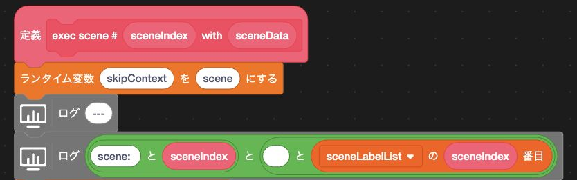<figcaption>「exec scene # …」の入口。scene contextを設定し、区切りとscene番号・labelを2つのlogへ記録する順序が分かる範囲だけを示します。</figcaption></figure>

<section><strong>いつ使う?</strong>scene開始、待機、asset生成、Actor処理の節目。</section><section><strong>何が分かる?</strong>どのcommandまで進み、どこで止まったか。</section><section><strong>異常時</strong>Kamishibai RuntimeのSVGと同じ原因をconsoleにも残す。</section>

<strong>このアプリでの役割:</strong> 緑の旗で古いconsoleを消し、<code>journal</code>で進行、<code>error</code>で異常を記録します。表示用errorと開発用logを混ぜないことが重要です。

ブロック例: <a href="https://github.com/kubohiroya/tm-kamishibai/blob/d1624c9ce9464bf696b4bb97851dce9154a09ee6/app/project.source.json">Version 3.2.0 project source</a>（Stage: <code>exec scene # %s with %s</code>）

## Temporary Variables — 実行範囲の異なる一時変数を作成・共有する {#extension-temporary-variables .extension-sheet .extension-sheet-left}

Gallery 2 / 7　機能拡張そのもの 1 / 2

Gallery<code>lmsTempVars2</code>状態管理

Scratch変数を増やさず、処理の途中だけ必要な名前付き値を保持します。
一つのcustom block内だけのthread variableと、project全体で共有するruntime variableを使い分けます。

<figure class="extension-gallery-banner"></figure>

<figure class="extension-flow"><figcaption>配布ソースの機能要約：値を置く場所で寿命と共有範囲が変わる</figcaption>
custom blockの呼出し<b>→</b>thread variable その実行だけ<b>／</b>runtime variable project全体
</figure>

<section>
thread variable
<ul><li>blockの実行stackに所属</li><li>再帰や同時実行で値を分離</li><li>処理終了後に捨てられる</li></ul></section><section>
runtime variable
<ul><li>全target・拡張から共有</li><li>名前で作成・更新・削除</li><li>project停止時までの一時値</li></ul></section>

出典: <a href="https://github.com/TurboWarp/extensions/blob/9c0ae4f045dfb021cf329ea1ea6e595502c56a8a/images/Lily/TempVariables2.svg">Galleryバナー</a>、<a href="https://github.com/TurboWarp/extensions/blob/9c0ae4f045dfb021cf329ea1ea6e595502c56a8a/extensions/Lily/TempVariables2.js">配布ソース</a>

## Temporary Variablesで処理ごとの一時値を分け、同時実行による上書きを防ぐ {#extension-temporary-variables-example .extension-sheet .extension-sheet-right}

Gallery 2 / 7　TMPose 紙芝居での利用例 2 / 2

<aside class="extension-kamishibai-why"><strong>なぜTM紙芝居に必要？</strong>
同じsceneの中でも複数のActorや入力処理が並行します。途中値を通常のScratch変数へ集めると別の実行が上書きし、変数一覧も膨らみます。呼出しごとの値はthreadへ、sceneや拡張をまたぐ合図だけはruntimeへ置くことで、状態の混線を防げます。
</aside>

<figure class="extension-editor-example">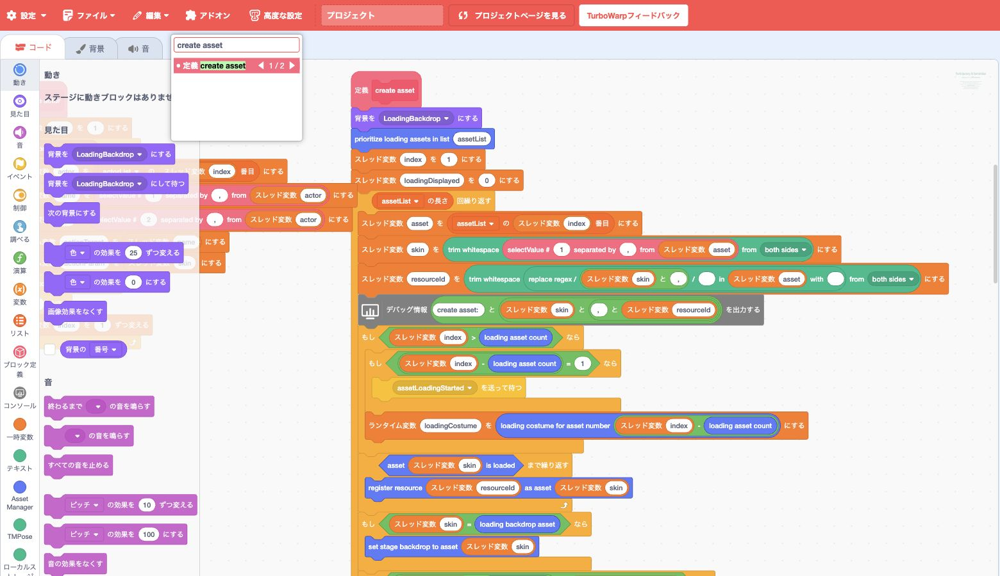<figcaption>「create asset」の解析部分。indexからasset、skin、resourceIdへ値を受け渡すthread variableの連鎖です。</figcaption></figure>

<section><strong>局所値</strong>assetName、address、引数番号をthreadへ置く。</section><section><strong>共有値</strong>scene、入力状態、Loading進捗をruntimeへ置く。</section><section><strong>連携</strong>Runtime ExpressionとAsync Inputが同じruntime値を読む。</section>

<strong>注意:</strong> runtime variableも永続保存ではありません。再起動後に残す値はLocal Storageを使い、green flag時にruntimeへ戻します。

ブロック例: <a href="https://github.com/kubohiroya/tm-kamishibai/blob/d1624c9ce9464bf696b4bb97851dce9154a09ee6/app/project.source.json">Version 3.2.0 project source</a>（Stage: <code>create asset</code>）

## Text — 文字列を検索・分割・置換する {#extension-text-operators .extension-sheet .extension-sheet-left}

Gallery 3 / 7　機能拡張そのもの 1 / 2

Gallery<code>strings</code>文字列処理

文字や文章を検索、分割、置換、比較、trimするための文字列演算拡張です。
「含むか」を調べるだけでなく、区切りごとの項目取得、部分文字列、文字種変換などを値blockとして組み合わせられます。

<figure class="extension-gallery-banner"></figure>

<figure class="extension-flow"><figcaption>公式Galleryと配布ソースの要約：文字列を調べ、必要な形へ作り直す</figcaption>
元のtext<b>→</b>検索・count・比較<b>／</b>split・replace・trim<b>→</b>値／整形済みtext
</figure>

<section>
形を調べる
<ul><li>文字数と出現回数</li><li>前方・後方一致</li><li>厳密な文字列比較</li></ul></section><section>
値を取り出す
<ul><li>区切り文字でsplit</li><li>部分文字列</li><li>前後の空白をtrim</li></ul></section>

出典: <a href="https://github.com/TurboWarp/extensions/blob/9c0ae4f045dfb021cf329ea1ea6e595502c56a8a/images/text.svg">Galleryバナー</a>、<a href="https://github.com/TurboWarp/extensions/blob/9c0ae4f045dfb021cf329ea1ea6e595502c56a8a/extensions/text.js">配布ソース</a>

## Textで台本のコマンド名と引数を、区切り文字から読み取る {#extension-text-operators-example .extension-sheet .extension-sheet-right}

Gallery 3 / 7　TMPose 紙芝居での利用例 2 / 2

<aside class="extension-kamishibai-why"><strong>なぜTM紙芝居に必要？</strong>
紙芝居DSLは、人が直接編集できる一続きのtextです。専用parserをJavaScript側へ隠すのではなく、どの区切りを探し、どの引数を取り出したかをTurboWarpのblockとして読める形にすると、台本仕様と実装を制作者が照合しやすくなります。
</aside>

<figure class="extension-editor-example">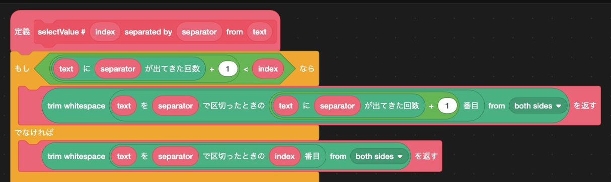<figcaption>「selectValue # …」の中核。区切り文字の出現数を調べ、指定項目をtrimして返す2つの分岐です。</figcaption></figure>

<section><strong>command</strong><code>asset=...</code>の最初の<code>=</code>を境界にする。</section><section><strong>引数</strong>comma区切りの指定位置を取得する。</section><section><strong>比較</strong>空文字・command名・action名を厳密に照合する。</section>

<strong>区別:</strong> このTextは文字列演算の<code>strings</code>です。Stageへ文字を描くAnimated Text（ID: <code>text</code>）とは別物です。

ブロック例: <a href="https://github.com/kubohiroya/tm-kamishibai/blob/d1624c9ce9464bf696b4bb97851dce9154a09ee6/app/project.source.json">Version 3.2.0 project source</a>（Stage: <code>selectValue # %s separated by %s from %s</code>）

## Local Storage — 文字列をブラウザーへ保存・取得・削除する {#extension-local-storage .extension-sheet .extension-sheet-left}

Gallery 4 / 7　機能拡張そのもの 1 / 2

Gallery<code>localstorage</code>永続保存

browserの保存領域に、project固有のnamespaceで文字列を保持します。
Scratch変数と違い、ページを閉じた後でも次回起動時に読み戻せます。

<figure class="extension-gallery-banner"></figure>

<figure class="extension-flow"><figcaption>公式ドキュメントの図解要約：namespaceでprojectごとの保存領域を分ける</figcaption>
key + plain text<b>→</b>project namespace<b>→</b>browser storage<b>→</b>reload後も取得
</figure>

<section>
できること
<ul><li>plain textの保存・取得・削除</li><li>namespace単位の全削除</li><li>別windowでの変更検知</li></ul></section><section>
性質と制約
<ul><li>通常変数より書込が遅い</li><li>Web版は容量が小さい</li><li>同じnamespaceは互いに上書き</li></ul></section>

出典: <a href="https://github.com/TurboWarp/extensions/blob/9c0ae4f045dfb021cf329ea1ea6e595502c56a8a/images/local-storage.svg">Galleryバナー</a>、<a href="https://github.com/TurboWarp/extensions/blob/9c0ae4f045dfb021cf329ea1ea6e595502c56a8a/docs/local-storage.md">公式ドキュメント</a>

## Local Storageで選んだ台本と言語設定を保存し、次回起動時に復元する {#extension-local-storage-example .extension-sheet .extension-sheet-right}

Gallery 4 / 7　TMPose 紙芝居での利用例 2 / 2

<aside class="extension-kamishibai-why"><strong>なぜTM紙芝居に必要？</strong>
体験会で選んだ台本や表示言語がreloadのたびに消えると、参加者は作品をプレイするより再設定に時間を取られます。小さな設定と台本文字列だけを保存し、次回は前回の続きから始められるようにします。camera映像や認識途中の値は保存しません。
</aside>

<figure class="extension-editor-example">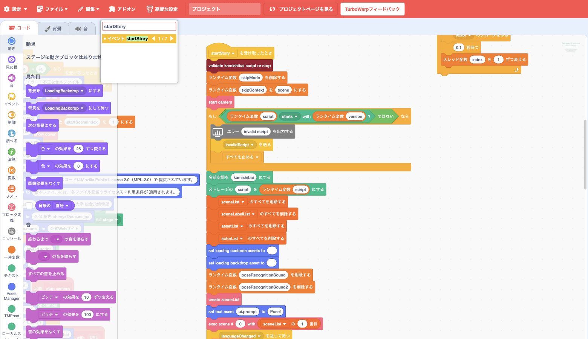<figcaption>名前空間を<code>kamishibai</code>に定め、runtimeのscriptをstorageへ書く、隣接した2ブロックです。</figcaption></figure>

<section><strong>起動時</strong>保存済み言語を読み、なければTranslateへ進む。</section><section><strong>台本選択</strong>Filesで開いたtextを保存し、reloadで再利用する。</section><section><strong>UI操作</strong>言語変更時に保存値とruntime値を同時更新する。</section>

<strong>注意:</strong> 同じprojectを複数tabで開くと、後から保存したwindowが値を上書きする可能性があります。小さな設定と台本文字列だけを対象にします。

ブロック例: <a href="https://github.com/kubohiroya/tm-kamishibai/blob/d1624c9ce9464bf696b4bb97851dce9154a09ee6/app/project.source.json">Version 3.2.0 project source</a>（Stage: green flag）

## More Timers — 複数の名前付きタイマーを個別に管理する {#extension-more-timers .extension-sheet .extension-sheet-left}

Gallery 5 / 7　機能拡張そのもの 1 / 2

Gallery<code>lmsTimers</code>時間管理

標準timerを一つだけでなく、文字列で名付けた複数timerとして並行管理します。
各timerを個別に開始、pause、resume、reset、増減、削除できるため、重なった処理の経過時間を独立して扱えます。

<figure class="extension-gallery-banner"></figure>

<figure class="extension-flow"><figcaption>公式Galleryと配布ソースの要約：名前ごとに独立したtimerのlife cycle</figcaption>
start / reset<b>→</b>pause / resume 値を読む・増減<b>→</b>remove
</figure>

<section>
個別timer
<ul><li>名前で作成・照会</li><li>pause／resume</li><li>reset、増減、削除</li></ul></section><section>
複数timer
<ul><li>互いの値を上書きしない</li><li>存在する名前を確認</li><li>必要なら全timerを削除</li></ul></section>

出典: <a href="https://github.com/TurboWarp/extensions/blob/9c0ae4f045dfb021cf329ea1ea6e595502c56a8a/images/Lily/MoreTimers.svg">Galleryバナー</a>、<a href="https://github.com/TurboWarp/extensions/blob/9c0ae4f045dfb021cf329ea1ea6e595502c56a8a/extensions/Lily/MoreTimers.js">配布ソース</a>

## More Timersで待機時間を計測しながら、利用者のスキップ操作にも応答する {#extension-more-timers-example .extension-sheet .extension-sheet-right}

Gallery 5 / 7　TMPose 紙芝居での利用例 2 / 2

<aside class="extension-kamishibai-why"><strong>なぜTM紙芝居に必要？</strong>
標準の「待つ」だけでは、待機中に観客がskipしても、その時間が終わるまでsceneを進められません。名前付きtimerの値とskipの両方を短いloopで確認すれば、予定時間を守りながら操作にもすぐ反応できます。
</aside>

<figure class="extension-editor-example">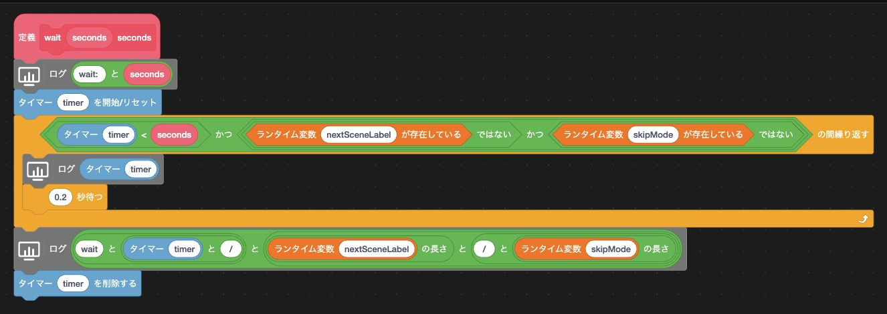<figcaption>「wait seconds」のtimer部分。開始／reset、経過値の監視、最後の削除までを一続きで示します。</figcaption></figure>

<section><strong>通常終了</strong>指定秒数へ達したらloopを抜ける。</section><section><strong>skip</strong>runtimeのskip状態でもloopを抜ける。</section><section><strong>後片付け</strong>どちらの終了でも名前付きtimerを削除する。</section>

<strong>設計上の要点:</strong> Scratchの長い「待つ」ブロックに任せず、短いloopでtimerとskipを同時に監視します。これによりプレイ中の操作へすぐ反応できます。

ブロック例: <a href="https://github.com/kubohiroya/tm-kamishibai/blob/d1624c9ce9464bf696b4bb97851dce9154a09ee6/app/project.source.json">Version 3.2.0 project source</a>（Stage: <code>wait %s seconds</code>）

## Files — ローカルファイルの読込みとダウンロードを行う {#extension-files .extension-sheet .extension-sheet-left}

Gallery 6 / 7　機能拡張そのもの 1 / 2

Gallery<code>files</code>ファイル入力

利用者が選択またはdrag & dropしたlocal fileを、textまたはdata URLとしてprojectへ渡す拡張です。
逆にproject内の値をfilename付きでdownloadでき、browserのfile pickerとTurboWarpのblockを橋渡しします。

<figure class="extension-gallery-banner"></figure>

<figure class="extension-flow"><figcaption>公式Galleryと配布ソースの要約：local fileを値へ、値をdownloadへ</figcaption>
click / drop<b>→</b>file picker<b>→</b>text / data URL + filename<b>↔</b>download
</figure>

<section>
入力
<ul><li>拡張子・MIME type指定</li><li>text／data URL</li><li>cancel時は空文字</li></ul></section><section>
出力
<ul><li>filename付きdownload</li><li>browser内で完結</li><li>明示的な利用者操作から開始</li></ul></section>

出典: <a href="https://github.com/TurboWarp/extensions/blob/9c0ae4f045dfb021cf329ea1ea6e595502c56a8a/images/files.svg">Galleryバナー</a>、<a href="https://github.com/TurboWarp/extensions/blob/9c0ae4f045dfb021cf329ea1ea6e595502c56a8a/extensions/files.js">配布ソース</a>

## Filesで参加者が選んだTXT台本を、埋め込み台本と同じ検査・実行経路へ渡す {#extension-files-example .extension-sheet .extension-sheet-right}

Gallery 6 / 7　TMPose 紙芝居での利用例 2 / 2

<aside class="extension-kamishibai-why"><strong>なぜTM紙芝居に必要？</strong>
このアプリの体験会を実施する場合を想定すると、参加者が書いたTXT台本をその場ですぐ試してもらいたい一方、どのような技量・経験を持った参加者が集まるかがわからず時間的制約もある状況では、台本ごとにWebへ公開したりアプリを作り直したりはできません。端末上のfileを利用者のclickで選び、埋め込み台本と同じ検査・実行経路へ渡す入口になります。
</aside>

<figure class="extension-editor-example">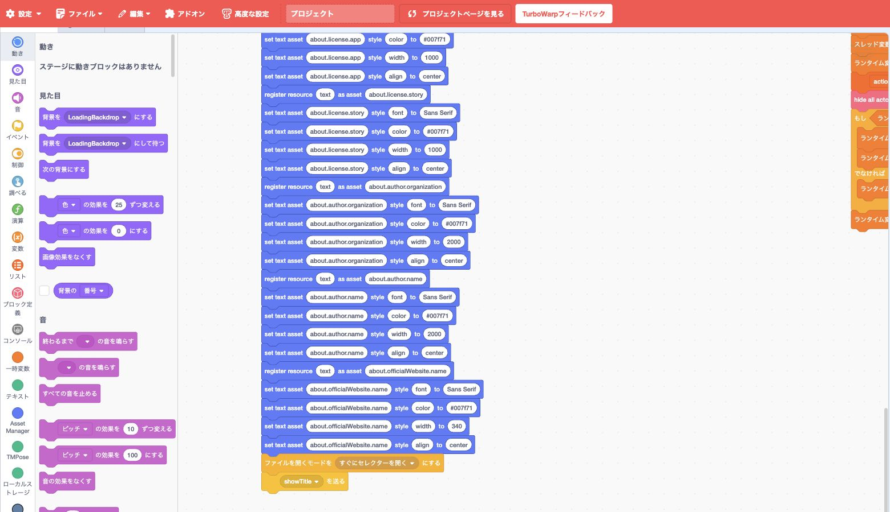<figcaption>ファイル選択を「すぐにセレクターを開く」に設定してから、title画面を表示する2ブロックです。</figcaption></figure>

<section><strong>UiItem</strong>menu buttonの操作からpickerを開く。</section><section><strong>runtime</strong>選択した全文を<code>script</code>へ渡す。</section><section><strong>合流</strong>埋め込み台本と同じpreflight・asset登録へ進む。</section>

<strong>安全性:</strong> pickerは利用者clickに続いて開きます。cancelで空文字になった場合は、保存済み台本を勝手に置き換えません。

ブロック例: <a href="https://github.com/kubohiroya/tm-kamishibai/blob/d1624c9ce9464bf696b4bb97851dce9154a09ee6/app/project.source.json">Version 3.2.0 project source</a>（UiItem: <code>runUiItemAction</code>）

## Animated Text — 文字列をスプライトの見た目として描画・アニメーションする {#extension-animated-text .extension-sheet .extension-sheet-left}

Gallery 7 / 7　機能拡張そのもの 1 / 2

Gallery<code>text</code>文字描画

spriteへ文字専用のrenderer skinを作り、font、色、幅、配置、outlineを設定して表示する拡張です。
文章をtyping、rainbow、zoom、shakeなどで演出でき、Scratch LabのAnimated Text実験と互換性があります。

<figure class="extension-gallery-banner"></figure>

<figure class="extension-flow"><figcaption>公式Galleryと配布ソースの要約：textをspriteの見た目へ変換する</figcaption>
text + font 色・幅・配置<b>→</b>renderer skin<b>→</b>spriteへ表示<b>→</b>animation
</figure>

<section>
style
<ul><li>font、色、outline</li><li>幅、折返し、align</li><li>spriteのskinとして描画</li></ul></section><section>
animation
<ul><li>typing</li><li>rainbow、zoom</li><li>shakeなどの演出</li></ul></section>

出典: <a href="https://github.com/TurboWarp/extensions/blob/9c0ae4f045dfb021cf329ea1ea6e595502c56a8a/images/lab/text.svg">Galleryバナー</a>、<a href="https://github.com/TurboWarp/extensions/blob/9c0ae4f045dfb021cf329ea1ea6e595502c56a8a/extensions/lab/text.js">配布ソース</a>

## Animated Textで台詞やメニューの文字列を画面へ描画する {#extension-animated-text-example .extension-sheet .extension-sheet-right}

Gallery 7 / 7　TMPose 紙芝居での利用例 2 / 2

<aside class="extension-kamishibai-why"><strong>なぜTM紙芝居に必要？</strong>
台詞、menu、prompt、診断文は台本や言語によって変わるため、すべてを事前にcostumeへ描いておくことはできません。実行時の文字列をStage上の見た目に変換すれば、同じUI部品を内容だけ差し替えて再利用できます。
</aside>

<figure class="extension-editor-example">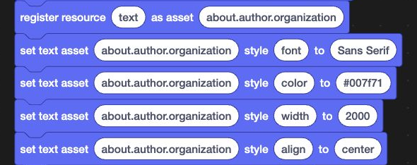<figcaption>実プロジェクトでは、文字をAsset Managerへ登録し、font・color・width・alignを設定します。ここに見える青いblockはAsset Managerであり、Animated Textの呼出しはその内部で行われます。</figcaption></figure>

<section><strong>project側</strong>Asset Managerでtext assetとstyleを登録する。</section><section><strong>内部呼出し</strong><code>text_setFont</code>等のopcodeをruntimeから取得する。</section><section><strong>描画時</strong><code>text_setText</code>／<code>text_animateText</code>でskinを作る。</section>

<strong>重要:</strong> 接続済みscriptにAnimated Text blockはありません。Asset Managerが表示時に<code>text_setFont</code>、<code>text_setColor</code>、<code>text_setWidth</code>、<code>text_setText</code>／<code>text_animateText</code>をprogrammaticに呼ぶ依存関係です。

<strong>DSL 3.2:</strong> この経路は旧Text Assetのdeprecated互換機能として少なくとも3.2系列で維持します。3.2.0には<a href="https://github.com/kubohiroya/turbowarp-svg-text">turbowarp-svg-text</a>も組み込まれており、新旧を併用できます。

ブロック例: <a href="https://github.com/kubohiroya/tm-kamishibai/blob/d1624c9ce9464bf696b4bb97851dce9154a09ee6/app/project.source.json">Version 3.2.0 project source</a>（text asset登録・style設定）、内部実装: <a href="https://github.com/kubohiroya/tm-kamishibai/blob/d1624c9ce9464bf696b4bb97851dce9154a09ee6/app/extensions/kubohiroyaassetmanager.js#L1491-L1503">Asset ManagerからAnimated Text opcodeを取得する処理</a>

## Translate — 文章を翻訳し、閲覧環境の言語を取得する {#extension-translate .extension-sheet .extension-sheet-left}

TurboWarp標準 1 / 1　機能拡張そのもの 1 / 2

TurboWarp標準<code>translate</code>表示言語

Scratch／TurboWarp標準の翻訳拡張です。文章と翻訳先の言語を指定するblockに加え、viewerで選択中の言語を返します。
翻訳結果とviewer languageは別のreporterであり、後者は通信せずに現在のlocale名を取得します。

文 <small>Language</small>

<strong>翻訳とviewer言語を別々に取得</strong>
文章の翻訳結果と、現在のTurboWarp UIが使う言語名をreporterとして返します。

<figure class="extension-flow"><figcaption>scratch-vm実装の要約：二つの独立したreporter</figcaption>
text + target language<b>→</b>translation<b>／</b>viewer locale<b>→</b>language名
</figure>

<section>
翻訳reporter
<ul><li>入力textと翻訳先を指定</li><li>対応言語から選択</li><li>結果を文字列で返す</li></ul></section><section>
language reporter
<ul><li>viewerのlocaleを取得</li><li>通信を必要としない</li><li>UI初期値の判断に使える</li></ul></section>

出典: <a href="https://github.com/TurboWarp/scratch-vm/blob/c4823421cb7c17d8d8a89878851ce1668c26a21f/src/extensions/scratch3_translate/index.js">固定scratch-vmのTranslate実装</a>

## Translateで閲覧環境の言語を取得し、初期表示へ反映する {#extension-translate-example .extension-sheet .extension-sheet-right}

TurboWarp標準 1 / 1　TMPose 紙芝居での利用例 2 / 2

<aside class="extension-kamishibai-why"><strong>なぜTM紙芝居に必要？</strong>
初めて開いた利用者には日本語か英語のどちらかを提示する必要がありますが、選択前には保存値がありません。そこでviewerの言語を一度だけ「最初の推測」に使い、その後は利用者自身の選択を優先します。台本文を自動翻訳するための利用ではありません。
</aside>

<figure class="extension-editor-example">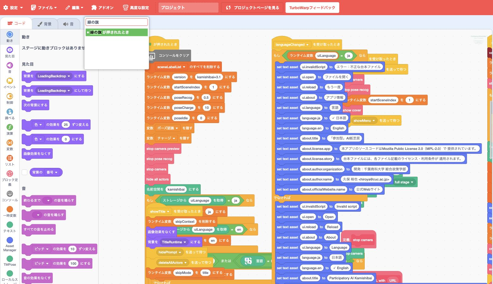<figcaption>保存済み言語がないときの条件内にあるTranslateの「言語」reporter。日本語／英語の初期判定に使います。</figcaption></figure>

<section><strong>優先1</strong>Local Storageに保存済みの利用者選択。</section><section><strong>優先2</strong>Translateのviewer language。</section><section><strong>結果</strong>runtime変数を通して全UIへbroadcast。</section>

<strong>方針:</strong> browser localeを毎回強制せず、利用者が一度選んだUI言語を優先します。Translateは初期値を決める補助です。

ブロック例: <a href="https://github.com/kubohiroya/tm-kamishibai/blob/d1624c9ce9464bf696b4bb97851dce9154a09ee6/app/project.source.json">Version 3.2.0 project source</a>（Stage: green flag）

## Asset Manager — 異なる場所・種類の素材を名前付きで管理・操作する {#extension-asset-manager .extension-sheet .extension-sheet-left}

外部埋め込み 1 / 6　機能拡張そのもの 1 / 2

外部埋め込み<code>kubohiroyaassetmanager</code>0.4.1

Web上の画像・音声、SB3内のcostume・backdrop・sound、実行時textを一つの名前付き登録簿で扱います。
登録後は素材の置き場所や種類に応じた処理を拡張が選び、共通のasset名で表示、再生、animation、cacheを操作できます。

A <small>Assets</small>

<strong>素材の住所を隠す登録簿</strong>
URL、project内素材、textを同じasset名へまとめ、Stage・Actor・音声へ配ります。

<figure class="extension-flow"><figcaption>公式図解ガイドの要約：異なる素材を一つの登録簿から適切な出力先へ</figcaption>
Web URL project内素材 動的text<b>→</b>名前 + 種類を登録 Web素材はcache<b>→</b>sprite / Stage sound / Actor timeline
</figure>

<section>
読込
<ul><li>種類判定と取得</li><li>IndexedDB cache</li><li>Loading用assetを先行</li></ul></section><section>
利用
<ul><li>Stage／sprite skin</li><li>音声再生・停止</li><li>Actor loop／sequence</li></ul></section>

出典: <a href="https://kubohiroya.github.io/turbowarp-asset-manager/ja/">Asset Manager図解ガイド</a>、<a href="https://github.com/kubohiroya/turbowarp-asset-manager/tree/c55e65787eed21d2e70b96a28dd6705d118f9995">固定commit c55e657</a>

## Asset Managerで台本指定の素材を読み込み、名前で背景・登場人物・音を操作する {#extension-asset-manager-example .extension-sheet .extension-sheet-right}

外部埋め込み 1 / 6　TMPose 紙芝居での利用例 2 / 2

<aside class="extension-kamishibai-why"><strong>なぜTM紙芝居に必要？</strong>
紙芝居の作者には、素材がURLかSB3内のcostumeかを意識せず「Hero」「海」「鐘」のような名前で台本を書いてほしいからです。登録と読込を一か所へ集めることで、local素材は通信なしで速く使い、Web素材はcacheし、Loading進捗も同じ単位で数えられます。
</aside>

<figure class="extension-editor-example">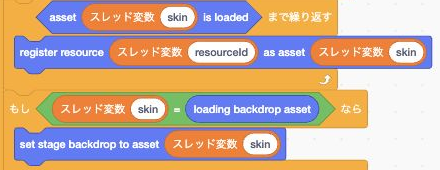<figcaption>読込完了を待ち、resourceをassetとして登録し、Loading用なら背景へ反映する接続部分です。</figcaption></figure>

<section><strong>開始前</strong>Loading backdropとcostumeを先に登録。</section><section><strong>登録中</strong>台本の全assetを名前・addressで登録。</section><section><strong>実行中</strong>同じ名前で背景、Actor、音、textを操作。</section>

<strong>address例:</strong> <code>costume:Actor:hero1</code>、<code>backdrop:sea</code>、<code>sound:Stage:bell</code>。project内参照はsprite名と素材名を正確に指定します。

ブロック例: <a href="https://github.com/kubohiroya/tm-kamishibai/blob/d1624c9ce9464bf696b4bb97851dce9154a09ee6/app/project.source.json">Version 3.2.0 project source</a>（Stage: <code>create asset</code>）

## TMPose — 学習済みモデルでカメラ映像のポーズを認識する {#extension-tmpose .extension-sheet .extension-sheet-left}

外部埋め込み 2 / 6　機能拡張そのもの 1 / 2

外部埋め込み<code>tmpose</code>1.4.0

Teachable Machine Pose modelとcamera映像を接続し、現在のpose名とconfidenceをTurboWarpの値として返します。
model、camera、preview、predictionを別々に開始・停止できます。

◎ <small>Pose</small>

<strong>身体の動きを数値と名前へ</strong>
カメラ映像から骨格を推定し、Teachable Machineで学習したposeごとのconfidenceを返します。

<figure class="extension-flow"><figcaption>公式図解ガイドの要約：1枚の映像から現在値と時間でならした値へ</figcaption>
camera frame<b>→</b>姿勢推定 keypoints<b>→</b>TM classifier<b>→</b>label・confidence 蓄積score
</figure>

<section>
現在の認識
<ul><li>pose labelとconfidence</li><li>すばやい動きへ即時反応</li><li>camera previewを配置</li></ul></section><section>
時間を含む認識
<ul><li>confidenceを蓄積・減衰</li><li>一瞬の揺れを平滑化</li><li>開始・停止を個別管理</li></ul></section>

出典: <a href="https://kubohiroya.github.io/turbowarp-tmpose/ja/">TMPose図解ガイド</a>、<a href="https://github.com/kubohiroya/turbowarp-tmpose/tree/08fe0cf9da061b1eba75297b8ee187d68549eed4">固定commit 08fe0cf</a>

## TMPoseで観客のポーズを認識し、物語を進める入力として扱う {#extension-tmpose-example .extension-sheet .extension-sheet-right}

外部埋め込み 2 / 6　TMPose 紙芝居での利用例 2 / 2

<aside class="extension-kamishibai-why"><strong>なぜTM紙芝居に必要？</strong>
このアプリでは、観客がkeyやbuttonを押すだけでなく、物語に合わせて体を動かすこと自体が入力になります。学習済みmodel、camera、preview、認識loopを別々に管理できるため、必要なsceneだけでcameraを使い、poseが十分確かになった時に物語を進められます。
</aside>

<figure class="extension-editor-example">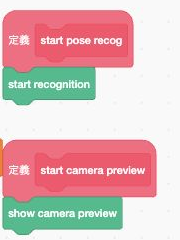<figcaption><code>start pose recog</code>と<code>start camera preview</code>。各custom blockが対応するTMPose blockを1つずつ呼びます。</figcaption></figure>

<section><strong>scene準備</strong><code>TMPoseURL</code>でmodelをload。</section><section><strong>action</strong>指定poseのscoreが閾値を超えるまで反復。</section><section><strong>終了</strong>skip、scene終了、stopでpredictionとcameraを停止。</section>

<strong>実行条件:</strong> camera権限とHTTPSが必要です。modelとTensorFlow／Teachable Machine libraryの取得にはnetwork接続を使います。

ブロック例: <a href="https://github.com/kubohiroya/tm-kamishibai/blob/d1624c9ce9464bf696b4bb97851dce9154a09ee6/app/project.source.json">Version 3.2.0 project source</a>（Stage: <code>setTMPoseURL</code> / <code>exec pose</code>）

## Text Lines — 複数行の文字列を行単位で取得・リスト化する {#extension-text-lines .extension-sheet .extension-sheet-left}

外部埋め込み 3 / 6　機能拡張そのもの 1 / 2

外部埋め込み<code>kubohiroyatextlines</code>0.1.1

長いtextを改行位置で分割し、行数、指定行、Scratch listとして扱います。
LF、CRLF、CRを同じ改行として正規化するため、台本を作ったOSに依存しません。

≡ <small>Lines</small>

<strong>一つのtextを物理行へ</strong>
元sourceの行番号を保ったまま、preflightと実行loopへ渡します。

<figure class="extension-flow"><figcaption>公式図解ガイドの要約：1つの入力から用途別の3つの結果を得る</figcaption>
複数行text<b>→</b>LF / CRLF / CR を正規化<b>→</b>行数 指定した1行 list全置換
</figure>

<section>
入力
<ul><li>LF、CRLF、CR</li><li>空行を含む全文</li><li>UTF-8の台本文字列</li></ul></section><section>
出力
<ul><li>行数</li><li>1始まりの指定行</li><li>list全置換</li></ul></section>

出典: <a href="https://kubohiroya.github.io/turbowarp-text-lines/ja/">Text Lines図解ガイド</a>、<a href="https://github.com/kubohiroya/turbowarp-text-lines/tree/8655d764cf3af0d783ba6f138086db927abd3570">固定commit 8655d76</a>

## Text Linesで台本を行ごとに分け、エラー表示を元のTXTの行番号へ対応させる {#extension-text-lines-example .extension-sheet .extension-sheet-right}

外部埋め込み 3 / 6　TMPose 紙芝居での利用例 2 / 2

<aside class="extension-kamishibai-why"><strong>なぜTM紙芝居に必要？</strong>
台本のerrorを直す人にとって最も役立つ手掛かりは、元のTXTと一致する行番号です。OSごとの改行差を吸収しつつ、検査と実行が同じ物理行のlistを使えば、「表示された行」と「直すべき行」がずれません。
</aside>

<figure class="extension-editor-example">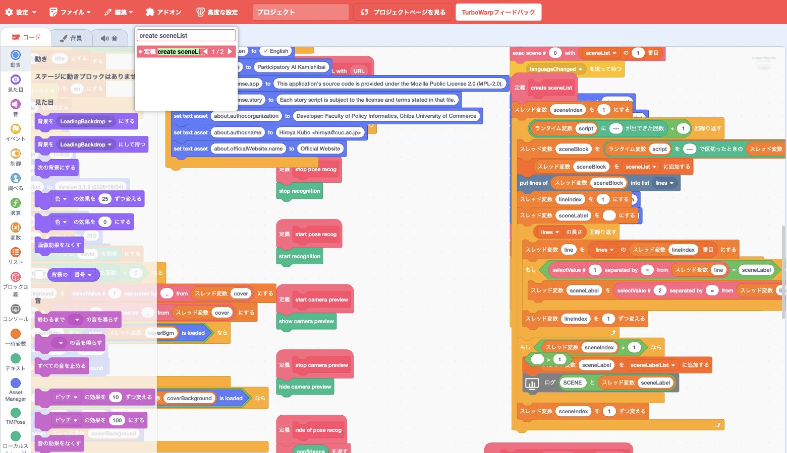<figcaption>scene単位に切り出した文字列を、Text Linesの1 blockで<code>lines</code> listへ展開する部分です。</figcaption></figure>

<section><strong>preflight</strong>物理行番号とcommandを一緒に検査。</section><section><strong>実行</strong>同じ<code>lines</code> listをscene生成へ渡す。</section><section><strong>診断</strong>errorの行番号を元TXTへ正確に対応。</section>

<strong>listの扱い:</strong> 書込blockは追記ではなく全置換です。前回台本の行が残らないため、reloadしても行番号がずれません。

ブロック例: <a href="https://github.com/kubohiroya/tm-kamishibai/blob/d1624c9ce9464bf696b4bb97851dce9154a09ee6/app/project.source.json">Version 3.2.0 project source</a>（Stage: <code>create sceneList</code>）

## Runtime Expression — 一時変数を参照する制限付き条件式を安全に評価する {#extension-runtime-expression .extension-sheet .extension-sheet-left}

外部埋め込み 4 / 6　機能拡張そのもの 1 / 2

外部埋め込み<code>kubohiroyaruntimeexpression</code>0.2.0

Temporary Variablesのruntime値を、JavaScriptに似た制限付き条件式から参照し、true／falseを返します。
任意codeを実行せず、許可した比較、論理、算術、括弧だけを評価します。

{?} <small>Expr</small>

<strong>状態を真偽値と変化eventへ</strong>
<code>score &gt;= 3 && hasKey</code>のような式を検査して評価し、必要ならfalse／trueの変化をbroadcastします。

<figure class="extension-flow"><figcaption>公式図解ガイドの要約：現在の判定と、判定結果が変わった時の通知</figcaption>
runtime variables + 条件式<b>→</b>制限付きparser<b>→</b>true / false<b>／</b>false↔true時だけ broadcast
</figure>

<section>
条件reporter
<ul><li>比較、論理、算術、括弧</li><li><code>vars["日本語名"]</code></li><li>代入・関数呼出しは禁止</li></ul></section><section>
条件付きbroadcast
<ul><li>最初の状態を記憶</li><li>結果が変化した時だけ通知</li><li>IDで置換・解除・timeout</li></ul></section>

出典: <a href="https://kubohiroya.github.io/turbowarp-runtime-expression/ja/">Runtime Expression図解ガイド</a>、<a href="https://github.com/kubohiroya/turbowarp-runtime-expression/tree/7e2bd99fa57fa9f0cbe6b91306b4c53322f00aa3">固定commit 7e2bd99</a>

## Runtime Expressionで台本の条件式を安全に評価し、最初に成立した場面へ進む {#extension-runtime-expression-example .extension-sheet .extension-sheet-right}

外部埋め込み 4 / 6　TMPose 紙芝居での利用例 2 / 2

<aside class="extension-kamishibai-why"><strong>なぜTM紙芝居に必要？</strong>
台本作者は「scoreが3以上なら次のsceneへ」のような分岐を書きたい一方、外部台本から任意のJavaScriptを動かしてはいけません。読める条件式の形を保ちつつ、許可した演算だけを現在のruntime値へ適用する安全な境界になります。
</aside>

<figure class="extension-editor-example">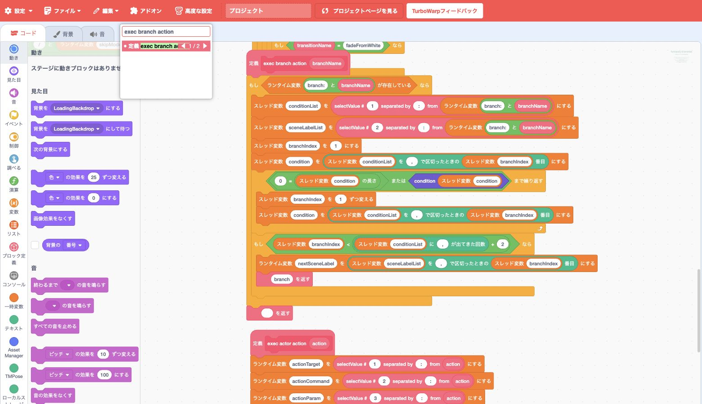<figcaption>branch条件を1件ずつ読むloop。thread variableへ式を取り出し、<code>condition</code> reporterで現在のruntime値に対して評価してから次の条件へ進みます。</figcaption></figure>

<section><strong>登録</strong><code>registerBranch</code>が式とscene labelを保持。</section><section><strong>評価</strong>上から順にruntime値を使って判定。</section><section><strong>決定</strong>最初にtrueとなった遷移先だけを採用。</section>

<strong>二段階の安全性:</strong> Kamishibai Runtimeが実行前にsyntaxを検査し、scene移動時にRuntime Expressionが現在値で評価します。

ブロック例: <a href="https://github.com/kubohiroya/tm-kamishibai/blob/d1624c9ce9464bf696b4bb97851dce9154a09ee6/app/project.source.json">Version 3.2.0 project source</a>（Stage: <code>exec branch action</code>）

## SVG Text — 名前付きスタイルで相対サイズの吹き出しとSVG文字を描画する {#extension-svg-text .extension-sheet .extension-sheet-left}

外部埋め込み 5 / 6　機能拡張そのもの 1 / 2

npm埋め込み<code>kubohiroyasvgtext</code>0.1.0

背景色、文字色、font、相対font size、配置、吹き出し方向を名前付きstyleとして定義し、say／think bubbleとsprite自身のSVG text skinで共有する拡張です。文字列中の<code>\n</code>を複数のSVG <code>tspan</code>へ変換します。

Aa <small>SVG</small>

<strong>画面と一緒に拡大する文字</strong>
size 100を480×360 stageの14px相当とし、stage寸法が変わっても相対的な大きさを保ちます。

<figure class="extension-flow"><figcaption>公式図解ガイドの要約：一つのstyleを二つの表示方法へ適用する</figcaption>
名前付きstyle + 複数行text<b>→</b>stage scaleで再計算<b>→</b>say / think bubble<b>／</b>SVG text actor
</figure>

<section>
style
<ul><li>背景色・文字色・font</li><li>size 1〜1000、左右／中央揃え</li><li>上下左右と斜めの8方向</li></ul></section><section>
再描画
<ul><li>stage size変更へ追従</li><li>同名styleの再定義へ追従</li><li>0.1.0ではanimationなし</li></ul></section>

出典: <a href="https://kubohiroya.github.io/turbowarp-svg-text/ja/">SVG Text日本語図解ガイド</a>、<a href="https://github.com/kubohiroya/turbowarp-svg-text/tree/v0.1.0">固定release v0.1.0</a>、<a href="https://www.npmjs.com/package/@kubohiroya/turbowarp-svg-text/v/0.1.0">npm 0.1.0</a>

## SVG Textで吹き出しとテキストアクターの見た目を共有する {#extension-svg-text-example .extension-sheet .extension-sheet-right}

外部埋め込み 5 / 6　TMPose 紙芝居での利用例 2 / 2

<aside class="extension-kamishibai-why"><strong>なぜTM紙芝居に必要？</strong>
大きなstageや全画面表示で吹き出しだけが相対的に小さくならないことに加え、登場人物に従属するbubbleではなく、タイトルやナレーションをActor自身として配置したいからです。同じstyle名を使えば、別々の表示方法でも配色と文字設計を揃えられます。
</aside>

<figure class="extension-editor-example">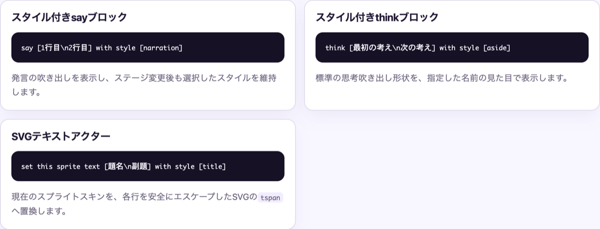<figcaption>公開済み日本語ガイドの3つの使用例。<code>\n</code>で改行し、同じ名前付きstyleを吹き出しとSVG text actorへ適用します。</figcaption></figure>

<section><strong>header</strong><code>svgTextStyle</code>で共通styleを定義。</section><section><strong>Actor</strong><code>setText</code>でActor自身をSVG文字へ変更。</section><section><strong>bubble</strong><code>say|think:TEXT:SECONDS:STYLE</code>で個別に選択。</section>

<strong>DSL 3.2:</strong> <code>svgTextStyle</code>で定義したstyleを、<code>setText</code>または<code>action=ACTOR:say|think:TEXT:SECONDS:STYLE</code>から使います。後者は内部で<code>sayWithStyle</code>／<code>thinkWithStyle</code>を呼び、STYLE省略時は<code>default</code>を使います。旧Text Assetもdeprecated互換として維持します。

ブロック例: <a href="https://github.com/kubohiroya/tm-kamishibai/blob/d1624c9ce9464bf696b4bb97851dce9154a09ee6/app/project.source.json">Version 3.2.0 project source</a>（Stage: <code>svgTextStyle</code>、Actor: <code>setText</code>）、<a href="https://github.com/kubohiroya/tm-kamishibai/pull/270">スタイル付きsay／think実装PR</a>、図版: <a href="https://kubohiroya.github.io/turbowarp-svg-text/ja/">SVG Text日本語ガイド</a>

## Async Input — キー・タッチ・カスタム入力を値更新と通知へ接続する {#extension-async-input .extension-sheet .extension-sheet-left}

外部埋め込み 6 / 6　機能拡張そのもの 1 / 2

外部埋め込み<code>kubohiroyaasyncinput</code>0.2.0

key、sprite／cloneのtouch、任意機能のpose入力を、Temporary Variablesのruntime値更新とbroadcastへ接続します。
bindingは登録したtargetが所有し、値を更新してから受信scriptの完了を待たずにmessageを送ります。

↯ <small>Input</small>

<strong>異なる入力を同じeventの形へ</strong>
key、touch、poseを「runtime値を更新し、必要ならmessageを送る」target所有のbindingへ揃えます。

<figure class="extension-flow"><figcaption>公式READMEの要約：入力をtarget所有のbindingから共通経路へ流す</figcaption>
key / touch pose（任意）<b>→</b>target-owned binding<b>→</b>runtime値を先に更新<b>→</b>broadcast 待機しない
</figure>

<section>
登録
<ul><li>KeyboardEvent.code</li><li>sprite／clone／Actor名</li><li>代入または算術更新</li></ul></section><section>
解除
<ul><li>cover表示</li><li>scene境界</li><li>target削除・stop</li></ul></section>

出典: <a href="https://github.com/kubohiroya/turbowarp-async-input/blob/3ecd7ff406b86fd957333ae4978cec118322ebd1/README.md">Async Input公式README</a>、<a href="https://github.com/kubohiroya/turbowarp-async-input/tree/3ecd7ff406b86fd957333ae4978cec118322ebd1">固定commit 3ecd7ff</a>

## Async Inputでキー・画面タッチ・ポーズ入力を、競合しない場面遷移へまとめる {#extension-async-input-example .extension-sheet .extension-sheet-right}

外部埋め込み 6 / 6　TMPose 紙芝居での利用例 2 / 2

<aside class="extension-kamishibai-why"><strong>なぜTM紙芝居に必要？</strong>
key、画面のActor、poseごとに「入力を待つ」scriptを増やすと、同時発火やsceneをまたいだ古い待機が競合します。入力源は違ってもruntime値とbroadcastへ合流させ、最初に成立した操作の後で残りを解除できる構造が必要です。
</aside>

<figure class="extension-editor-example">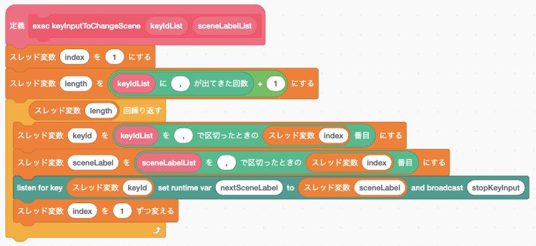<figcaption>keyとscene labelを対応付け、listenerがruntime更新とbroadcastを行う1回分のloopです。</figcaption></figure>

<section><strong>key</strong>物理keyからscene labelを選ぶ。</section><section><strong>touch</strong>画面のActor名から同じ遷移へ合流。</section><section><strong>競合</strong>最初の入力で解決し、残りのlistenerを解除。</section>

<strong>後片付け:</strong> 登録はtargetごとに所有されます。sceneをまたいだ古いlistenerが次の場面で発火しないよう、境界で必ず停止します。

ブロック例: <a href="https://github.com/kubohiroya/tm-kamishibai/blob/d1624c9ce9464bf696b4bb97851dce9154a09ee6/app/project.source.json">Version 3.2.0 project source</a>（Stage: <code>keyInputToChangeScene</code>）

## Kamishibai Runtime — 紙芝居DSLを事前検査し、構造化診断とSVGを生成する {#extension-kamishibai-runtime .extension-sheet .extension-sheet-left}

アプリ内蔵 1 / 2　機能拡張そのもの 1 / 2

アプリ内蔵<code>kubohiroyakamishibairuntime</code>DSL診断

紙芝居DSL 3.1／3.2を実行前に検査し、旧Text Assetのdeprecated警告と、失敗時の分類済み診断・SVG error画面を作るproject専用拡張です。
正常な台本の実行は置き換えず、副作用を始めてよいかだけを判定します。

✓ <small>Preflight</small>

<strong>安全に失敗する入口</strong>
cameraや音声を始める前に、version、command、参照、条件式をまとめて検査します。

<figure class="extension-flow"><figcaption>内部仕様の要約：副作用を始める前に段階的に検査し、構造化した結果を返す</figcaption>
DSL + project<b>→</b>version・構文<b>→</b>scene / asset参照 address・条件式<b>→</b>実行許可 ／ SVG診断
</figure>

<section>
検査
<ul><li>version、command、action</li><li>scene／asset参照</li><li>addressと条件式syntax</li></ul></section><section>
診断
<ul><li>error code</li><li>行・列</li><li>source抜粋とSVG文字</li></ul></section>

出典: <a href="internal-specification.md">紙芝居アプリ 3.2 内部仕様書</a>、<a href="https://github.com/kubohiroya/tm-kamishibai/blob/d1624c9ce9464bf696b4bb97851dce9154a09ee6/app/extensions/kubohiroyakamishibairuntime.js">内蔵拡張ソース</a>

## Kamishibai Runtimeで素材読込やカメラ開始の前に台本を検査し、エラーを表示する {#extension-kamishibai-runtime-example .extension-sheet .extension-sheet-right}

アプリ内蔵 1 / 2　TMPose 紙芝居での利用例 2 / 2

<aside class="extension-kamishibai-why"><strong>なぜTM紙芝居に必要？</strong>
外部から読み込む台本には、綴り間違いだけでなく、存在しないsceneや素材、危険なaddressが含まれ得ます。asset取得やcamera開始の後で失敗すると、利用者には半端な画面しか残りません。プレイ前に止め、直す行と理由を読める形で示します。
</aside>

<figure class="extension-editor-example"><figcaption><code>startStory</code>直後にvalidateし、成功した場合だけskip状態の初期化やcamera開始へ進む順序を示します。</figcaption></figure>

<section><strong>位置</strong><code>startStory</code>直後、asset／cameraより前。</section><section><strong>失敗</strong>背景作業を始めず、promptへSVG診断を表示。</section><section><strong>成功</strong>従来のStage custom block群へ処理を返す。</section>

<strong>責任境界:</strong> DSL parser／実行器全体ではありません。実行前の限定preflightと、利用者が直せる診断表示に責任を絞っています。

ブロック例: <a href="https://github.com/kubohiroya/tm-kamishibai/blob/d1624c9ce9464bf696b4bb97851dce9154a09ee6/app/project.source.json">Version 3.2.0 project source</a>（Stage: <code>startStory</code>）

## Web Link — HTTPS URLを検証し、新しいタブで開く {#extension-web-link .extension-sheet .extension-sheet-left}

アプリ内蔵 2 / 2　機能拡張そのもの 1 / 2

アプリ内蔵<code>kubohiroyaweblink</code>外部navigation

受け取ったURLを検証し、新しいbrowser tabで開くproject専用の小さな拡張です。
任意schemeを許可せず、HTTPS URLへの明示的なnavigationだけをblock化します。

↗ <small>HTTPS</small>

<strong>アプリの外へ出る一つの安全な扉</strong>
絶対URL、HTTPS、noopener／noreferrerを確認してから新しいtabを開きます。

<figure class="extension-flow"><figcaption>内部仕様の要約：文字列を検証し、開いたtabと元projectを分離する</figcaption>
URL文字列<b>→</b>絶対URLとしてparse<b>→</b>https:だけ許可<b>→</b>new tab noopener / noreferrer
</figure>

<section>
許可
<ul><li>絶対URL</li><li><code>https:</code></li><li>利用者clickからの呼出し</li></ul></section><section>
拒否
<ul><li><code>http:</code></li><li><code>file:</code>／<code>javascript:</code></li><li>通常sceneからの任意navigation</li></ul></section>

出典: <a href="internal-specification.md">紙芝居アプリ 3.2 内部仕様書</a>、<a href="https://github.com/kubohiroya/tm-kamishibai/blob/d1624c9ce9464bf696b4bb97851dce9154a09ee6/app/extensions/kubohiroyaweblink.js">内蔵拡張ソース</a>

## Web Linkで利用者がボタンやメニューを操作したとき、設定済みのHTTPSページを開く {#extension-web-link-example .extension-sheet .extension-sheet-right}

アプリ内蔵 2 / 2　TMPose 紙芝居での利用例 2 / 2

<aside class="extension-kamishibai-why"><strong>なぜTM紙芝居に必要？</strong>
このアプリでは、公式サイトbuttonやmenu項目からWebページへ案内します。一方、台本中の任意URLが勝手にtabを開く設計にはできません。利用者の操作をきっかけに、アプリ側で設定されたHTTPS URLだけを開くことで、案内機能と安全なプレイを両立します。
</aside>

<figure class="extension-editor-example">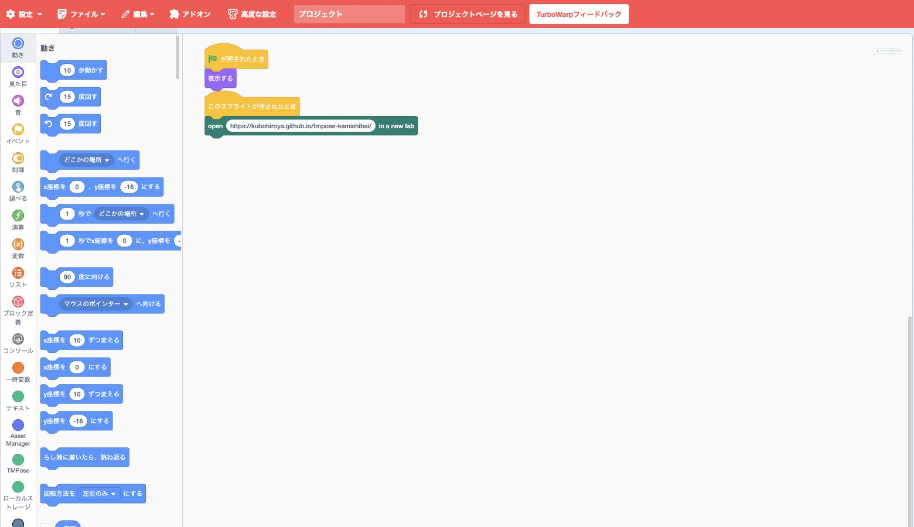<figcaption>buttonクリック直後に、Web Linkが公式HTTPS URLを新しいtabで開く2ブロックのstackです。</figcaption></figure>

<section><strong>入口</strong>公式サイトbutton、<code>open-url</code>を指定したUI項目。</section><section><strong>値</strong>公式サイトURLまたはUI項目へ設定したHTTPS URL。</section><section><strong>制約</strong>通常のscene actionからは呼び出さない。</section>

<strong>browser policy:</strong> popup blockを避けるため、利用者clickに続けて実行します。新しいtabには<code>noopener,noreferrer</code>を付けます。

ブロック例: <a href="https://github.com/kubohiroya/tm-kamishibai/blob/d1624c9ce9464bf696b4bb97851dce9154a09ee6/app/project.source.json">Version 3.2.0 project source</a>（<code>officialWebsiteButton</code>）

