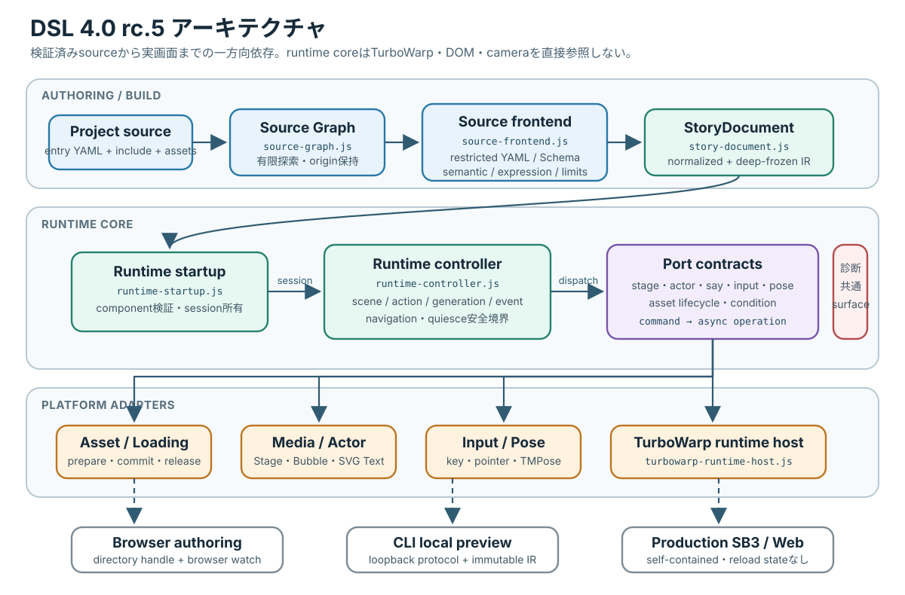
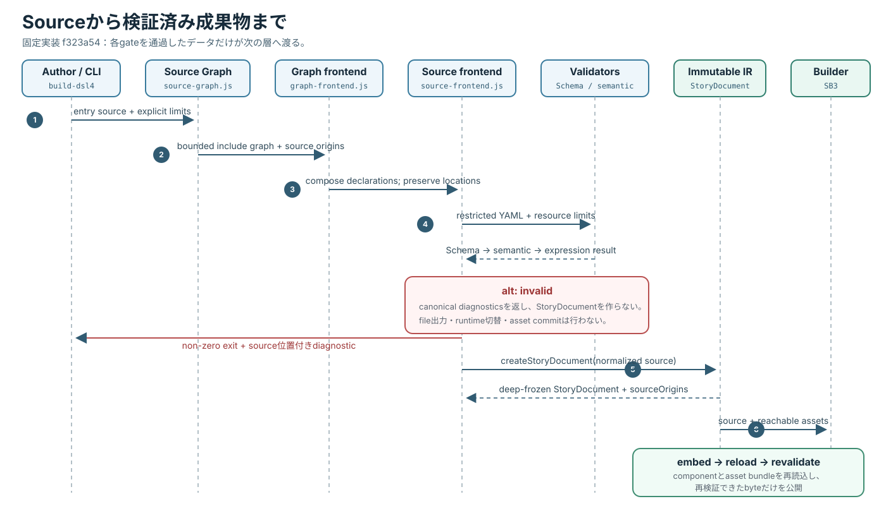
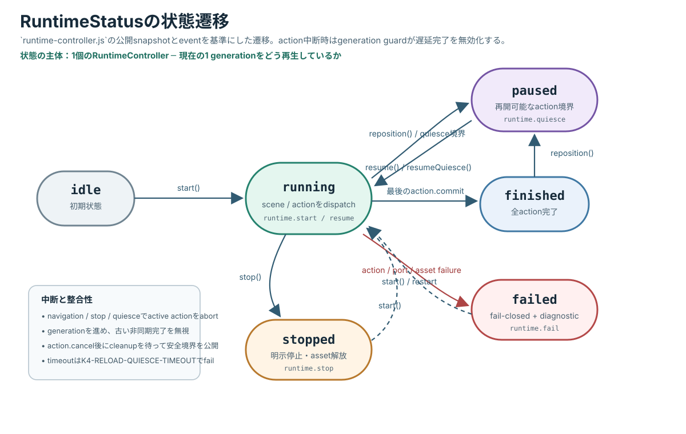
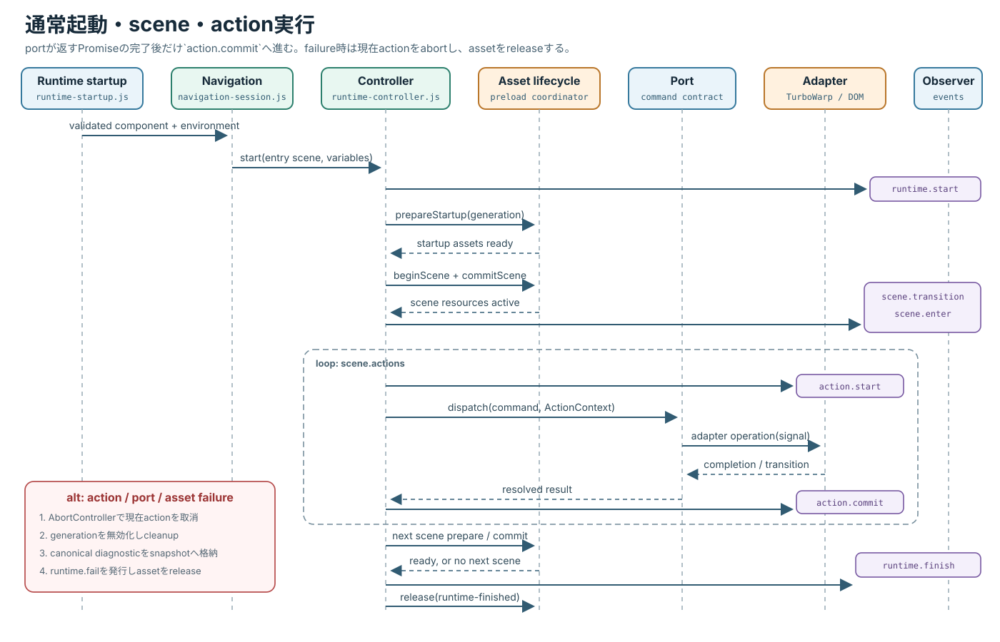
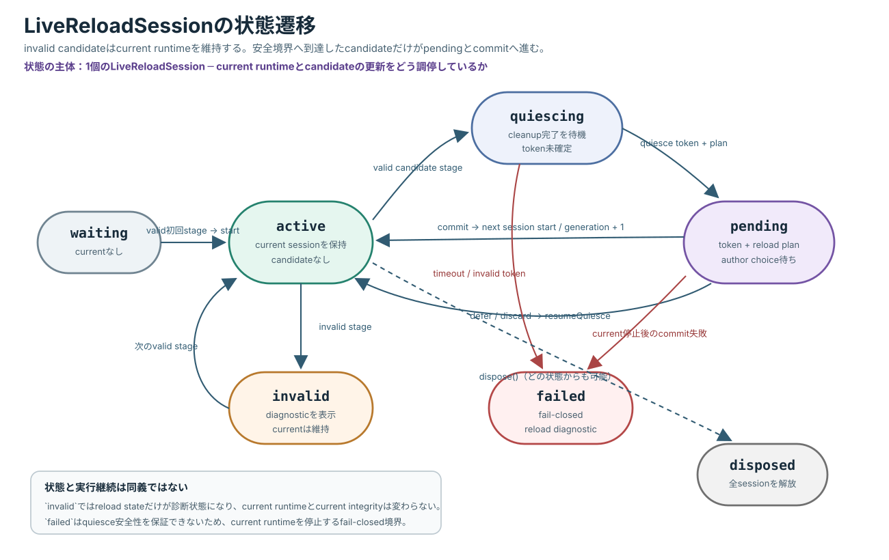
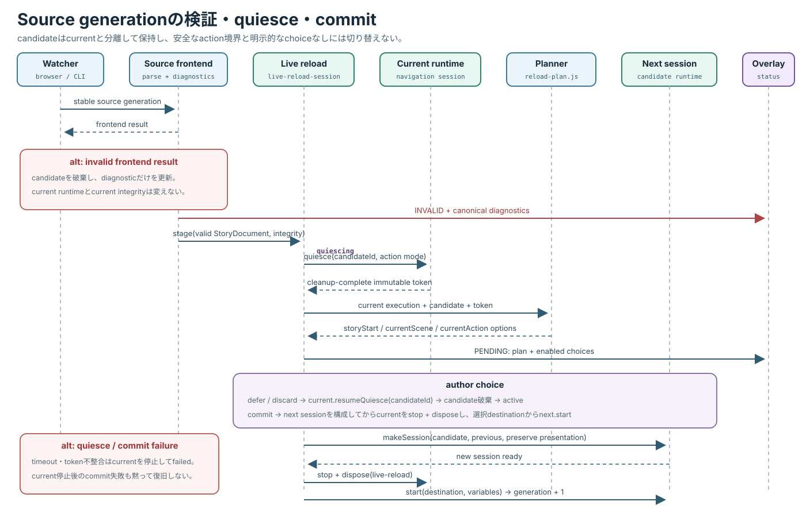
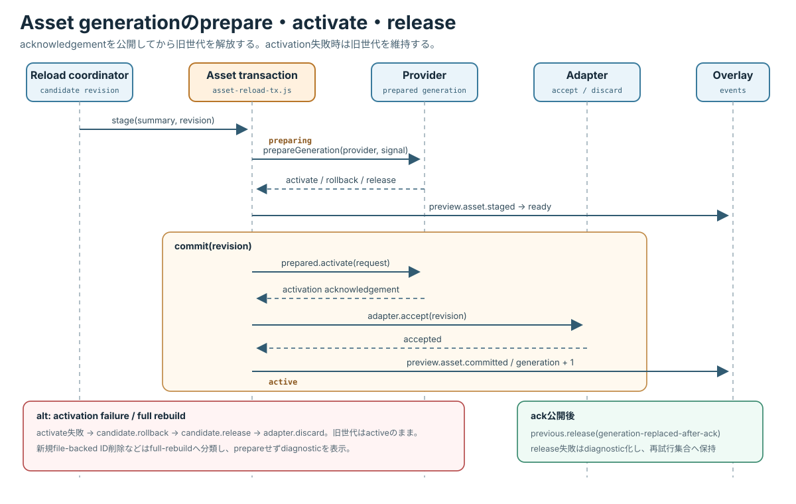

# 紙芝居アプリ 4.0 内部仕様書

Copyright © 2026 Hiroya Kubo. この文書は[CC BY-SA 4.0](https://creativecommons.org/licenses/by-sa/4.0/)で提供します。

文書状態: 固定実装基準を説明する内部仕様（正式リリース済みの意味ではない）\
調査基準: TM Kamishibai `29c0dea`（4.0.0-rc.8）、2026年8月20日

> **配布状態との区別:** 2026年8月20日時点で`v4.0.0-rc.8`はprereleaseとして公開されていますが、
> 正式な`v4.0.0`ではありません。本書はrc.8固定コミットの内部構造を説明します。

この文書は、TM紙芝居4.0のsource frontend、実行中間表現、runtime、platform adapter、
preview transactionの責務境界を、完成実装に対応させて記録します。作者向けのYAML構文は
[紙芝居DSL 4.0 台本作成ガイド](../dsl-author-guides/dsl-4.0-author-guide.md)、fieldの型と制約は
[紙芝居DSL 4.0 Schemaリファレンス](../dsl-author-guides/dsl-4.0-schema-reference.md)を参照してください。

対象アプリ: TM Kamishibai 4.0.x\
受理するDSL宣言: `kamishibai: '4.0'`\
実装固定commit: [`29c0dea`](https://github.com/kubohiroya/tm-kamishibai/commit/29c0deadcb98badf94a0244c479ca896dc71f842)（2026年8月20日、`v4.0.0-rc.8`）

本書のpath、型、関数、event、flagは、このcommitのsourceとtestを基準にしています。
配布成果物を調査して推測した名称ではありません。

## 読む前に {#before-reading .unnumbered}

本書は、4.0の利用方法を知った後に内部の層を理解する開発者向け文書です。アプリの使い方や台本作成の
入門書ではありません。初めて4.0に触れる場合は[大人向け概要](../user-guides/executive-summary-adult-4.0.md)、
制作環境から実装へ進む場合は[アプリ・教材・ツールチェインガイド](application-materials-guide-4.0.md)を
先にお読みください。実際の保守手順だけを探している場合は
[ソフトウェアメンテナンスガイド](developer-guide-4.0.md)から入り、必要な内部節へ戻る方法もあります。

本書は「範囲 → 用語 → アーキテクチャ → 各層 → transaction → 診断」の順で読みます。特に
`StoryDocument`、generation、port、adapter、commitの意味を用語表で確認してから先へ進んでください。

## 文書の範囲 {#scope .unnumbered}

本書は次を扱います。

- project内のYAMLを有限かつ決定的に読み取るsource frontend
- 複数sourceを一つのgenerationへ構成するSource Graph
- JSON Schema検証、意味検証、式検証と診断の順序
- immutableな`StoryDocument`とsource位置の対応
- sceneとactionを実行するruntime controller、Action Context、navigation
- TurboWarp、asset、入力、pose、SVG Textを隔離するplatform adapter
- assetのprepare、scene commit、releaseとlive reload transaction
- browser preview、CLI preview、production SB3の共有契約と能力差

本書はYAMLの書き方、作品制作手順、release作業そのものは扱いません。また、Scratch target、
保存block、broadcastを内部仕様の中心には置きません。4.0の正本はYAMLから生成する
`StoryDocument`と、それを消費するJavaScript moduleの契約です。

## 用語 {#terminology .unnumbered}

| 用語            | 本書での意味                                                                           |
| --------------- | -------------------------------------------------------------------------------------- |
| project         | `project.source.json`、entry YAML、included YAML、local assetを含むdirectory境界       |
| source          | `.k4.yml`、`.k4.yaml`、`.kamishibai.yml`、`.kamishibai.yaml`のいずれかで終わるYAML     |
| Source Graph    | entryから`include`で到達するsource、edge、宣言、asset pathを持つimmutable graph        |
| generation      | sourceとassetを同じ時点の検証済みsnapshotとして識別する単位                            |
| `StoryDocument` | 検証済みYAMLをruntime用に正規化し、deep-freezeした中間表現                             |
| source frontend | canonicalize、YAML、Schema、意味・式・資源上限検証を一つの結果へまとめるpure境界       |
| runtime session | 一つの`StoryDocument`、実行状態、platform environmentを所有する単位                    |
| Action Context  | actionごとの`AbortSignal`、generation、変数snapshot、Structured Data参照を渡す実行文脈 |
| port            | runtime coreがplatform固有処理を呼ぶ関数集合                                           |
| adapter         | TurboWarp VM、Asset Manager、TurboWarp TM、DOMなどをport契約へ変換する外側のmodule     |
| quiesce         | live reload前に、action cleanupが完了した再開可能境界へruntimeを移す処理               |
| commit          | 検証・prepare済みcandidateをcurrent generationとして公開する処理                       |
| rollback        | candidateのactivate失敗時にcandidate資源を戻し、current generationを維持する処理       |

## 権威関係とアーキテクチャ {#architecture}

次図は、sourceからplatform固有処理までの主な依存方向です。内側のruntimeはcameraやTurboWarpを直接扱わず、
portを介して外側のadapterへ依頼します。



_図: rc.8の実装moduleを責務ごとに配置したレイヤー構成。矢印は主な依存方向であり、各層の失敗は
canonical diagnosticとして共通surfaceへ投影されます。_

### 固定実装の呼出し経路 {#implementation-call-path}

前図を実装のexportとcomposition rootまで具体化すると、固定commit`29c0dea`では次の経路になります。
この追跡は、同commitの公開rc.8 SB3をbaseにしたlocal previewを実行し、immutable sourceの稼働、
`Version 4.0.0-rc.8`のタイトル、invalid保存時の診断とcurrent integrity維持を観測した結果と
突き合わせています。

<figure class="concept-flow dsl4-implementation-map"><figcaption>固定実装をsourceから実画面まで追う主要呼出し経路</figcaption><div class="concept-flow__track"><span><code>createDsl4SourceGraph</code><small>source-graph.js<br>entryとincludeを有限探索</small></span><b aria-hidden="true">→</b><span><code>createDsl4SourceGraphFrontend.parse</code><small>source-graph-frontend.js<br>合成後にsingle-source frontendへ委譲</small></span><b aria-hidden="true">→</b><span><code>createDsl4SourceFrontend.parse</code><small>source-frontend.js<br>YAML・Schema・semantic・Action Registry</small></span><b aria-hidden="true">→</b><span><code>createStoryDocument</code><small>story-document.js<br>正規化してdeep-freeze</small></span><b aria-hidden="true">→</b><span><code>createDsl4RuntimeStartup</code><small>runtime-startup.js<br>componentを検証しsessionを所有</small></span><b aria-hidden="true">→</b><span><code>createDsl4RuntimeController.dispatch</code><small>runtime-controller.js<br>sceneとactionを順にportへ渡す</small></span><b aria-hidden="true">→</b><span><code>createDsl4TurboWarpRuntimeEnvironment</code><small>turbowarp-runtime-host.js<br>portとlifecycleを構成</small></span></div><div class="dsl4-implementation-map__ports"><section><strong>アセットとLoading</strong><code>platform-asset-session.js</code><span>Asset Manager、背景、音、ポーズモデルをprepare・release</span></section><section><strong>表示と発話</strong><code>media-action-port.js</code><code>actor-action-port.js</code><span>Stage、Actor、Bubble、SVG Textへ反映</span></section><section><strong>入力とポーズ</strong><code>async-input-action-port.js</code><code>pose-action-port.js</code><span>キー、タッチ、TurboWarp TM、カメラ、feedbackへ接続</span></section></div><p class="concept-flow__note">runtime coreは<code>stage</code>、<code>say</code>、<code>pose</code>等のcommand名でportを呼びます。TurboWarp VM、DOM、cameraをcoreから直接参照しないため、同じ<code>StoryDocument</code>をpreviewと配布成果物で共有できます。</p></figure>

実画面ではsource frontendの成功結果が`VALID: The current immutable source is running.`として表示され、
reload監視は`Watching`になります。versionを`4.1`へ変えた一時candidateは`K4-VERSION-001`で`INVALID`となり、
current integrityを更新しませんでした。画面との対応、撮影条件、固定した成果物hashは
[DSL 4.0 実装ビジュアル記録](../../DSL4-IMPLEMENTATION-VISUALS.md)を参照してください。

### 正本の順序

1. 作者向け構造の正本は`schema/dsl-4.schema.json`です。
2. parse後の追加制約は`src/dsl4/semantic-validator.js`と、注入されたRuntime Expression validatorが正本です。
3. runtime入力の正本は`src/dsl4/story-document.js`が生成する`StoryDocument`です。
4. 実行状態とeventの正本は`src/dsl4/runtime-controller.js`です。
5. platform能力は`src/dsl4/platform/`のcomposition rootと各adapterが正本です。
6. preview candidateの切替は`live-reload-session.js`、asset byteの切替は`asset-reload-transaction.js`が正本です。

Schemaからruntime実装を生成したり、runtimeの受理状態からSchemaを逆生成したりはしません。
Schema、semantic validator、StoryDocument、runtimeの各境界を独立testで同期します。

### 実装から検証できる関係表

次表は上から下への主要呼出し方向です。「主要関数」は固定commitに存在するexport、
「確認test」はその境界を直接検証するfileです。

| 層                     | 入力 → 出力                                                | 主要path・関数                                                                         | 確認test                                                        |
| ---------------------- | ---------------------------------------------------------- | -------------------------------------------------------------------------------------- | --------------------------------------------------------------- |
| project read           | project path → bounded source bytes                        | `src/builder/dsl4-external-source.js`、`loadDsl4ExternalSource`                        | `test/dsl4-external-source-loader.test.mjs`                     |
| graph discovery        | entry path → Source Graph                                  | `src/dsl4/source-graph.js`、`createDsl4SourceGraph`                                    | `test/dsl4-source-graph.test.mjs`                               |
| graph composition      | Source Graph → composed parse result                       | `src/dsl4/source-graph-frontend.js`、`createDsl4SourceGraphFrontend`                   | `test/dsl4-source-graph-frontend.test.mjs`                      |
| source frontend        | canonical YAML → diagnosticまたは`StoryDocument`           | `src/dsl4/source-frontend.js`、`createDsl4SourceFrontend`                              | `test/dsl4-schema.test.mjs`、`test/dsl4-source-limits.test.mjs` |
| production composition | Schema + Runtime Expression → frontend                     | `src/builder/dsl4-source-frontend.js`、`createDsl4ProductionSourceFrontend`            | `test/dsl4-expression-diagnostic-boundaries.test.mjs`           |
| artifact build         | source + asset + base SB3 → verified runtime component     | `src/builder/dsl4-build.js`、`buildDsl4RuntimeComponent`                               | `test/dsl4-one-shot-build.test.mjs`                             |
| startup                | packaged component → navigation session                    | `src/dsl4/runtime-startup.js`、`createDsl4RuntimeStartup`                              | `test/dsl4-runtime-startup.test.mjs`                            |
| execution core         | `StoryDocument` + port → runtime state・event              | `src/dsl4/runtime-controller.js`、`createDsl4RuntimeController`                        | `test/dsl4-runtime-controller.test.mjs`                         |
| navigation             | runtime + input + history → controlled movement            | `src/dsl4/navigation-session.js`、`createDsl4NavigationSession`                        | `test/dsl4-navigation-session.test.mjs`                         |
| platform composition   | runtime component + TurboWarp host → port・asset lifecycle | `src/dsl4/platform/turbowarp-runtime-host.js`、`createDsl4TurboWarpRuntimeEnvironment` | `test/dsl4-turbowarp-runtime-host.test.mjs`                     |
| source reload          | immutable candidate → next runtime session                 | `src/dsl4/live-reload-session.js`、`createDsl4LiveReloadSession`                       | `test/dsl4-live-reload-session.test.mjs`                        |
| asset reload           | byte candidate → active asset generation                   | `src/dsl4/asset-reload-transaction.js`、`createDsl4AssetReloadTransaction`             | `test/dsl4-asset-reload-transaction.test.mjs`                   |

`test/dsl4-architecture.test.mjs`は、core import graphに`node:`、DOM、Scratch VM、
platform moduleが侵入しないことを検査します。I/Oとplatform依存を注入するため、同じ
`StoryDocument`とruntime coreを複数surfaceで共有できます。

### 図と実装の追跡表

| 図                          | 主な実装正本                                                                                       | 直接確認するtest                                                         |
| --------------------------- | -------------------------------------------------------------------------------------------------- | ------------------------------------------------------------------------ |
| レイヤー構成                | `source-graph.js`、`source-frontend.js`、`story-document.js`、`runtime-controller.js`、`platform/` | `dsl4-architecture.test.mjs`                                             |
| source build sequence       | `source-graph-frontend.js`、`builder/dsl4-source-frontend.js`、`builder/dsl4-build.js`             | `dsl4-source-graph-frontend.test.mjs`、`dsl4-one-shot-build.test.mjs`    |
| RuntimeStatus               | `runtime-controller.js`                                                                            | `dsl4-runtime-controller.test.mjs`                                       |
| 通常実行sequence            | `runtime-startup.js`、`navigation-session.js`、`runtime-controller.js`                             | `dsl4-runtime-startup.test.mjs`、`dsl4-navigation-session.test.mjs`      |
| live reload state／sequence | `live-reload-session.js`、`runtime-controller.js`                                                  | `dsl4-live-reload-session.test.mjs`、`dsl4-live-reload-quiesce.test.mjs` |
| asset reload sequence       | `asset-reload-transaction.js`                                                                      | `dsl4-asset-reload-transaction.test.mjs`                                 |

## Source frontend {#source-frontend}

### 単一sourceの処理順

`createDsl4SourceFrontend(schema, options)`はSchemaをAJV 2020で一度compileし、`parse()`ごとに
次の順で処理します。

1. `canonicalizeDsl4Source`で改行とsource表現を規範化する。
2. UTF-8 byte上限を超えるsourceをYAML parse前に`K4-SOURCE-LIMIT-BYTES-001`で拒否する。
3. YAML 1.2 strict modeで、一つのtop-level mappingだけを読む。
4. alias、anchor、merge key、custom tag、prototype汚染につながるmapping keyを拒否する。
5. YAML node数、collection depth、scalar長を検査する。
6. JSON Schemaで構造、型、未知field、action形を検査する。
7. `validateDsl4Semantics`で参照、asset kind、重複stable ID、scene・pose条件などを検査する。
8. scene数、action数、asset数と、branch式の構文・上限を検査する。
9. errorがなければ`createStoryDocument`でimmutable IRを生成する。



_図: 失敗結果に部分的な`StoryDocument`を含めず、成果物出力前に埋込み後のcomponentを再読込・再検証する
build gate。_

戻り値はdiscriminated resultです。成功時は`{ok: true, canonicalSource, diagnostics,
storyDocument}`、失敗時は`{ok: false, canonicalSource, diagnostics}`です。失敗結果に部分的な
`StoryDocument`を載せないため、後段は`ok`をstage gateとして使えます。

source frontendの既定上限は`dsl4SourceFrontendDefaultLimits`に固定されています。

| field                     | 既定最大値 |
| ------------------------- | ---------: |
| `maxCanonicalSourceBytes` |    256 KiB |
| `maxYamlNodes`            |     20,000 |
| `maxYamlDepth`            |         64 |
| `maxScalarScalars`        |     16,384 |
| `maxScenes`               |        512 |
| `maxActionsPerScene`      |      1,024 |
| `maxTotalActions`         |      4,096 |
| `maxAssets`               |      1,024 |
| `maxDiagnostics`          |        100 |
| `maxRelatedLocations`     |          8 |

callerはこの値以下へだけ狭めます。未知のlimit名、上限より大きい値、非整数は起動時に拒否します。

### Source Graph

`createDsl4SourceGraph(entryPath, {readSource, limits})`はassetを読まず、source topologyだけを作ります。
各nodeは`sourceId`と`sourcePath`を同じlogical project-relative pathとして持ち、canonical source、
byte数、include edge、宣言、宣言元に対して解決したasset file pathを保持します。

既定上限`dsl4SourceGraphDefaultLimits`は次のとおりです。

| field                 |    既定最大値 |
| --------------------- | ------------: |
| `maxSourceFiles`      |            64 |
| `maxSourceBytes`      | 1 MiB／source |
| `maxTotalSourceBytes` |  4 MiB／graph |
| `maxIncludeDepth`     |            32 |

pathはproject rootから脱出できず、source suffixも検査します。cycleは`K4-INCLUDE-CYCLE`、
読込失敗は`K4-INCLUDE-READ-001`、同じnamespace・IDまたはsingletonの重複は
`K4-DECLARATION-DUPLICATE`で停止します。`order`はdependency order、`discoveryOrder`はentryを
先頭とする安定した発見順です。

`createDsl4SourceGraphFrontend(sourceFrontend)`は`dsl4SourceIncludes`がONのときだけ動作します。
各nodeへrestricted YAML policyを適用し、named declarationとsingletonを一つへ構成します。
root優先や後勝ち規則はありません。構成後のcanonical sourceにも明示上限を適用し、その後は単一sourceと
同じfrontendへ渡します。

included sourceの宣言位置は失われません。生成後の`StoryDocument.sourceOrigins`はstory pathごとに
`{sourceId, range}`を持ち、runtime diagnosticは`sourceOriginForStoryPath()`で最も近い宣言元へ戻せます。

### Schema、意味検証、式検証

検証境界は次のように分離します。

| 段階       | 拒否する例                                                                       | 実装                                                         |
| ---------- | -------------------------------------------------------------------------------- | ------------------------------------------------------------ |
| Schema     | 型違い、必須field欠落、未知top-level key、action形の不一致                       | `schema/dsl-4.schema.json` + AJV 2020                        |
| semantic   | 存在しないscene・asset・actor参照、asset kind違い、pose model不足、重複stable ID | `validateDsl4Semantics`                                      |
| expression | branch式のsyntax、token・depth上限、runtimeの未知・不正variable                  | Runtime Expression composition + `expression-diagnostics.js` |
| resource   | source、YAML、scene、action、asset、diagnostic件数の超過                         | `source-frontend.js`                                         |

production compositionは`createDsl4ProductionSourceFrontend`が
`@kubohiroya/turbowarp-runtime-expression/composition`を注入します。独自parser、`eval`、
`Function`へのfallbackはありません。preview、validate、buildはこのfrontend契約を共有します。

runtimeでは`resolveBranch()`がaction contextの`variables` snapshotを`evaluateCondition()`へ渡し、一つのbranchを
上から評価します。4.0.0-rc.8のsnapshotに含まれるのはトップレベル`variables:`だけで、Stage／sprite変数、
Temporary Variables、controller status、pose eventをliveには読みません。

## StoryDocument {#story-document}

### 形とimmutability

`createStoryDocument()`はsource objectをcloneしてから再構成し、`deepFreeze()`した次のrootを返します。

```json
{
  "kind": "StoryDocument",
  "version": "4.0",
  "metadata": {"sourceId": "project/story.k4.yml"},
  "assets": {},
  "actors": {},
  "cover": null,
  "textStyles": {},
  "speechStyles": {},
  "variables": {},
  "loading": null,
  "poseRecognition": null,
  "controls": null,
  "branches": {},
  "scenes": [],
  "sourceMap": {}
}
```

Source Graph経由ではさらに`sourceOrigins`が加わります。`assets`はIDをkeyとし、compact記法も
`id`、`kind`、`name`、`delivery`、`loading`、`retention`を持つobjectへ正規化します。
既定の`delivery`は`embedded`、`loading`は`eager`、`retention`はpose modelだけ`scene`、
その他は`story`です。

`scenes`は宣言順の配列です。各sceneは`{kind: 'Scene', id, poseModel, posePreview, actions}`、
各actionは次の形です。

YAML 1.2のmappingはrepresentation model上で順序を持ちません。DSL 4.0は固有規則として、source YAMLの
serialization treeに現れる`scenes` pairの順序を通常実行のscene順とします。source frontendはYAML nodeの
pair列、または全scene IDで同値な順序を保証する中間表現から`StoryDocument.scenes`を構築し、JSON Schema検証用の
native objectが持つproperty列挙順を正本にしてはいけません。formatter、converter、serializerもscene keyを
sortせず、parse、serialize、parseのround tripで同じpair順を保持します。

現行実装は`Document#toJS()`後の`scenes`を`Object.entries()`で配列化するため、ECMAScriptのarray index相当の
scene IDではsource順を失います。例えば`"10"`、`"2"`、`"1"`の順に宣言したsceneが`"1"`、`"2"`、
`"10"`の順になります。これは意図した契約ではなく既知の適合差です。toolはこの挙動を互換仕様として固定せず、
YAML nodeのpair順から正規化する実装へ置換します。

```json
{
  "kind": "Action",
  "id": "/scenes/opening/actions/0",
  "target": "Hero",
  "command": "say",
  "args": {"text": "こんにちは"},
  "sourceRange": {}
}
```

custom actionだけ`handler: 'custom'`を持ち、明示された場合は`stableId`も持ちます。`id`は
StoryDocument内のstory pathであり、Scratch block IDではありません。

### source位置

`sourceMap`はstory pathからcanonical sourceの`SourceRange`へ対応します。`SourceRange`は
1-originの`line`・`column`と0-originの`offset`を持つ`start`・`end`です。診断は
作者向け`path`に加え、利用できる場合は`storyPath`を持ちます。included sourceでは
`sourceOrigins`からlogical source pathを復元し、絶対machine pathを公開しません。

## RuntimeとAction Context {#runtime}

### 起動境界

`createDsl4RuntimeStartup()`は起動時に一度`resolveDsl4FeatureFlags()`を呼びます。
`dsl4Runtime`がOFFならdependencyを初期化せず`enabled: false`を返します。ONならpackaged componentを
検証し、hostが明示したsource・asset上限の下で`StoryDocument`、runtime artifact、asset bundleを読み、
`createDsl4NavigationSession()`へ渡します。

runtime environmentは次を提供します。

- `port`: action command名をkeyとするplatform operation
- `assetLifecycle`: `prepare`、`setLoading`、`releaseAssets`、`release`
- `evaluateCondition`: branch式評価
- `inputArbitration`: navigationと作品内inputの競合を一つのconsumerへ決める契約
- `dispose(reason)`: environmentが所有する全resourceの冪等解放

sessionはenvironmentを単独所有します。session dispose時はnavigationを停止した後、environmentを解放し、
双方のcleanup失敗を`AggregateError`へまとめます。

### RuntimeStatusとsnapshot

`createDsl4RuntimeController()`の`RuntimeStatus`は`idle`、`running`、`paused`、`failed`、
`finished`、`stopped`です。公開snapshotは`status`、`sceneId`、`actionIndex`、`actionPath`、
`generation`、primitiveだけの`variables`、失敗時の`diagnostic`をdeep-freezeして返します。



_図: `start()`、`reposition()`、quiesce、`resume()`、正常終了、失敗、停止の遷移。破線はterminal状態から
再度`start()`したときの再初期化を表します。_

この図の主体は**一つの`RuntimeController`**です。「現在の一つのgenerationを、どのscene・action位置で
どう再生しているか」だけを表します。source変更の有無、candidateの妥当性、作者がreloadを承認したかは
`RuntimeStatus`へ混ぜません。それらは後述する`LiveReloadSession`が別の状態として持ちます。

| 現在状態                                | 操作・条件                           | 次状態                  | 主なevent                                          |
| --------------------------------------- | ------------------------------------ | ----------------------- | -------------------------------------------------- |
| `idle`、`finished`、`failed`、`stopped` | `start()`                            | `running`               | `runtime.start`、`scene.transition`、`scene.enter` |
| `running`                               | action dispatch開始                  | `running`               | `action.start`                                     |
| `running`                               | action正常完了                       | `running`               | `action.commit`                                    |
| `running`                               | `goto`、`branch`、input route        | `running`のまま別scene  | `scene.transition`、`scene.enter`                  |
| `running`                               | 最後のaction完了                     | `finished`              | `runtime.finish`                                   |
| `running`                               | action、port、式、asset失敗          | `failed`                | `runtime.fail`                                     |
| `running`                               | navigation、reloadで現在actionを取消 | `running`または`paused` | `action.cancel`                                    |
| `running`、`finished`                   | `reposition()`                       | `paused`                | `navigation.reposition`                            |
| `paused`                                | `resume()`                           | `running`               | `runtime.resume`                                   |
| `running`、`paused`                     | `stop()`                             | `stopped`               | `runtime.stop`                                     |

scene transitionはtarget sceneのlazy assetをprepareしてから`transitionTo()`をpublishします。
scene commit後に不要なscene-retained assetを解放します。準備失敗時は現在sceneを置き換えません。



_図: portが返す非同期operationの完了後だけ`action.commit`へ進みます。action、port、式、assetの失敗は
current generationを無効化し、canonical diagnosticと`runtime.fail`へ収束します。_

### RuntimeEvent

eventは`{sequence, type, sceneId, storyPath, actionPath, generation, details}`です。
`sequence`はstartごとに0へ戻り、observerは実行意味を変更できません。`onEvent`がthrowしてもruntimeは継続します。
主要typeは次です。

- lifecycle: `runtime.start`、`runtime.resume`、`runtime.finish`、`runtime.fail`、`runtime.stop`
- scene: `scene.transition`、`scene.enter`
- action: `action.start`、`action.commit`、`action.cancel`
- navigation: `navigation.advance`、`navigation.reposition`
- asset: `assets.startup.start`、`assets.startup.ready`、`assets.preload.start`、
  `assets.loading.show`、`assets.loading.hide`、`assets.scene.ready`、`assets.release`
- reload boundary: `runtime.quiesce`

### Action Context

coreが各actionへ渡す`ActionContext`は次を持ちます。

| member                     | 契約                                                        |
| -------------------------- | ----------------------------------------------------------- |
| `signal`                   | action取消とともにabortされる`AbortSignal`                  |
| `generation`               | action開始時のruntime generation                            |
| `sceneId`、`actionPath`    | 現在位置の安定した識別子                                    |
| `variables`                | action開始時のimmutable primitive snapshot                  |
| `getVariable(name)`        | 現在値の読取                                                |
| `setVariable(name, value)` | current generation、未abort、宣言済み、同じ型のときだけ更新 |
| `createAdvanceWait()`      | speech advance flag有効時の一回限りの待機handle             |
| `structuredData`           | 有効時だけ渡す`actionScopeRef`と`actionViewRef`             |

generationとsignalの両方を検査するため、取消済みの非同期actionが遅れて完了しても変数やsceneをcommitできません。

custom actionは別の起動時flag `dsl4CustomActionsEnabled`で既定OFFです。
`createDsl4ActionInvocationAdapter()`がAction Registry Snapshot、Structured Dataのaction scope、
TurboWarp primary threadを一つのinvocationへ束ねます。invocationは`running`から`completed`、
`transitioned`、`failed`、`cancelled`のいずれかへ一度だけsettleします。既定timeoutは30秒です。

`createDsl4ActionContextTurboWarpSurface()`はunsandboxed TurboWarp hostへ、次の開発者blockを
flag ON時だけ登録します。

- `whenCustomAction`
- `currentActionName`、`currentActionTarget`
- `currentActionHasArgument`、`currentActionArgument`
- `completeCurrentAction`、`failCurrentAction`、`gotoFromCurrentAction`

contextがないthread、二重settle、未知引数、不正goto、timeout、thread cleanup失敗は
`K4-CUSTOM-*`診断へ変換されます。

## Platform adapter {#platform-adapters}

coreはbrowser global、DOM、Scratch API、filesystem、networkを直接参照しません。
`src/dsl4/platform/`が外部能力を注入し、`createDsl4TurboWarpRuntimeEnvironment()`がport衝突と
作品が要求するcommandの欠落を起動時に検査します。

| adapter／port                | 担当能力                                                              | 主なruntime command・resource                               |
| ---------------------------- | --------------------------------------------------------------------- | ----------------------------------------------------------- |
| `asset-manager-adapter.js`   | backdrop、costume、image、soundの登録・解放                           | Asset Manager composition                                   |
| `tm-model-adapter.js`        | pose model bundleの登録・label取得・解放                              | TurboWarp TM composition                                    |
| `platform-asset-session.js`  | asset adapter、verified remote cache、binary entry、Async Inputの所有 | `assetLifecycle`、pose/input composition                    |
| `media-action-port.js`       | stage、BGM、sound、Actor skin                                         | `stage`、`bgm`、`sound`、`setSkin`                          |
| `actor-action-port.js`       | actor表示、発話、移動、透明度                                         | `show`、`hide`、`say`、`think`、`moveTo`、`setTransparency` |
| `svg-text-action-port.js`    | SVG Text targetとstyle                                                | `setText`                                                   |
| `pose-action-port.js`        | pose sequence・selectionとfeedback event                              | `pose`、`poseInputToChangeScene`                            |
| `async-input-action-port.js` | key・touch route                                                      | `keyInputToChangeScene`、`touchInputToChangeScene`          |
| `camera-preview-controls.js` | preview mirror、camera menu、reserved layout                          | DOM controlとcamera port                                    |
| `turbowarp-actor-adapter.js` | actor target、speech、transitionをTurboWarpへ接続                     | VM target・scheduler                                        |

`createDsl4StandardAppShell()`が受理するsurface名は`webPlayer`、`regularEditor`、`packager`、
`developmentPreview`です。pose feedback用DOMは必要になるまで作らず、shell disposeはruntime hostを
先に解放してからmountを削除します。

## Asset lifecycle {#asset-lifecycle}

### build時のsnapshot

`buildDsl4RuntimeComponent()`は検証済み`StoryDocument`が参照するlocal assetだけを
`loadDsl4LocalAssetSnapshot()`で読みます。fileごとのbyte上限、件数、総byte数を明示し、
integrity付き`assetBundle`、`sourceDescriptor`、`runtimeArtifact`を作成します。base SB3へ埋め込んだ後、
`loadDsl4RuntimeComponent()`で同じ上限を使って再読込し、成功したbyteだけを返します。

file出力は`buildDsl4RuntimeComponentFile()`がcandidate directoryを検証し、
`installBundleTransactionally()`で置き換えます。検証に失敗した途中SB3を最終出力へ残しません。

### runtime prepareとretention

`createDsl4EmbeddedAssetLifecycle()`はasset IDごとに`pending`、`ready`、`failed`のcache entryを持ちます。
`prepare()`はasset materializeとplatform adapter prepareを行い、generationがstaleまたはsignalがabort済みなら
作成済みresourceを即座にreleaseします。

`createDsl4AssetPreloadCoordinator()`はasset kindを知らず、dependency indexに従って時期だけを調整します。

1. startupでcover、loading、actor、eager assetをprepareする。
2. scene開始前にそのsceneのlazy assetをprepareする。
3. pending中だけloading presentationを表示する。
4. 準備完了後にscene transitionをpublishする。
5. scene commitで次sceneに不要な`retention: scene` assetをreleaseする。
6. stop、failure、disposeで全resourceを逆所有順に解放する。

Poseモデルについて`poseRecognition.modelInitialization.policy`が`latest-needed`の場合、preload coordinatorの
最新要求をTurboWarp TM 1.12.0 Compositionへ渡し、重い初期化をactive 1件＋最新pending 1件へ制限します。
superseded requestはasset lifecycleの`AbortSignal`でcancelし、registryへ公開しません。Aの実行中にB、Cが
要求された場合はBを開始せず、Aの安全な終了後にCだけを開始します。pose不要sceneへskipした場合はpendingを
破棄します。

camera lifecycleとmodel lifecycleは別の所有者です。`getUserMedia()`／`video.play()`はdescriptor探索、
decode、SHA検証、TensorFlow／PoseNet初期化と並行できます。未検証byte列をTensorFlowへ渡してはならず、
最初の推論でcamera readyとmodel registeredを同期します。model cancelだけでcameraを停止せず、stopまたは
session disposeがcameraを解放します。既定値`legacy`／`parallel: false`はこの最適化を無効化します。

`poseRecognition.preview.overlay`がある場合、hostは正規化済みの表示、joint style、bone style、最低confidence、
confidence連動をTurboWarp TM 1.12.0の公開Composition APIへ順番に適用します。overlay専用feature flagはありません。
camera canvas、2D context、推論readback、SVG要素はTurboWarp TMが所有し、hostはDOMやTensorFlow.js内部経路をpatchしません。

remote assetは自動的に許可しません。`createDsl4RemoteAssetLifecycle()`へhost loaderを明示注入した場合だけ
有効です。通常のposeModelはHTTPS directory URLから`model.json`、`metadata.json`、宣言されたweightsを
lazy取得します。検証付きremoteはSHA-256 integrity、media type、sizeを再検証して同じlifecycleへ入ります。

## Transaction、snapshot、commit／rollback {#transactions}

### source generation transaction

Web／CLI previewは安定読込を二回行い、source graphとasset manifestのfingerprintが一致した一式だけを
generationとしてstageします。途中保存、sourceだけ新しい状態、assetだけ新しい状態はprotocolへ公開しません。
invalid candidateはdiagnosticだけを更新し、current runtimeを維持します。

`createDsl4LiveReloadSession()`の状態は`waiting`、`active`、`invalid`、`quiescing`、`pending`、
`failed`、`disposed`です。



_図: `invalid`はreload表示の状態であり、current runtimeを停止する状態ではありません。quiesceの安全性を
証明できない場合だけ`failed`へfail-closedします。_

#### `RuntimeStatus`との読み分け

二つの状態機械は階層が異なり、同じ時点に**併存**します。`LiveReloadSession.getState()`は外側の
reload `status`だけでなく、`current.runtime.status`として内側の`RuntimeStatus`も保持します。
UIやprotocolはこの二つを一つの状態へ平坦化してはなりません。

| 観点               | `RuntimeStatus`                                              | `LiveReloadSession.status`                                             |
| ------------------ | ------------------------------------------------------------ | ---------------------------------------------------------------------- |
| 状態を持つ主体     | 一つの`RuntimeController`                                    | 一つの`LiveReloadSession`                                              |
| 答える問い         | current generationを今どう再生しているか                     | currentとcandidateの更新を今どう調停しているか                         |
| 時間の単位         | 一回の`start()`と、そのgeneration内のscene・action実行       | source監視開始から複数generationのstage・defer・commitまで             |
| 主な入力           | `start`、action完了、navigation、`resume`、`stop`、実行失敗  | parse結果、candidate、quiesce token、作者のchoice、`dispose`           |
| 待機を表す状態     | `paused`: current runtimeが再開可能な実行境界で停止          | `pending`: candidateとreload planが揃い、作者の選択を待つ              |
| `failed`の意味     | action・port・式・assetなど、current generationの実行失敗    | quiesceまたはcommitを安全に完了できず、更新調停をfail-closedした       |
| 正常終了・所有終了 | `finished`: 作品の全action完了、`stopped`: currentの明示停止 | `disposed`: currentとcandidateを含むreload session全体の所有・監視終了 |

特に`active`は「runtimeが`running`」という意味ではなく、**current sessionを保持し、candidateがない**
というreload側の状態です。このため、作品が最後まで進んだ後も`finished` + `active`になり得ます。
同様に、`invalid`と`failed`は二つの図で同じ失敗を重複表現しているのではありません。

| 代表的な時点                  | `current.runtime.status` | `LiveReloadSession.status` | 二つを分ける理由                                                  |
| ----------------------------- | ------------------------ | -------------------------- | ----------------------------------------------------------------- |
| valid sourceを通常再生中      | `running`                | `active`                   | 実行中であり、更新候補はない                                      |
| 保存したcandidateがinvalid    | `running`                | `invalid`                  | 診断を表示しても、検証済みcurrentの再生は止めない                 |
| valid candidateを安全化中     | `running`→`paused`など   | `quiescing`                | action cleanupとtoken確定を待つ間も、更新処理の進捗を別に示す     |
| reload choice待ち             | `paused`または`finished` | `pending`                  | currentの安全な位置と、candidate採用の意思決定を区別する          |
| 作品が正常終了、監視は継続    | `finished`               | `active`                   | 再生完了後も次のsource変更を受け付けられる                        |
| current自体のaction実行が失敗 | `failed`                 | `active`                   | 実行失敗であり、reload transactionの失敗とは限らない              |
| quiesce／commit安全性が破綻   | `stopped`                | `failed`                   | currentをfail-closed停止し、更新失敗の原因と所有状態を外側へ残す  |
| previewを閉じる               | currentなし              | `disposed`                 | 個別runtimeの状態ではなく、reload session全体のresource解放を表す |

したがって、`RuntimeStatus`図だけではinvalid candidateを表示しながらcurrentを継続する契約を表せず、
`LiveReloadSession`図だけではscene・actionの進行、正常終了、実行失敗を表せません。安全なlive reloadは
「内側の実行状態」と「外側の世代交代状態」を同時に観測するため、二図を併記します。

1. 最初のvalid generationは新sessionを作り、先頭から開始して`active`にする。
2. 次のvalid generationはcandidate IDを発行し、current sessionへ`quiesce()`を要求する。
3. `Dsl4QuiesceToken`のscene、action、variables、generationを検証する。
4. reload plannerが`storyStart`、`currentScene`、`currentAction`の可否とfallbackを決める。
5. `defer()`はcandidateを捨て、current sessionを`resumeQuiesce()`する。
6. `commit()`はnext sessionを先に生成し、currentを停止・解放してから選択位置でnextをstartする。



_図: invalid、defer、commit、quiesce／commit failureを分けたsource generation transaction。candidateと
currentの同時公開を避け、commit成功時だけgenerationとintegrityを切り替えます。_

source session commitはcandidate生成前までcurrentを保持します。ただしcurrentを停止した後にnext startが
失敗した場合、停止済みcurrentへ暗黙rollbackはせず`failed`にします。作者が明示的にrestartし、同じ失敗を
自動loopさせないのが安全側の契約です。

### action quiesce

action handlerは`finish-only`または`cancel-replay-safe`です。`finish-only`は現在actionが完了した次のdispatch境界で
pauseします。`cancel-replay-safe`はactionをabortし、Structured Data scopeとplatform resourceのcleanup完了後、
同じactionを再実行できる境界をtoken化します。既定5秒、許容100 ms〜30秒のtimeoutを超えると
`K4-RELOAD-QUIESCE-TIMEOUT`でruntimeをfail-closed停止します。

### asset live reload transaction

`createDsl4AssetReloadTransaction()`の状態は`idle`、`preparing`、`ready`、`applying`、`active`、
`diagnostic`、`full-rebuild`、`disposed`です。

candidateはrevision、provider ID、source・graph・content integrity、change classification、affected scene、
validation summaryを持ちます。byteや絶対pathはprotocol summaryへ含めません。

| 変更                                       | classification                   | 処理                                     |
| ------------------------------------------ | -------------------------------- | ---------------------------------------- |
| 内容不変                                   | `no-change`                      | 何もしない                               |
| sourceのみ                                 | `source-live-reload`             | source candidateとして処理               |
| 既存asset内容のみ                          | `asset-live-reload`              | asset candidateをprepare                 |
| source + 既存内容                          | `composite-live-reload`          | 一つのgenerationとしてcommit             |
| source + 新規file-backed ID                | `additive-composite-live-reload` | 追加分を含む一つのgenerationとしてcommit |
| 削除、rename、kind・path・bundle shape変更 | `full-rebuild`                   | currentを維持しCLI buildを要求           |

commitはprepare済みcandidateへ`activate()`を呼び、adapterのrevision受理を確認します。activate失敗時は
`rollback('activation-failed')`、`release()`、adapter discardを順に試し、旧active generationを維持します。
成功時は`preview.asset.committed` acknowledgementをpublishしてから旧generationをreleaseします。
ack後の旧resource解放失敗はcommitを取消さず`K4-ASSET-RELEASE-001`とし、disposeで再試行します。



_図: activation失敗時はcandidateをrollback・release・discardし、旧active generationを維持します。
full rebuild分類はcandidateをprepareせず、作者へ明示します。_

## 診断と安全停止 {#diagnostics}

canonical diagnostic v1は次を持ちます。

```json
{
  "version": 1,
  "code": "K4-RUNTIME-ACTION-001",
  "severity": "error",
  "message": "Runtime operation failed",
  "sourceId": "chapters/opening.k4.yml",
  "range": {
    "start": {"line": 12, "column": 7, "offset": 180},
    "end": {"line": 12, "column": 18, "offset": 191}
  },
  "storyPath": "/scenes/opening/actions/2",
  "path": "$.scenes.opening[2]",
  "related": []
}
```

`storyPath`だけが任意です。source frontendは位置、code、messageの決定的順序へ正規化し、100件を超える場合は
`K4-DIAGNOSTICS-TRUNCATED`を最後の一件として追加します。UI、clipboard、telemetryへsource本文、
runtime variable値、絶対path、handle、tokenを渡しません。

runtime failureは現在actionをabortし、generationを無効化し、Structured Data action・story scope、
asset、input、camera control、platform environmentを所有者順に解放して`failed`へ移ります。
cleanup observerがthrowしても元の実行意味を変更せず、複数cleanup failureは内部で集約します。

## Surfaceごとの能力差 {#surface-capabilities}

三surfaceともproduction source frontend、`StoryDocument`、runtime controller、navigation、platform port、
canonical diagnosticを共有します。違いはsource・assetの取得方法とdevelopment-only reload能力です。

| 能力          | Browser Web Preview                                          | CLI Preview                                          | Production SB3                                   |
| ------------- | ------------------------------------------------------------ | ---------------------------------------------------- | ------------------------------------------------ |
| 起点          | secure top-level pageの`showDirectoryPicker({mode: 'read'})` | `preview-dsl4 --watch`とproject path                 | `build-dsl4`で生成した自己完結SB3                |
| source所有者  | browserのread-only directory handle                          | Node hostがbounded readし、browserへ検証済みIRを送る | SB3内のsource descriptor                         |
| runtime所有者 | browser TurboWarp environment                                | browser pageのTurboWarp VM・renderer                 | Editor、Web player、Packager内のStandard runtime |
| Source Graph  | flag ON時にbrowser内で構成                                   | flag ON時にNodeで構成                                | build時に構成済み                                |
| watch         | foreground 500 ms、hidden 5 sのpoll                          | filesystem watch + stable read                       | なし                                             |
| source reload | candidate、defer、restart choice                             | 認証済みNDJSON generation、共通overlay               | なし                                             |
| asset reload  | optional transactional live reload                           | generation更新またはfull rebuild                     | なし                                             |
| transport     | directory handleはmemory-only、remote previewなし            | literal loopback、one-use token、Origin + bearer検証 | preview transportなし                            |
| camera・DOM   | browser adapterで利用                                        | browser-owned stageで利用                            | 実行surfaceが提供する能力だけ利用                |
| 永続化禁止    | handle、timer、candidate、reload UI state                    | token、absolute path、watch state                    | preview field・module・opcodeを格納しない        |

CLI previewではNodeがproduction frontendで一度parseし、version付き
`preview.source.generation`としてimmutable `StoryDocument`、diagnostic、source ID、byte数、SRIだけを送ります。
raw／canonical YAML、絶対path、tokenはwireに含めません。browserはYAMLを再parseせず、IRをruntime bridgeへstageします。

production SB3はsource、runtime artifact、asset bundleを自己完結させ、埋込み後に再検証します。
`previewBridge`、`previewToken`、`reloadCandidate`、directory handle、reload overlayなどのdevelopment stateを
保存しません。`test/fixtures/dsl4/preview-production-exclusion.json`と
`test/dsl4-packaged-runtime-component.test.mjs`がこの境界を固定します。

## Feature flagとrollback {#feature-flags}

runtime全体のflagは`src/dsl4/feature-flags.js`で読み、すべて既定OFFです。snapshotは起動時に固定し、
session途中で切り替えません。

| flag                               | 前提                              | OFF時の境界                               |
| ---------------------------------- | --------------------------------- | ----------------------------------------- |
| `dsl4Runtime`                      | なし                              | runtime dependencyを初期化しない          |
| `dsl4SourceIncludes`               | `dsl4Runtime`                     | 単一source frontendへ戻る                 |
| `dsl4AppShell`                     | `dsl4Runtime`                     | Standard shell DOMを作らない              |
| `dsl4WebPreviewAdapter`            | runtime + app shell               | directory pickerとbrowser watchを作らない |
| `dsl4WebPreviewAssetLiveReload`    | runtime + app shell + Web Preview | source-only reload／full rebuildへ戻る    |
| `dsl4PreviewReloadOverlay`         | runtime + app shell               | candidate UIを作らない                    |
| `dsl4PoseFeedbackModes`            | なし                              | 追加feedback presenterを作らない          |
| `dsl4PosePreviewMirroring`         | なし                              | pose preview mirror portを要求しない      |
| `dsl4CameraPreviewControls`        | なし                              | camera menuとmirror controlを作らない     |
| `dsl4SpeechAdvanceTypewriter`      | `dsl4Runtime`                     | extended speech actionを拒否する          |
| `structuredDataIntegrationEnabled` | なし                              | action scope・viewを作らない              |

custom actionの`dsl4CustomActionsEnabled`は`action-context-turbowarp.js`で別に管理し、既定OFFです。

rollbackは該当flagをOFFにしてprocessまたはsessionを再起動します。既定値をONへ変更したり、
Schema、StoryDocument、artifact format、保存済みSB3をmigrationしたりしません。productionに問題がある場合は
直前の検証済みSB3とexact dependency pinへ戻し、preview stateはsession-ownedのためdata cleanupを必要としません。

## 実装を変更するときの確認表 {#verification}

| 変更箇所              | 同時に確認する契約                                                                       |
| --------------------- | ---------------------------------------------------------------------------------------- |
| Schema field・action  | Schema snapshot、semantic validator、StoryDocument正規化、author guide、schema reference |
| include・path解決     | Source Graph limits、cycle・duplicate診断、source origin、browser／Node graph generation |
| StoryDocument field   | artifact loader、reload planner、Structured Data view、runtime controller                |
| runtime command       | semantic validator、port capability検査、platform adapter、cancel・failure test          |
| action state          | RuntimeEvent、generation guard、quiesce token、history reducer                           |
| asset kind・retention | dependency index、bundle descriptor、adapter router、preload coordinator、release test   |
| preview protocol      | capability negotiation、revision単調性、redaction、production exclusion                  |
| feature flag          | default-off snapshot、依存関係、flag-off import／resource test、rollback記述             |

最低限、`pnpm lint`、`pnpm format`、`pnpm typecheck`、`pnpm test`、`pnpm build`を実行します。
runtime側の仕様変更では、表に示した固定commitの対応testも更新し、文書だけを先行して正本にしません。

## 固定実装への参照 {#implementation-links .unnumbered}

- [source frontend](https://github.com/kubohiroya/tm-kamishibai/blob/29c0deadcb98badf94a0244c479ca896dc71f842/src/dsl4/source-frontend.js)
- [Source Graph](https://github.com/kubohiroya/tm-kamishibai/blob/29c0deadcb98badf94a0244c479ca896dc71f842/src/dsl4/source-graph.js)と[graph frontend](https://github.com/kubohiroya/tm-kamishibai/blob/29c0deadcb98badf94a0244c479ca896dc71f842/src/dsl4/source-graph-frontend.js)
- [StoryDocument](https://github.com/kubohiroya/tm-kamishibai/blob/29c0deadcb98badf94a0244c479ca896dc71f842/src/dsl4/story-document.js)と[semantic validator](https://github.com/kubohiroya/tm-kamishibai/blob/29c0deadcb98badf94a0244c479ca896dc71f842/src/dsl4/semantic-validator.js)
- [runtime controller](https://github.com/kubohiroya/tm-kamishibai/blob/29c0deadcb98badf94a0244c479ca896dc71f842/src/dsl4/runtime-controller.js)と[navigation session](https://github.com/kubohiroya/tm-kamishibai/blob/29c0deadcb98badf94a0244c479ca896dc71f842/src/dsl4/navigation-session.js)
- [Action Context](https://github.com/kubohiroya/tm-kamishibai/blob/29c0deadcb98badf94a0244c479ca896dc71f842/src/dsl4/action-context-turbowarp.js)と[custom action invocation](https://github.com/kubohiroya/tm-kamishibai/blob/29c0deadcb98badf94a0244c479ca896dc71f842/src/dsl4/action-invocation-adapter.js)
- [TurboWarp runtime host](https://github.com/kubohiroya/tm-kamishibai/blob/29c0deadcb98badf94a0244c479ca896dc71f842/src/dsl4/platform/turbowarp-runtime-host.js)
- [live reload session](https://github.com/kubohiroya/tm-kamishibai/blob/29c0deadcb98badf94a0244c479ca896dc71f842/src/dsl4/live-reload-session.js)と[asset reload transaction](https://github.com/kubohiroya/tm-kamishibai/blob/29c0deadcb98badf94a0244c479ca896dc71f842/src/dsl4/asset-reload-transaction.js)
- [feature flags](https://github.com/kubohiroya/tm-kamishibai/blob/29c0deadcb98badf94a0244c479ca896dc71f842/src/dsl4/feature-flags.js)
