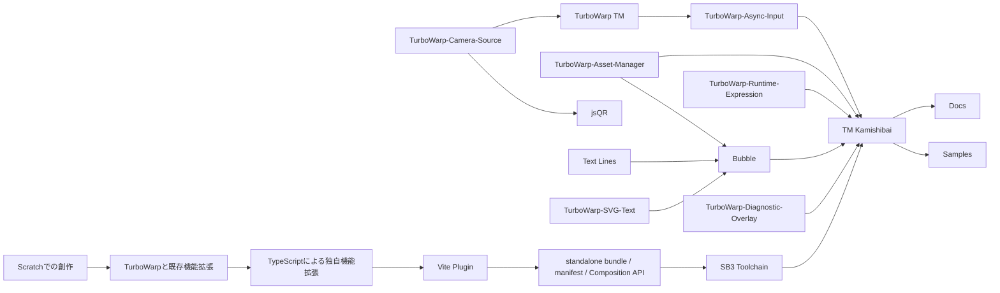

# TurboWarp extension and toolchain overview

Copyright © 2026 Hiroya Kubo. この文書は[CC BY-SA 4.0](https://creativecommons.org/licenses/by-sa/4.0/)で提供します。

更新日: 2026-08-26

文書状態: TM Kamishibai `v4.0.0-rc.8` 文書群から公開するTurboWarp ecosystem overview

この文書は `sources/turbowarp-ecosystem.json` を正本として生成しています。repository、package、guide link、利用surface、関係図のnodeがずれた場合は、正本dataと生成検査を更新してください。

## Concept

Scratchでの創作からTypeScriptの機能拡張、Composition API、SB3の再現可能なbuild、TM Kamishibaiの統合applicationまでを一つの道筋として説明する。

- Scratchでの創作
- TurboWarpと既存機能拡張の利用
- TypeScriptによる独自機能拡張
- Composition APIによる機能の合成
- SB3のsource管理と再現可能なbuild
- TM Kamishibaiという統合application

このecosystemは、Scratch作品をいきなり別言語へ移すためのものではありません。TurboWarpのblock UIで試せるStandalone extensionと、host applicationから組み合わせるComposition APIを分け、同じ機能を学習・制作・配布の流れへ接続するためのものです。

機能は一枚岩にせず、camera、recognition、input、state、asset、text、bubble、diagnostic、networkへ分けます。個々のrepositoryは小さく検証可能な責務を持ち、TM Kamishibaiはそれらを教材・作品・Web配布へ接続する統合applicationとして扱います。

## Relationship Flow

図は次の関係を示します。TypeScriptで書いた機能拡張はVite pluginでstandalone bundle、manifest、Composition API向け出力へ分かれ、SB3 ToolchainでScratch/TurboWarp projectのsource管理と再現可能buildへ接続します。Camera SourceはTurboWarp TMとjsQRへ映像sourceを渡し、Async Inputは認識・device・application eventを作品の実行tickから扱える状態へ整えます。SVG Text、Text Lines、Asset ManagerはBubbleの表示素材と台詞を支え、Diagnostic Overlayは停止理由や検証結果を画面へ出します。TM Kamishibaiはこれらを統合し、DocsとSamplesが利用者・教材作者・開発者の入口を提供します。

## Inventory Policy

- product name、package name、repository slug、Extension ID、opcodeは同じものとして扱わない。
- current entryではTM Kamishibai、TM紙芝居、TurboWarp TM、`tm-kamishibai`を使う。
- old product name、old repository slug、old Extension ID、old opcode prefixはHistory、Migration、source provenanceだけに限定する。
- version numberを本文に固定する場合はinventoryまたはrelease記録と一致検査できる場所へ置く。
- docsとして扱う本文と独自図はCC BY-SA 4.0、build scriptとsite codeはMPL-2.0、第三者素材は個別noticeに従う。

## 認識・入力・通信

| Product                                                                                          | Surface                               | Responsibility                                                                       | Package                                       |
| ------------------------------------------------------------------------------------------------ | ------------------------------------- | ------------------------------------------------------------------------------------ | --------------------------------------------- |
| [TurboWarp TM](https://github.com/kubohiroya/turbowarp-tm)                                       | Standalone extension, Composition API | カメラ由来の姿勢・動作状態をTurboWarp blockとComposition APIへ渡す。                 | `@kubohiroya/turbowarp-tm`                    |
| [TurboWarp-Camera-Source](https://github.com/kubohiroya/turbowarp-camera-source)                 | Standalone extension, Composition API | ブラウザーのカメラ入力を他の機能拡張が扱える映像sourceとして提供する。               | `@kubohiroya/turbowarp-camera-source`         |
| [TurboWarp jsQR](https://github.com/kubohiroya/turbowarp-jsqr)                                   | Standalone extension, Composition API | カメラ画像からQR codeを読み取り、作品内の入力として扱う。                            | `@kubohiroya/turbowarp-jsqr`                  |
| [TurboWarp-WebUSB-Pasori](https://github.com/kubohiroya/turbowarp-webusb-pasori)                 | Standalone extension, Composition API | PaSoRiなどのWebUSB機器から読み取った入力をTurboWarpへ接続する。                      | `@kubohiroya/turbowarp-webusb-pasori`         |
| [TurboWarp-Async-Input](https://github.com/kubohiroya/turbowarp-async-input)                     | Standalone extension, Composition API | 非同期の入力eventを一時保持し、Scratch/TurboWarpの実行tickから参照できる形へ整える。 | `@kubohiroya/turbowarp-async-input`           |
| [TurboWarp-Extended-Notification](https://github.com/kubohiroya/turbowarp-extended-notification) | Standalone extension, Composition API | 作品やhost applicationから利用する通知・状態表示の入口を提供する。                   | `@kubohiroya/turbowarp-extended-notification` |
| [TurboWarp WebRTC](https://github.com/kubohiroya/turbowarp-webrtc)                               | Standalone extension, Composition API | ブラウザー間通信を作品やapplicationの入力・同期経路として扱う。                      | `@kubohiroya/turbowarp-webrtc`                |

### TurboWarp TM

- Repository: [kubohiroya/turbowarp-tm](https://github.com/kubohiroya/turbowarp-tm)
- Package: `@kubohiroya/turbowarp-tm`
- Surface: Standalone extension, Composition API
- Input: camera frame, pose model output
- Output: motion state, TM events
- Direct dependencies: turbowarp-camera-source
- Optional integrations: turbowarp-async-input, tm-kamishibai
- Representative use case: 身体の動きで紙芝居やScratch作品を進める。
- License policy: MPL-2.0 for software.
- Status: current
- Extension ID: `kubohiroyatm`

### TurboWarp-Camera-Source

- Repository: [kubohiroya/turbowarp-camera-source](https://github.com/kubohiroya/turbowarp-camera-source)
- Package: `@kubohiroya/turbowarp-camera-source`
- Surface: Standalone extension, Composition API
- Input: MediaDevices camera stream
- Output: video frame source
- Direct dependencies: none
- Optional integrations: turbowarp-tm, turbowarp-jsqr
- Representative use case: 認識系拡張へ共通のカメラ入力を渡す。
- License policy: MPL-2.0 for software.
- Status: current

### TurboWarp jsQR

- Repository: [kubohiroya/turbowarp-jsqr](https://github.com/kubohiroya/turbowarp-jsqr)
- Package: `@kubohiroya/turbowarp-jsqr`
- Surface: Standalone extension, Composition API
- Input: video frame source
- Output: QR payload
- Direct dependencies: turbowarp-camera-source
- Optional integrations: tm-kamishibai
- Representative use case: 会場や教材でQR codeから作品・台本・設定を選ぶ。
- License policy: MPL-2.0 for software.
- Status: current

### TurboWarp-WebUSB-Pasori

- Repository: [kubohiroya/turbowarp-webusb-pasori](https://github.com/kubohiroya/turbowarp-webusb-pasori)
- Package: `@kubohiroya/turbowarp-webusb-pasori`
- Surface: Standalone extension, Composition API
- Input: WebUSB device data
- Output: device input event
- Direct dependencies: none
- Optional integrations: turbowarp-async-input
- Representative use case: カードや外部デバイスで作品の分岐を操作する。
- License policy: MPL-2.0 for software.
- Status: current

### TurboWarp-Async-Input

- Repository: [kubohiroya/turbowarp-async-input](https://github.com/kubohiroya/turbowarp-async-input)
- Package: `@kubohiroya/turbowarp-async-input`
- Surface: Standalone extension, Composition API
- Input: TM event, device event, application event
- Output: queued input state
- Direct dependencies: none
- Optional integrations: turbowarp-tm, turbowarp-webusb-pasori, tm-kamishibai
- Representative use case: 複数入力を作品側の分岐条件へ安定して渡す。
- License policy: MPL-2.0 for software.
- Status: current

### TurboWarp-Extended-Notification

- Repository: [kubohiroya/turbowarp-extended-notification](https://github.com/kubohiroya/turbowarp-extended-notification)
- Package: `@kubohiroya/turbowarp-extended-notification`
- Surface: Standalone extension, Composition API
- Input: message request, status request
- Output: notification UI state
- Direct dependencies: none
- Optional integrations: tm-kamishibai
- Representative use case: 入力待ち、完了、警告を作品利用者に伝える。
- License policy: MPL-2.0 for software.
- Status: current

### TurboWarp WebRTC

- Repository: [kubohiroya/turbowarp-webrtc](https://github.com/kubohiroya/turbowarp-webrtc)
- Package: `@kubohiroya/turbowarp-webrtc`
- Surface: Standalone extension, Composition API
- Input: WebRTC message
- Output: peer message event
- Direct dependencies: none
- Optional integrations: tm-kamishibai
- Representative use case: 複数端末を使う作品や会場運用で状態を共有する。
- License policy: MPL-2.0 for software.
- Status: current

## 状態・素材

| Product                                                                                    | Surface                               | Responsibility                                                                   | Package                                    |
| ------------------------------------------------------------------------------------------ | ------------------------------------- | -------------------------------------------------------------------------------- | ------------------------------------------ |
| [TurboWarp-Asset-Manager](https://github.com/kubohiroya/turbowarp-asset-manager)           | Standalone extension, Composition API | 画像・音声・台本素材などのasset参照と読み込み状態を管理する。                    | `@kubohiroya/turbowarp-asset-manager`      |
| [TurboWarp-Text-Lines](https://github.com/kubohiroya/turbowarp-text-lines)                 | Standalone extension, Composition API | 複数行の台詞・文章を作品から扱いやすい単位へ分割し、順番に参照できるようにする。 | `@kubohiroya/turbowarp-text-lines`         |
| [TurboWarp-Runtime-Expression](https://github.com/kubohiroya/turbowarp-runtime-expression) | Standalone extension, Composition API | application runtimeの値を式として参照・評価し、台本やblockの条件分岐へ接続する。 | `@kubohiroya/turbowarp-runtime-expression` |

### TurboWarp-Asset-Manager

- Repository: [kubohiroya/turbowarp-asset-manager](https://github.com/kubohiroya/turbowarp-asset-manager)
- Package: `@kubohiroya/turbowarp-asset-manager`
- Surface: Standalone extension, Composition API
- Input: asset URL, asset manifest
- Output: resolved asset, asset loading state
- Direct dependencies: none
- Optional integrations: turbowarp-bubble, turbowarp-svg-text, tm-kamishibai
- Representative use case: 作品の場面や台詞に対応する素材を再現可能に読み込む。
- License policy: MPL-2.0 for software.
- Status: current

### TurboWarp-Text-Lines

- Repository: [kubohiroya/turbowarp-text-lines](https://github.com/kubohiroya/turbowarp-text-lines)
- Package: `@kubohiroya/turbowarp-text-lines`
- Surface: Standalone extension, Composition API
- Input: text asset, line selection
- Output: line text, cursor state
- Direct dependencies: none
- Optional integrations: turbowarp-bubble, tm-kamishibai
- Representative use case: 紙芝居の台詞を一行ずつ表示・進行する。
- License policy: MPL-2.0 for software.
- Status: current

### TurboWarp-Runtime-Expression

- Repository: [kubohiroya/turbowarp-runtime-expression](https://github.com/kubohiroya/turbowarp-runtime-expression)
- Package: `@kubohiroya/turbowarp-runtime-expression`
- Surface: Standalone extension, Composition API
- Input: runtime variable, expression
- Output: evaluated value
- Direct dependencies: none
- Optional integrations: tm-kamishibai
- Representative use case: 台本変数とTurboWarpの状態を同じ条件判断に使う。
- License policy: MPL-2.0 for software.
- Status: current

## 表示・対話

| Product                                                                                    | Surface                               | Responsibility                                                                           | Package                                    |
| ------------------------------------------------------------------------------------------ | ------------------------------------- | ---------------------------------------------------------------------------------------- | ------------------------------------------ |
| [TurboWarp-SVG-Text](https://github.com/kubohiroya/turbowarp-svg-text)                     | Standalone extension, Composition API | SVGとして扱える文字表示を生成し、作品の見た目と文字品質を安定させる。                    | `@kubohiroya/turbowarp-svg-text`           |
| [TurboWarp Bubble](https://github.com/kubohiroya/turbowarp-bubble)                         | Standalone extension, Composition API | 吹き出し表示と台詞presentationを、作品とhost applicationの両方から利用できるようにする。 | `@kubohiroya/turbowarp-bubble`             |
| [TurboWarp-Diagnostic-Overlay](https://github.com/kubohiroya/turbowarp-diagnostic-overlay) | Standalone extension, Composition API | 検証結果・実行状態・失敗理由を画面上に重ねて表示する。                                   | `@kubohiroya/turbowarp-diagnostic-overlay` |

### TurboWarp-SVG-Text

- Repository: [kubohiroya/turbowarp-svg-text](https://github.com/kubohiroya/turbowarp-svg-text)
- Package: `@kubohiroya/turbowarp-svg-text`
- Surface: Standalone extension, Composition API
- Input: text, font setting, layout setting
- Output: SVG text asset
- Direct dependencies: none
- Optional integrations: turbowarp-bubble, tm-kamishibai
- Representative use case: 紙芝居の台詞や見出しを画像素材として整える。
- License policy: MPL-2.0 for software.
- Status: current
- Extension ID: `kubohiroyasvgtext`

### TurboWarp Bubble

- Repository: [kubohiroya/turbowarp-bubble](https://github.com/kubohiroya/turbowarp-bubble)
- Package: `@kubohiroya/turbowarp-bubble`
- Surface: Standalone extension, Composition API
- Input: line text, speaker state, asset state
- Output: bubble rendering request
- Direct dependencies: turbowarp-svg-text
- Optional integrations: turbowarp-text-lines, turbowarp-asset-manager, tm-kamishibai
- Representative use case: 紙芝居の登場人物の台詞を画面に表示する。
- License policy: MPL-2.0 for software.
- Status: current

### TurboWarp-Diagnostic-Overlay

- Repository: [kubohiroya/turbowarp-diagnostic-overlay](https://github.com/kubohiroya/turbowarp-diagnostic-overlay)
- Package: `@kubohiroya/turbowarp-diagnostic-overlay`
- Surface: Standalone extension, Composition API
- Input: diagnostic event, runtime status
- Output: overlay message
- Direct dependencies: none
- Optional integrations: tm-kamishibai
- Representative use case: 会場運用や開発中に、止まった理由を画面で確認する。
- License policy: MPL-2.0 for software.
- Status: current

## 開発・配布基盤

| Product                                                                                               | Surface | Responsibility                                                                         | Package                                    |
| ----------------------------------------------------------------------------------------------------- | ------- | -------------------------------------------------------------------------------------- | ------------------------------------------ |
| [TurboWarp-Extension-Template](https://github.com/kubohiroya/turbowarp-extension-template)            | CLI     | TypeScriptでTurboWarp機能拡張を作るためのrepository標準と初期構成を提供する。          | `@kubohiroya/turbowarp-extension-template` |
| [Vite Plugin for TurboWarp Extensions](https://github.com/kubohiroya/vite-plugin-turbowarp-extension) | CLI     | TurboWarp standalone bundle、manifest、Composition API向け出力をVite buildへ接続する。 | `vite-plugin-turbowarp-extension`          |
| [SB3 Toolchain](https://github.com/kubohiroya/sb3-toolchain)                                          | CLI     | Scratch/TurboWarp projectのsource管理、manifest検査、再現可能なSB3 buildを担う。       | `@kubohiroya/sb3-toolchain`                |

### TurboWarp-Extension-Template

- Repository: [kubohiroya/turbowarp-extension-template](https://github.com/kubohiroya/turbowarp-extension-template)
- Package: `@kubohiroya/turbowarp-extension-template`
- Surface: CLI
- Input: extension source
- Output: extension repository skeleton
- Direct dependencies: none
- Optional integrations: vite-plugin-turbowarp-extension
- Representative use case: 新しい機能拡張を共通のlint、build、release手順で始める。
- License policy: MPL-2.0 for software template files unless stated otherwise.
- Status: current

### Vite Plugin for TurboWarp Extensions

- Repository: [kubohiroya/vite-plugin-turbowarp-extension](https://github.com/kubohiroya/vite-plugin-turbowarp-extension)
- Package: `vite-plugin-turbowarp-extension`
- Surface: CLI
- Input: TypeScript extension source, extension metadata
- Output: standalone bundle, extension manifest, composition bundle
- Direct dependencies: Vite
- Optional integrations: turbowarp-extension-template
- Representative use case: 機能拡張の配布物を同じ規則で生成する。
- License policy: MPL-2.0 for software.
- Status: current

### SB3 Toolchain

- Repository: [kubohiroya/sb3-toolchain](https://github.com/kubohiroya/sb3-toolchain)
- Package: `@kubohiroya/sb3-toolchain`
- Surface: CLI
- Input: SB3 source tree, extension manifest, migration plan
- Output: validated SB3, build report
- Direct dependencies: none
- Optional integrations: tm-kamishibai, turbowarp-extension-template
- Representative use case: 作品や教材をソース管理し、同じ入力から同じSB3を生成する。
- License policy: MPL-2.0 for software.
- Status: current

## 統合application／content

| Product                                                                     | Surface          | Responsibility                                                                                         | Package                             |
| --------------------------------------------------------------------------- | ---------------- | ------------------------------------------------------------------------------------------------------ | ----------------------------------- |
| [TM Kamishibai](https://github.com/kubohiroya/tm-kamishibai)                | Application, CLI | 複数のTurboWarp機能拡張、台本、素材、build手順を統合し、Web配布できる紙芝居applicationとして提供する。 | `@kubohiroya/tm-kamishibai`         |
| [TM紙芝居ドキュメント](https://github.com/kubohiroya/tm-kamishibai-docs)    | Docs             | TM Kamishibaiの利用者、台本作者、開発者、workshop運営者向け文書を公開する。                            | `@kubohiroya/tm-kamishibai-docs`    |
| [TM紙芝居 作品library](https://github.com/kubohiroya/tm-kamishibai-samples) | Samples          | TM Kamishibaiで試せる作品、教材、配布用sampleを整理して公開する。                                      | `@kubohiroya/tm-kamishibai-samples` |

### TM Kamishibai

- Repository: [kubohiroya/tm-kamishibai](https://github.com/kubohiroya/tm-kamishibai)
- Package: `@kubohiroya/tm-kamishibai`
- Surface: Application, CLI
- Input: script, asset, extension bundle, runtime setting
- Output: web application, SB3 artifact, publication artifact
- Direct dependencies: turbowarp-tm, turbowarp-asset-manager, turbowarp-async-input, turbowarp-runtime-expression, turbowarp-bubble, turbowarp-diagnostic-overlay, sb3-toolchain
- Optional integrations: turbowarp-jsqr, turbowarp-webrtc
- Representative use case: 教材、作品、ワークショップ用の紙芝居を配布・実行する。
- License policy: Software is MPL-2.0; documents and content follow their own notices.
- Status: current

### TM紙芝居ドキュメント

- Repository: [kubohiroya/tm-kamishibai-docs](https://github.com/kubohiroya/tm-kamishibai-docs)
- Package: `@kubohiroya/tm-kamishibai-docs`
- Surface: Docs
- Input: Markdown source, publication metadata
- Output: HTML publication, PDF where applicable
- Direct dependencies: @vivliostyle/cli
- Optional integrations: tm-kamishibai, tm-kamishibai-samples
- Representative use case: 利用者の入口と開発者向けの正規ガイドをまとめる。
- License policy: Documents are CC BY-SA 4.0 unless another notice applies; site code is MPL-2.0.
- Status: current

### TM紙芝居 作品library

- Repository: [kubohiroya/tm-kamishibai-samples](https://github.com/kubohiroya/tm-kamishibai-samples)
- Package: `@kubohiroya/tm-kamishibai-samples`
- Surface: Samples
- Input: sample source, asset, metadata
- Output: sample catalog, playable publication
- Direct dependencies: tm-kamishibai
- Optional integrations: tm-kamishibai-docs
- Representative use case: 初めての利用者が動く作品から試し、教材作者が出発点を選ぶ。
- License policy: Each sample declares its own rights notice.
- Status: current

## upstream fork

| Product                                                             | Surface | Responsibility                                                                             | Package          |
| ------------------------------------------------------------------- | ------- | ------------------------------------------------------------------------------------------ | ---------------- |
| [scratch-render fork](https://github.com/kubohiroya/scratch-render) | Fork    | 上流Scratch rendererの検証やpatch候補を扱うforkであり、独自product一覧とは分けて管理する。 | `scratch-render` |

### scratch-render fork

- Repository: [kubohiroya/scratch-render](https://github.com/kubohiroya/scratch-render)
- Package: `scratch-render`
- Surface: Fork
- Input: upstream Scratch renderer source
- Output: patch verification branch
- Direct dependencies: none
- Optional integrations: tm-kamishibai
- Representative use case: 上流挙動の確認と、必要なpatchの検証を行う。
- License policy: Follows upstream license terms.
- Status: upstream fork

## Repository Integration Checklist

主要repositoryのREADMEには、この文書と同じ一覧を複製しません。各READMEには短い導線だけを置き、詳細な相互関係はこの中央indexへ集約します。

- TurboWarp機能拡張: READMEからこのoverviewへ一文で案内する。
- templateとVite plugin: 新規機能拡張を作る開発者向けに、このoverviewを設計背景として案内する。
- SB3 Toolchain: manifest、migration plan、reproducible buildの説明からこのoverviewへ接続する。
- TM Kamishibai: applicationが統合するpackage群をこのoverviewへ委譲し、READMEには利用者向け導線を残す。
- DocsとSamples: 公開siteの入口から、このoverview、チュートリアル、作品libraryを行き来できるようにする。
