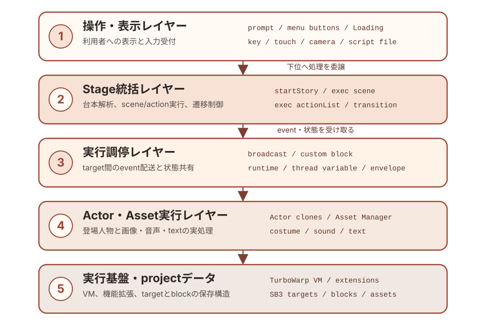
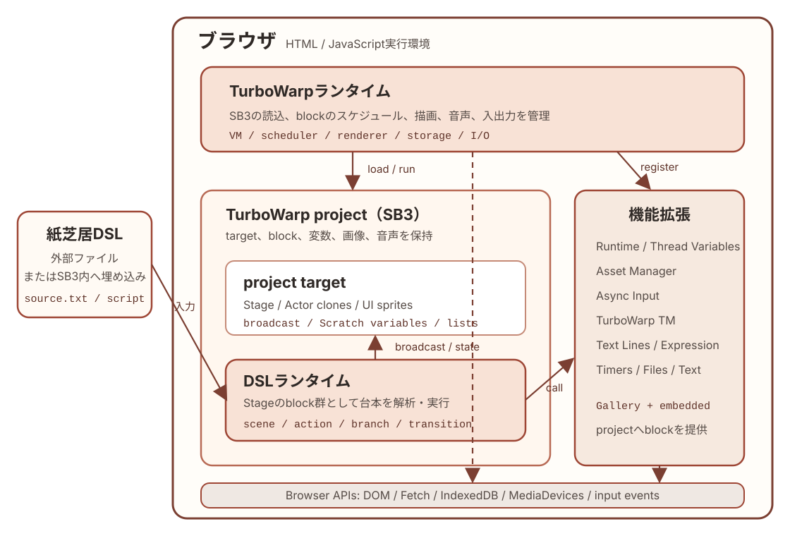

# 紙芝居アプリ内部仕様書

Copyright © 2026 Hiroya Kubo. この文書は[CC BY-SA 4.0](https://creativecommons.org/licenses/by-sa/4.0/)で提供します。

この文書は、TMPose紙芝居の汎用アプリSB3について、target、変数、event、
custom block、呼出し関係、状態遷移の内部仕様を現在の実装に対応させて記録します。
成果物プロファイル、SB3・台本変換ビルダーの外部契約、開発・検証・公開手順は
[ソフトウェアメンテナンスガイド](06-developer-guide.md)を参照してください。台本の
外部仕様は[台本DSLマニュアル](04-dsl-manual.md)と
[コマンドリファレンス](05-command-reference.md)を参照してください。

本書は「アプリが内部でどのように動くか」を扱い、「リポジトリをどう変更・公開するか」
や「ビルダーをどう利用するか」は扱いません。

対象アプリ／DSL: `kamishibai=3.1`

過去のバージョンからの変更は[`history.md`](history.md)を参照してください。

## この文書で使う用語 {#terminology .unnumbered}

本書ではScratch／TurboWarpの用語と、このアプリ固有の用語を次の意味で使います。
表中の等幅書体（`Stage`、`script`、`action=`など）は、target名、変数名、DSL記法として
実装に現れる正確な綴りを表します。通常書体の用語は、概念または分類名を表します。
詳細なデータ構造や処理は、表に示した後続の章で説明します。

### Scratch／TurboWarpのproject構造

| 用語    | この文書での意味                                                                                                                                                |
| ------- | --------------------------------------------------------------------------------------------------------------------------------------------------------------- |
| project | Stage、sprite、block、変数、画像、音声などをまとめたScratch／TurboWarp作品全体                                                                                  |
| SB3     | projectを1ファイルに格納するScratch 3形式。このリポジトリではbuildによって生成する成果物                                                                        |
| target  | project内でblock、変数、costumeなどを所有する実行単位。1つのStage targetと、0個以上のsprite targetがある                                                        |
| `Stage` | projectに1つだけある舞台のtarget。このアプリでは背景表示に加え、台本解析と実行状態の統括を担う。詳細は[「SB3の構成」](#sb3-structure){data-ref="chapter"}を参照 |
| sprite  | 舞台上に表示・移動でき、costume、sound、block、変数を持てるtarget                                                                                               |

### cloneとActor

| 用語                               | この文書での意味                                                                                     |
| ---------------------------------- | ---------------------------------------------------------------------------------------------------- |
| clone                              | 実行中にspriteから作る複製。同じblockを共有する一方、スプライトローカル変数にはcloneごとの値を持てる |
| `Actor` target／アクタースプライト | アクターをcloneとして生成するためのsprite雛形。このprojectではtarget名が`Actor`                      |
| アクター                           | `Actor` targetから作られ、`actorName`で区別される個々のclone。物語上の登場人物としてactionを実行する |

### 紙芝居DSLと実行

| 用語                    | この文書での意味                                                                                                    |
| ----------------------- | ------------------------------------------------------------------------------------------------------------------- |
| asset                   | Asset Managerへ名前付きで登録する画像、音声、text。SB3内のcostumeなどと外部URLのresourceを同じ方法で参照できる      |
| 紙芝居DSL／台本ファイル | asset、アクター、scene、actionなどをテキストで定義する言語と、その言語で記述したファイル                            |
| `script`                | 読み込んだ台本を保持するruntime variable。外部ファイルと組み込み台本は、ここから同じ処理経路へ入る                  |
| scene                   | 台本を`---`で区切った実行単位。内部では最初の区切りより前をscene 0として扱う                                        |
| command                 | 台本の`key=value`形式の1行。`exec command %s %s`がkeyに応じて設定、定義、action登録などを行う                       |
| action                  | scene内で順番に実行する演出命令。Stageが実行するStage actionと、アクターへ送るActor actionがある                    |
| action envelope         | Actor actionの宛先、command、引数を入れる`actionTarget`、`actionCommand`、`actionParam`、`actionParam2`のまとまり   |
| message／broadcast      | Scratch／TurboWarpのevent配送機構。broadcastすると、そのmessageに対応するhat blockがあるtargetやcloneで処理が始まる |

### 変数とblock

| 用語                 | この文書での意味                                                                                                                                                                                                                     |
| -------------------- | ------------------------------------------------------------------------------------------------------------------------------------------------------------------------------------------------------------------------------------ |
| Scratch変数／list    | SB3に保存され、Stageまたはspriteが所有する値と配列                                                                                                                                                                                   |
| runtime variable     | Runtime Variables機能拡張が保持し、project全体から参照する共有値                                                                                                                                                                     |
| thread variable      | Thread Variables機能拡張が、カスタムブロック呼出し単位で保持する一時値                                                                                                                                                               |
| event hat／hat block | green flag、broadcast受信、clickなどのeventを受けて処理を開始する、stack最上部のblock                                                                                                                                                |
| カスタムブロック     | project内で定義し、名前と引数によって呼び出す処理。一般的なプログラミング言語のprocedureに相当する                                                                                                                                   |
| block ID             | SB3の`targets[].blocks`内でblockを識別するkey。実装スナップショット内の調査にだけ使い、版をまたぐ永続IDとしては扱わない。詳細は[「event、カスタムブロック、呼出し関係」](#events-custom-blocks-call-graph){data-ref="chapter"}を参照 |

## 文書の範囲と実装基準

アプリ内部構造の正本は`app/project.source.json`です。本書のtarget、変数、list、
broadcast、hat、カスタムブロック定義は、このファイルから抽出した現在の構造を
記載しています。配布用`kamishibai.sb3`は`app/`から生成する成果物であり、本書の
調査元にはしません。

### 内部構造のレイヤー {#architecture-layers}

次の図は、汎用アプリSB3の実行時責務を上位から下位へ並べた概念図です。
上位レイヤーは下位レイヤーへ処理を委譲し、eventや共有変数を介して結果と状態を受け取ります。
各レイヤーの具体的なtarget、変数、message、custom blockは後続の章で説明します。

### 実行アーキテクチャ {#runtime-architecture}

次の図は、DSLがブラウザ上で実行されるまでの包含関係と主要な接続を示します。
TurboWarpランタイムはSB3 projectと機能拡張を読み込み、project内のStageに実装された
DSLランタイムが、外部ファイルまたはSB3へ埋め込まれたDSLを解析・実行します。
DSLランタイムはbroadcastや共有変数でproject内のtargetを統括し、画像・音声、入力、
姿勢認識などの処理を機能拡張へ委譲します。

### 実装スナップショット

| 項目                     | 件数 |
| ------------------------ | ---: |
| target（Stageを含む）    |   21 |
| block                    | 1943 |
| event hat                |  108 |
| カスタムブロック定義     |   43 |
| Scratch変数              |   14 |
| Scratch list             |   11 |
| broadcast message        |   23 |
| 静的なruntime variable名 |   21 |
| 静的なthread variable名  |   36 |
| TurboWarp機能拡張        |   15 |

本書に掲載するblock IDの意味と安定性は
[「event、カスタムブロック、呼出し関係」](#events-custom-blocks-call-graph){data-ref="chapter"}で説明します。

### 使用する機能拡張

| ID                            | 役割                                       | 取得形態 |
| ----------------------------- | ------------------------------------------ | -------- |
| `sipcconsole`                 | デバッグ用console                          | Gallery  |
| `lmsTempVars2`                | runtime variable／thread variable          | Gallery  |
| `strings`                     | 文字列処理                                 | Gallery  |
| `kubohiroyaassetmanager`      | 画像・音声の登録とLoading進捗              | 埋め込み |
| `tmpose`                      | カメラ姿勢認識                             | 埋め込み |
| `localstorage`                | 台本と選択UI言語のローカル保存             | Gallery  |
| `kubohiroyatextlines`         | 行単位の台本処理                           | 埋め込み |
| `kubohiroyaruntimeexpression` | 分岐条件式の評価                           | 埋め込み |
| `kubohiroyakamishibairuntime` | DSL 3.1の限定preflight、診断表示、安全停止 | 埋め込み |
| `kubohiroyaasyncinput`        | key／touch入力とscene移動                  | 埋め込み |
| `lmsTimers`                   | `wait`と時間ベースactor actionのタイマー   | Gallery  |
| `files`                       | 外部台本ファイルの選択                     | Gallery  |
| `text`                        | テキスト描画・アニメーション               | Gallery  |
| `translate`                   | Scratch／TurboWarpの表示言語を取得         | 標準     |
| `kubohiroyaweblink`           | HTTPSの公式Webサイトを新しいタブで開く     | 埋め込み |

GitHub由来の管理対象となる埋め込み拡張では、由来、固定commit、SHA-256を
`app/embedded-extensions.json`の`source`に記録します。更新方法は
[`sb3-toolchain`のワークフロー](https://github.com/kubohiroya/sb3-toolchain/blob/main/docs/workflows.md)
に従います。`kubohiroyakamishibairuntime`と`kubohiroyaweblink`はこのproject内で管理する
小規模な拡張なので、`source`を持ちません。

## SB3の構成 {#sb3-structure}

Scratch／TurboWarpのprojectは、1つの**Stage（ステージ）** targetと、0個以上のsprite targetから
構成されます。Stage targetはproject全体の舞台を表し、背景（backdrop）を表示します。
Stage自身にblock、variable、listを持てますが、spriteのように座標を変えて動かしたり、
cloneを作ったりする対象ではありません。

このアプリでは、Stage targetを舞台の表示だけでなく、紙芝居全体の制御役として使います。
Stageに置かれたblock群が、台本の読込・解析、assetとactorの生成、sceneとactionの実行、
カメラと入力、画面遷移、共有runtime状態を統括します。したがって、本書やシーケンス図で
`Stage`と書いた場合は、画面に見える舞台だけでなく、このStage targetとそこに置かれた
制御用block群を指します。

### target一覧

| target                    | 種別       | 役割                                                                | 初期costume／sound                                  |
| ------------------------- | ---------- | ------------------------------------------------------------------- | --------------------------------------------------- |
| `Stage`                   | Stage      | 初期化、台本解析、scene/action実行、カメラ、入力、遷移を統括        | `Title`, `TitleRuntime`, `Stars`, `LoadingBackdrop` |
| `Actor`                   | sprite雛形 | 物語上の登場人物ごとにcloneされ、移動・見た目・音・時間actionを実行 | `button1`／音声なし                                 |
| `prompt`                  | UI sprite  | 操作案内とpose案内をAsset Managerで、詳細な台本エラーをSVGで表示    | `ui-placeholder`                                    |
| `openButton`              | UI sprite  | 外部台本ファイルを選択して`startStory`へ渡す                        | `ui-placeholder`                                    |
| `reloadButton`            | UI sprite  | 保存済みの直前の台本を再読込する                                    | `ui-placeholder`                                    |
| `showTitleButton`         | UI sprite  | menuからtitleへ戻す                                                 | `ui-placeholder`                                    |
| `languageButton`          | UI sprite  | menu末尾から言語選択画面を開く                                      | `ui-placeholder`                                    |
| `japaneseLanguageButton`  | UI sprite  | UI言語を日本語に変更して保存                                        | `ui-placeholder`                                    |
| `englishLanguageButton`   | UI sprite  | UI言語を英語に変更して保存                                          | `ui-placeholder`                                    |
| `titleHeading`            | UI sprite  | `about.title`を実行時SVGテキストとして表示                          | `ui-placeholder`                                    |
| `titleVersion`            | UI sprite  | versionとbuild dateを実行時SVGテキストとして表示                    | `ui-placeholder`                                    |
| `titleLicenseApp`         | UI sprite  | `about.license.app`を実行時SVGテキストとして表示                    | `ui-placeholder`                                    |
| `titleLicenseStory`       | UI sprite  | `about.license.story`を実行時SVGテキストとして表示                  | `ui-placeholder`                                    |
| `titleAuthorOrganization` | UI sprite  | `about.author.organization`を実行時SVGテキストとして表示            | `ui-placeholder`                                    |
| `titleAuthorName`         | UI sprite  | `about.author.name`とemailを実行時SVGテキストとして表示             | `ui-placeholder`                                    |
| `officialWebsiteLabel`    | UI sprite  | 公式Webサイト名を実行時SVGテキストとして表示し、押下時に開く        | `ui-placeholder`                                    |
| `UiItem`                  | UI雛形     | menu、言語選択、title用テキストを画面ごとのcloneとして生成・破棄    | `ui-placeholder`                                    |
| `officialWebsiteButton`   | UI sprite  | titleの3行目から公式Webサイトを開く                                 | 初期表示用／実行時表示用の言語非依存costume         |
| `closeTitleButton`        | UI sprite  | title右上の閉じるボタンからStage clickと同じ遷移を実行する          | `title-close-button`                                |
| `Loading`                 | UI sprite  | Asset Managerの読込開始・進捗・完了に合わせてcostumeを表示          | `loading`／音声なし                                 |
| `LoadingBubbleAnchor`     | UI sprite  | Loading進捗メッセージ用のspeech bubble位置を固定                    | `loading-bubble-anchor`                             |

`Actor`の本体は非表示で、cloneだけを登場人物として表示します。`prompt`、menu／言語選択sprite、
title用テキストsprite、`Loading`、`LoadingBubbleAnchor`の実画像は、Asset Managerへ登録します。台本が定義する
予約済みUIテキストは`ui.prompt`だけです。`ui.open`、`ui.reload`、`ui.about`、`ui.language`、
`ui.invalidScript`はアプリの言語定義から設定します。

既定OFFの`featureCloneUiItems`をgreen flag前に有効にすると、起動時に
`cloneUiItemsEnabled`へ値を固定します。この経路では`UiItem`本体を非表示のcontroller兼雛形とし、
`showTitle`、`showMenu`、`showLanguageMenu`ごとに必要な項目だけをcloneとして作ります。画面遷移時は
cloneを非表示のまま保持せず削除します。従来の個別UI spriteは同じフラグで表示処理全体を止めます。
雛形は10×10の透明costumeを保持し、位置とsizeだけを設定してcloneします。2×2の透明costumeでは
TurboWarpのsprite fencingにより50〜80%の指定が100%へ切り上げられるため、最小50%を保持できる寸法にしています。
Asset Managerのruntime text skinはclone開始後にclone自身へ適用し、Animated Textのskinを雛形から複製しません。
生成手続きはwarpで原子的に実行し、cloneへローカル値をコピーした直後に雛形の`uiIsTemplate`を数値`1`へ復元します。
asset適用後に表示し、1 tick譲ってから最前面へ移動します。
フラグOFFでは`UiItem`はcloneを作らず、従来spriteのblockをそのまま使用するため即時に切り戻せます。

アプリUIの定義元は`scripts/sb3/app-shell-locales.mjs`です。ロケール別の`about.title`、
`about.officialWebsite.name`、`about.license.app`、`about.license.story`、
`about.author.organization`、`about.author.name`と、共通の`about.officialWebsite.url`、
`about.author.email`を、green flag後にAsset Managerの実行時SVGテキストとして表示します。
versionとbuild dateはbuild時に`about.version`へ設定します。言語変更時は表示中の同じspriteの
テキストskinを更新するため、ロケール別backdropは使用しません。

title用テキストの配置と文字サイズはScratch標準のStage解像度である480×360を基準にします。
長いライセンス文はロケール定義で明示的に2行へ分け、縮小表示に依存せず、タイトル、version、
公式Webサイト名、ライセンス、開発者情報を480×360の画面上で読める大きさに保ちます。

SB3読込直後からAsset Manager初期化完了まで、または初期化に失敗した場合にも画面を空に
しないため、`Title`と`official-website-button`には英語の固定フォールバックをbuild時に
埋め込みます。初期化が完了して`showTitle`を送ると、Stageは文字なしの`TitleRuntime`へ、
公式Webボタンは文字なしの実行時costumeへ切り替え、title用テキストspriteを重ねます。
公式Webボタンの両costumeには`site/favicon.png`を埋め込みます。

green flag時はlocalStorageの`uiLanguage`が`ja`または`en`ならその値を優先します。未保存なら
標準`translate`機能拡張の`（言語）` reporterが`日本語`、`ja`、`ja-JP`のいずれかを返す場合は
日本語、それ以外は英語を選びます。menuの`languageButton`から選び直した値はlocalStorageへ
保存し、`languageChanged`でアプリUIのテキストを即時更新します。言語選択画面では現在値に
`✓`を付けます。台本のUTF-8本文には翻訳や言語切替を適用しません。

### アクターへ命令を届けるしくみ {#actor-message-delivery}

Scratch／TurboWarpで1つのspriteから複数の登場人物を作る場合、cloneごとに
スプライトローカル変数の識別子を持たせれば、同じblockを共有しながら個体を区別できます。
このアプリはその考え方を、cloneへ命令を届けるところまで拡張しています。

本書では、cloneの雛形として使う`Actor` targetを**アクタースプライト**、そこから作られ、
スプライトローカル変数の`actorName`を割り当てられた各cloneを**アクター**と呼びます。
アクタースプライトの本体は表示せず、物語の登場人物として表示するのはアクターだけです。
すべてのアクターは同じblock定義を共有し、`actorName`によって互いを区別します。

Stageからアクターへ命令を届ける流れは次のとおりです。

1. StageがDSLのActor actionを、宛先となるアクター名、command、引数に分解する
2. `actionTarget`、`actionCommand`、`actionParam`、`actionParam2`というruntime variableへ
   それぞれを格納する。このまとまりを本書では**action envelope**と呼ぶ
3. Stageが`execActorAction`をbroadcastする
4. すべての`Actor` cloneがmessageを受け取り、自分の`actorName`が`actionTarget`の
   対象に含まれるかを調べる
5. 対象になったアクターだけが、`actionCommand`を入れ子の条件分岐で振り分け、
   移動、見た目、音、時間に関する処理を実行する

つまり、action envelopeが「誰に・何を・どの引数で実行させるか」を表し、broadcastが
その命令を全アクターへ配送します。ここでいうcommandは、アクターに対する
メソッドに相当しますが、TurboWarp上ではカスタムブロックと条件分岐で実装されています。

通常のScratch projectではcostumeやsoundはspriteに属します。このアプリでは
[TurboWarp Asset Manager](https://github.com/kubohiroya/turbowarp-asset-manager)を使い、
SB3内のcostume、backdrop、sound、textや、外部URLの画像・音声を、名前を持つassetとして
登録します。アクターの見た目や音のactionはこのasset名を参照するため、振る舞いを実装する
アクタースプライトと、実際に使う画像・音声を分けて組み合わせられます。

台本DSLは、このassetの定義、アクターの定義、sceneごとにアクターへ送るactionの定義を
テキストで記述するための言語です。TurboWarpで作られたこのアプリはDSLを解析し、assetを
読み込み、アクターを生成し、action envelopeとbroadcastを使って命令を実行します。
したがって、このアプリ全体は、紙芝居DSLを解析・実行する処理系であり、その実行基盤
（runtime）でもあります。

#### 台本からアクターclone生成までのシーケンス

アクターは、台本準備時に`actor=` commandから生成します。これは生成済みのアクターへ
Actor actionを送る処理とは実行時期もデータの渡し方も異なるため、別の図に示します。

`exec command %s %s`は`actor=`の値を`actorList`へ追加します。各値は
`アクター名,初期skin名`の形式です。その後、Stageの`create actor`が`actorList`を順に読み、
各値をthread variableの`name`と`skin`へ分けます。Stageは共有runtime variableの
`actionTarget`へ`name`、`actionParam`へ`skin`を設定してから、`Actor` targetのcloneを
作ります。

clone開始hatは、`actionTarget`をそのcloneのスプライトローカル変数`actorName`へ保存し、
`actionParam`をTurboWarp Asset Managerへ渡して初期skinを設定します。Stageはcloneを
作るたびに0.1秒待ち、この初期化が走る機会を設けてから、共有runtime variableを次の
アクター用の値で上書きします。clone生成時には`execActorAction`をbroadcastしません。

`Actor` target本体はcloneの雛形として非表示です。cloneはこの表示状態を引き継ぐため、
生成直後も非表示であり、sceneの後続のActor actionによって必要な時点で表示されます。

#### 台本からActor actionまでのシーケンス

台本ファイルからActor内の処理までを、データの変換と実行の順に並べると次のようになります。
外部ファイルだけでなく、再生用SB3へ組み込んだ台本も`script`へ入った後は同じ経路を通ります。

`create sceneList`は`script`をscene単位に分けます。`exec scene # %s with %s`は現在のsceneを
行単位の`commandList`に分け、`exec command %s %s`でcommandを順に処理します。このうち
`action=`の値を`actionList`へ集め、`exec actionList`が各actionを`exec action %s`へ渡します。
Stage actionはStage内で実行されます。Actor actionでは、Stageが`actionTarget`、
`actionCommand`、`actionParam`、`actionParam2`へaction envelopeを書き込んでから、
`execActorAction`をbroadcastします。messageを受信した各`Actor` cloneは4変数を読み、
自分の`actorName`と宛先を照合します。実際にcommandを分岐して処理するのは、宛先に
一致したアクターだけです。

### target間の責務

`Stage`は台本を`sceneList`、`commandList`、`actionList`へ段階的に変換します。
さらにsceneと共有runtime状態を管理し、Stage actionを実行します。`Actor` cloneの責務は、
生成時に自分の`actorName`と初期skinを確定し、その後、
[「アクターへ命令を届けるしくみ」](#actor-message-delivery){data-ref="section"}で配送されたActor actionのうち
自分を対象とするものを実行することです。

UI spriteは表示状態を`showMenu`／`hideMenu`、`showPrompt`／`hidePrompt`、
Asset ManagerのLoading messageで受け取ります。clone UI経路では`UiItem`本体が画面単位の
clone生成とaction実行を担い、clone自身は表示情報とclickしたactionだけを保持します。
台本の実行状態をUI sprite側へ複製せず、Stageを状態の所有者とします。

## 変数とlist

変数は、SB3へ永続化されるScratch変数／list、threadごとの一時値、project全体で共有する
runtime variableの3種類に分けます。

### Scratch変数

| 所有者   | 変数                          | 初期値       | 役割                                       |
| -------- | ----------------------------- | ------------ | ------------------------------------------ |
| `Stage`  | `ポーズ認識`                  | `0`          | pose認識中の表示・互換用状態               |
| `Stage`  | `チャージ`                    | `0`          | pose成立までのcharge表示・互換用状態       |
| `Stage`  | `actionIndex`                 | `1`          | 現在処理する`actionList`の位置             |
| `Stage`  | `poseIndex`                   | `1`          | 現在処理する`poseList`の位置               |
| `Stage`  | `featureDetailedScriptErrors` | `false`      | DSL 3.1詳細診断preflightの既定OFFフラグ    |
| `Stage`  | `featureCloneUiItems`         | `false`      | clone UI経路の既定OFFフラグ                |
| `Stage`  | `cloneUiItemsEnabled`         | `false`      | green flag時に固定したclone UI経路の有効値 |
| `Stage`  | `__tmpose_embedded_script`    | 空文字       | `player` profileの組み込み台本予約領域     |
| `Actor`  | `actorName`                   | `_template_` | cloneが担当する台本上のactor名             |
| `UiItem` | `uiIsTemplate`                | `true`       | 本体とcloneを区別する                      |
| `UiItem` | `uiId`                        | `_template_` | UI項目の論理ID                             |
| `UiItem` | `uiAsset`                     | 空文字       | Asset Managerへ渡すasset名                 |
| `UiItem` | `uiAction`                    | 空文字       | click時にcontrollerへ渡すaction名          |
| `UiItem` | `uiValue`                     | 空文字       | 言語値またはURLなどのaction引数            |

`__tmpose_embedded_script`はStageに一つだけ存在し、monitorを持ちません。`generic`と
`editor`では空、`player`ではbuilderが変換済み台本を設定します。
`featureDetailedScriptErrors`は最初の`startStory`で一度だけ読み、次のgreen flagまで値を固定します。
`false`では従来のScratch parserと`invalidScript`経路だけを使います。
`featureCloneUiItems`はgreen flagの先頭で`cloneUiItemsEnabled`へコピーし、その実行中は後者だけを
参照します。したがって、実行途中で元フラグを変更してもUI実装経路は切り替わりません。

### Scratch list

すべてStage所有で、汎用SB3では空の初期状態です。

| list             | 役割                           |
| ---------------- | ------------------------------ |
| `skinList`       | actor action中のcostume候補    |
| `poseList`       | pose action中の認識label候補   |
| `soundList`      | actor action中のsound候補      |
| `actionList`     | 現在sceneのaction列            |
| `sceneList`      | 台本から抽出したscene block    |
| `commandList`    | sceneの前に評価する設定command |
| `actorList`      | 台本から生成するactor定義      |
| `assetList`      | 登録するasset定義              |
| `durationList`   | pose候補ごとの継続時間         |
| `sceneLabelList` | scene labelとindexの対応       |
| `lines`          | Text Linesで分割した台本行     |

### runtime variable

静的な名前を持つruntime variableは次の21個です。

| 変数                                                           | 生存期間／役割                                                     |
| -------------------------------------------------------------- | ------------------------------------------------------------------ |
| `script`                                                       | 読み込んだ変換済み台本。title、reload、`startStory`間で共有        |
| `version`                                                      | 台本の`kamishibai` version                                         |
| `startSceneIndex`                                              | 台本で指定した開始scene                                            |
| `sceneIndex`                                                   | 現在実行中のscene index                                            |
| `actionTarget`, `actionCommand`, `actionParam`, `actionParam2` | StageからActor cloneへ渡すaction envelope                          |
| `nextSceneLabel`                                               | key／touch入力が要求した遷移先scene label                          |
| `skipMode`                                                     | `Space`、`Right`、`Down`による未消費の進行要求                     |
| `skipContext`                                                  | `title`、`action`、`pose`、`scene`のどの境界が要求を消費できるか   |
| `poseRecog`, `poseCharge`, `poseIdle`                          | pose認識のしきい値、charge時間、idle時間。既定値は`0.5`、`10`、`0` |
| `poseRecognitionSound`                                         | `setPoseRecognitionSound`で指定した認識中の音声アセット名          |
| `poseRecognitionSound2`                                        | `setPoseRecognitionSound`で指定した認識成立時の音声アセット名      |
| `loadingCostume`                                               | Loading spriteへ適用するcostume名                                  |
| `message`                                                      | Loading bubbleへ表示する現在の進捗文言                             |
| `uiLanguage`                                                   | アプリUIの表示言語。`ja`または`en`                                 |
| `uiItemAction`, `uiItemValue`                                  | clickしたUI cloneから非clone controllerへ渡すaction envelope       |

このほか、`exec command %s %s`はDSLで指定されたruntime variable名を動的に設定します。
分岐条件は`branch:<branchName>`という名前で保存します。この2系列は入力から名前が決まるため、
静的な21個には数えません。

詳細診断を有効にしてfatal errorが発生した場合、Kamishibai Runtimeは互換用scalarとして
`kamishibaiErrorCategory`、`kamishibaiErrorCode`、`kamishibaiErrorLine`、
`kamishibaiErrorColumn`、`kamishibaiErrorMessage`、`kamishibaiErrorSource`、
`kamishibaiErrorSvg`を作ります。診断の正本は拡張内部の`lastDiagnostic`であり、これらの
runtime variableと前回のSVG skinは次のgreen flagで削除します。

### thread variable

カスタムブロック呼出しごとに分離され、呼出し終了後に共有状態として残さない値です。

| 用途                  | 名前                                                                                   |
| --------------------- | -------------------------------------------------------------------------------------- |
| 共通loop・文字列処理  | `index`, `length`, `line`, `lineIndex`, `name`, `value`, `key`, `keyValue`             |
| 台本解析              | `sceneBlock`, `sceneLabel`, `sceneLabelList`, `condition`, `conditionList`             |
| asset／actor生成      | `asset`, `assetList`, `resourceId`, `actor`, `actorName`, `skin`                       |
| action実行            | `action`, `actionResult`, `actionListResult`, `stageActionResult`, `actorActionResult` |
| command／branch／入力 | `commandIndex`, `branchIndex`, `keyId`, `hasRead`                                      |
| cover                 | `cover`, `coverBackground`, `coverBgm`                                                 |
| Actor clone           | `x`, `y`, `scale`                                                                      |
| その他                | `durationList`, `sceneIndex`                                                           |

runtime variableと同名の`sceneIndex` thread variableは、カスタムブロック内の局所的な
引数・計算値です。project全体の現在sceneはruntime variable側だけを正本とします。

## event、カスタムブロック、呼出し関係 {#events-custom-blocks-call-graph}

表の`target`はblockを所有するStageまたはsprite、`ID`はそのtargetの`blocks`
objectにあるkeyです。SB3内では`project.json`の`targets[].blocks`、このリポジトリ
では`app/project.source.json`の同じ位置に保存されます。IDはopcodeや表示名ではなく、
この実装スナップショット内のblockを特定するための内部識別子です。

`sb3-toolchain`のbuildとimportはblock IDを新規採番せず、入力に含まれるIDを保持します。
既存blockを再生成しないTurboWarp上の編集・保存でも通常は保持されます。一方、blockの
削除と再作成、複製やcopy & pasteによる新しいblockの作成、target／projectのimportなどで
blockが再生成されるとIDは変わります。したがって、IDは外部仕様、永続ID、他の版をまたぐ
参照には使いません。アプリを編集してIDが変わった場合は、本章も現在の
`app/project.source.json`に合わせて更新します。

### event hat一覧

`procedures_definition`と、接続されていないreporter blockはevent hatに含めません。
「実行される内容」はhatを起点とする主要なカスタムブロック呼出し、broadcast、状態変更、
表示操作を要約したもので、標準blockを含む全処理の逐語的な列挙ではありません。

#### Stage

| target  | ID                     | trigger               | 実行される内容                                                                         |
| ------- | ---------------------- | --------------------- | -------------------------------------------------------------------------------------- |
| `Stage` | `iM`                   | green flag            | UI言語を保存値／標準`（言語）`から決定後、camera／pose／actorを初期化し`showTitle`送信 |
| `Stage` | `i;`                   | key `space`           | `showCover`送信                                                                        |
| `Stage` | `i}`                   | key `down arrow`      | 現在の`sound`停止、sequence終端化、`finishTimedActorAction`送信、`skipMode=scene`      |
| `Stage` | `jb`                   | key `right arrow`     | 現在の`sound`停止、sequence終端化、`finishTimedActorAction`送信、`skipMode=action`     |
| `Stage` | `jX`                   | `startStory`受信      | 既定OFFの詳細診断後、`start camera`, `create sceneList`, asset／actor生成、scene実行   |
| `Stage` | `j/`                   | `stopStory`受信       | `stop camera`, `stop pose recog`, `show cover`; `deleteAllActors`, `showMenu`送信      |
| `Stage` | `j?`                   | `debugTestCamera`受信 | TMPoseのcamera previewを直接確認                                                       |
| `Stage` | `kD`                   | `showCover`受信       | `show cover`; `hidePrompt`, `deleteAllActors`送信                                      |
| `Stage` | `l=`                   | Stage click           | `closeTitle`送信                                                                       |
| `Stage` | `titleCloseHat`        | `closeTitle`受信      | 組み込み台本の有無に応じて`showCover`または`startStory`送信                            |
| `Stage` | `l[`                   | `showTitle`受信       | `TitleRuntime`へ切替え、実行contextをclearし、`hidePrompt`, `deleteAllActors`送信      |
| `Stage` | `m~`                   | `stopKeyInput`受信    | Async Inputの全listenerを停止                                                          |
| `Stage` | `nx`                   | `stopTouchInput`受信  | Async Inputの全listenerを停止                                                          |
| `Stage` | `uiLanguageChangedHat` | `languageChanged`受信 | menuと`about.*`の実行時SVGテキストを選択言語で更新                                     |

#### Actor

| target  | ID               | trigger                      | 実行される内容                                          |
| ------- | ---------------- | ---------------------------- | ------------------------------------------------------- |
| `Actor` | `nY`             | `execActorAction`受信        | `isTimeBasedAction`, `wait for actor action %s seconds` |
| `Actor` | `oH`             | `deleteAllActors`受信        | cloneを削除                                             |
| `Actor` | `oJ`             | clone開始                    | `actorName`、位置、scaleをruntime envelopeから初期化    |
| `Actor` | `actorFinishHat` | `finishTimedActorAction`受信 | 対象actorと`skipMode`を照合して時間actionを完了         |

#### UI sprite

| target                    | ID                                                                                                                                                                        | trigger                               | 実行される内容                                        |
| ------------------------- | ------------------------------------------------------------------------------------------------------------------------------------------------------------------------- | ------------------------------------- | ----------------------------------------------------- |
| `prompt`                  | `oS`                                                                                                                                                                      | `showPrompt`受信                      | 案内costumeを表示                                     |
| `prompt`                  | `oV`                                                                                                                                                                      | `hidePrompt`受信                      | 非表示                                                |
| `prompt`                  | `oX`                                                                                                                                                                      | `invalidScript`受信                   | エラーcostumeを表示                                   |
| `openButton`              | `o!`                                                                                                                                                                      | green flag                            | 非表示                                                |
| `openButton`              | `o%`                                                                                                                                                                      | sprite click                          | file選択後に`hideMenu`, `startStory`送信              |
| `openButton`              | `o*`                                                                                                                                                                      | `hideMenu`受信                        | 非表示                                                |
| `openButton`              | `o,`                                                                                                                                                                      | `showMenu`受信                        | `ui.open` skinで表示                                  |
| `reloadButton`            | `o.`                                                                                                                                                                      | green flag                            | 非表示                                                |
| `reloadButton`            | `o:`                                                                                                                                                                      | `hideMenu`受信                        | 非表示                                                |
| `reloadButton`            | `o=`                                                                                                                                                                      | sprite click                          | 保存済み台本で`hideMenu`, `startStory`送信            |
| `reloadButton`            | `o[`                                                                                                                                                                      | `showMenu`受信                        | 台本が保存済みなら表示                                |
| `showTitleButton`         | <code>o&#96;</code>                                                                                                                                                       | green flag                            | 非表示                                                |
| `showTitleButton`         | <code>o&#124;</code>                                                                                                                                                      | `hideMenu`受信                        | 非表示                                                |
| `showTitleButton`         | `o~`                                                                                                                                                                      | sprite click                          | `hideMenu`, `showTitle`送信                           |
| `showTitleButton`         | `pb`                                                                                                                                                                      | `showMenu`受信                        | title以外なら表示                                     |
| `languageButton`          | `languageButtonFlag`                                                                                                                                                      | green flag                            | 非表示                                                |
| `languageButton`          | `languageButtonHideMenu`                                                                                                                                                  | `hideMenu`受信                        | 非表示                                                |
| `languageButton`          | `languageButtonShowMenu`                                                                                                                                                  | `showMenu`受信                        | `ui.language` skinで表示                              |
| `languageButton`          | `languageButtonClick`                                                                                                                                                     | sprite click                          | `hideMenu`後に`showLanguageMenu`送信                  |
| `japaneseLanguageButton`  | `japaneseLanguageFlag`                                                                                                                                                    | green flag                            | 非表示                                                |
| `japaneseLanguageButton`  | `japaneseLanguageHideMenu`                                                                                                                                                | `hideMenu`受信                        | 非表示                                                |
| `japaneseLanguageButton`  | `japaneseLanguageShowChoices`                                                                                                                                             | `showLanguageMenu`受信                | 現在値なら`✓ 日本語`、それ以外は`日本語`を表示        |
| `japaneseLanguageButton`  | `japaneseLanguageClick`                                                                                                                                                   | sprite click                          | `uiLanguage=ja`を保存・適用しmenuへ戻る               |
| `englishLanguageButton`   | `englishLanguageFlag`                                                                                                                                                     | green flag                            | 非表示                                                |
| `englishLanguageButton`   | `englishLanguageHideMenu`                                                                                                                                                 | `hideMenu`受信                        | 非表示                                                |
| `englishLanguageButton`   | `englishLanguageShowChoices`                                                                                                                                              | `showLanguageMenu`受信                | 現在値なら`✓ English`、それ以外は`English`を表示      |
| `englishLanguageButton`   | `englishLanguageClick`                                                                                                                                                    | sprite click                          | `uiLanguage=en`を保存・適用しmenuへ戻る               |
| `titleHeading`            | `titleHeadingFlag`, `titleHeadingClick`, `titleHeadingShowTitle`, `titleHeadingHideMenu`, `titleHeadingStartStory`                                                        | green flag／click／title・menu・story | `about.title`を表示し、clickでは`closeTitle`送信      |
| `titleVersion`            | `titleVersionFlag`, `titleVersionClick`, `titleVersionShowTitle`, `titleVersionHideMenu`, `titleVersionStartStory`                                                        | green flag／click／title・menu・story | `about.version`を表示し、clickでは`closeTitle`送信    |
| `titleLicenseApp`         | `titleLicenseAppFlag`, `titleLicenseAppClick`, `titleLicenseAppShowTitle`, `titleLicenseAppHideMenu`, `titleLicenseAppStartStory`                                         | green flag／click／title・menu・story | アプリライセンスを表示し、clickでは`closeTitle`送信   |
| `titleLicenseStory`       | `titleLicenseStoryFlag`, `titleLicenseStoryClick`, `titleLicenseStoryShowTitle`, `titleLicenseStoryHideMenu`, `titleLicenseStoryStartStory`                               | green flag／click／title・menu・story | 台本ライセンス案内を表示し、clickでは`closeTitle`送信 |
| `titleAuthorOrganization` | `titleAuthorOrganizationFlag`, `titleAuthorOrganizationClick`, `titleAuthorOrganizationShowTitle`, `titleAuthorOrganizationHideMenu`, `titleAuthorOrganizationStartStory` | green flag／click／title・menu・story | 開発者所属を表示し、clickでは`closeTitle`送信         |
| `titleAuthorName`         | `titleAuthorNameFlag`, `titleAuthorNameClick`, `titleAuthorNameShowTitle`, `titleAuthorNameHideMenu`, `titleAuthorNameStartStory`                                         | green flag／click／title・menu・story | 開発者氏名・emailを表示し、clickでは`closeTitle`送信  |
| `officialWebsiteLabel`    | `officialWebsiteLabelFlag`, `officialWebsiteLabelClick`, `officialWebsiteLabelShowTitle`, `officialWebsiteLabelHideMenu`, `officialWebsiteLabelStartStory`                | green flag／click／title・menu・story | 公式Webサイト名を表示し、clickではサイトを開く        |
| `UiItem`                  | `ui_event_whenbroadcastreceived_17`, `ui_event_whenbroadcastreceived_31`, `ui_event_whenbroadcastreceived_40`                                                             | title／言語選択／menu表示             | 現在画面の既存cloneを削除し、必要なUI項目だけを生成   |
| `UiItem`                  | `ui_event_whenflagclicked_56`, `ui_control_start_as_clone_59`                                                                                                             | green flag／clone開始                 | clone自身へassetを適用して最前面表示                  |
| `UiItem`                  | `ui_event_whenbroadcastreceived_64`, `ui_event_whenbroadcastreceived_69`, `ui_event_whenbroadcastreceived_74`                                                             | menu非表示／明示削除／story開始       | 不要になったUI cloneを削除                            |
| `UiItem`                  | `ui_event_whenthisspriteclicked_79`, `ui_event_whenbroadcastreceived_135`                                                                                                 | clone click／action relay受信         | action envelopeを本体へ渡し、本体側で画面遷移を実行   |
| `officialWebsiteButton`   | `officialWebsiteFlag`                                                                                                                                                     | green flag                            | 初期化前用の英語フォールバックを表示                  |
| `officialWebsiteButton`   | `officialWebsiteClick`                                                                                                                                                    | sprite click                          | 公式Webサイトを新しいタブで開く                       |
| `officialWebsiteButton`   | `officialWebsiteShowTitle`                                                                                                                                                | `showTitle`受信                       | 文字なしの実行時costumeへ切り替えて表示               |
| `officialWebsiteButton`   | `officialWebsiteHideMenu`                                                                                                                                                 | `showMenu`受信                        | 非表示                                                |
| `officialWebsiteButton`   | `officialWebsiteStartStory`                                                                                                                                               | `startStory`受信                      | 非表示                                                |
| `closeTitleButton`        | `closeTitleFlag`                                                                                                                                                          | green flag                            | 右上に表示                                            |
| `closeTitleButton`        | `closeTitleClick`                                                                                                                                                         | sprite click                          | `closeTitle`送信                                      |
| `closeTitleButton`        | `closeTitleShowTitle`                                                                                                                                                     | `showTitle`受信                       | 表示                                                  |
| `closeTitleButton`        | `closeTitleHideMenu`                                                                                                                                                      | `showMenu`受信                        | 非表示                                                |
| `closeTitleButton`        | `closeTitleStartStory`                                                                                                                                                    | `startStory`受信                      | 非表示                                                |
| `Loading`                 | `pf`                                                                                                                                                                      | green flag                            | 非表示                                                |
| `Loading`                 | `pm`                                                                                                                                                                      | `assetLoadingStarted`受信             | Loading costumeを表示                                 |
| `Loading`                 | `pj`                                                                                                                                                                      | `assetLoadingProgress`受信            | costumeを循環                                         |
| `Loading`                 | `ph`                                                                                                                                                                      | `assetLoadingCompleted`受信           | 非表示、完了sound                                     |
| `LoadingBubbleAnchor`     | `loadingBubbleFlag`                                                                                                                                                       | green flag                            | 非表示、bubbleをclear                                 |
| `LoadingBubbleAnchor`     | `loadingBubbleStarted`                                                                                                                                                    | `assetLoadingStarted`受信             | anchorを表示                                          |
| `LoadingBubbleAnchor`     | `loadingBubbleProgress`                                                                                                                                                   | `assetLoadingProgress`受信            | runtime variable `message`をsay                       |
| `LoadingBubbleAnchor`     | `loadingBubbleCompleted`                                                                                                                                                  | `assetLoadingCompleted`受信           | bubbleをclearして非表示                               |

### カスタムブロック定義一覧

引数名はprototypeの`argumentnames`、warpはprototypeの`mutation.warp`から取得します。
「呼び出す処理／送信するmessage」には定義内で呼ぶ別のカスタムブロックや機能拡張の
処理を示し、broadcast messageは送信する名前を明記します。

#### 初期化・parse・共通処理

| target   | ID                       | 定義                                                              | 引数                                               | warp | 呼び出す処理／送信するmessage                                                                                |
| -------- | ------------------------ | ----------------------------------------------------------------- | -------------------------------------------------- | ---- | ------------------------------------------------------------------------------------------------------------ |
| `Stage`  | `c:`                     | `init skinList with %s`                                           | `commaSeparatedText`                               | yes  | `selectValue # %s separated by %s from %s`                                                                   |
| `Stage`  | `c_`                     | `init poseList with %s`                                           | `commaSeparatedText`                               | yes  | `selectValue # %s separated by %s from %s`                                                                   |
| `Stage`  | `dc`                     | `init soundList with %s`                                          | `commaSeparatedText`                               | yes  | `selectValue # %s separated by %s from %s`                                                                   |
| `Stage`  | `gH`                     | `init durationList with %s`                                       | `commaSeparatedText`                               | no   | `selectValue # %s separated by %s from %s`                                                                   |
| `Stage`  | `eM`                     | `selectValue # %s separated by %s from %s`                        | `index`, `separator`, `text`                       | yes  | —                                                                                                            |
| `Stage`  | `hl`                     | `substr of %s after %s`                                           | `text`, `firstDelim`                               | no   | —                                                                                                            |
| `Stage`  | `dL`                     | `min %s %s`                                                       | `valueA`, `valueB`                                 | yes  | —                                                                                                            |
| `Stage`  | `d)`                     | `exec command %s %s`                                              | `key`, `value`                                     | no   | `substr of %s after %s`, `selectValue # %s separated by %s from %s`, `setTMPoseURL with %s`; `invalidScript` |
| `Stage`  | `e+`                     | `create sceneList`                                                | —                                                  | yes  | `selectValue # %s separated by %s from %s`                                                                   |
| `Stage`  | `fe`                     | `create asset`                                                    | —                                                  | no   | 組み込み`LoadingBackdrop`; Asset Manager; `assetLoadingStarted/Progress/Completed`                           |
| `Stage`  | `fv`                     | `create actor`                                                    | —                                                  | no   | `selectValue # %s separated by %s from %s`                                                                   |
| `UiItem` | `uiCreateItemDefinition` | `create UI item %s asset %s action %s value %s x %s y %s size %s` | `id`, `asset`, `action`, `value`, `x`, `y`, `size` | yes  | clone用ローカル変数、位置、sizeを設定してcloneを生成                                                         |

#### camera・pose

| target  | ID   | 定義                   | 引数        | warp | 呼び出す処理／送信するmessage                                                                                                    |
| ------- | ---- | ---------------------- | ----------- | ---- | -------------------------------------------------------------------------------------------------------------------------------- |
| `Stage` | `dQ` | `setTMPoseURL with %s` | `URL`       | no   | —                                                                                                                                |
| `Stage` | `dU` | `start camera`         | —           | no   | —                                                                                                                                |
| `Stage` | `dX` | `stop camera`          | —           | no   | —                                                                                                                                |
| `Stage` | `eD` | `start pose recog`     | —           | no   | —                                                                                                                                |
| `Stage` | `dG` | `stop pose recog`      | —           | no   | —                                                                                                                                |
| `Stage` | `dY` | `rate of pose recog`   | —           | no   | —                                                                                                                                |
| `Stage` | `d!` | `label of pose recog`  | —           | no   | —                                                                                                                                |
| `Stage` | `d%` | `start camera preview` | —           | no   | —                                                                                                                                |
| `Stage` | `d(` | `stop camera preview`  | —           | no   | —                                                                                                                                |
| `Stage` | `dk` | `exec pose action %s`  | `actorName` | no   | `start camera preview`, `start pose recog`, `exec pose %s`, `stop pose recog`, `stop camera preview`; `showPrompt`, `hidePrompt` |
| `Stage` | `f[` | `exec pose %s`         | `actorName` | no   | `change skin...`, Asset Managerの認識音再生／停止、`min...`, `rate of pose recog`                                                |

#### scene・action・actor

| target  | ID             | 定義                               | 引数                      | warp | 呼び出す処理／送信するmessage                                                                                                                |
| ------- | -------------- | ---------------------------------- | ------------------------- | ---- | -------------------------------------------------------------------------------------------------------------------------------------------- |
| `Stage` | `fB`           | `exec scene # %s with %s`          | `sceneIndex`, `sceneData` | no   | scene skip中もcommandを末尾まで解析し、`exec actionList`、`hide all actors`; `invalidScript`                                                 |
| `Stage` | `e=`           | `exec actionList`                  | —                         | no   | 通常は`exec action %s`、scene skip中は`bgm`と`transition`だけを台本順に実行                                                                  |
| `Stage` | `f(`           | `exec action %s`                   | `action`                  | no   | `exec stage action %s`, `exec actor action %s`                                                                                               |
| `Stage` | `gP`           | `exec stage action %s`             | `action`                  | no   | `touchInputToChangeScene %s %s`, `exec keyInputToChangeScene %s %s`, `exec branch action %s`, `exec transition action %s`, `wait %s seconds` |
| `Stage` | `gp`           | `exec actor action %s`             | `action`                  | no   | `selectValue # %s separated by %s from %s`, 3つのlist初期化、`exec pose action %s`; `execActorAction`                                        |
| `Stage` | `ee`           | `hide all actors`                  | —                         | no   | `execActorAction`                                                                                                                            |
| `Stage` | `eh`           | `change skin of %s to %s`          | `actorName`, `skinName`   | no   | `execActorAction`                                                                                                                            |
| `Stage` | `eR`           | `show cover`                       | —                         | no   | `selectValue # %s separated by %s from %s`; `showMenu`                                                                                       |
| `Actor` | `it`           | `isTimeBasedAction`                | —                         | no   | —                                                                                                                                            |
| `Actor` | `actorWaitDef` | `wait for actor action %s seconds` | `seconds`                 | no   | —                                                                                                                                            |

#### transition・branch・input

| target  | ID                 | 定義                               | 引数                              | warp | 呼び出す処理／送信するmessage                                                                                                                |
| ------- | ------------------ | ---------------------------------- | --------------------------------- | ---- | -------------------------------------------------------------------------------------------------------------------------------------------- |
| `Stage` | `ga`               | `exec transition action %s`        | `transitionName`                  | no   | `exec transition reset`, `exec transition fadeUp`, `exec transition fadeOut`, `exec transition fadeToWhite`, `exec transition fadeFromWhite` |
| `Stage` | `gf`               | `exec transition fadeOut`          | —                                 | no   | —                                                                                                                                            |
| `Stage` | `gh`               | `exec transition fadeUp`           | —                                 | no   | —                                                                                                                                            |
| `Stage` | `gj`               | `exec transition reset`            | —                                 | no   | —                                                                                                                                            |
| `Stage` | `fadeToWhiteDef`   | `exec transition fadeToWhite`      | —                                 | no   | `exec transition fadeUp`                                                                                                                     |
| `Stage` | `fadeFromWhiteDef` | `exec transition fadeFromWhite`    | —                                 | no   | `exec transition fadeOut`                                                                                                                    |
| `Stage` | `g]`               | `exec branch action %s`            | `branchName`                      | no   | `selectValue...`                                                                                                                             |
| `Stage` | `hq`               | `exec keyInputToChangeScene %s %s` | `keyIdList`, `sceneLabelList`     | no   | Async Input                                                                                                                                  |
| `Stage` | `hu`               | `touchInputToChangeScene %s %s`    | `actorNameList`, `sceneLabelList` | no   | Async Input                                                                                                                                  |
| `Stage` | `hy`               | `wait %s seconds`                  | `seconds`                         | no   | More Timers                                                                                                                                  |

### 主要な呼出し経路

| 起点          | 経路                                                                                                                                           |
| ------------- | ---------------------------------------------------------------------------------------------------------------------------------------------- |
| green flag    | 保存済みUI言語または標準`（言語）`を判定 → app shell文言初期化 → camera／pose停止 → actor非表示 → `showTitle`                                  |
| `startStory`  | flag ONなら副作用のないDSL 3.1 preflight → `create sceneList` → asset／actor生成 → `exec scene # %s with %s`                                   |
| scene実行     | `exec command %s %s` → `exec actionList` → actionごとに`exec action %s`                                                                        |
| Stage action  | branch、transition、key／touch入力、`wait`などへdispatch                                                                                       |
| Actor action  | runtime envelope設定 → `execActorAction` → 対象clone → 移動・見た目・音・時間action                                                            |
| UI clone      | `showTitle`／`showMenu`／`showLanguageMenu` → 旧clone削除 → `create UI item...` → click時は`runUiItemAction`で本体へactionを委譲               |
| pose action   | camera preview／pose認識開始 → 第1音を再生 → `exec pose %s`反復（条件成立時は第2音を「ポーズ認識」更新前に再生）→音声／認識停止 → prompt非表示 |
| asset loading | 組み込みの黒背景 → `setLoadingBackdrop`指定背景 → Loading用画像 → 通常アセット                                                                 |
| 終了          | `stopStory` → camera／pose停止 → actor削除 → cover → menu                                                                                      |

## broadcastと状態遷移

### message一覧

| message                  | 主な送信者                               | 受信者                            | 役割                                        |
| ------------------------ | ---------------------------------------- | --------------------------------- | ------------------------------------------- |
| `showPrompt`             | `Stage`                                  | `prompt`                          | 操作・pose案内を表示                        |
| `hidePrompt`             | `Stage`                                  | `prompt`                          | 案内を非表示                                |
| `invalidScript`          | `Stage`                                  | `prompt`                          | 台本エラーを表示                            |
| `hideMenu`               | menu／言語選択button、`UiItem`本体       | 従来UI sprite、`UiItem` clone     | 従来UIを隠し、UI cloneを削除                |
| `showMenu`               | `Stage`、言語選択button、`UiItem`本体    | 従来UI sprite、`UiItem`本体       | 利用可能なmenu項目を表示                    |
| `showLanguageMenu`       | `languageButton`、`UiItem`本体           | 2つの言語選択button、`UiItem`本体 | `日本語`と`English`の選択肢を表示           |
| `languageChanged`        | `Stage`、言語選択button、`UiItem`本体    | `Stage`                           | app shellの予約済みテキストを選択言語へ更新 |
| `startStory`             | `Stage`、menu button、`UiItem`本体       | `Stage`、Title用UI、`UiItem`      | 台本の解析・実行を開始しUI cloneを削除      |
| `stopStory`              | `Stage`                                  | `Stage`                           | 実行を停止しcoverへ戻す                     |
| `showCover`              | `Stage`                                  | `Stage`                           | coverを構築してmenuを表示                   |
| `showTitle`              | `Stage`、`showTitleButton`、`UiItem`本体 | `Stage`、Title用UI、`UiItem`本体  | title状態へ戻しTitle用UIを表示する          |
| `closeTitle`             | `Stage`、Title用UI、`UiItem`本体         | `Stage`                           | Stage clickと閉じるUIの遷移を共通化する     |
| `deleteUiClones`         | `UiItem`本体                             | `UiItem` clone                    | 次画面の生成前に既存UI cloneを全削除        |
| `runUiItemAction`        | `UiItem` clone                           | `UiItem`本体                      | clickされたaction/valueを本体で実行         |
| `execActorAction`        | `Stage`                                  | `Actor`                           | action envelopeをcloneへ通知                |
| `deleteAllActors`        | `Stage`                                  | `Actor`                           | 全cloneを削除                               |
| `assetLoadingStarted`    | `Stage`／Asset Manager                   | `Loading`, `LoadingBubbleAnchor`  | Loading表示を開始                           |
| `assetLoadingProgress`   | `Stage`／Asset Manager                   | `Loading`, `LoadingBubbleAnchor`  | 進捗costumeとmessageを更新                  |
| `assetLoadingCompleted`  | `Stage`／Asset Manager                   | `Loading`, `LoadingBubbleAnchor`  | Loading表示を終了                           |
| `stopKeyInput`           | Async Input                              | `Stage`                           | key listenerを停止                          |
| `stopTouchInput`         | Async Input                              | `Stage`                           | touch listenerを停止                        |
| `finishTimedActorAction` | `Stage`のRight／Down key hat             | `Actor`                           | 時間actionを確定状態へ進める                |
| `debugTestCamera`        | TurboWarp editorからの手動送信           | `Stage`                           | camera previewの診断                        |

`stopKeyInput`と`stopTouchInput`は標準broadcast blockではなく、Async Inputへ渡した
callback messageです。`debugTestCamera`は通常フローに送信元を持たない診断用messageです。

### 状態遷移

主要状態はStageが所有します。UI表示そのものを状態の正本にせず、runtime variable、
broadcast、実行中のcustom blockから導出します。

| 状態                     | 入口                                       | 主な出口                                                                           |
| ------------------------ | ------------------------------------------ | ---------------------------------------------------------------------------------- |
| 初期化                   | green flag                                 | `showTitle`                                                                        |
| title                    | `showTitle`                                | Stage clickまたは右上の閉じるボタン。組み込み台本なら`startStory`、それ以外はcover |
| cover／menu              | `showCover`または`stopStory`               | open／reloadで`startStory`、title buttonで`showTitle`                              |
| 台本準備                 | `startStory`                               | 正常ならasset loadingとscene実行、詳細診断または従来検証の異常なら安全停止         |
| asset loading            | `create asset`                             | `assetLoadingCompleted`後にscene実行                                               |
| scene実行                | `exec scene # %s with %s`                  | 次scene／branch、最終sceneで`stopStory`、解析異常で`invalidScript`                 |
| action実行               | `exec actionList`                          | Rightでaction境界、Downでscene境界、完了で次action                                 |
| pose待機                 | `exec pose action %s`                      | pose成立、Right／Downでaction実行へ戻る                                            |
| 台本エラー表示・実行停止 | 詳細preflightまたは従来parserのfatal error | flag ONではSVG診断、OFFでは`ui.invalidScript`を表示し、後続threadを停止            |

`invalidScript`はpose待機への遷移ではありません。flag OFFでは、Stageが台本検証、command解析、
scene解析のエラー時にこのmessageを送信し、各送信箇所の直後に`stop all`を実行します。
`prompt`はmessageを受信すると`ui.invalidScript`のskinを設定して表示します。

flag ONでは、Kamishibai RuntimeがScratch parserより前に物理行番号付きの限定preflightを行います。
最初のfatal diagnosticを内部へ保存して`runtime.stopAll()`を呼び、日本語または英語の説明、
code、行・列、該当行をXML escapeした480×360 SVGを`prompt`へ適用します。Asset Managerの
project-local address検証APIとRuntime Expressionのsyntax-only APIだけを使い、正常時の
実行用listやactorは従来のScratch parserだけが生成します。rendererを利用できない場合は
テキスト表示、それも利用できない場合は`invalidScript`へfallbackします。

`skipMode`は要求、`skipContext`は消費可能な境界です。要求はtitle、action、pose、sceneの
該当境界だけが消費し、scene開始、cover、stopでclearします。`nextSceneLabel`はkey／touch
listenerが設定し、scene loopがlabelをindexへ解決したあと削除します。

`skipMode=scene`では、scene parserは残りのcommandを解析してaction listを完成させます。
action loopは`bgm`と`transition`だけを選択して台本順に高速実行し、それ以外を読み飛ばします。
transitionの反復待ちは`skipMode`の存在で終了しますが、最後の明るさ設定は必ず実行します。
`bgm`はscene skip中も開始でき、down arrow handlerは全音声を停止せず、現在の`sound`だけを
停止します。これにより、すでに再生中またはシーン残部で開始したBGMを次sceneへ引き継ぎます。

## 関連ドキュメント

- [`03-user-guide.md`](03-user-guide.md): アプリの利用方法と成果物の使い分け
- [`04-dsl-manual.md`](04-dsl-manual.md): 台本の構造と書き方
- [`05-command-reference.md`](05-command-reference.md): コマンドとactionの外部仕様
- [`06-developer-guide.md`](06-developer-guide.md): 成果物とビルダーの利用、setup、変更、検証、公開
- [`history.md`](history.md): DSLとアプリの変更履歴
- [`README.md`](../../README.md): プロジェクト全体の入口
