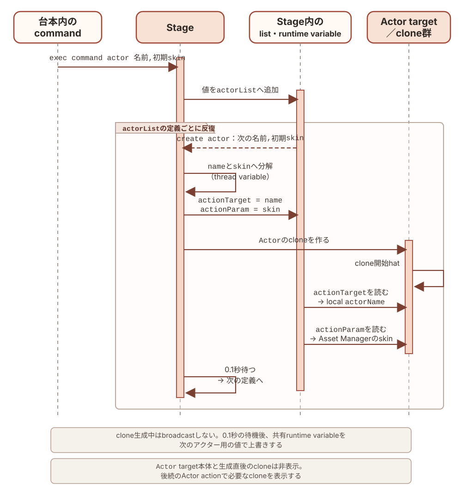
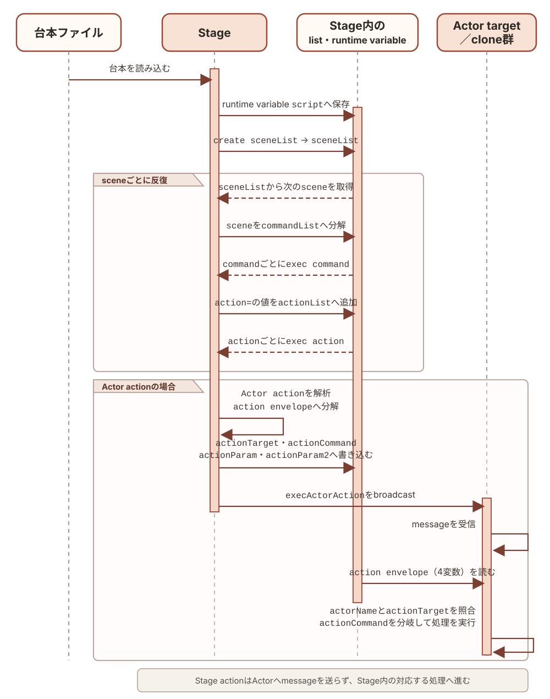
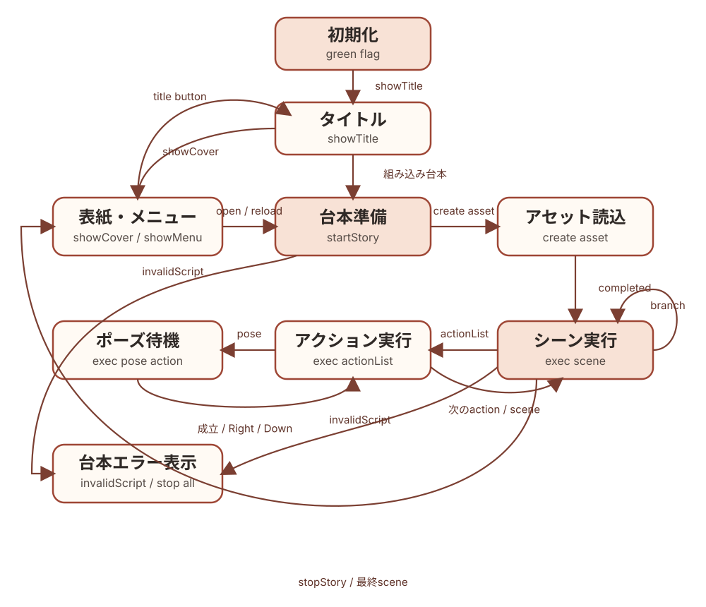

# 紙芝居アプリ内部仕様書

Copyright © 2026 Hiroya Kubo. この文書は[CC BY-SA 4.0](https://creativecommons.org/licenses/by-sa/4.0/)で提供します。

この文書は、TMPose紙芝居の汎用アプリSB3、成果物、SB3・台本変換ビルダー、検証、
公開の内部仕様を、現在の実装に対応させて記録します。アプリを変更する手順は
[ソフトウェア開発者向け資料](06-developer-guide.md)、台本の外部仕様は
[台本DSLマニュアル](04-dsl-manual.md)と
[コマンドリファレンス](05-command-reference.md)を参照してください。

対象アプリ／DSL: `kamishibai=3.1`

過去のバージョンからの変更は[`history.md`](history.md)を参照してください。

## この文書で使う用語

本書ではScratch／TurboWarpの用語と、このアプリ固有の用語を次の意味で使います。
表中の等幅書体（`Stage`、`script`、`action=`など）は、target名、変数名、DSL記法として
実装に現れる正確な綴りを表します。通常書体の用語は、概念または分類名を表します。
詳細なデータ構造や処理は、表に示した後続の章で説明します。

### Scratch／TurboWarpのproject構造

| 用語    | この文書での意味                                                                                                |
| ------- | --------------------------------------------------------------------------------------------------------------- |
| project | Stage、sprite、block、変数、画像、音声などをまとめたScratch／TurboWarp作品全体                                  |
| SB3     | projectを1ファイルに格納するScratch 3形式。このリポジトリではbuildによって生成する成果物                        |
| target  | project内でblock、変数、costumeなどを所有する実行単位。1つのStage targetと、0個以上のsprite targetがある        |
| `Stage` | projectに1つだけある舞台のtarget。このアプリでは背景表示に加え、台本解析と実行状態の統括を担う。詳細は4章を参照 |
| sprite  | 舞台上に表示・移動でき、costume、sound、block、変数を持てるtarget                                               |

### cloneとActor

| 用語                               | この文書での意味                                                                                     |
| ---------------------------------- | ---------------------------------------------------------------------------------------------------- |
| clone                              | 実行中にspriteから作る複製。同じblockを共有する一方、スプライトローカル変数にはcloneごとの値を持てる |
| `Actor` target／アクタースプライト | アクターをcloneとして生成するためのsprite雛形。このprojectではtarget名が`Actor`                      |
| アクター                           | `Actor` targetから作られ、`actorName`で区別される個々のclone。物語上の登場人物としてactionを実行する |

### 紙芝居DSLと実行

| 用語                    | この文書での意味                                                                                                    |
| ----------------------- | ------------------------------------------------------------------------------------------------------------------- |
| asset                   | Asset Managerへ名前付きで登録する画像、音声、text。SB3内のcostumeなどと外部URLのresourceを同じ方法で参照できる      |
| 紙芝居DSL／台本ファイル | asset、アクター、scene、actionなどをテキストで定義する言語と、その言語で記述したファイル                            |
| `script`                | 読み込んだ台本を保持するruntime variable。外部ファイルと組み込み台本は、ここから同じ処理経路へ入る                  |
| scene                   | 台本を`---`で区切った実行単位。内部では最初の区切りより前をscene 0として扱う                                        |
| command                 | 台本の`key=value`形式の1行。`exec command %s %s`がkeyに応じて設定、定義、action登録などを行う                       |
| action                  | scene内で順番に実行する演出命令。Stageが実行するStage actionと、アクターへ送るActor actionがある                    |
| action envelope         | Actor actionの宛先、command、引数を入れる`actionTarget`、`actionCommand`、`actionParam`、`actionParam2`のまとまり   |
| message／broadcast      | Scratch／TurboWarpのevent配送機構。broadcastすると、そのmessageに対応するhat blockがあるtargetやcloneで処理が始まる |

### 変数とblock

| 用語                 | この文書での意味                                                                                                                         |
| -------------------- | ---------------------------------------------------------------------------------------------------------------------------------------- |
| Scratch変数／list    | SB3に保存され、Stageまたはspriteが所有する値と配列                                                                                       |
| runtime variable     | Runtime Variables機能拡張が保持し、project全体から参照する共有値                                                                         |
| thread variable      | Thread Variables機能拡張が、カスタムブロック呼出し単位で保持する一時値                                                                   |
| event hat／hat block | green flag、broadcast受信、clickなどのeventを受けて処理を開始する、stack最上部のblock                                                    |
| カスタムブロック     | project内で定義し、名前と引数によって呼び出す処理。一般的なプログラミング言語のprocedureに相当する                                       |
| block ID             | SB3の`targets[].blocks`内でblockを識別するkey。実装スナップショット内の調査にだけ使い、版をまたぐ永続IDとしては扱わない。詳細は6章を参照 |

## 1. 文書の範囲と実装基準

アプリ内部構造の正本は`app/project.source.json`です。本書のtarget、変数、list、
broadcast、hat、カスタムブロック定義は、このファイルから抽出した現在の構造を
記載しています。配布用`kamishibai.sb3`は`app/`から生成する成果物であり、本書の
調査元にはしません。

### 1.1 実装スナップショット

| 項目                     | 件数 |
| ------------------------ | ---: |
| target（Stageを含む）    |    8 |
| block                    | 1444 |
| event hat                |   39 |
| カスタムブロック定義     |   40 |
| Scratch変数              |    6 |
| Scratch list             |   11 |
| broadcast message        |   18 |
| 静的なruntime variable名 |   16 |
| 静的なthread variable名  |   36 |
| TurboWarp機能拡張        |   12 |

本書に掲載するblock IDの意味と安定性は6章で説明します。

### 1.2 使用する機能拡張

| ID                            | 役割                                     | 取得形態 |
| ----------------------------- | ---------------------------------------- | -------- |
| `sipcconsole`                 | デバッグ用console                        | Gallery  |
| `lmsTempVars2`                | runtime variable／thread variable        | Gallery  |
| `strings`                     | 文字列処理                               | Gallery  |
| `kubohiroyaassetmanager`      | 画像・音声の登録とLoading進捗            | 埋め込み |
| `tmpose`                      | カメラ姿勢認識                           | 埋め込み |
| `localstorage`                | 台本のローカル保存                       | Gallery  |
| `kubohiroyatextlines`         | 行単位の台本処理                         | 埋め込み |
| `kubohiroyaruntimeexpression` | 分岐条件式の評価                         | 埋め込み |
| `kubohiroyaasyncinput`        | key／touch入力とscene移動                | 埋め込み |
| `lmsTimers`                   | `wait`と時間ベースactor actionのタイマー | Gallery  |
| `files`                       | 外部台本ファイルの選択                   | Gallery  |
| `text`                        | テキスト描画・アニメーション             | Gallery  |

埋め込み拡張の由来、固定commit、SHA-256は`app/embedded-extensions.json`を正本とし、
更新方法は[`sb3-toolchain`のワークフロー](https://github.com/kubohiroya/sb3-toolchain/blob/main/docs/workflows.md)
に従います。

## 2. 成果物プロファイル

紙芝居の成果物は、台本と物語固有アセットをどこに保持するかで分けます。

| プロファイル | 例               | 台本       | 物語固有アセット | 主な用途                   |
| ------------ | ---------------- | ---------- | ---------------- | -------------------------- |
| `generic`    | `kamishibai.sb3` | 非埋め込み | 非埋め込み       | 本体が配布する汎用雛形     |
| `editor`     | `_urashima.sb3`  | 非埋め込み | 埋め込み         | 物語作成者の編集・動作確認 |
| `player`     | `urashima.sb3`   | 埋め込み   | 埋め込み         | 配布・再生、Packager Web版 |

`generic`は`app/`から生成し、特定の物語を含めません。builder APIとCLIが受け付ける
`profile`は`editor`または`player`です。

`editor`と`player`は同じベースSB3、台本、アセットロックから生成します。両者の
変換済み台本とアセット参照を分岐させません。`player`は組み込み台本を予約変数へ保存し、
タイトル操作後にファイル選択なしで開始します。

`player`へ台本とアセットを組み込んでも、TMPoseモデル、カメラ、外部サービスまで
自動的にオフライン化されるわけではありません。残るオンライン依存は成果物manifestと
公開ページへ明記します。

## 3. SB3・台本変換ビルダー

### 3.1 導入

利用可能なバージョンを確認し、消費側で明示的に固定します。

```bash
npm view @kubohiroya/tmpose-kamishibai version
pnpm add --save-exact @kubohiroya/tmpose-kamishibai@<VERSION>
```

生成したlockfileをcommitし、CIでは`pnpm install --frozen-lockfile`を使います。

### 3.2 CLI

```bash
pnpm exec tmpose-kamishibai build-sb3 \
  --base kamishibai.sb3 \
  --script source.txt \
  --assets assets.lock.json \
  --output dist/sample \
  --profile editor
```

`--output`は拡張子を含まないベース名です。次の3ファイルを同じtransactionとして
生成します。

```text
dist/sample.sb3
dist/sample.txt
dist/sample.manifest.json
```

| オプション              | 意味                                      |
| ----------------------- | ----------------------------------------- |
| `--allow-file-root DIR` | `file:`の許可ルートを追加。複数回指定可能 |
| `--allow-http`          | 平文HTTPを明示的に許可                    |
| `--timeout-ms N`        | 1リクエストのタイムアウト                 |
| `--max-asset-bytes N`   | 1アセットの最大バイト数                   |
| `--max-script-bytes N`  | 組み込み台本の最大バイト数                |
| `--max-redirects N`     | HTTPリダイレクト上限                      |

完全な一覧は`pnpm exec tmpose-kamishibai --help`で確認します。

### 3.3 JavaScript API

```js
import {
  Sb3BuilderError,
  buildSb3Bundle,
  validateAssetManifest,
  validateBundle,
} from '@kubohiroya/tmpose-kamishibai/builder';

const result = await buildSb3Bundle({
  baseSb3: 'kamishibai.sb3',
  sourceScript: 'source.txt',
  assetManifest: 'assets.lock.json',
  outputDirectory: 'dist',
  outputName: 'sample',
  profile: 'editor',
});

console.log(result.outputPaths);
```

`baseSb3`と`sourceScript`にはファイルパスまたは`file:` URLを指定できます。
`assetManifest`にはファイルパス、`file:` URL、または検証対象のJavaScriptオブジェクトを
指定できます。相対`file:`を含むオブジェクトでは`manifestBaseDirectory`も指定します。

ネットワーク・ファイル取得は`allowedFileRoots`、`allowHttp`、`requestTimeoutMs`、
`maxAssetBytes`、`maxRedirects`で制限できます。`player`の組み込み台本上限は
`maxEmbeddedScriptBytes`で変更できます。

`buildSb3Bundle`は`manifest`と`outputPaths`を返します。入力・アセット・出力の問題は
`Sb3BuilderError`として処理段階とアセット情報を保持します。

### 3.4 アセットマニフェスト

入力manifestは`formatVersion: 1`と1件以上の`assets`を持ちます。

```json
{
  "formatVersion": 1,
  "assets": [
    {
      "name": "forest",
      "uri": "file:assets/forest.svg",
      "kind": "backdrop",
      "target": "@stage",
      "sb3Name": "森",
      "contentType": "image/svg+xml",
      "dataFormat": "svg",
      "size": 1234,
      "sha256": "<64文字の16進数>",
      "license": "CC-BY-4.0: https://creativecommons.org/licenses/by/4.0/",
      "metadata": {
        "bitmapResolution": 1,
        "rotationCenterX": 240,
        "rotationCenterY": 180
      }
    }
  ]
}
```

| `kind`        | `target`     | 変換後の台本参照             |
| ------------- | ------------ | ---------------------------- |
| `backdrop`    | `@stage`     | `backdrop:<sb3Name>`         |
| `costume`     | スプライト名 | `costume:<target>:<sb3Name>` |
| `stageSound`  | `@stage`     | `sound:@stage:<sb3Name>`     |
| `spriteSound` | スプライト名 | `sound:<target>:<sb3Name>`   |

DSL名、同一target内のSB3名、既存SB3のアセット名は重複できません。`license`には素材の
ライセンスまたは利用条件の識別情報と参照先を記録します。

### 3.5 安全性と再現性

- `file:`は既定でmanifestのディレクトリ以下だけを許可し、`..`やsymlinkによる脱出を拒否する
- HTTPSを既定とし、平文HTTPは明示的に許可した場合だけ取得する
- Content-Type、実サイズ、ロック済みサイズ、SHA-256、timeout、redirectを検証する
- ZIP entry順、timestamp、圧縮設定、JSON表現を固定する
- SB3、変換済み台本、出力manifestの対応を確定前に再検証する
- 3成果物を一時領域で生成し、すべて成功した場合だけ置換する
- 失敗時は既存成果物を保持または復元する

同じ入力、固定依存、設定から生成したSB3、台本、manifestはbit-for-bitで一致しなければ
なりません。

## 4. SB3の構成

Scratch／TurboWarpのprojectは、1つの**Stage（ステージ）** targetと、0個以上のsprite targetから
構成されます。Stage targetはproject全体の舞台を表し、背景（backdrop）を表示します。
Stage自身にblock、variable、listを持てますが、spriteのように座標を変えて動かしたり、
cloneを作ったりする対象ではありません。

このアプリでは、Stage targetを舞台の表示だけでなく、紙芝居全体の制御役として使います。
Stageに置かれたblock群が、台本の読込・解析、assetとactorの生成、sceneとactionの実行、
カメラと入力、画面遷移、共有runtime状態を統括します。したがって、本書やシーケンス図で
`Stage`と書いた場合は、画面に見える舞台だけでなく、このStage targetとそこに置かれた
制御用block群を指します。

### 4.1 target一覧

| target                | 種別       | 役割                                                                | 初期costume／sound      |
| --------------------- | ---------- | ------------------------------------------------------------------- | ----------------------- |
| `Stage`               | Stage      | 初期化、台本解析、scene/action実行、カメラ、入力、遷移を統括        | `Title`, `Stars`        |
| `Actor`               | sprite雛形 | 物語上の登場人物ごとにcloneされ、移動・見た目・音・時間actionを実行 | `button1`／`pop`        |
| `prompt`              | UI sprite  | 操作案内、pose案内、台本エラーをAsset Managerのcostumeで表示        | `ui-placeholder`        |
| `openButton`          | UI sprite  | 外部台本ファイルを選択して`startStory`へ渡す                        | `ui-placeholder`        |
| `reloadButton`        | UI sprite  | 保存済みの直前の台本を再読込する                                    | `ui-placeholder`        |
| `showTitleButton`     | UI sprite  | menuからtitleへ戻す                                                 | `ui-placeholder`        |
| `Loading`             | UI sprite  | Asset Managerの読込開始・進捗・完了に合わせてcostumeを表示          | `loading`／`Chirp`      |
| `LoadingBubbleAnchor` | UI sprite  | Loading進捗メッセージ用のspeech bubble位置を固定                    | `loading-bubble-anchor` |

`Actor`の本体は非表示で、cloneだけを登場人物として表示します。`prompt`、3つのmenu button、
`Loading`、`LoadingBubbleAnchor`の実画像は、台本の`ui.*`設定または組み込みfallbackから
Asset Managerへ登録します。

### 4.2 アクターへ命令を届けるしくみ

Scratch／TurboWarpで1つのspriteから複数の登場人物を作る場合、cloneごとに
スプライトローカル変数の識別子を持たせれば、同じblockを共有しながら個体を区別できます。
このアプリはその考え方を、cloneへ命令を届けるところまで拡張しています。

本書では、cloneの雛形として使う`Actor` targetを**アクタースプライト**、そこから作られ、
スプライトローカル変数の`actorName`を割り当てられた各cloneを**アクター**と呼びます。
アクタースプライトの本体は表示せず、物語の登場人物として表示するのはアクターだけです。
すべてのアクターは同じblock定義を共有し、`actorName`によって互いを区別します。

Stageからアクターへ命令を届ける流れは次のとおりです。

1. StageがDSLのActor actionを、宛先となるアクター名、command、引数に分解する
2. `actionTarget`、`actionCommand`、`actionParam`、`actionParam2`というruntime variableへ
   それぞれを格納する。このまとまりを本書では**action envelope**と呼ぶ
3. Stageが`execActorAction`をbroadcastする
4. すべての`Actor` cloneがmessageを受け取り、自分の`actorName`が`actionTarget`の
   対象に含まれるかを調べる
5. 対象になったアクターだけが、`actionCommand`を入れ子の条件分岐で振り分け、
   移動、見た目、音、時間に関する処理を実行する

つまり、action envelopeが「誰に・何を・どの引数で実行させるか」を表し、broadcastが
その命令を全アクターへ配送します。ここでいうcommandは、アクターに対する
メソッドに相当しますが、TurboWarp上ではカスタムブロックと条件分岐で実装されています。

通常のScratch projectではcostumeやsoundはspriteに属します。このアプリでは
[TurboWarp Asset Manager](https://github.com/kubohiroya/turbowarp-asset-manager)を使い、
SB3内のcostume、backdrop、sound、textや、外部URLの画像・音声を、名前を持つassetとして
登録します。アクターの見た目や音のactionはこのasset名を参照するため、振る舞いを実装する
アクタースプライトと、実際に使う画像・音声を分けて組み合わせられます。

台本DSLは、このassetの定義、アクターの定義、sceneごとにアクターへ送るactionの定義を
テキストで記述するための言語です。TurboWarpで作られたこのアプリはDSLを解析し、assetを
読み込み、アクターを生成し、action envelopeとbroadcastを使って命令を実行します。
したがって、このアプリ全体は、紙芝居DSLを解析・実行する処理系であり、その実行基盤
（runtime）でもあります。

#### 台本からアクターclone生成までのシーケンス

アクターは、台本準備時に`actor=` commandから生成します。これは生成済みのアクターへ
Actor actionを送る処理とは実行時期もデータの渡し方も異なるため、別の図に示します。



`exec command %s %s`は`actor=`の値を`actorList`へ追加します。各値は
`アクター名,初期skin名`の形式です。その後、Stageの`create actor`が`actorList`を順に読み、
各値をthread variableの`name`と`skin`へ分けます。Stageは共有runtime variableの
`actionTarget`へ`name`、`actionParam`へ`skin`を設定してから、`Actor` targetのcloneを
作ります。

clone開始hatは、`actionTarget`をそのcloneのスプライトローカル変数`actorName`へ保存し、
`actionParam`をTurboWarp Asset Managerへ渡して初期skinを設定します。Stageはcloneを
作るたびに0.1秒待ち、この初期化が走る機会を設けてから、共有runtime variableを次の
アクター用の値で上書きします。clone生成時には`execActorAction`をbroadcastしません。

`Actor` target本体はcloneの雛形として非表示です。cloneはこの表示状態を引き継ぐため、
生成直後も非表示であり、sceneの後続のActor actionによって必要な時点で表示されます。

#### 台本からActor actionまでのシーケンス

台本ファイルからActor内の処理までを、データの変換と実行の順に並べると次のようになります。
外部ファイルだけでなく、再生用SB3へ組み込んだ台本も`script`へ入った後は同じ経路を通ります。



`create sceneList`は`script`をscene単位に分けます。`exec scene # %s with %s`は現在のsceneを
行単位の`commandList`に分け、`exec command %s %s`でcommandを順に処理します。このうち
`action=`の値を`actionList`へ集め、`exec actionList`が各actionを`exec action %s`へ渡します。
Stage actionはStage内で実行され、Actor actionだけがaction envelopeとmessageを経由します。
messageはすべての`Actor` cloneが受け取りますが、実際に処理するのは宛先に一致した
アクターだけです。

### 4.3 target間の責務

`Stage`は台本を`sceneList`、`commandList`、`actionList`へ段階的に変換します。
さらにsceneと共有runtime状態を管理し、Stage actionを実行します。`Actor` cloneの責務は、
生成時に自分の`actorName`と初期skinを確定し、その後、4.2で配送されたActor actionのうち
自分を対象とするものを実行することです。

UI spriteは表示状態を`showMenu`／`hideMenu`、`showPrompt`／`hidePrompt`、
Asset ManagerのLoading messageで受け取ります。台本の実行状態をUI sprite側へ
複製せず、Stageを状態の所有者とします。

## 5. 変数とlist

変数は、SB3へ永続化されるScratch変数／list、threadごとの一時値、project全体で共有する
runtime variableの3種類に分けます。

### 5.1 Scratch変数

| 所有者  | 変数                       | 初期値       | 役割                                   |
| ------- | -------------------------- | ------------ | -------------------------------------- |
| `Stage` | `ポーズ認識`               | `0`          | pose認識中の表示・互換用状態           |
| `Stage` | `チャージ`                 | `0`          | pose成立までのcharge表示・互換用状態   |
| `Stage` | `actionIndex`              | `1`          | 現在処理する`actionList`の位置         |
| `Stage` | `poseIndex`                | `1`          | 現在処理する`poseList`の位置           |
| `Stage` | `__tmpose_embedded_script` | 空文字       | `player` profileの組み込み台本予約領域 |
| `Actor` | `actorName`                | `_template_` | cloneが担当する台本上のactor名         |

`__tmpose_embedded_script`はStageに一つだけ存在し、monitorを持ちません。`generic`と
`editor`では空、`player`ではbuilderが変換済み台本を設定します。

### 5.2 Scratch list

すべてStage所有で、汎用SB3では空の初期状態です。

| list             | 役割                           |
| ---------------- | ------------------------------ |
| `skinList`       | actor action中のcostume候補    |
| `poseList`       | pose action中の認識label候補   |
| `soundList`      | actor action中のsound候補      |
| `actionList`     | 現在sceneのaction列            |
| `sceneList`      | 台本から抽出したscene block    |
| `commandList`    | sceneの前に評価する設定command |
| `actorList`      | 台本から生成するactor定義      |
| `assetList`      | 登録するasset定義              |
| `durationList`   | pose候補ごとの継続時間         |
| `sceneLabelList` | scene labelとindexの対応       |
| `lines`          | Text Linesで分割した台本行     |

### 5.3 runtime variable

静的な名前を持つruntime variableは次の16個です。

| 変数                                                           | 生存期間／役割                                                   |
| -------------------------------------------------------------- | ---------------------------------------------------------------- |
| `script`                                                       | 読み込んだ変換済み台本。title、reload、`startStory`間で共有      |
| `version`                                                      | 台本の`kamishibai` version                                       |
| `startSceneIndex`                                              | 台本で指定した開始scene                                          |
| `sceneIndex`                                                   | 現在実行中のscene index                                          |
| `actionTarget`, `actionCommand`, `actionParam`, `actionParam2` | StageからActor cloneへ渡すaction envelope                        |
| `nextSceneLabel`                                               | key／touch入力が要求した遷移先scene label                        |
| `skipMode`                                                     | `Space`、`Right`、`Down`による未消費の進行要求                   |
| `skipContext`                                                  | `title`、`action`、`pose`、`scene`のどの境界が要求を消費できるか |
| `poseRecog`, `poseCharge`, `poseIdle`                          | pose認識のしきい値、charge時間、idle時間                         |
| `loadingCostume`                                               | Loading spriteへ適用するcostume名                                |
| `message`                                                      | Loading bubbleへ表示する現在の進捗文言                           |

このほか、`exec command %s %s`はDSLで指定されたruntime variable名を動的に設定します。
分岐条件は`branch:<branchName>`という名前で保存します。この2系列は入力から名前が決まるため、
静的な16個には数えません。

### 5.4 thread variable

カスタムブロック呼出しごとに分離され、呼出し終了後に共有状態として残さない値です。

| 用途                  | 名前                                                                                   |
| --------------------- | -------------------------------------------------------------------------------------- |
| 共通loop・文字列処理  | `index`, `length`, `line`, `lineIndex`, `name`, `value`, `key`, `keyValue`             |
| 台本解析              | `sceneBlock`, `sceneLabel`, `sceneLabelList`, `condition`, `conditionList`             |
| asset／actor生成      | `asset`, `assetList`, `resourceId`, `actor`, `actorName`, `skin`                       |
| action実行            | `action`, `actionResult`, `actionListResult`, `stageActionResult`, `actorActionResult` |
| command／branch／入力 | `commandIndex`, `branchIndex`, `keyId`, `hasRead`                                      |
| cover                 | `cover`, `coverBackground`, `coverBgm`                                                 |
| Actor clone           | `x`, `y`, `scale`                                                                      |
| その他                | `durationList`, `sceneIndex`                                                           |

runtime variableと同名の`sceneIndex` thread variableは、カスタムブロック内の局所的な
引数・計算値です。project全体の現在sceneはruntime variable側だけを正本とします。

## 6. event、カスタムブロック、呼出し関係

表の`target`はblockを所有するStageまたはsprite、`ID`はそのtargetの`blocks`
objectにあるkeyです。SB3内では`project.json`の`targets[].blocks`、このリポジトリ
では`app/project.source.json`の同じ位置に保存されます。IDはopcodeや表示名ではなく、
この実装スナップショット内のblockを特定するための内部識別子です。

`sb3-toolchain`のbuildとimportはblock IDを新規採番せず、入力に含まれるIDを保持します。
既存blockを再生成しないTurboWarp上の編集・保存でも通常は保持されます。一方、blockの
削除と再作成、複製やcopy & pasteによる新しいblockの作成、target／projectのimportなどで
blockが再生成されるとIDは変わります。したがって、IDは外部仕様、永続ID、他の版をまたぐ
参照には使いません。アプリを編集してIDが変わった場合は、本章も現在の
`app/project.source.json`に合わせて更新します。

### 6.1 event hat一覧

`procedures_definition`と、接続されていないreporter blockはevent hatに含めません。
「実行される内容」はhatを起点とする主要なカスタムブロック呼出し、broadcast、状態変更、
表示操作を要約したもので、標準blockを含む全処理の逐語的な列挙ではありません。

#### Stage

| target  | ID   | trigger               | 実行される内容                                                                                |
| ------- | ---- | --------------------- | --------------------------------------------------------------------------------------------- |
| `Stage` | `iM` | green flag            | `stop camera preview`, `stop pose recog`, `stop camera`, `hide all actors`; `showTitle`送信   |
| `Stage` | `i;` | key `space`           | `showCover`送信                                                                               |
| `Stage` | `i}` | key `down arrow`      | `finishTimedActorAction`送信、`skipMode=Down`                                                 |
| `Stage` | `jb` | key `right arrow`     | `finishTimedActorAction`送信、`skipMode=Right`                                                |
| `Stage` | `jX` | `startStory`受信      | `start camera`, `create sceneList`, `exec scene # %s with %s`, `create asset`, `create actor` |
| `Stage` | `j/` | `stopStory`受信       | `stop camera`, `stop pose recog`, `show cover`; `deleteAllActors`, `showMenu`送信             |
| `Stage` | `j?` | `debugTestCamera`受信 | TMPoseのcamera previewを直接確認                                                              |
| `Stage` | `kD` | `showCover`受信       | `show cover`; `hidePrompt`, `deleteAllActors`送信                                             |
| `Stage` | `l=` | Stage click           | 組み込み台本の有無に応じて`showCover`または`startStory`送信                                   |
| `Stage` | `l[` | `showTitle`受信       | 実行contextをclearし、`hidePrompt`, `deleteAllActors`送信                                     |
| `Stage` | `m~` | `stopKeyInput`受信    | Async Inputの全listenerを停止                                                                 |
| `Stage` | `nx` | `stopTouchInput`受信  | Async Inputの全listenerを停止                                                                 |

#### Actor

| target  | ID               | trigger                      | 実行される内容                                          |
| ------- | ---------------- | ---------------------------- | ------------------------------------------------------- |
| `Actor` | `nY`             | `execActorAction`受信        | `isTimeBasedAction`, `wait for actor action %s seconds` |
| `Actor` | `oH`             | `deleteAllActors`受信        | cloneを削除                                             |
| `Actor` | `oJ`             | clone開始                    | `actorName`、位置、scaleをruntime envelopeから初期化    |
| `Actor` | `actorFinishHat` | `finishTimedActorAction`受信 | 対象actorと`skipMode`を照合して時間actionを完了         |

#### UI sprite

| target                | ID                       | trigger                     | 実行される内容                             |
| --------------------- | ------------------------ | --------------------------- | ------------------------------------------ |
| `prompt`              | `oS`                     | `showPrompt`受信            | 案内costumeを表示                          |
| `prompt`              | `oV`                     | `hidePrompt`受信            | 非表示                                     |
| `prompt`              | `oX`                     | `invalidScript`受信         | エラーcostumeを表示                        |
| `openButton`          | `o!`                     | green flag                  | 非表示                                     |
| `openButton`          | `o%`                     | sprite click                | file選択後に`hideMenu`, `startStory`送信   |
| `openButton`          | `o*`                     | `hideMenu`受信              | 非表示                                     |
| `openButton`          | `o,`                     | `showMenu`受信              | `ui.open` skinで表示                       |
| `reloadButton`        | `o.`                     | green flag                  | 非表示                                     |
| `reloadButton`        | `o:`                     | `hideMenu`受信              | 非表示                                     |
| `reloadButton`        | `o=`                     | sprite click                | 保存済み台本で`hideMenu`, `startStory`送信 |
| `reloadButton`        | `o[`                     | `showMenu`受信              | 台本が保存済みなら表示                     |
| `showTitleButton`     | <code>o&#96;</code>      | green flag                  | 非表示                                     |
| `showTitleButton`     | <code>o&#124;</code>     | `hideMenu`受信              | 非表示                                     |
| `showTitleButton`     | `o~`                     | sprite click                | `hideMenu`, `showTitle`送信                |
| `showTitleButton`     | `pb`                     | `showMenu`受信              | title以外なら表示                          |
| `Loading`             | `pf`                     | green flag                  | 非表示                                     |
| `Loading`             | `pm`                     | `assetLoadingStarted`受信   | Loading costumeを表示                      |
| `Loading`             | `pj`                     | `assetLoadingProgress`受信  | costumeを循環                              |
| `Loading`             | `ph`                     | `assetLoadingCompleted`受信 | 非表示、完了sound                          |
| `LoadingBubbleAnchor` | `loadingBubbleFlag`      | green flag                  | 非表示、bubbleをclear                      |
| `LoadingBubbleAnchor` | `loadingBubbleStarted`   | `assetLoadingStarted`受信   | anchorを表示                               |
| `LoadingBubbleAnchor` | `loadingBubbleProgress`  | `assetLoadingProgress`受信  | runtime variable `message`をsay            |
| `LoadingBubbleAnchor` | `loadingBubbleCompleted` | `assetLoadingCompleted`受信 | bubbleをclearして非表示                    |

### 6.2 カスタムブロック定義一覧

引数名はprototypeの`argumentnames`、warpはprototypeの`mutation.warp`から取得します。
「呼び出す処理／送信するmessage」には定義内で呼ぶ別のカスタムブロックや機能拡張の
処理を示し、broadcast messageは送信する名前を明記します。

#### 初期化・parse・共通処理

| target  | ID   | 定義                                       | 引数                         | warp | 呼び出す処理／送信するmessage                                                                                |
| ------- | ---- | ------------------------------------------ | ---------------------------- | ---- | ------------------------------------------------------------------------------------------------------------ |
| `Stage` | `c:` | `init skinList with %s`                    | `commaSeparatedText`         | yes  | `selectValue # %s separated by %s from %s`                                                                   |
| `Stage` | `c_` | `init poseList with %s`                    | `commaSeparatedText`         | yes  | `selectValue # %s separated by %s from %s`                                                                   |
| `Stage` | `dc` | `init soundList with %s`                   | `commaSeparatedText`         | yes  | `selectValue # %s separated by %s from %s`                                                                   |
| `Stage` | `gH` | `init durationList with %s`                | `commaSeparatedText`         | no   | `selectValue # %s separated by %s from %s`                                                                   |
| `Stage` | `eM` | `selectValue # %s separated by %s from %s` | `index`, `separator`, `text` | yes  | —                                                                                                            |
| `Stage` | `hl` | `substr of %s after %s`                    | `text`, `firstDelim`         | no   | —                                                                                                            |
| `Stage` | `dL` | `min %s %s`                                | `valueA`, `valueB`           | yes  | —                                                                                                            |
| `Stage` | `d)` | `exec command %s %s`                       | `key`, `value`               | no   | `substr of %s after %s`, `selectValue # %s separated by %s from %s`, `setTMPoseURL with %s`; `invalidScript` |
| `Stage` | `e+` | `create sceneList`                         | —                            | yes  | `selectValue # %s separated by %s from %s`                                                                   |
| `Stage` | `fe` | `create asset`                             | —                            | no   | `selectValue...`; `assetLoadingStarted/Progress/Completed`                                                   |
| `Stage` | `fv` | `create actor`                             | —                            | no   | `selectValue # %s separated by %s from %s`                                                                   |

#### camera・pose

| target  | ID   | 定義                   | 引数        | warp | 呼び出す処理／送信するmessage                                                                                                    |
| ------- | ---- | ---------------------- | ----------- | ---- | -------------------------------------------------------------------------------------------------------------------------------- |
| `Stage` | `dQ` | `setTMPoseURL with %s` | `URL`       | no   | —                                                                                                                                |
| `Stage` | `dU` | `start camera`         | —           | no   | —                                                                                                                                |
| `Stage` | `dX` | `stop camera`          | —           | no   | —                                                                                                                                |
| `Stage` | `eD` | `start pose recog`     | —           | no   | —                                                                                                                                |
| `Stage` | `dG` | `stop pose recog`      | —           | no   | —                                                                                                                                |
| `Stage` | `dY` | `rate of pose recog`   | —           | no   | —                                                                                                                                |
| `Stage` | `d!` | `label of pose recog`  | —           | no   | —                                                                                                                                |
| `Stage` | `d%` | `start camera preview` | —           | no   | —                                                                                                                                |
| `Stage` | `d(` | `stop camera preview`  | —           | no   | —                                                                                                                                |
| `Stage` | `dk` | `exec pose action %s`  | `actorName` | no   | `start camera preview`, `start pose recog`, `exec pose %s`, `stop pose recog`, `stop camera preview`; `showPrompt`, `hidePrompt` |
| `Stage` | `f[` | `exec pose %s`         | `actorName` | no   | `change skin...`, `min...`, `rate of pose recog`                                                                                 |

#### scene・action・actor

| target  | ID             | 定義                               | 引数                      | warp | 呼び出す処理／送信するmessage                                                                                                                    |
| ------- | -------------- | ---------------------------------- | ------------------------- | ---- | ------------------------------------------------------------------------------------------------------------------------------------------------ |
| `Stage` | `fB`           | `exec scene # %s with %s`          | `sceneIndex`, `sceneData` | no   | `selectValue # %s separated by %s from %s`, `substr of %s after %s`, `exec command %s %s`, `exec actionList`, `hide all actors`; `invalidScript` |
| `Stage` | `e=`           | `exec actionList`                  | —                         | no   | `exec action %s`                                                                                                                                 |
| `Stage` | `f(`           | `exec action %s`                   | `action`                  | no   | `exec stage action %s`, `exec actor action %s`                                                                                                   |
| `Stage` | `gP`           | `exec stage action %s`             | `action`                  | no   | `touchInputToChangeScene %s %s`, `exec keyInputToChangeScene %s %s`, `exec branch action %s`, `exec transition action %s`, `wait %s seconds`     |
| `Stage` | `gp`           | `exec actor action %s`             | `action`                  | no   | `selectValue # %s separated by %s from %s`, 3つのlist初期化、`exec pose action %s`; `execActorAction`                                            |
| `Stage` | `ee`           | `hide all actors`                  | —                         | no   | `execActorAction`                                                                                                                                |
| `Stage` | `eh`           | `change skin of %s to %s`          | `actorName`, `skinName`   | no   | `execActorAction`                                                                                                                                |
| `Stage` | `eR`           | `show cover`                       | —                         | no   | `selectValue # %s separated by %s from %s`; `showMenu`                                                                                           |
| `Actor` | `it`           | `isTimeBasedAction`                | —                         | no   | —                                                                                                                                                |
| `Actor` | `actorWaitDef` | `wait for actor action %s seconds` | `seconds`                 | no   | —                                                                                                                                                |

#### transition・branch・input

| target  | ID   | 定義                               | 引数                              | warp | 呼び出す処理／送信するmessage                                                |
| ------- | ---- | ---------------------------------- | --------------------------------- | ---- | ---------------------------------------------------------------------------- |
| `Stage` | `ga` | `exec transition action %s`        | `transitionName`                  | no   | `exec transition reset`, `exec transition fadeUp`, `exec transition fadeOut` |
| `Stage` | `gf` | `exec transition fadeOut`          | —                                 | no   | —                                                                            |
| `Stage` | `gh` | `exec transition fadeUp`           | —                                 | no   | —                                                                            |
| `Stage` | `gj` | `exec transition reset`            | —                                 | no   | —                                                                            |
| `Stage` | `g]` | `exec branch action %s`            | `branchName`                      | no   | `selectValue...`                                                             |
| `Stage` | `hq` | `exec keyInputToChangeScene %s %s` | `keyIdList`, `sceneLabelList`     | no   | Async Input                                                                  |
| `Stage` | `hu` | `touchInputToChangeScene %s %s`    | `actorNameList`, `sceneLabelList` | no   | Async Input                                                                  |
| `Stage` | `hy` | `wait %s seconds`                  | `seconds`                         | no   | More Timers                                                                  |

### 6.3 主要な呼出し経路

| 起点         | 経路                                                                                |
| ------------ | ----------------------------------------------------------------------------------- |
| green flag   | 初期化 → camera／pose停止 → actor非表示 → `showTitle`                               |
| `startStory` | 台本検証 → `create sceneList` → asset／actor生成 → `exec scene # %s with %s`        |
| scene実行    | `exec command %s %s` → `exec actionList` → actionごとに`exec action %s`             |
| Stage action | branch、transition、key／touch入力、`wait`などへdispatch                            |
| Actor action | runtime envelope設定 → `execActorAction` → 対象clone → 移動・見た目・音・時間action |
| pose action  | camera preview／pose認識開始 → `exec pose %s`反復 →認識停止 → prompt非表示          |
| 終了         | `stopStory` → camera／pose停止 → actor削除 → cover → menu                           |

## 7. broadcastと状態遷移

### 7.1 message一覧

| message                  | 主な送信者                            | 受信者                           | 役割                         |
| ------------------------ | ------------------------------------- | -------------------------------- | ---------------------------- |
| `showPrompt`             | `Stage`                               | `prompt`                         | 操作・pose案内を表示         |
| `hidePrompt`             | `Stage`                               | `prompt`                         | 案内を非表示                 |
| `invalidScript`          | `Stage`                               | `prompt`                         | 台本エラーを表示             |
| `hideMenu`               | 3つのmenu button                      | 3つのmenu button                 | menuを一括非表示             |
| `showMenu`               | `Stage`                               | 3つのmenu button                 | 利用可能なmenuを表示         |
| `startStory`             | `Stage`, `openButton`, `reloadButton` | `Stage`                          | 台本の解析・実行を開始       |
| `stopStory`              | `Stage`                               | `Stage`                          | 実行を停止しcoverへ戻す      |
| `showCover`              | `Stage`                               | `Stage`                          | coverを構築してmenuを表示    |
| `showTitle`              | `Stage`, `showTitleButton`            | `Stage`                          | title状態へ戻す              |
| `execActorAction`        | `Stage`                               | `Actor`                          | action envelopeをcloneへ通知 |
| `deleteAllActors`        | `Stage`                               | `Actor`                          | 全cloneを削除                |
| `assetLoadingStarted`    | `Stage`／Asset Manager                | `Loading`, `LoadingBubbleAnchor` | Loading表示を開始            |
| `assetLoadingProgress`   | `Stage`／Asset Manager                | `Loading`, `LoadingBubbleAnchor` | 進捗costumeとmessageを更新   |
| `assetLoadingCompleted`  | `Stage`／Asset Manager                | `Loading`, `LoadingBubbleAnchor` | Loading表示を終了            |
| `stopKeyInput`           | Async Input                           | `Stage`                          | key listenerを停止           |
| `stopTouchInput`         | Async Input                           | `Stage`                          | touch listenerを停止         |
| `finishTimedActorAction` | `Stage`のRight／Down key hat          | `Actor`                          | 時間actionを確定状態へ進める |
| `debugTestCamera`        | TurboWarp editorからの手動送信        | `Stage`                          | camera previewの診断         |

`stopKeyInput`と`stopTouchInput`は標準broadcast blockではなく、Async Inputへ渡した
callback messageです。`debugTestCamera`は通常フローに送信元を持たない診断用messageです。

### 7.2 状態遷移



主要状態はStageが所有します。UI表示そのものを状態の正本にせず、runtime variable、
broadcast、実行中のcustom blockから導出します。

| 状態                     | 入口                                              | 主な出口                                                             |
| ------------------------ | ------------------------------------------------- | -------------------------------------------------------------------- |
| 初期化                   | green flag                                        | `showTitle`                                                          |
| title                    | `showTitle`                                       | 組み込み台本ならStage clickで`startStory`、それ以外はcover           |
| cover／menu              | `showCover`または`stopStory`                      | open／reloadで`startStory`、title buttonで`showTitle`                |
| 台本準備                 | `startStory`                                      | 正常ならasset loadingとscene実行、検証異常なら`invalidScript`        |
| asset loading            | `create asset`                                    | `assetLoadingCompleted`後にscene実行                                 |
| scene実行                | `exec scene # %s with %s`                         | 次scene／branch、最終sceneで`stopStory`、解析異常で`invalidScript`   |
| action実行               | `exec actionList`                                 | Rightでaction境界、Downでscene境界、完了で次action                   |
| pose待機                 | `exec pose action %s`                             | pose成立、Right／Downでaction実行へ戻る                              |
| 台本エラー表示・実行停止 | 台本・command・scene解析エラー時の`invalidScript` | `prompt`が`ui.invalidScript`を表示し、送信元の`stop all`で実行を停止 |

`invalidScript`はpose待機への遷移ではありません。Stageは台本検証、command解析、
scene解析のエラー時にこのmessageを送信し、各送信箇所の直後に`stop all`を実行します。
`prompt`はmessageを受信すると`ui.invalidScript`のskinを設定して表示します。

`skipMode`は要求、`skipContext`は消費可能な境界です。要求はtitle、action、pose、sceneの
該当境界だけが消費し、scene開始、cover、stopでclearします。`nextSceneLabel`はkey／touch
listenerが設定し、scene loopがlabelをindexへ解決したあと削除します。

## 8. 検証

### 8.1 変更対象ごとのテスト

| 変更対象               | 主なテスト                                                                                      |
| ---------------------- | ----------------------------------------------------------------------------------------------- |
| builder API／CLI       | `test/builder.test.mjs`                                                                         |
| 展開SB3の構造          | `test/sb3-project.test.mjs`、`test/skip-mode.test.mjs`                                          |
| 内部仕様書の構造一覧   | `test/internal-specification.test.mjs`                                                          |
| TurboWarp実行結果      | `test/turbowarp-vm.test.mjs`                                                                    |
| 入力、分岐、wait       | `test/async-input.test.mjs`、`test/register-branch.test.mjs`、`test/wait-action.test.mjs`       |
| 文書、画像、ライセンス | `test/docs-config.test.mjs`、`test/docs-images.test.mjs`、`test/documentation-license.test.mjs` |
| 公開物と汎用性         | `test/sb3-publication.test.mjs`、`test/build-freshness.test.mjs`                                |

### 8.2 標準チェック

```bash
pnpm lint
pnpm format
pnpm typecheck
pnpm test
pnpm run build
```

GitHub ActionsはcleanなLinux環境で`pnpm install --frozen-lockfile`、`pnpm test`、
`pnpm build`を実行します。ローカルで成功しても、未追跡ファイルや既存生成物へ依存して
いないことをCIで確認します。

`pnpm run build`は少なくとも次を生成・検証します。

- `dist/downloads/kamishibai.sb3`
- 一般文書ごとのWeb Publication、HTML/PDF、Vivliostyle CLIが`h2`・`h3`までから生成する目次
- 参加者向け・スタッフ向け体験会資料
- 公開サイトのリンク、画像、目次、PDF bookmark、favicon

SB3またはruntimeを変更した場合は、生成SB3をTurboWarpで開いて次を手動確認します。

- 読込エラーがない
- green flagでtitleとmenuが表示される
- 外部台本と組み込み台本の対象フローが開始できる
- pause、Space、Right、Downの進行が意図どおり動く
- Loading、画像、音声、テキストが正しく表示・再生される

内部構造を変更したPRでは、`app/project.source.json`と本書のtarget、変数、message、
hat、custom block一覧を同時に更新します。

## 9. 公開

### 9.1 GitHub Pages

```bash
pnpm run deploy
```

`predeploy`がフルbuildを行い、成功した`dist/`だけを`gh-pages`へ公開します。公開後は
top page、文書一覧、各カードのHTML／Vivliostyle Viewer／PDF、SB3 downloadを実際の
URLから確認します。

問題がある場合は、直前の検証済みcommitをcheckoutしたcleanな環境から再度build・
deployします。生成済み`dist/`だけを手作業で修正しません。

### 9.2 npmパッケージ

公開済みversionは変更・再利用できません。releaseごとに新しいversionとGit tagを使います。

1. `package.json`、lockfile、`src/builder/constants.js`、READMEの導入例を同じversionへ更新する。
2. cleanなcommitで標準チェック、フルbuild、公開内容のdry-runを実行する。

```bash
pnpm release:check
```

3. tarballのファイル一覧、license、size、CLI/APIを確認する。
4. Git worktreeではなく通常のclean cloneから公開する。
5. WebAuthnなどの認証を完了してpublic packageとして公開する。

```bash
npm publish --access public
```

6. registry反映後にmetadataを確認する。

```bash
npm view @kubohiroya/tmpose-kamishibai@<VERSION> \
  version license dist-tags.latest dist.integrity --json
```

7. 一時ディレクトリへ公開版を導入し、CLIの`--version`と
   `@kubohiroya/tmpose-kamishibai/builder`のimportを確認する。
8. 公開に使った確定commitへannotated tagを作り、GitHub Releaseを作成する。

公開後に問題が見つかった場合は対象versionを`npm deprecate`し、修正版を新しいpatch
versionとして公開します。公開済みtarballやtagを差し替えません。

## 10. トラブルシューティング

| 症状                                              | 確認と対応                                                                                                                                                       |
| ------------------------------------------------- | ---------------------------------------------------------------------------------------------------------------------------------------------------------------- |
| `sb3:import`が置換を拒否する                      | `git status`と`git diff -- app`を確認し、[toolchainの手順](https://github.com/kubohiroya/sb3-toolchain/blob/main/docs/workflows.md#既存ソースへの再import)に従う |
| `.app.rollback-*`や`.＜出力名＞.rollback-*`が残る | 削除前に元出力と比較し、[toolchainの失敗時の扱い](https://github.com/kubohiroya/sb3-toolchain/blob/main/docs/workflows.md#失敗時の扱い)に従う                    |
| 埋め込み拡張が追跡refと異なる                     | `pnpm sb3:extensions:status`で確認し、固定commitへ戻すなら`sync`、更新するなら`update`を使う                                                                     |
| PDF生成browserが見つからない                      | Chrome/Chromiumを導入し、必要なら`VIVLIOSTYLE_CHROME_PATH`を設定する                                                                                             |
| ローカルだけtestが通る                            | 生成物と未追跡ファイルを確認し、clean cloneと`pnpm install --frozen-lockfile`で再現する                                                                          |
| builderが既存出力を更新しない                     | エラーの`stage`、asset名、URIを確認する。rollback領域が残っていないか確認する                                                                                    |
| 公開直後にnpm registryが404になる                 | 同じversionを再publishせず、npm公開pageとregistryの反映を待って確認する                                                                                          |

復旧でGit履歴を破壊しません。公開済み変更は`git revert`または新しい修正PRで戻し、tagを
移動しません。

## 11. ライセンスと秘密情報

| 対象                                                                     | ライセンス                                         |
| ------------------------------------------------------------------------ | -------------------------------------------------- |
| `docs/general/**`                                                        | CC BY-SA 4.0                                       |
| `docs/workshops/**`                                                      | Copyright © 2026 Hiroya Kubo. All rights reserved. |
| 上記以外で個別表示のない、本プロジェクトが著作権を持つソフトウェアと素材 | MPL-2.0                                            |

詳細は[`LICENSES.md`](../../LICENSES.md)、[`docs/general/LICENSE.md`](LICENSE.md)、
[`docs/workshops/LICENSE.md`](../workshops/LICENSE.md)を参照してください。

第三者の画像、音声、font、model、機能拡張には個別のlicenseまたは利用条件が適用されます。
builderで組み込む素材はasset manifestの`license`へ由来を記録します。許諾が確認できない
素材を本体またはsampleへ追加しません。

token、npm認証情報、秘密鍵、個人情報をrepository、SB3、台本、manifest、生成HTMLへ
記録しません。認証情報は環境変数、OSのkeychain、GitHub Secretsなど、公開物へ含まれない
仕組みで渡します。

## 12. 関連ドキュメント

- [`03-user-guide.md`](03-user-guide.md): アプリの利用方法と成果物の使い分け
- [`04-dsl-manual.md`](04-dsl-manual.md): 台本の構造と書き方
- [`05-command-reference.md`](05-command-reference.md): コマンドとactionの外部仕様
- [`06-developer-guide.md`](06-developer-guide.md): setupと変更手順
- [`history.md`](history.md): DSLとアプリの変更履歴
- [`README.md`](../../README.md): プロジェクト全体の入口
