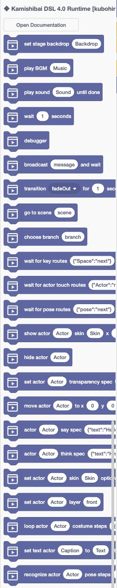
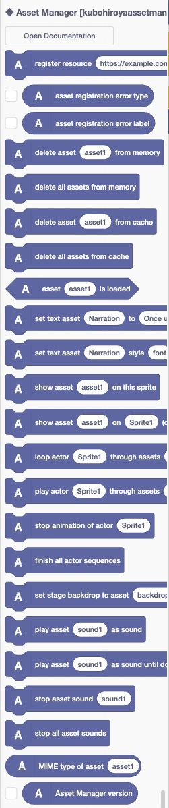
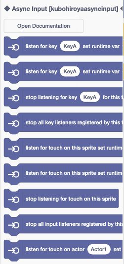
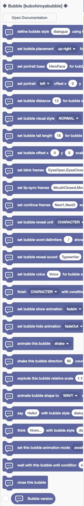
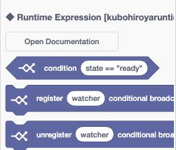
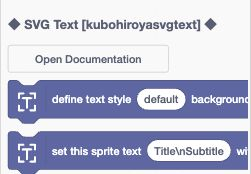
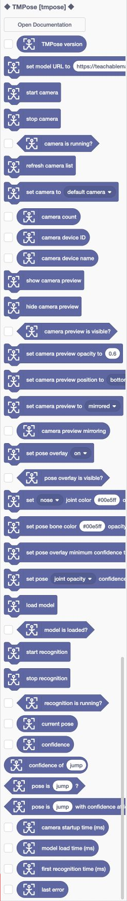

# DSL 4.0ランタイム ブロックリファレンス

Copyright © 2026 Hiroya Kubo. この文書は[CC BY-SA 4.0](https://creativecommons.org/licenses/by-sa/4.0/)で提供します。

対象: DSL 4.0ランタイムをTurboWarp Editorで開き、集約されたブロックからプログラムを書く方  
調査基準: tmpose-kamishibai 4.0.0-rc.7（`3a5f31d`）、sb3-toolchain 0.8.0、2026年8月16日

文書状態: 公開プレリリース4.0.0-rc.7向けリファレンス 
実装基準: annotated tag `v4.0.0-rc.7`のcommit `3a5f31d`

この一覧は4.0の正式リリースまたは将来版で同じblock構成を保証するものではありません。利用前に
[公開元](https://github.com/kubohiroya/tmpose-kamishibai/releases)のversionとrelease noteを確認してください。

DSL 4.0のSB3には、紙芝居ランタイムと6つの機能拡張が、一つの静的な機能拡張bundleとして入っています。
TurboWarp Editorでは一つのパレットに見えますが、見出し、アイコン、名前空間、ドキュメントボタンによって
由来を識別できます。本書は、現行bundleでパレットに表示される125ブロックと、TurboWarpの変数blockから
参照できる2つの公開Stage変数を一覧にします。

## パレットとドキュメントボタン

各memberは、パレット内で次の順に表示されます。

1. `◆ 機能拡張名 [member ID] ◆`という見出し
2. その機能拡張が`docsURI`を持つ場合は`Open Documentation`ボタン
3. その機能拡張に由来するブロック

ボタンを押すと、次の公開文書を開きます。リンク先のトップが英語の場合は、ページ内の「日本語」を選べます。

| 由来                       | version    | member ID                      | docsURI                                                                                                                                |
| -------------------------- | ---------- | ------------------------------ | -------------------------------------------------------------------------------------------------------------------------------------- |
| Kamishibai DSL 4.0 Runtime | 4.0.0-rc.7 | `kubohiroyakamishibairuntime4` | [本リファレンス](https://kubohiroya.github.io/tmpose-kamishibai-docs/4.0/turbowarp-programmer-guides/dsl-4.0-runtime-block-reference/) |
| Asset Manager              | 0.11.0     | `kubohiroyaassetmanager`       | [Asset Manager](https://kubohiroya.github.io/turbowarp-asset-manager/)                                                                 |
| Async Input                | 0.4.0      | `kubohiroyaasyncinput`         | [Async Input](https://kubohiroya.github.io/turbowarp-async-input/)                                                                     |
| Bubble                     | 0.7.0      | `kubohiroyabubble`             | [Bubble](https://kubohiroya.github.io/turbowarp-bubble/)                                                                               |
| Runtime Expression         | 0.4.0      | `kubohiroyaruntimeexpression`  | [Runtime Expression](https://kubohiroya.github.io/turbowarp-runtime-expression/)                                                       |
| SVG Text                   | 0.5.0      | `kubohiroyasvgtext`            | [SVG Text](https://kubohiroya.github.io/turbowarp-svg-text/)                                                                           |
| TMPose                     | 1.12.0     | `tmpose`                       | [TMPose](https://kubohiroya.github.io/turbowarp-tmpose/)                                                                               |

以下の各member章の冒頭図は、SHA-256
`2494b43f43f7b7acbd1ce9d307fcff383d239931aa46de550f76c3eb3ec40f3c`の固定
`kamishibai-4.0.0-rc.5.sb3`をTurboWarp Editorの日本語UIで開き、集約パレットを表示して撮影しました。
各図は`◆ member名 [member ID] ◆`から次のmemberセパレータ直前までを切り出し、ブロックの並び替えや合成は
していません。パレット自体が固定幅のため、長いブロック文の右端は実画面どおり見切れます。完全なopcodeと役割は
図の直後にある表を正本としてください。

図はrc.5／TMPose 1.10.0で撮影した固定証跡です。rc.7で追加されたoverlay 6ブロックは画像へ後付けせず、
下のopcode表を現行の正本とします。

集約時にopcodeはmember IDを含む名前空間へ変換されるため、同名ブロックが別memberにあっても衝突しません。
保存済みprojectでは変換後opcodeを使い、利用者が見るブロック文と実行時の意味は上流拡張の定義を保ちます。

## 現状TurboWarpブロックから参照できる公開変数（2変数）

4.0.0-rc.7の公開SB3には、DSL 4.0ランタイムがポーズ認識の状態を公開するためのStage変数が2つあります。
どちらもクラウド変数ではない通常の数値変数です。TurboWarpの「変数」パレットにある変数reporter、表示／非表示、
設定、変更の各blockから、Stageとspriteのどちらでも同じ値を参照できます。

| 変数名       | 値域   | ポーズ待機中の意味                                                   | 初期値・終了時 |
| ------------ | ------ | -------------------------------------------------------------------- | -------------- |
| `ポーズ認識` | 0〜100 | 現在の認識対象ポーズに対するconfidenceを百分率へ変換した値           | `0`            |
| `チャージ`   | 0〜100 | 現在のポーズ手順が成立へどこまで進んだかを百分率へ変換したprogress値 | `0`            |

固定された変数IDは順に`dsl4-pose-confidence`、`dsl4-pose-progress`です。ただし、TurboWarpのblockではIDではなく
日本語の変数名を選びます。名前を変更したり、変数またはmonitorを削除したり、クラウド変数へ置き換えたりしないでください。
必要なStage変数とmonitorをランタイムが一意に解決できない場合は、ポーズfeedbackの開始を安全側へ停止します。

### 値の更新と寿命

- ランタイム起動時は両方を`0`にしてmonitorを隠します。
- `pose` actionが`waiting`または`charging`の間は、両方を更新してmonitorを表示します。値は0〜100の範囲ですが、
  整数だけとは限りません。
- `pose` actionが完了またはキャンセルされたときと、ランタイムを停止・解放したときは、両方を`0`へ戻して
  monitorを隠します。

`poseRecognition.feedback.mode`によって、TurboWarp blockからの扱いが変わります。

| mode             | TurboWarp blockからの参照  | TurboWarp blockからの書換え                                                          |
| ---------------- | -------------------------- | ------------------------------------------------------------------------------------ |
| `scratchMirror`  | できる                     | ランタイムへの入力にはならず、次の更新で投影値へ戻る。省略時の既定mode               |
| `scratchBinding` | できる                     | できる。各ポーズtickで最後に書いた0〜100の有限数値を一度読み取り、認識処理へ反映する |
| `presenter`      | できるが常に公開値ではない | 使用しない。専用UIへ表示し、2変数はランタイムから更新されない                        |

`scratchBinding`では数値または10進数表記の文字列を使えます。空文字、16進表記、`NaN`、`Infinity`、0未満、
100を超える値のいずれかがある組は受理せず、最後にランタイムが投影した2変数の値へ戻します。

### DSLの`variables:`とは別のもの

台本のトップレベル`variables:`で宣言する名前付き値は、branch式とruntime controllerが所有する物語の内部状態です。
同名のStage変数は自動作成されず、4.0.0-rc.7の集約パレットには、その内部状態を通常のTurboWarp変数blockへ
直接読み書きする公開blockもありません。TurboWarpの変数blockから参照できる固定名の公開変数は、上記2変数だけです。

ただし、`variables:`の値はrc.7でも`branch[].if`の条件式から参照できます。ASCIIのbare nameは`score >= 10`、
それ以外の名前は`vars["救助回数"] >= 2`の形で記述します。式評価時に渡るのは台本変数の不変snapshotであり、
Stage変数、sprite変数、Temporary Variables、上記2つのポーズfeedback変数は自動では含まれません。

これ以外の内部状態と台本変数のTurboWarp連携契約は、
[DSL 4.0ランタイム変数 TurboWarp連携リファレンス](dsl-4.0-runtime-variable-turbowarp-reference.md)で、
公開、条件付き公開、非公開に分けて説明しています。台本での宣言と分岐式は、
[DSL 4.0ランタイム変数ガイド](../dsl-author-guides/dsl-4.0-runtime-variable-guide.md)を参照してください。
追加surfaceは実装済みですが既定OFFであり、4.0.0-rc.7の現行公開APIではありません。

一覧はtag `v4.0.0-rc.7`の公開SB3と
[`scratch-pose-feedback-adapter.js`](https://github.com/kubohiroya/tmpose-kamishibai/blob/3a5f31d2519dfb2b9dab32b2c377762c774d5844/src/dsl4/platform/scratch-pose-feedback-adapter.js)に基づきます。

## Kamishibai DSL 4.0 Runtime（23ブロック）

_図1: Kamishibai DSL 4.0 Runtimeのmemberセパレータで切り出したパレット。_

このmemberは、YAML actionと同じSchema定義で引数を検証して実行します。`SPEC`、`ROUTES`、`STEPS`はJSON文字列です。

| opcode                    | パレットのブロック文                                               | 役割                                          |
| ------------------------- | ------------------------------------------------------------------ | --------------------------------------------- |
| `stage`                   | `set stage backdrop [BACKDROP]`                                    | 背景assetを設定する                           |
| `bgm`                     | `play BGM [SOUND]`                                                 | BGMを再生する                                 |
| `sound`                   | `play sound [SOUND] until done`                                    | 効果音を再生し、終了まで待つ                  |
| `wait`                    | `wait [SECONDS] seconds`                                           | 指定秒数待つ                                  |
| `debugger`                | `debugger`                                                         | development debugの停止境界を置く             |
| `broadcastMessageAndWait` | `broadcast [MESSAGE] and wait`                                     | exact nameのmessageを送り、receiver完了を待つ |
| `transition`              | `transition [EFFECT] for [SECONDS] seconds`                        | 画面遷移effectを実行する                      |
| `goto`                    | `go to scene [SCENE]`                                              | 指定sceneへ移動する                           |
| `branch`                  | `choose branch [BRANCH]`                                           | 指定branchを評価する                          |
| `keyInputToChangeScene`   | `wait for key routes [ROUTES]`                                     | キーからsceneへのrouteを待つ                  |
| `touchInputToChangeScene` | `wait for actor touch routes [ROUTES]`                             | actorタッチからsceneへのrouteを待つ           |
| `poseInputToChangeScene`  | `wait for pose routes [ROUTES]`                                    | ポーズからsceneへのrouteを待つ                |
| `show`                    | `show actor [TARGET] skin [SKIN] x [X] y [Y] scale [SCALE] %`      | actorを指定skin・位置・倍率で表示する         |
| `hide`                    | `hide actor [TARGET]`                                              | actorを隠す                                   |
| `setTransparency`         | `set actor [TARGET] transparency spec [SPEC]`                      | 透明度を即時または時間付きで変更する          |
| `moveTo`                  | `move actor [TARGET] to x [X] y [Y] in [SECONDS] seconds [EASING]` | actorを補間移動する                           |
| `say`                     | `actor [TARGET] say spec [SPEC]`                                   | 指定Bubble styleで発話する                    |
| `think`                   | `actor [TARGET] think spec [SPEC]`                                 | 指定Bubble styleで思考を表示する              |
| `setSkin`                 | `set actor [TARGET] skin [SKIN] optional scale [SCALE]`            | actorのskinと任意の倍率を変更する             |
| `setLayer`                | `set actor [TARGET] layer [LAYER]`                                 | actorを前面、背面、数値layerへ移す            |
| `loop`                    | `loop actor [TARGET] costume steps [STEPS]`                        | actorのskin列をloopする                       |
| `setText`                 | `set text actor [TARGET] to [TEXT] style [STYLE]`                  | text actorの内容とstyleを設定する             |
| `pose`                    | `recognize actor [TARGET] pose steps [STEPS]`                      | ポーズ認識の手順を実行する                    |

YAMLからTurboWarpの受信scriptを呼ぶ場合は、
[メッセージに応じた動作の記述](dsl-4.0-turbowarp-broadcast-guide.md)も参照してください。

## Asset Manager 0.11.0（23ブロック）

_図2: Asset Managerのmemberセパレータで切り出したパレット。_

素材を名前で登録し、画像、文字、音声、animationへ同じ名前を渡します。外部URL、cache、costume、backdrop、
project sound、runtime textを扱います。

| opcode                    | パレットのブロック文                                                                    | 役割                                                       |
| ------------------------- | --------------------------------------------------------------------------------------- | ---------------------------------------------------------- |
| `registerAsset`           | `register resource [RESOURCE_ID] as asset [NAME]`                                       | resourceを名前付きassetとして登録する                      |
| `assetErrorType`          | `asset registration error type`                                                         | 直近の登録失敗のstable error codeを返す                    |
| `assetErrorLabel`         | `asset registration error label`                                                        | 直近の登録失敗に関係する名前を返す                         |
| `deleteMemoryAsset`       | `delete asset [NAME] from memory`                                                       | 一つの登録をmemoryから解放する                             |
| `deleteAllMemoryAssets`   | `delete all assets from memory`                                                         | 全登録と所有するskin、animation、音声を解放する            |
| `deleteCachedAsset`       | `delete asset [NAME] from cache`                                                        | 一つの外部assetをIndexedDB cacheから削除する               |
| `deleteAllCachedAssets`   | `delete all assets from cache`                                                          | 外部asset cacheをすべて消去する                            |
| `isLoaded`                | `asset [NAME] is loaded`                                                                | assetが登録済みか返す                                      |
| `setTextValue`            | `set text asset [NAME] to [VALUE]`                                                      | runtime text assetの値を設定する                           |
| `setTextStyle`            | `set text asset [NAME] style [PROPERTY] to [VALUE]`                                     | text assetのanimation、font、color、width、alignを設定する |
| `setThisSpriteSkin`       | `show asset [NAME] on this sprite`                                                      | 現在のsprite／cloneへ画像またはtext assetを表示する        |
| `setSpriteSkin`           | `show asset [NAME] on [SPRITE] (compatibility)`                                         | 名前付きspriteへassetを表示する互換ブロック                |
| `startActorLoop`          | `loop actor [ACTOR] through assets [ASSETS] for seconds [DURATIONS]`                    | actorのasset列をbackgroundでloopする                       |
| `startActorSequence`      | `play actor [ACTOR] through assets [ASSETS] for seconds [DURATIONS] once in background` | actorのasset列をbackgroundで一度再生する                   |
| `stopActorAnimation`      | `stop animation of actor [ACTOR]`                                                       | actorのloop／sequenceを停止する                            |
| `finishAllActorSequences` | `finish all actor sequences`                                                            | 全one-shot sequenceを最終画像まで進める                    |
| `setStageSkin`            | `set stage backdrop to asset [NAME]`                                                    | Stageへ登録画像を表示する                                  |
| `playSound`               | `play asset [NAME] as sound`                                                            | 登録音声を待たずに再生する                                 |
| `playSoundUntilDone`      | `play asset [NAME] as sound until done`                                                 | 登録音声を終了まで再生する                                 |
| `stopSound`               | `stop asset sound [NAME]`                                                               | 指定assetの再生だけを停止する                              |
| `stopAllSounds`           | `stop all asset sounds`                                                                 | Asset Managerが追跡する全音声を停止する                    |
| `getAssetMimeType`        | `MIME type of asset [NAME]`                                                             | 登録assetの正規化済みMIME typeを返す                       |
| `getVersion`              | `Asset Manager version`                                                                 | Asset Managerのversionを返す                               |

`loadAsset`、loading表示用block、構造化project locator検証などは内部／互換surfaceであり、現行bundleの
パレットには表示されません。session binary backing、verified remote cache、bitmap resolutionなどのhost APIは
上流ガイドのComposition APIを参照してください。

## Async Input 0.4.0（9ブロック）

_図3: Async Inputのmemberセパレータで切り出したパレット。_

入力listenerは、それを登録したStage、sprite、cloneが所有します。runtime variableはTemporary Variables由来です。

| opcode                            | パレットのブロック文                                                                                 | 役割                                               |
| --------------------------------- | ---------------------------------------------------------------------------------------------------- | -------------------------------------------------- |
| `listenForKey`                    | `listen for key [KEY_ID] set runtime var [RUNTIME_VAR] to [VALUE]`                                   | physical keyでruntime variableを更新する           |
| `listenForKeyAndBroadcast`        | `listen for key [KEY_ID] set runtime var [RUNTIME_VAR] to [VALUE] and broadcast [MESSAGE]`           | keyで変数を更新してmessageを送る                   |
| `stopListeningForKey`             | `stop listening for key [KEY_ID] for this target`                                                    | 現在targetの指定key listenerを外す                 |
| `stopAllKeyListeners`             | `stop all key listeners registered by this target`                                                   | 現在targetの全key listenerを外す                   |
| `listenForTouch`                  | `listen for touch on this sprite set runtime var [RUNTIME_VAR] to [VALUE]`                           | 現在sprite／cloneのタッチで変数を更新する          |
| `listenForTouchAndBroadcast`      | `listen for touch on this sprite set runtime var [RUNTIME_VAR] to [VALUE] and broadcast [MESSAGE]`   | タッチで変数を更新してmessageを送る                |
| `stopListeningForTouch`           | `stop listening for touch on this sprite`                                                            | 現在targetのtouch listenerを外す                   |
| `stopAllInputListeners`           | `stop all input listeners registered by this target`                                                 | 現在targetのkey、touch listenerをすべて外す        |
| `listenForActorTouchAndBroadcast` | `listen for touch on actor [ACTOR] set runtime var [RUNTIME_VAR] to [VALUE] and broadcast [MESSAGE]` | 名前付きactorのタッチで変数を更新してmessageを送る |

sourceには`listenForPose`、`stopListeningForPose`、`stopAllPoseListeners`もありますが、rc.7では
`poseInput` feature flagが既定OFFのためパレットに表示されず、125ブロックには数えません。
`listenForActorTouchAndBroadcast`は実装上`internalBlockDefinitions`に置かれていますが、固定rc.7の集約パレットには
表示されるため、本リファレンスでは公開パレットblockとして扱います。

## Bubble 0.7.0（28ブロック）

_図4: Bubbleのmemberセパレータで切り出したパレット。_

BubbleはSVG body、SVG Text、portrait、目パチ、口パク、音声、continue indicatorを一つの表示surfaceとして扱います。

| opcode                    | パレットのブロック文                                                                                           | 役割                                                 |
| ------------------------- | -------------------------------------------------------------------------------------------------------------- | ---------------------------------------------------- |
| `defineBubbleStyle`       | `define bubble style [STYLE] using text style [TEXT_STYLE]`                                                    | 名前付きBubble styleとSVG Text styleの対応を定義する |
| `setBubblePlacement`      | `set bubble placement [PLACEMENT] for bubble style [STYLE]`                                                    | actor相対方向または背景相対regionを設定する          |
| `setPortraitBase`         | `set portrait base [ASSET] for bubble style [STYLE]`                                                           | portraitの基準画像assetを設定する                    |
| `setPortraitLayout`       | `set portrait [PLACEMENT] offset x [X] y [Y] zoom [ZOOM] % corner radius [RADIUS] px for bubble style [STYLE]` | portraitの辺／角、offset、zoom、角丸を設定する       |
| `setBubbleDistance`       | `set bubble distance [DISTANCE] for bubble style [STYLE]`                                                      | actor境界からtail先端までの距離を設定する            |
| `setBubbleVisualStyle`    | `set bubble visual style [VISUAL_STYLE] for bubble style [STYLE]`                                              | BubbleのSVG形状を設定する                            |
| `setBubbleTailLength`     | `set bubble tail length [LENGTH] for bubble style [STYLE]`                                                     | actor相対Bubbleのtail長を設定する                    |
| `setBubbleOffset`         | `set bubble offset x [X] y [Y] scale [SCALE] % for bubble style [STYLE]`                                       | Bubble本体のoffsetとscaleを設定する                  |
| `setBlinkFrames`          | `set blink frames [ASSETS] every [SECONDS] seconds for bubble style [STYLE]`                                   | portraitの目パチasset列と間隔を設定する              |
| `setLipSyncFrames`        | `set lip-sync frames [ASSETS] every [SECONDS] seconds for bubble style [STYLE]`                                | portraitの口パクasset列と間隔を設定する              |
| `setContinueFrames`       | `set continue frames [ASSETS] every [SECONDS] seconds for bubble style [STYLE]`                                | 入力待ちindicatorのasset列と間隔を設定する           |
| `setBubbleReveal`         | `set bubble reveal unit [UNIT] every [SECONDS] seconds layout [LAYOUT] for bubble style [STYLE]`               | CHARACTER／WORD／LINE／BLOCKの逐次表示を設定する     |
| `setBubbleWordDelimiters` | `set bubble word delimiters [DELIMITERS] show [SHOW] for bubble style [STYLE]`                                 | WORD表示の区切り文字と表示有無を設定する             |
| `setBubbleRevealSound`    | `set bubble reveal sound [ASSET] for bubble style [STYLE]`                                                     | 逐次表示単位ごとの効果音assetを設定する              |
| `setBubbleVoice`          | `set bubble voice [ASSET] for bubble style [STYLE]`                                                            | Bubble開始時のfull-voice assetを設定する             |
| `finishBubbleReveal`      | `finish [UNIT] with condition [CONDITION] or timeout after [TIMEOUT] seconds`                                  | 残りを表示し、条件またはtimeoutを待つ                |
| `setBubbleShowAnimation`  | `set bubble show animation [MOTION] for [SECONDS] seconds for bubble style [STYLE]`                            | 表示開始animationを設定する                          |
| `setBubbleHideAnimation`  | `set bubble hide animation [MOTION] for [SECONDS] seconds for bubble style [STYLE]`                            | 表示終了animationを設定する                          |
| `animateBubble`           | `animate this bubble [MOTION]`                                                                                 | 名前付きdisplay animationを直ちに実行する            |
| `shakeBubble`             | `shake this bubble direction [DIRECTION] count [COUNT] ease [EASE]`                                            | Bubble surface全体を方向・回数・easing付きで揺らす   |
| `explodeBubble`           | `explode this bubble relative scale [SCALE] count [COUNT] ease [EASE]`                                         | Bubble surface全体を相対倍率で拡縮する               |
| `animateBubbleShape`      | `animate bubble shape to [VISUAL_STYLE] speed [SPEED] for [SECONDS] seconds`                                   | Bubble形状を別visual styleへ遷移する                 |
| `sayWithBubbleStyle`      | `say [MESSAGE] with bubble style [STYLE]`                                                                      | 現在spriteの発話Bubbleを表示する                     |
| `thinkWithBubbleStyle`    | `think [MESSAGE] with bubble style [STYLE]`                                                                    | 現在spriteの思考Bubbleを表示する                     |
| `setBubbleAnimationMode`  | `set this bubble animation mode [MODE]`                                                                        | talking／awaiting-continueなどのmodeを変える         |
| `waitForBubbleContinue`   | `wait with this bubble until condition [CONDITION] or timeout after [TIMEOUT] seconds`                         | Runtime Expressionの条件またはtimeoutを待つ          |
| `closeBubble`             | `close this bubble`                                                                                            | Bubbleを閉じ、timer、skin、drawableを解放する        |
| `getVersion`              | `Bubble version`                                                                                               | Bubbleのversionを返す                                |

## Runtime Expression 0.4.0（3ブロック）

_図5: Runtime Expressionのmemberセパレータで切り出したパレット。_

| opcode                           | パレットのブロック文                                                                                                    | 役割                                                          |
| -------------------------------- | ----------------------------------------------------------------------------------------------------------------------- | ------------------------------------------------------------- |
| `runtimeCondition`               | `condition [EXPRESSION]`                                                                                                | Temporary Variablesを使う制限付きJavaScript風条件式を評価する |
| `registerConditionalBroadcast`   | `register [ID] conditional broadcast [CONDITION] [MESSAGE_ON_TRUE] / [MESSAGE_ON_FALSE] with [TIMEOUT] seconds timeout` | false→true／true→falseの変化でmessageを送る登録を作る         |
| `unregisterConditionalBroadcast` | `unregister [ID] conditional broadcast`                                                                                 | IDが一致する条件付きbroadcastを解除する                       |

`validateConditionSyntax`はhost向けの非表示blockです。利用できる演算子、値の変換、式の長さ・token数・深さ・
timeout、エラー時の扱いは上流ガイドを参照してください。

## SVG Text 0.5.0（2ブロック）

_図6: SVG Textのmemberセパレータで切り出したパレット。_

| opcode        | パレットのブロック文                                                                                        | 役割                                                                   |
| ------------- | ----------------------------------------------------------------------------------------------------------- | ---------------------------------------------------------------------- |
| `defineStyle` | `define text style [STYLE] background [BACKGROUND] text [TEXT_COLOR] font [FONT] size [SIZE] align [ALIGN]` | background、文字色、font、size、alignを持つ名前付き文字styleを定義する |
| `setText`     | `set this sprite text [TEXT] with style [STYLE]`                                                            | 現在spriteのskinを、指定styleのresponsive SVG textへ置き換える         |

文字幅測定、skin所有権、target／全体解放はComposition APIで提供され、パレットblockではありません。

## TMPose 1.12.0（37ブロック）

_図7: 公開rc.7 Standard SB3をTurboWarp Editorで開き、TMPose 1.12.0のmemberセパレータから37ブロックを切り出したパレット。_

TMPose 1.12.0で追加されたoverlay 6ブロックと、`recognition`へ統一された公開opcodeを含む実パレットです。

### model、camera、preview

| opcode                     | パレットのブロック文                        | 役割                                          |
| -------------------------- | ------------------------------------------- | --------------------------------------------- |
| `versionReporter`          | `TMPose version`                            | TMPoseのversionを返す                         |
| `setModelURL`              | `set model URL to [URL]`                    | Teachable Machine Pose model URLを設定する    |
| `loadModel`                | `load model`                                | 設定済みmodelを読み込む                       |
| `isModelLoaded`            | `model is loaded?`                          | modelの読込状態を返す                         |
| `startCamera`              | `start camera`                              | cameraとpreviewを開始する                     |
| `stopCamera`               | `stop camera`                               | cameraと認識loopを停止する                    |
| `isCameraRunning`          | `camera is running?`                        | cameraの実行状態を返す                        |
| `refreshCameraList`        | `refresh camera list`                       | 利用できるvideo input一覧を更新する           |
| `setCameraSelection`       | `set camera to [CAMERA]`                    | default、front、back、検出済みcameraを選ぶ    |
| `cameraCountReporter`      | `camera count`                              | 検出したcamera数を返す                        |
| `cameraDeviceIdReporter`   | `camera device ID`                          | 使用中cameraのdevice IDを返す                 |
| `cameraDeviceNameReporter` | `camera device name`                        | 使用中cameraのdevice名を返す                  |
| `showPreview`              | `show camera preview`                       | camera previewを表示する                      |
| `hidePreview`              | `hide camera preview`                       | camera previewを隠す                          |
| `isPreviewVisible`         | `camera preview is visible?`                | previewの表示設定を返す                       |
| `setPreviewOpacity`        | `set camera preview opacity to [OPACITY]`   | previewの不透明度を0〜1で設定する             |
| `setPreviewPosition`       | `set camera preview position to [POSITION]` | previewのStage内位置を設定する                |
| `setPreviewMirroring`      | `set camera preview to [MIRRORING]`         | 認識入力を変えずにpreviewの左右反転を設定する |
| `previewMirroringReporter` | `camera preview mirroring`                  | `mirrored`または`unmirrored`を返す            |

### ポーズoverlay

| opcode                            | パレットのブロック文                                               | 役割                                                 |
| --------------------------------- | ------------------------------------------------------------------ | ---------------------------------------------------- |
| `setPoseOverlayVisibility`        | `set pose overlay [VISIBILITY]`                                    | SVG overlayを表示または非表示にする                  |
| `isPoseOverlayVisible`            | `pose overlay is visible?`                                         | overlayの表示設定を返す                              |
| `setPoseJointStyle`               | `set [PART] joint color [COLOR] opacity [OPACITY] radius [RADIUS]` | 1関節の色、不透明度、半径を設定する                  |
| `setPoseBoneStyle`                | `set pose bone color [COLOR] opacity [OPACITY] width [WIDTH]`      | 全ボーンの色、不透明度、線幅を設定する               |
| `setPoseOverlayMinimumConfidence` | `set pose overlay minimum confidence to [CONFIDENCE]`              | 表示する関節とボーンの最低confidenceを設定する       |
| `setPoseConfidenceScaling`        | `set pose [PROPERTY] confidence scaling [STATE]`                   | confidenceに応じてstyle値を0から設定値まで変化させる |

### 認識結果と診断

| opcode                       | パレットのブロック文                                   | 役割                                   |
| ---------------------------- | ------------------------------------------------------ | -------------------------------------- |
| `startRecognition`           | `start recognition`                                    | ポーズ認識を開始する                   |
| `stopRecognition`            | `stop recognition`                                     | ポーズ認識を停止する                   |
| `isRecognizing`              | `recognition is running?`                              | 認識中か返す                           |
| `currentPoseReporter`        | `current pose`                                         | confidenceが最大のpose labelを返す     |
| `scoreReporter`              | `confidence`                                           | 現在poseのconfidenceを返す             |
| `poseScoreReporter`          | `confidence of [NAME]`                                 | 指定poseのconfidenceを返す             |
| `isPose`                     | `pose is [NAME]?`                                      | 指定poseが既定threshold 0.75以上か返す |
| `isPoseWithThreshold`        | `pose is [NAME] with confidence at least [THRESHOLD]?` | 指定poseが指定threshold以上か返す      |
| `cameraMsReporter`           | `camera startup time (ms)`                             | camera開始時間をmsで返す               |
| `modelLoadMsReporter`        | `model load time (ms)`                                 | model読込時間をmsで返す                |
| `firstRecognitionMsReporter` | `first recognition time (ms)`                          | 最初の認識までの時間をmsで返す         |
| `lastErrorReporter`          | `last error`                                           | 直近のerror messageを返す              |

`setAccumulatedPoseParameters`、`setAccumulatedPoseThreshold`、`resetAccumulatedPose`、
`accumulatedPoseReporter`、`accumulatedScoreReporter`、`accumulatedPoseScoreReporter`は
`temporalPoseScoring`が既定OFFのため、現行の集約パレットには表示されません。DSL 4.0内部は
TMPose Composition APIの時間累積機能を、作品実行の契約に従って利用します。

TMPose 1.12.0の`latest-needed` model初期化、`AbortSignal`、実行中1件＋最新待機1件、cancelled modelを
registryへ公開しない契約もComposition API側の機能であり、TurboWarp blockとしては追加されません。

## 互換性と安全な使い方

- 集約ランタイム内のblockは、同じversionの上流ドキュメントを正本として使います。
- 上流packageのComposition APIすべてがTurboWarp blockになるわけではありません。host専用APIは各Pagesで区別します。
- `SPEC`や`ROUTES`へ渡すJSONは文字数16,384、深さ32、node数1,024の上限と危険keyの拒否を受けます。
- camera、microphone、外部network、local fileはブラウザーの権限とsecure contextの制約を受けます。
- memberのversionまたはblock定義を更新したら、bundle成果物、docsURI、block count、本書を同じrelease候補で再検証します。
