# 紙芝居を作る

Copyright © 2026 Hiroya Kubo. この文書は[CC BY-SA 4.0](https://creativecommons.org/licenses/by-sa/4.0/)で提供します。

作者用実行環境: `4.0.0-rc.5`（公開プレリリース）\
スターター基準: `4.0.0-rc.3`（公開中の既存成果物）\
対象: 初めて紙芝居DSL 4.0を書く人\
扱う台本: 4.0用のYAML台本\
想定時間: 60〜90分

入口: [TMPose紙芝居 4.0 ドキュメント](https://kubohiroya.github.io/tmpose-kamishibai-docs/4.0/)

このチュートリアルでは、「紙芝居を遊ぶ」で使用した作品のスターターを少しずつ変更します。台本は、
YAML（項目を字下げして並べるテキスト形式）で書きます。SB3（TurboWarpやScratchで開ける一つの作品ファイル）
のうち、台本をまだ埋め込んでいないStandard SB3をTurboWarp Editorで実行します。ローカルプレビュー（ブラウザー上で
変更を確かめる画面）、自動検査、配布用SB3の作成までをブラウザー内で行います。
Node.js、pnpm、ターミナルは使いません。Scratchのブロックは追加しません。

## 最初のゴール

最初の目標は、スターターのセリフを一行だけ変え、プレビューで変更を確かめることです。背景、登場人物、
ポーズは、その成功を確認してから一つずつ追加します。ここではまだ編集せず、Step 1から順番に進めます。

## 用意するもの

- 文字を編集できるエディター
- File System Access APIに対応したChromium系ブラウザー
- ポーズ場面を確かめるためのカメラと、全身を映せる少しの空間

この手順では`4.0.0-rc.5`の非埋め込みStandard SB3を使用します。スターターはrc.3で公開された既存成果物ですが、
台本と素材をrc.5の作者用runtimeから開きます。安定版`4.0.0`ではないため、ほかの作品と分けた作業フォルダーで
進めてください。

## 全体の流れ

| Step | やること                           | 画面で確かめること                 |
| ---: | ---------------------------------- | ---------------------------------- |
|    1 | 完成作品を遊ぶ                     | 物語の始まり、ポーズ、終わり       |
|    2 | スターターとStandard SB3を用意する | 編集する台本ファイル               |
|    3 | TurboWarpで作品フォルダーを開く    | 変更を待っている状態               |
|    4 | セリフを一行変える                 | 新しいセリフ                       |
|    5 | 背景、登場人物、場面を加える       | 新しい場面                         |
|    6 | 同梱されたポーズ場面を加える       | ポーズの案内と進み具合             |
|    7 | わざと一つ間違えてから直す         | エラーの場所と、修正後に消えること |
|    8 | メニューから配布用SB3を作る        | 完成したSB3                        |
|    9 | 完成したSB3を再生する              | 最後まで遊べること                 |

## 1. 完成作品を確認する

最初に[紙芝居を遊ぶ](play.md)を行い、作成する作品の開始、ポーズ認識、終了を確認します。完成状態を
先に知ることで、以後の変更が画面のどこへ反映されたか比較できます。

<!-- screenshot:C-13 -->

## 2. スターターとStandard SB3を用意する

次の二つをダウンロードします。

- [チュートリアル用スターター](https://kubohiroya.github.io/tmpose-kamishibai-samples/stories/tutorial/tutorial-story-starter-4.0.zip)
- [紙芝居4.0.0-rc.5のStandard SB3](https://kubohiroya.github.io/tmpose-kamishibai/downloads/kamishibai-4.0.0-rc.5.sb3)

新しい作業フォルダーを作り、スターターのZIPをその中へ展開します。Standard SB3も同じ作業フォルダーへ
保存します。インストール作業はありません。展開後の主なファイルは次の配置になります。

```text
作業フォルダー/
├── kamishibai-4.0.0-rc.5.sb3
└── tutorial-story/
    ├── README.md
    ├── LICENSES.md
    ├── project.source.json
    ├── story.kamishibai.yaml
    ├── classroom.svg
    ├── student-ready.svg
    ├── success.mp3
    ├── safety-pose/
    │   ├── model.json
    │   ├── metadata.json
    │   └── weights.bin
    └── addition-kit/
        ├── earthquake-classroom.svg
        ├── protect-head.svg
        ├── add-background-and-actor.yml.txt
        ├── add-pose-scene.yml.txt
        └── intentional-diagnostic.kamishibai.yaml.txt
```

最初に編集するのは`tutorial-story/story.kamishibai.yaml`です。`project.source.json`は読み込む台本を
指定する設定ファイルです。この設定ファイル、画像、音声、
`safety-pose`フォルダーはそのままにします。`addition-kit`はStep 5以降で使う追加素材とYAML見本です。

<!-- screenshot:C-01 -->

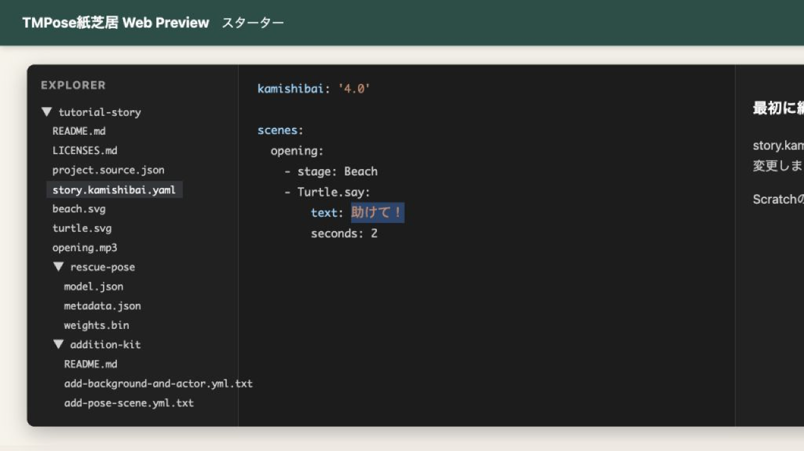

_スターターを開き、編集する台本と後で使う追加素材を確認します。画像は公開starterの配置を再現したfixtureです。_

## 3. TurboWarpで作品フォルダーを開く

1. [TurboWarp Editor](https://turbowarp.org/editor)を開く
2. 「ファイル」から`kamishibai-4.0.0-rc.5.sb3`を読み込む
3. 緑の旗を押す
4. タイトル画面を閉じ、メニューの「台本を開く」（以後「開く」）を押す
5. フォルダー選択画面で、スターターを展開した`tutorial-story`フォルダーを選ぶ
6. ブラウザーから確認を求められたら、このフォルダーの読み取りを許可する

<!-- screenshot:C-02 -->

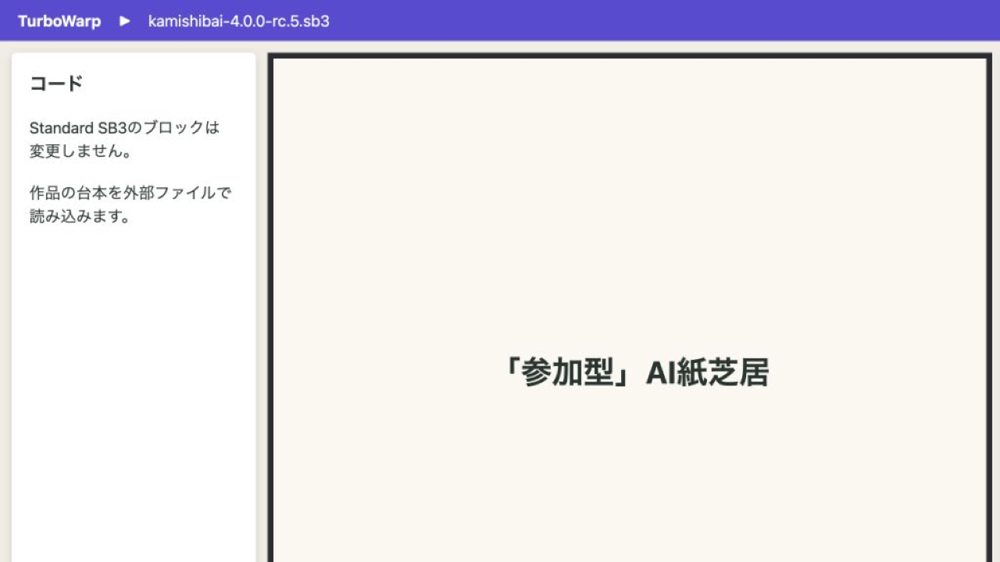

_Standard SB3をTurboWarp Editorで開き、緑の旗から作者用プレビューを開始します。_

「開く」はYAMLファイル一つではなく、`project.source.json`がある`tutorial-story`フォルダーを選びます。
選択したフォルダーの外は読み取りません。フォルダーの名前や端末内の絶対パスは、作成するSB3へ保存されません。

<!-- screenshot:C-03 -->

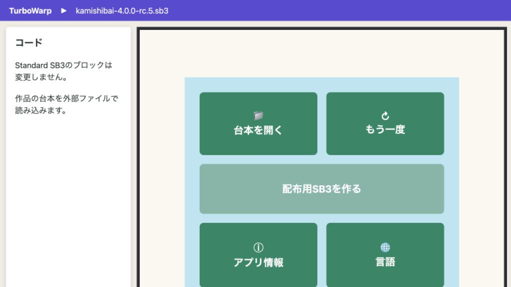

_メニューの「台本を開く」を押し、続いて表示される選択画面で`tutorial-story`フォルダーを選びます。_

台本と素材の読み取りが完了すると、作品が始まります。以後、選択したフォルダー内の台本と宣言済み素材が
監視されます。通常の保存は自動で検査され、問題がなければ安全な区切りで作品へ反映されます。

<!-- screenshot:C-04 -->

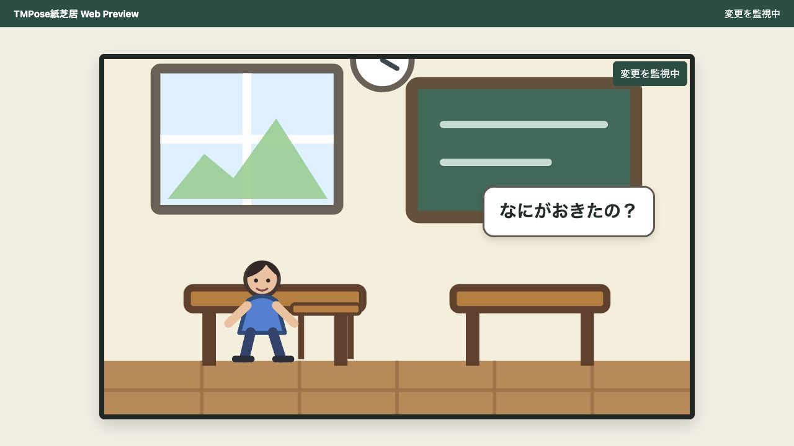

_作品の最初の画面と、変更を待つ状態を確認します。_

## 4. セリフを変更する

`story.kamishibai.yaml`をエディターで開きます。最初に編集する内容は次の形です。

```yaml
kamishibai: '4.0'

assets:
  Classroom:
    kind: backdrop
    file: classroom.svg
  StudentReady:
    kind: costume
    target: Student
    file: student-ready.svg

actors:
  Student: StudentReady

scenes:
  earthquake:
    - stage: Classroom
    - Student.say:
        text: なにがおきたの？
        seconds: 2
```

`text`の右側だけを次のように変更し、保存します。行の先頭にある空白と、`text`や`seconds`の位置は
変えません。

```yaml
- Student.say:
    text: 地震だ！
    seconds: 2
```

validな変更はプレビューへ自動で反映されます。更新状態ボタンから、今回の再開位置と次回以降の
再開方針を確認することもできます。

<!-- screenshot:C-05 -->

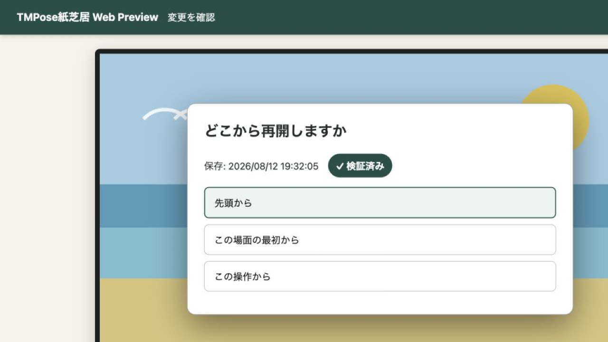

_更新状態ボタンを開いた場合は、今回の再開位置を選べます。画像はrelease fixtureの2段階契約を日本語で再現しています。_

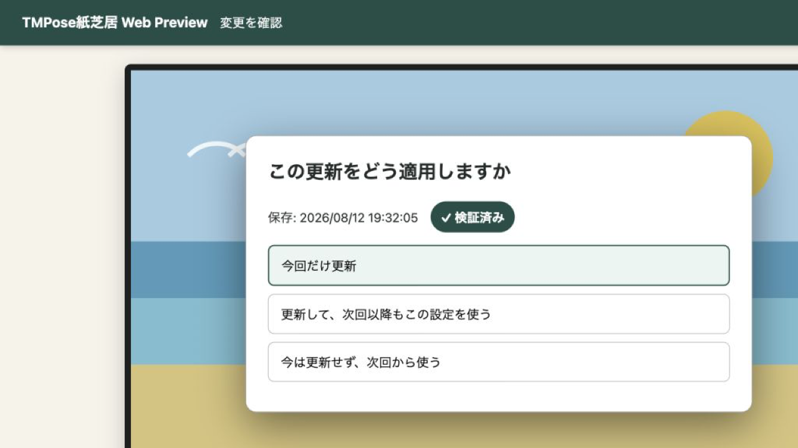

_次の画面では、選んだ再開位置を今回だけ使うか、次回以降も使うかを選べます。_

変更したセリフが「地震だ！」になったことを確認します。ここまでできれば、最初の編集は成功です。

<!-- screenshot:C-06 -->

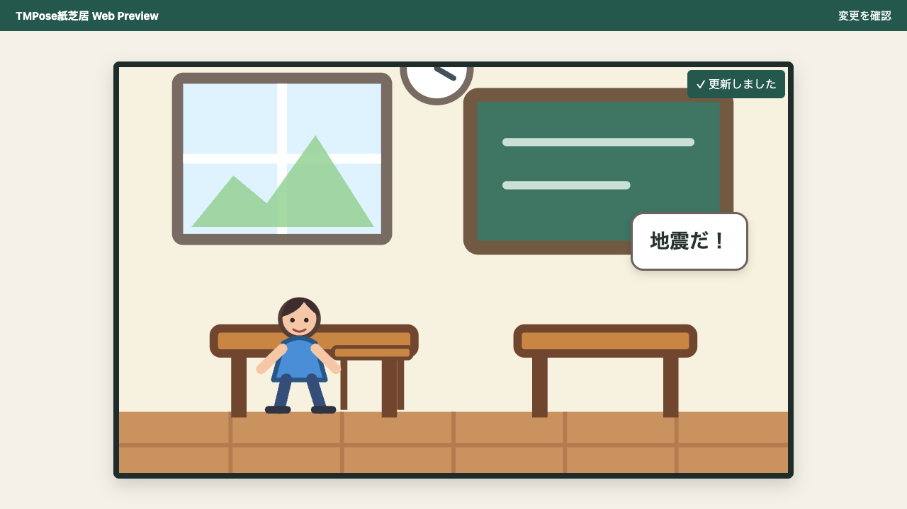

_台本で変更したセリフがプレビューへ反映されたことを確認します。画像は公開starterを再現したfixtureです。_

## 5. 背景、登場人物、場面を追加する

次は、`addition-kit`の追加素材を使います。一度に一種類ずつ追加します。

1. `addition-kit/earthquake-classroom.svg`と`addition-kit/protect-head.svg`を`tutorial-story`直下へコピーする
2. `addition-kit/add-background-and-actor.yml.txt`を開き、`assets`、`actors`、`scenes`を同じ形にする
3. `story.kamishibai.yaml`を保存する

追加後の主要部分は次の形です。

```yaml
assets:
  Classroom:
    kind: backdrop
    file: classroom.svg
  StudentReady:
    kind: costume
    target: Student
    file: student-ready.svg
  EarthquakeClassroom:
    kind: backdrop
    file: earthquake-classroom.svg
  ProtectHead:
    kind: costume
    target: Student
    file: protect-head.svg
```

```yaml
actors:
  Student: StudentReady
```

```yaml
scenes:
  earthquake:
    - stage: Classroom
    - Student.show:
        skin: StudentReady
        x: -90
        y: -55
        scale: 58
    - Student.say:
        text: 地震だ！
        seconds: 2
  instruction:
    - stage: EarthquakeClassroom
    - Student.say:
        text: 自分の身を守るため、丈夫な机の下に入り、両手で頭を守ろう！
        seconds: 4
```

<!-- screenshot:C-07 -->

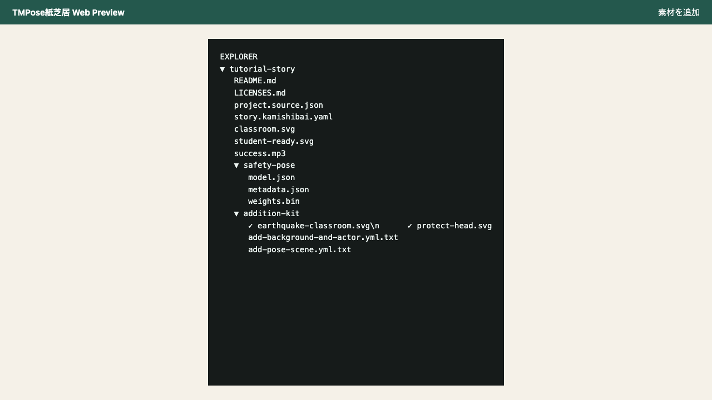

_追加素材の背景と登場人物の画像を作品フォルダー直下へコピーします。画像は公開starterの配置を再現したfixtureです。_

更新状態に、追加した背景と登場人物が反映されたことを確認します。

<!-- screenshot:C-08 -->

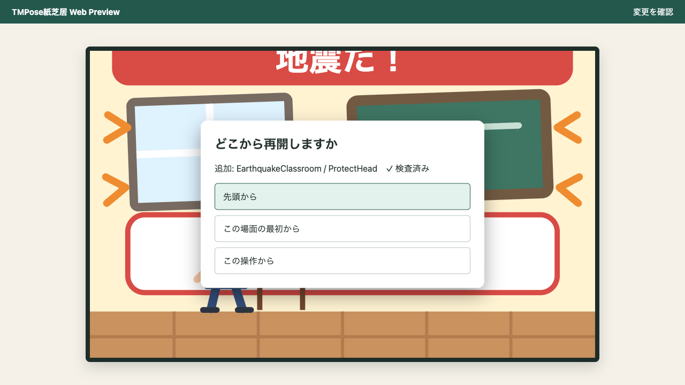

_追加した`EarthquakeClassroom`と`ProtectHead`を確認し、先頭から更新します。画像はasset差分契約を再現したfixtureです。_

先頭から再開し、新しい背景、登場人物、場面が表示されることを確認します。表示されない場合は、
ファイル名と台本の`file`が同じか確認します。

<!-- screenshot:C-09 -->

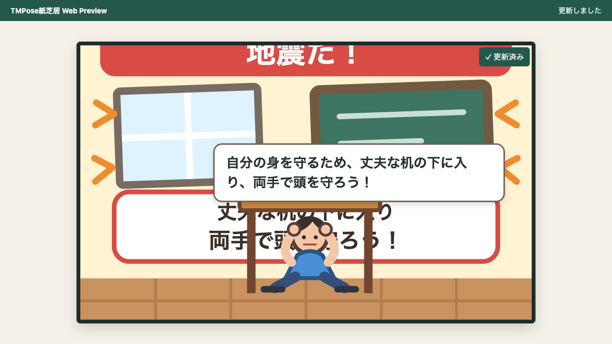

_揺れている教室、頭を守る見本、`instruction`場面が表示されたことを確認します。画像は公開addition kitを再現したfixtureです。_

## 6. ポーズ場面を追加する

スターターに同梱された`safety-pose`を使う場面を追加します。このモデルには`頭を守る`というポーズが
登録済みです。これは浦島太郎の最終場面で使う「ひざまずいて両手で頭を抱える」姿勢の学習済みクラスを、
同じ身体形状の「しゃがんで両手で頭を守る」見本へ転用したものです。
`addition-kit/add-pose-scene.yml.txt`を開き、`assets`、`actors`、`scenes`を見本と
同じ形にして保存します。追加するアセットと場面は次の部分です。

```yaml
assets:
  Classroom:
    kind: backdrop
    file: classroom.svg
  StudentReady:
    kind: costume
    target: Student
    file: student-ready.svg
  EarthquakeClassroom:
    kind: backdrop
    file: earthquake-classroom.svg
  ProtectHead:
    kind: costume
    target: Student
    file: protect-head.svg
  SafetyPose:
    kind: poseModel
    file: safety-pose
    loading: lazy
  SuccessSound:
    kind: sound
    file: success.mp3
```

```yaml
scenes:
  earthquake:
    - stage: Classroom
    - Student.show:
        skin: StudentReady
        x: -90
        y: -55
        scale: 58
    - Student.say:
        text: 地震だ！
        seconds: 2
  instruction:
    - stage: EarthquakeClassroom
    - Student.say:
        text: 自分の身を守るため、丈夫な机の下に入り、両手で頭を守ろう！
        seconds: 4
  protect:
    poseModel: SafetyPose
    actions:
      - stage: EarthquakeClassroom
      - Student.show:
          skin: ProtectHead
          x: 0
          y: -60
          scale: 65
      - Student.pose:
          steps:
            - pose: 頭を守る
              skin: ProtectHead
              sound: SuccessSound
  success:
    - stage: EarthquakeClassroom
    - Student.show:
        skin: ProtectHead
        x: 0
        y: -60
        scale: 65
    - Student.say:
        text: できた！ 頭を守れたね。揺れがおさまるまで、そのまま待とう。
        seconds: 5
    - wait: 1
```

このチュートリアルでは、ポーズモデルそのものは作りません。プレビューを先頭から更新し、カメラを
許可します。見本のポーズ、カメラ映像、進み具合が表示され、ポーズを保つと次へ進むことを確認します。

<!-- screenshot:C-10 -->

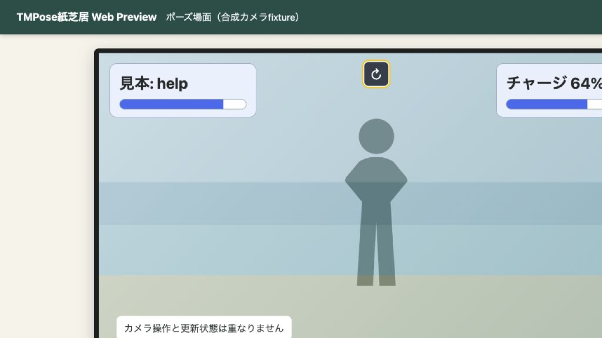

_カメラ操作を右上、更新状態を上中央へ分けた固定layoutを確認します。人物は合成fixtureです。_

## 7. 診断を読んで修正する

`story.kamishibai.yaml`の`Student.say`を一か所だけ`Student.sya`へ変え、保存します。保存した内容は
自動で検査されます。不正な台本へ切り替わらず、画面では最後に正常だった作品がそのまま動き、診断に
ファイル名、行、`K4-SCHEMA-UNKNOWN-KEY`、未知の命令であることが表示されます。

<!-- screenshot:C-11 -->

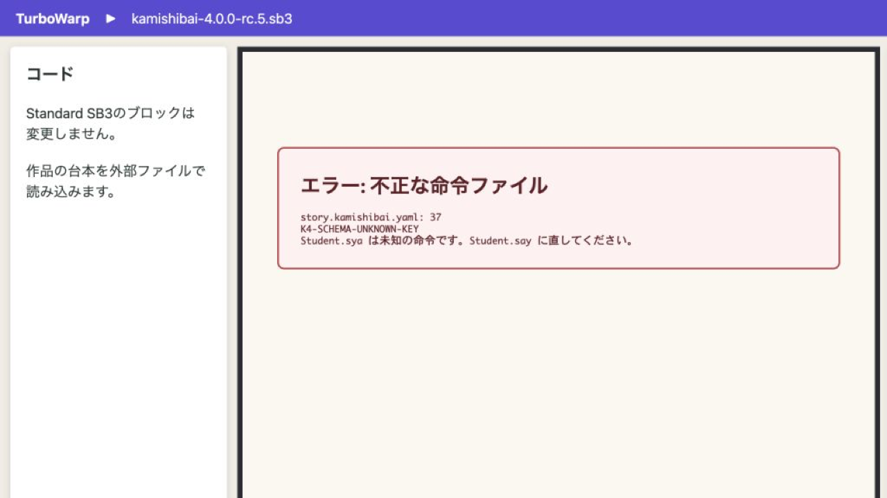

_不正な保存では最後に正常だった作品を保ち、診断のファイル名、行、コード、説明から台本を直します。_

`Student.sya`を`Student.say`へ直して保存します。自動検査に成功すると診断が消え、修正した台本へ
自動で復旧します。別の検証コマンドを実行する必要はありません。

## 8. メニューから配布用SB3を作る

作品のメニューへ戻り、「配布用SB3を作る」を押します。ボタンを押した時点で、紙芝居はフォルダーを
もう一度安定して読み取り、最新の台本、宣言済み素材、実行環境をまとめて最終検査します。

<!-- screenshot:C-14 -->

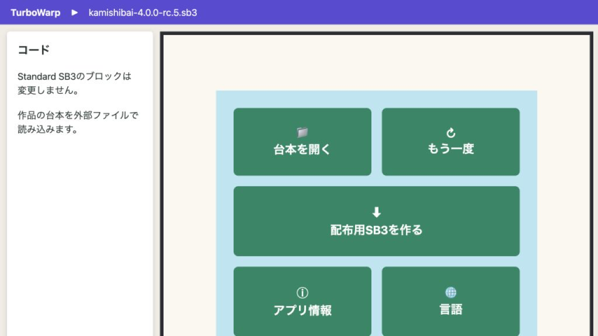

_台本と素材が正常で、フォルダーの読み取り権限があるときだけ、配布用SB3を作れます。_

保存先を選ぶ画面が表示された場合は、元のStandard SB3とは別の名前、たとえば
`tutorial-story-built.sb3`で保存します。保存先を選ぶ機能がない環境では、同じファイルがブラウザーの
ダウンロード先へ保存されます。元のStandard SB3と作品フォルダーは書き換えられません。

次の場合、古い正常版を黙って出力せず、ボタンが無効になるか診断を表示して停止します。

- 作品フォルダーをまだ開いていない
- 台本または素材が不正、見つからない、保存途中である
- 変更の読み取りや反映が進行中である
- フォルダーの読み取り権限が失われた
- 出力サイズやファイル数の上限を超えた

直前の保存が完了するまで待つか、表示されたファイルと行を修正してから、もう一度作成します。

## 9. 完成したSB3を再生する

新しいTurboWarp Editorのタブを開き、完成した`tutorial-story-built.sb3`を読み込んで緑の旗を押します。
元の作品フォルダーを移動するか閉じた状態でも、「開く」やフォルダー選択をせずに物語が始まります。

<!-- screenshot:C-12 -->

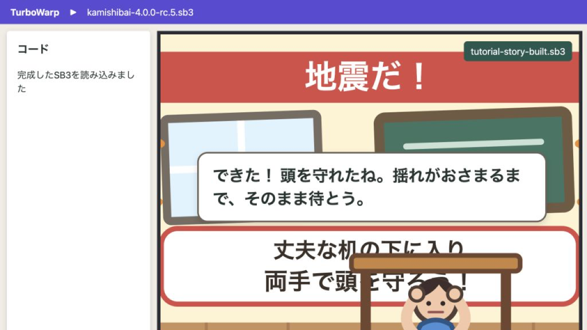

_完成したSB3をTurboWarpで開き、緑の旗から再生します。画像は操作位置を示すfixtureです。_

タイトルから開始し、「遊ぶ」と同じ順序で最後まで再生します。「地震だ！」という発端、教室の背景、
具体的な安全行動の案内、「頭を守る」ポーズの見本、認識後の達成メッセージがすべて表示されれば完成です。

## 完了チェック

- [ ] rc.3基準の公開スターターと`4.0.0-rc.5`の非埋め込みStandard SB3を用意した
- [ ] TurboWarp Editorで緑の旗を押し、「開く」から作品フォルダーを選んだ
- [ ] セリフを一行変更し、自動検査後にプレビューへ反映した
- [ ] 新しい背景、登場人物、場面を追加した
- [ ] 同梱されたポーズを使う場面を確認した
- [ ] 不正な保存でも最後に正常だった作品が続き、診断が表示された
- [ ] エラーが示した行を修正し、自動で復旧した
- [ ] メニューの「配布用SB3を作る」からSB3を保存した
- [ ] 新しいTurboWarp Editorで、作品フォルダーなしに完成したSB3を最後まで再生した
- [ ] Scratchブロックを追加しなかった

## 対応ブラウザーと権限

この入門手順は、File System Access APIのdirectory pickerを利用できるChromium系ブラウザーと、
HTTPSで提供されるTurboWarp Editorを対象にします。フォルダーは利用者が「開く」を押したときだけ選択し、
読み取り権限はブラウザーのsession中だけ保持します。再読み込み後に確認を求められた場合は、同じ
`tutorial-story`フォルダーを選び直してください。

FirefoxやSafariなどdirectory pickerを利用できない環境、組織のpolicyでlocal filesystem accessが
禁止された環境、埋め込みframe内、secure contextでないページでは、このブラウザー完結flowは使えません。
対応ブラウザーへ切り替えられない場合は、次の任意のCLI手順を使用します。

## 高度な利用者・CI向けのCLI（任意）

複数作品の一括処理、CIでの再現可能な検査、高度な配布profile、directory picker非対応環境では、
Node.jsとpnpmを用意して`preview-dsl4`、`validate-dsl4`、`build-dsl4`を利用できます。一般作者が
このチュートリアルを完了するためには不要です。正確な引数と上限は、使用する版で次を実行して確認します。

```bash
pnpm exec tmpose-kamishibai preview-dsl4 --help
pnpm exec tmpose-kamishibai validate-dsl4 --help
pnpm exec tmpose-kamishibai build-dsl4 --help
```

## このチュートリアルと台本作成ガイドの違い

ここで扱うのは、最初の作品を完成させるための一つの学習経路だけです。できあがるのは、変更した台本と
素材をまとめたSB3です。作者ガイドを最初から読み直す必要はありません。

すべての命令、複数の台本を組み合わせる方法、分岐、独自の命令など、作品を発展させるときに必要な内容は
[紙芝居DSL 4.0 台本作成ガイド](../dsl-author-guides/dsl-4.0-author-guide.md)または
[DSL 4.0 Schemaリファレンス](../dsl-author-guides/dsl-4.0-schema-reference.md)で調べます。

DSL 3.1／3.2のTXT／SB3操作や変換は扱いません。移行が必要な場合は、別の変換ガイドを使います。

## 初版で扱わないこと

- Teachable Machineでのポーズモデル作成
- DSL 3.1／3.2台本の変換
- 複雑な分岐と独自の命令
- Web公開やGitHub Pagesへの公開
- 紙芝居アプリ本体や機能拡張の開発

## 次に読む

- [紙芝居DSL 4.0 台本作成ガイド](../dsl-author-guides/dsl-4.0-author-guide.md)
- [DSL 4.0 Schemaリファレンス](../dsl-author-guides/dsl-4.0-schema-reference.md)
- DSL 3.1／3.2からの移行は[変換ガイド](../dsl-author-guides/dsl-3.2-to-4.0-conversion-guide.md)を使う
