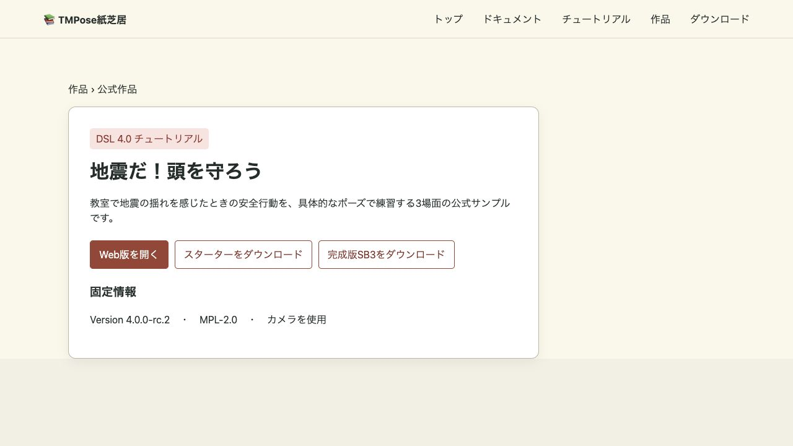
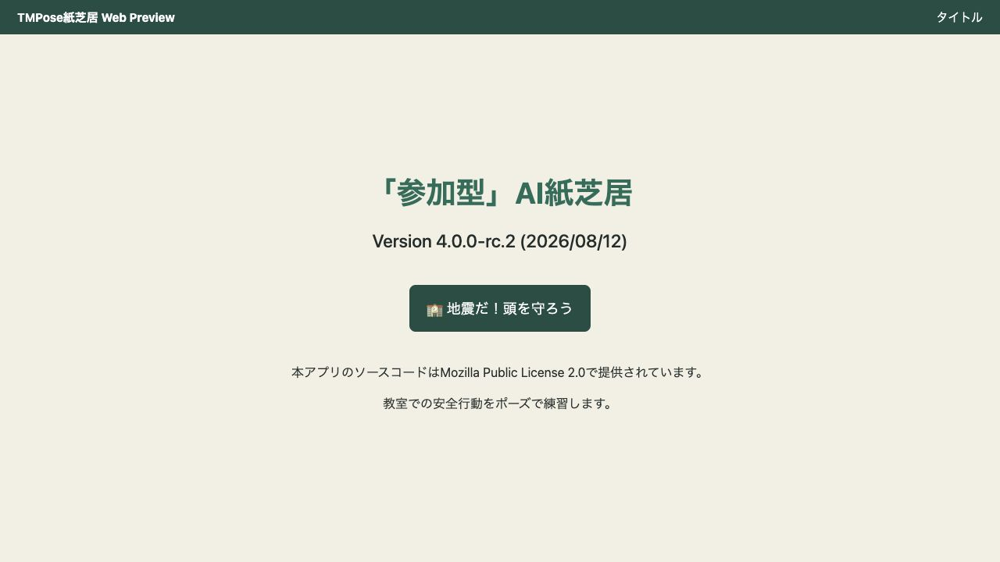
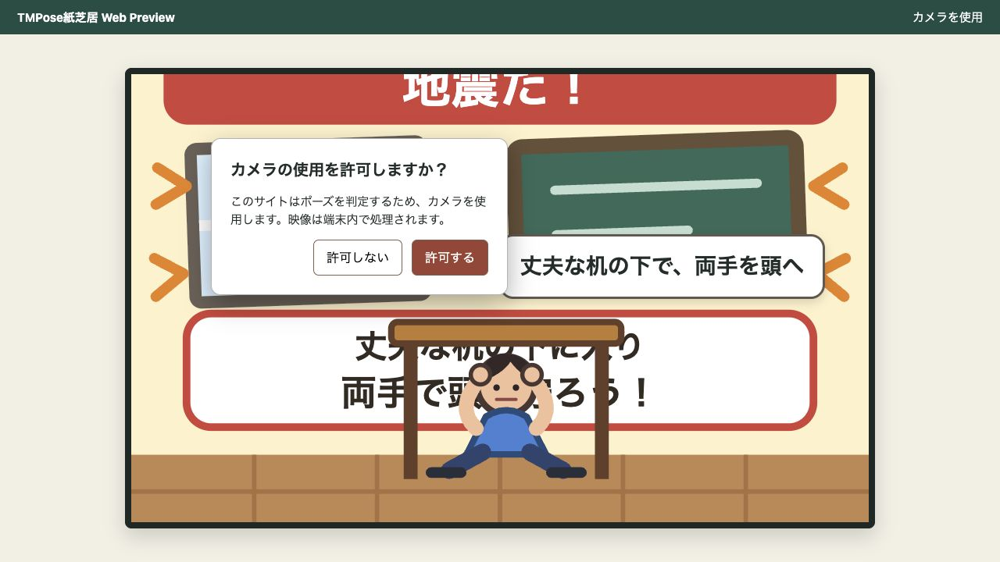
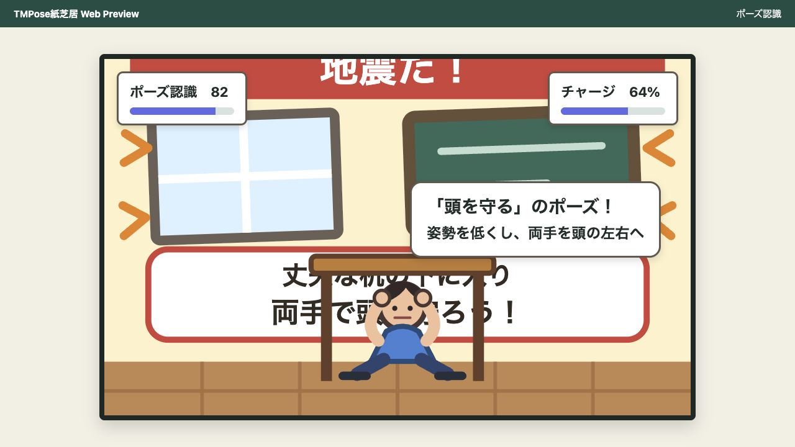
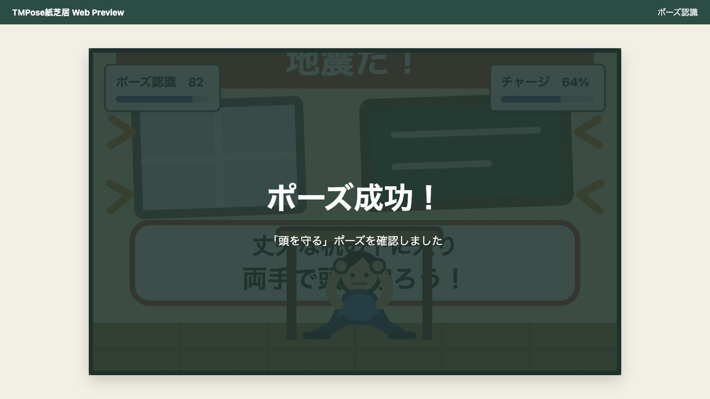
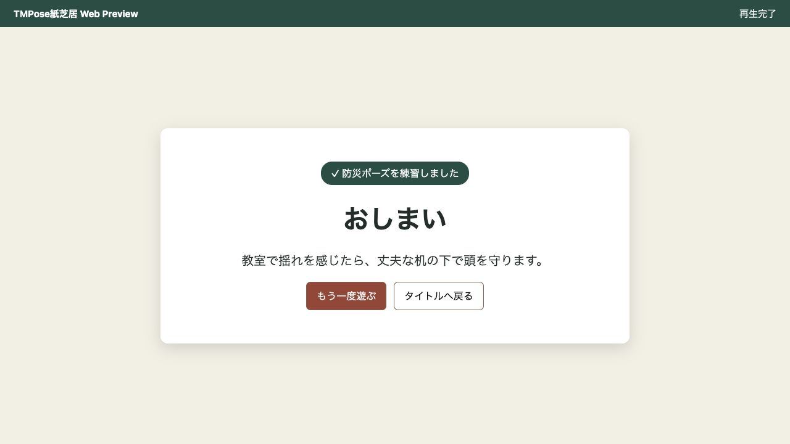

# 紙芝居を遊ぶ

Copyright © 2026 Hiroya Kubo. この文書は[CC BY-SA 4.0](https://creativecommons.org/licenses/by-sa/4.0/)で提供します。

対象バージョン: `4.0.0-rc.2`（公開プレリリース）\
対象: 初めてTMPose紙芝居を再生する人\
想定時間: 10〜15分

入口: [紙芝居チュートリアル](index.md)

このチュートリアルでは、Webブラウザーでポーズを使うサンプル作品を開き、カメラの前でポーズを取り、
物語を最後まで進めます。台本やプログラムの知識は必要ありません。カメラを使わない場合は、公開作品の
説明から、キーや画面のタッチで参加できる作品を選んでください。

サンプルの舞台は教室です。「地震だ！」という合図のあと、自分の身を守るために丈夫な机の下へ入り、
両手で頭を守るポーズを取ります。画面の見本と具体的な指示を見て動きます。

## 最初にやること

1. サンプル作品を開く
2. タイトル画面で紙芝居を始める
3. ポーズを求められたときだけカメラを許可する
4. 画面の見本に合わせてポーズを取る
5. 物語を最後まで進める

台本やコマンドを入力する必要はありません。画面の案内に沿って進めれば完了します。

## 用意するもの

- 新しいWebブラウザーを使えるパソコンまたはタブレット
- カメラ
- カメラの前で全身を映せる少しの空間
- 明るく、他の人や個人情報が映り込まない場所

## このチュートリアルのゴール

- サンプルサイトからWeb版の紙芝居を開ける
- カメラ利用を許可し、画面へ自分の姿を収められる
- ポーズ認識の案内と進捗を見ながらポーズを取れる
- 終了後にもう一度遊ぶか、タイトルへ戻れる
- カメラやポーズ認識が進まないときに基本項目を確認できる

## 1. サンプル作品を選ぶ

[チュートリアル用サンプル作品](https://kubohiroya.github.io/tmpose-kamishibai-samples/stories/tutorial/)を開き、
「Web版を開く」を押します。作品の説明で、対象バージョンが`4.0.0-rc.2`であることと、カメラを
使うことを確認してから開きます。

<!-- screenshot:P-01 -->

_公開サンプルの詳細ページから「Web版を開く」を選びます。_

Web版へ直接進む場合は、
[地震だ！頭を守ろう](https://kubohiroya.github.io/tmpose-kamishibai-samples/stories/tutorial/web-4.0/)を開きます。

## 2. 紙芝居を開始する

Web版を開くと、最初に黒い読み込み画面が表示され、その後にバージョンとライセンスの画面が
表示されます。`Version 4.0.0-rc.2`を確認し、右上の「閉じる」を押すと作品が始まります。

<!-- screenshot:P-02 -->

_バージョンと利用条件を確認し、右上の「閉じる」を押します。_

黒い画面と進捗バーが表示されている間は、画面を閉じずに待ちます。読み込みが長く続く場合は、
ネットワーク接続を確認してページを再読み込みします。

<!-- screenshot:P-03 -->

_公開Web版が台本と素材を読み込むまで待ちます。_

## 3. カメラを許可する

ポーズを使う場面になると、Webブラウザーがカメラ利用の許可を求めます。「許可」を選びます。

<!-- screenshot:P-04 -->

_カメラ許可の操作例です。実際の表示はブラウザーによって異なります。画像は個人情報を含まない説明用fixtureです。_

許可しなかった場合や以前の選択が残っている場合は、アドレスバー付近のサイト設定からカメラを
許可し、ページを再読み込みします。設定名はブラウザーによって異なります。

## 4. ポーズを取る

画面に「丈夫な机の下に入り、両手で頭を守ろう！」と表示されたら、周囲にぶつかる物がないことを
確かめてから、見本のように姿勢を低くし、両手を頭の左右へ当てます。この作品では、教室にある丈夫な
机の下で頭を守る動作を練習します。画面では次を確認できます。

- 現在求められているポーズ
- カメラに映っている自分の姿
- 見本へどのくらい近づいているか
- ポーズを保った結果として進むチャージ
- 認識待ち、チャージ中、完了の状態

<!-- screenshot:P-05 -->

_「頭を守る」という具体的な案内と見本に合わせ、ポーズ認識度とチャージを確認します。画像の人物は合成fixtureです。_

ポーズが成立すると、音や表示が変わり、作品の設定に応じて次の場面へ進みます。

<!-- screenshot:P-06 -->

_ポーズが成立すると成功表示へ変わり、物語が進みます。画像は合成fixtureです。_

この練習は、机のある教室という場面を表したものです。実際には、落下物や倒れそうな家具から離れるなど、
周囲の状況に応じて安全を確保してください。表現は
[気象庁](https://www.jma.go.jp/jma/kishou/know/faq/faq7.html)と
[消防庁](https://www.fdma.go.jp/relocation/bousai_manual/occ/occurrence111.html)の案内を参考にしています。

## 5. 最後まで進める

画面のセリフや案内に従い、最後の場面まで進めます。終了画面では、もう一度遊ぶ操作とタイトルへ
戻る操作を区別して説明します。

<!-- screenshot:P-07 -->

_終了後は「もう一度遊ぶ」か「タイトルへ戻る」を選びます。画像は操作位置を示すfixtureです。_

## 6. うまく進まないとき

次を順番に確認します。

| 状態                   | 確認すること                                                    |
| ---------------------- | --------------------------------------------------------------- |
| カメラ映像が出ない     | WebブラウザーとOSのカメラ許可、他のアプリのカメラ利用を確認する |
| 体が画面へ収まらない   | カメラから離れ、頭から足まで入る位置へ移動する                  |
| 認識度が上がらない     | 明るさ、背景、服と背景の色、複数人の映り込みを確認する          |
| チャージが途中で戻る   | ポーズを大きく作り、同じ姿勢を少し長く保つ                      |
| 想定と左右が逆に見える | 左右反転の設定が表示される場合は、設定を切り替える              |
| 別のカメラを使いたい   | カメラ選択が表示される場合は、接続中のカメラを選び直す          |

<!-- capture-note: カメラ選択と左右反転が公開版へ採用された場合は、この位置へ操作画像を置く。 -->

<!-- screenshot:P-08 -->

## 完了チェック

- [ ] サンプルのWeb版を開けた
- [ ] カメラ映像へ全身を映せた
- [ ] 案内されたポーズを成立させた
- [ ] 紙芝居を最後まで進めた
- [ ] 再実行またはタイトル復帰の方法を確認した

## 次に読む

自分で台本を変更する場合は[紙芝居を作る](create.md)へ進みます。台本のすべての項目や命令を調べる場合は、
[紙芝居DSL 4.0 台本作成ガイド](../dsl-author-guides/dsl-4.0-author-guide.md)を参照します。
