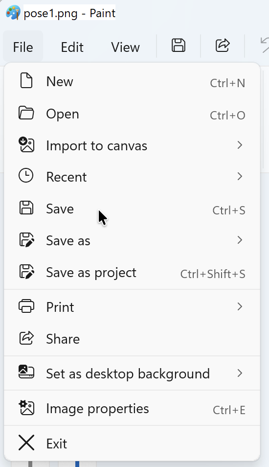
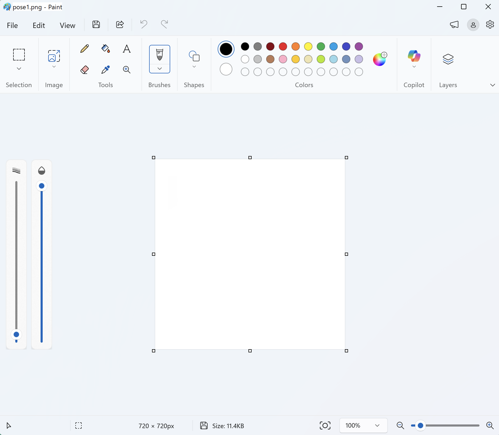
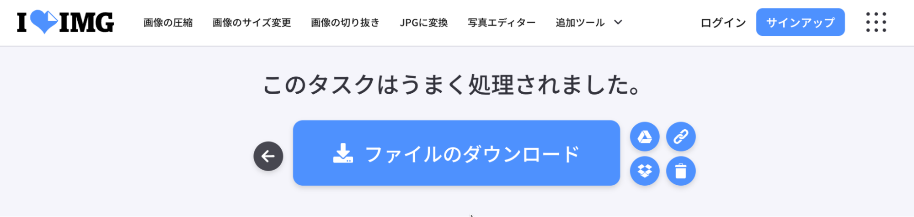
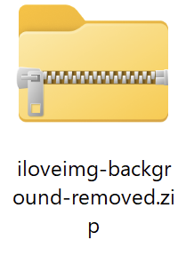
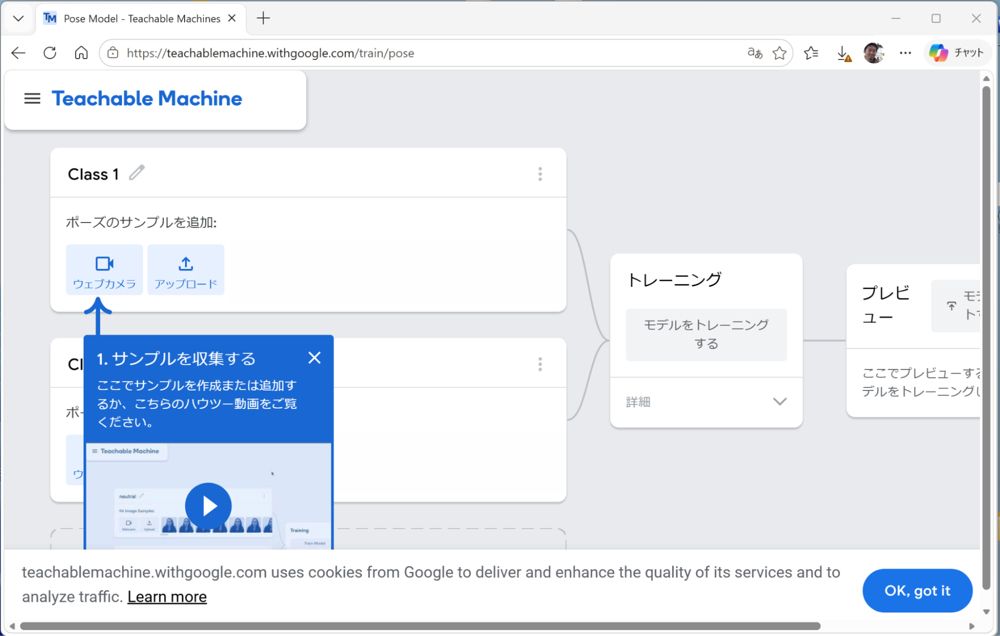
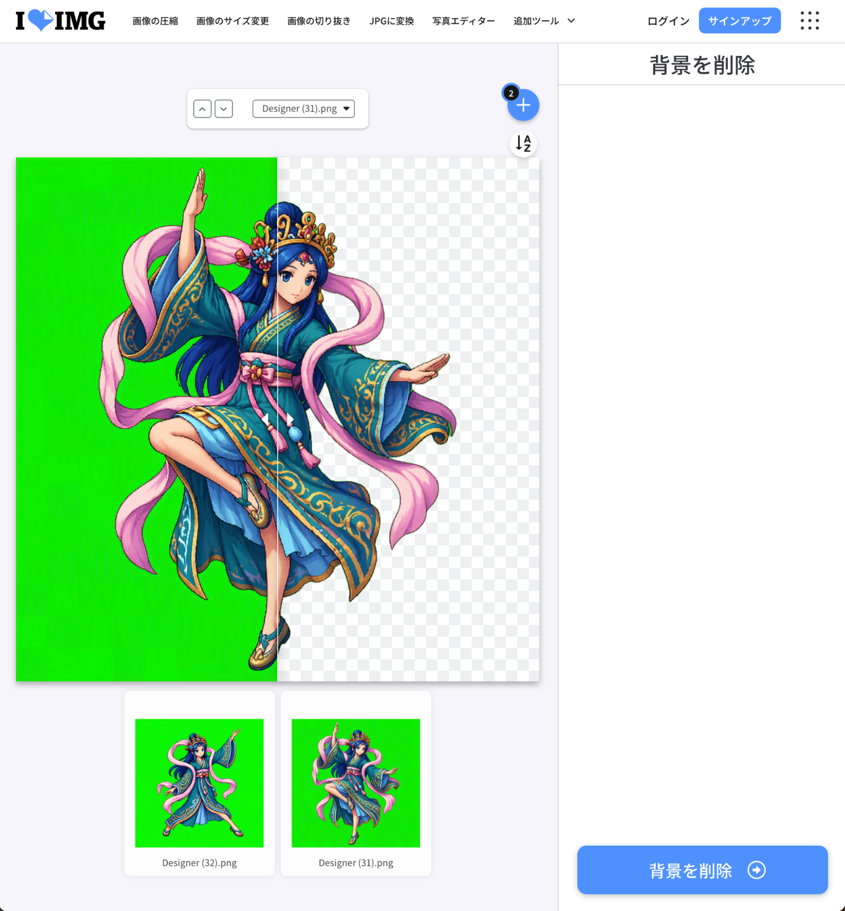

## 2.4 背景を透明化する

AI紙芝居アプリに登場させるキャラクターは、背景と重ね合わせて表示できるように、「背景を透明化」しておく必要があります。ここでは、そのためのオンラインツールとして、「I♡IMG」というWebサイトの「背景を削除」ツールを利用します。

### 2.4.1 背景を透明化するためのツールを開く

「背景を削除」ツールを開いてください。

[https://www.iloveimg.com/ja/remove-background](https://www.iloveimg.com/ja/remove-background)

{style="width: 400.50px;"}

### 2.4.2 背景を透明化したい画像を選択する

画面中央の「画像を選択」ボタンをクリックしてください。

ファイル選択ダイアログが開いたら、パソコンの「ダウンロード」フォルダを選び、背景緑色のポーズの画像を選択してください。一度に複数選択できます。

### 2.4.3 背景を透明化する

ツールに画像が読み込まれ、次のような画面が表示されます。ここで、画像の中の背景部分を見つけ出すためにも、AIが使われています。

{style="width: 428.50px;"}

読み込まれた画像に含まれる緑色の部分が背景であるとして自動的に認識され、透明化対象にしてよいかどうかの確認をすることができます。

【服や髪の毛の縁の部分に緑色が少しだけ残ってしまう場合がありますが、無料版のソフトなので、ある程度は仕方がないと考えましょう。もしどうしても気になるならば「ペイント」アプリなどで後で修正することもできます。】

状況を確認し、「背景を削除」ボタンをクリックしてください。

{style="width: 321.50px;"}

しばらくすると、「このタスクはうまく処理されました。」と表示されます。そこで次には、「ファイルのダウンロード」ボタンをクリックします。

{style="width: 325.50px;"}

ここでファイルのダウンロードが正しく実行されたかどうかは、次の2.4.4で確認します。

### 2.4.4 背景を透明化した画像のファイル名を付け直す

デスクトップ下部中央付近の「エクスプローラー」をクリックし、エクスプローラー画面左側の「クイックアクセス」から「ダウンロード」フォルダを開いてください。

「ダウンロード」フォルダの中で、「iloveimg-background-removed.zip」という名前で保存されているファイルを探してください。そのファイルのアイコンを右クリックしてメニューを表示し、「すべて展開...」をクリックしてください。

{style="width: 103.80px;"}{style="width: 222.20px;"}

「圧縮（ZIP形式）フォルダーの展開」という画面が開くので、「展開」ボタンをクリックします。
{style="width: 201.50px;"}
