# 0. この教材と体験会について

Copyright © 2026 Hiroya Kubo. All rights reserved.

## 0.1 この教材の一次配布元

AI紙芝居アプリおよびこの教材は、久保裕也（千葉商科大学 総合政策学部 教授）による研究プロジェクトの成果物です。
最新版を、[https://kubohiroya.github.io/tmpose-kamishibai/](https://kubohiroya.github.io/tmpose-kamishibai/)で配布します。
AI紙芝居アプリも、ここから遊べます。

## 0.2 この体験会で学ぶこと

この体験会では、

* 画像づくりAI
* ポーズ認識AI
* 紙芝居プログラミングアプリ

といった技術を組み合わせて、

**「AI技術を応用して、紙芝居の物語の中に参加する仕組み」**

を作ります。楽しんでください！

## 0.3 この体験会が想定する参加者

この体験会は、「小学生とその保護者のペア」で参加していただくことを想定しています。

* AI利用経験は問いません。
* プログラミング経験（Scratchなど）は問いません。

なお、念のため、次のことを確認させてください。

* マウスやキーボードの操作ができますか？
* EdgeなどのWebブラウザの操作ができますか？
* Windowsにおけるフォルダやファイルの概念を理解していますか？

わからないことがあっても、体験会を通じてスタッフがサポートしますので、安心してください。

# 1. はじめに

## 1.1 準備

### 1.1.1 教室内の座席に座るとき

受付で配布された名札には、\[1\] 〜 \[15\] の番号が書かれています。
あなたの番号は何番ですか？ 下の図の中で、あなたの番号と同じ番号の「吹き出し」がついている座席を探してください。

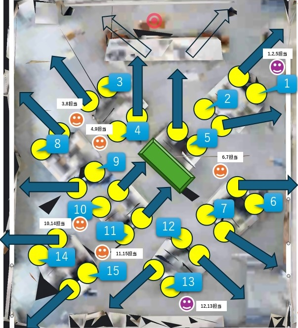{alt="教室内の座席配置図" style="width: 601.70px;"}

教室内の、配置図の丸印{alt="黄色い丸印" style="width: 18.72px;"}{alt="黄色い丸印" style="width: 18.72px;"}で指定された座席に、小学生と保護者のペアで着席してください。図の中の「吹き出し＋番号」{alt="番号入りの吹き出し" style="width: 38.33px;"}と、自分の名札の番号が同じであることを確認してください。

* 保護者の方：「吹き出し＋番号」{alt="黄色い丸印" style="width: 18.72px;"}{alt="番号入りの吹き出し" style="width: 35.50px;"}がついている席に座ってください（パソコンの画面の電源は「オフ」になっています）。

* 小学生の方：「矢印」{alt="黄色い丸印" style="width: 18.72px;"}{alt="右向きの矢印" style="width: 44.75px;"}がついている席に座ってください（パソコンの画面の電源は「オン」になっています）。

小学生の方が座る席の液晶ディスプレイは、あらかじめ、
図中の「矢印」の方向に向けて設置されています。
講師からの指示があるまで、そのままの方向にしておいてください。

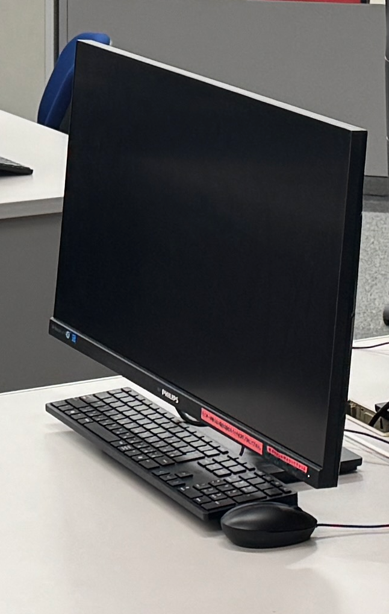{alt="座席に設置された液晶ディスプレイ" style="height: 180px;"}

この体験会では、基本的に、小学生の方の席のパソコン・液晶ディスプレイ・カメラを、小学生の方と保護者の方のペアで使用していただきます。
保護者の方の席のパソコンは、トラブルが発生した場合の予備として、必要なときだけ使用します。

### 1.1.2 配布資料

親子ペアごとに、次のような資料一式が机の上に置かれていることを確認してください。

* 教材：AIを使って「紙芝居の物語に参加する仕組み」を作ろう！
* A4メモ用紙（白紙）× 4枚
* そのほか

### 1.1.3 カメラを使用するとき

液晶ディスプレイの上に、カメラが載せられています。

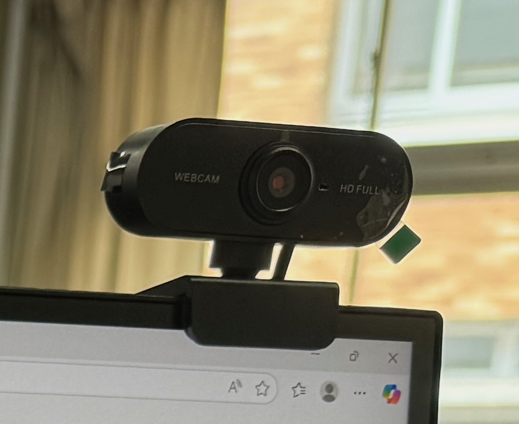{alt="液晶ディスプレイ上部に設置されたカメラ" style="height: 150px;"}

この体験会の途中で、講師から「カメラを使用してください」と指示される場合があります。
そのときには、小学生の方の席の液晶ディスプレイを、台座から回転させて、
図中の「矢印」{alt="右向きの矢印" style="width: 64.58px;"}の方向に向けてください。
この液晶ディスプレイは、台座の円形部分が回転するので、簡単に向きを変えられます。
また必要に応じて、液晶ディスプレイの上の
カメラの向きや角度を微調整してください。

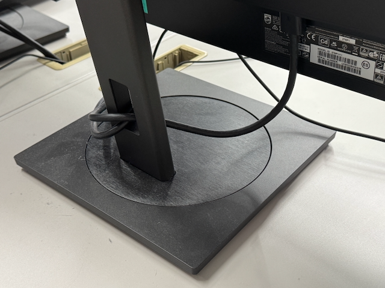{alt="液晶ディスプレイを撮影方向へ回転させる様子" style="height: 200px;"}

図中の「矢印」は、それぞれの撮影方向がなるべく交差しないように、基本的には中央から外側へ向けて放射状に配置されています。
10番と11番の席については、教室中央に立てられた緑色背景スタンドに向けて配置されています。

体験会に参加している他の人が、カメラの撮影内容に映り込まないように、カメラの向きや録画のタイミングについて、親子ペア同士で声を掛け合い、お互いに配慮しながら取り組んでください。

### 1.1.4 ポーズを取るとき

画面上部に「ポーズをとろう」という表示が出た場合には、
親子ペアの一方（例：小学生）は、物語のキャラクターのポーズに合わせて、カメラの前でポーズを取ってください。
親子ペアのもう一方（例：保護者）は、必要に応じてパソコンを操作してください。

ポーズを取るときには、周囲の人や物にぶつからないようにし、足元にも注意して転ばないようにしてください。

### 1.1.5 カメラの使用を終了するとき

この体験会の途中で、講師から「カメラの使用を終了してください」
と指示される場合があります。
そのときには、液晶ディスプレイが通常の向きになるように回転させて、
椅子に座って画面を見て操作をしやすいようにしてください。

## 1.2 「参加型」AI紙芝居をプレイしてみよう

「参加型」AI紙芝居アプリを、「浦島太郎」の物語を組み込んだ状態で開きましょう。

https://kubohiroya.github.io/tmpose-kamishibai-samples/stories/urashima/web/

{alt="浦島太郎のサンプルを開くリンク" style="width: 209.50px;"}

このURLは、パソコンでもスマートフォンでも開けるようになっていますが、
この体験会では、教室内のパソコンを使いましょう。

次のような画面が開いたことを確認したら、画面をマウスでクリックしてください。

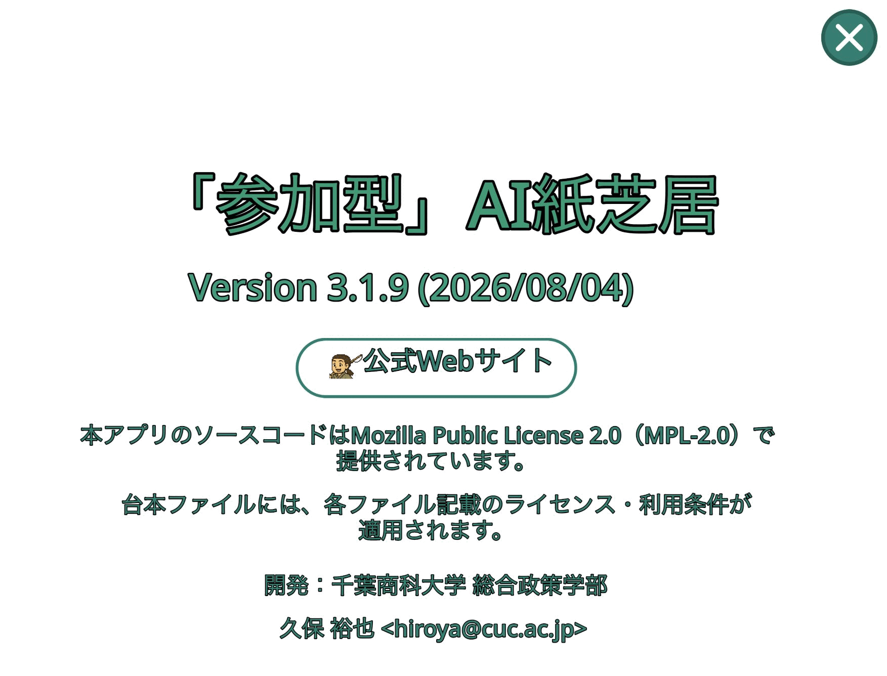{alt="AI紙芝居アプリのタイトル画面" style="width: 360.46px;"}

物語のシーンの進行に応じて、カメラがオンになり、ポーズを取るように指示される場合があります。
そのときには、親子で交代しながらカメラの前に立ち、
物語のキャラクターのポーズに合わせてカメラの前でポーズを取ってください。

> ⭐️ このときにカメラが撮影する映像は、ポーズの識別のためだけに用いられるため、パソコン上にもネットワーク上にも、どこにも保存されません。

{alt="カメラの前でポーズを取ってAI紙芝居を進める様子" style="width: 360.46px;"}

正しいポーズを取ると、左上の「ポーズ認識」のバーが「100」に近づきます。
正しいポーズをそのまま続けていると、右上の「チャージ」のバーが増えていきます。
「チャージ」が「100」になったら成功となり、物語が次に進みます。

## 1.3 「参加型」AI紙芝居を作ろう

このAI紙芝居アプリは、さまざまな物語を作って、読み込んで、遊べるようになっています。
いま遊んでもらったアプリは、「浦島太郎」でした。 この台本では、浦島太郎が竜宮城に到着したときに、
あなたが浦島太郎になってダンスをするようになっていましたね。

この体験会では、物語の台本を書き換えるなどして、あなたが乙姫様になってダンスをする内容に変えてみましょう。
これから、乙姫様にどんなダンスポーズをさせるかを考え、棒人間の絵を描き、それをもとに乙姫様の絵をAIに描かせてみます。
さらに、ダンスポーズを認識できるようにAIをトレーニングします。
最後に、紙芝居の台本を更新し、AIによる成果物をとりまとめて、作品全体を遊べるようにします。

## 1.4 この作品は、どんな技術でできているの？

{alt="AI紙芝居を構成する技術の説明図" style="width: 567.00px;"}

このページも生成AI(ChatGPT Pro GPT-5.5)を活用して作成しました。AIは教材づくりにも役立ちます。

# 2. AIに乙姫様を描いてもらおう

それではさっそく、乙姫様にどのようなダンスを踊らせたいかを考えましょう。
あなたは、どんな乙姫様にどんなダンスを踊らせたいですか？　あなた自身は、どんなダンスをしたいですか？

## 2.1 ダンスのポーズを考えて棒人間の絵で下書きする

そのダンスの「決めポーズ」を、最低2つ、最大4つ、親子で考えてください。

* それぞれのポーズが、他のポーズとはっきり違うものになるようにしてください。
* ポーズごとに左右の腕の角度や肘の曲げ伸ばしを変え、違いがはっきりわかるようにしてください。
* 上半身だけでポーズの見分けがつくようにしてください（この体験会のカメラには下半身が映りにくいため、下半身だけが異なるポーズにはしないでください）。

### 2.1.1 手書きで棒人間の絵を描く

親子で相談・分担しながら、その「決めポーズ」の絵を、「棒人間」として描いてください。

* それぞれのポーズの絵を、配布されているメモ用紙に筆記用具を用いて描いてください。
* 細部をリアルに描く必要はありません。また、絵の上手下手は関係ありません。
* 大事なことは、上半身の大きな動きがわかるように描くことです。
* 下半身は認識しにくいため、下半身だけが異なるポーズにはしないでください。
* うまく描けなかったら、別の紙に描き直しをしてもかまいません。
* 最低2つ、最大4つの「棒人間」を描けたら、次の作業に進みます。

「棒人間」の絵を描くときには、たとえば次のような感じに描けば大丈夫です。

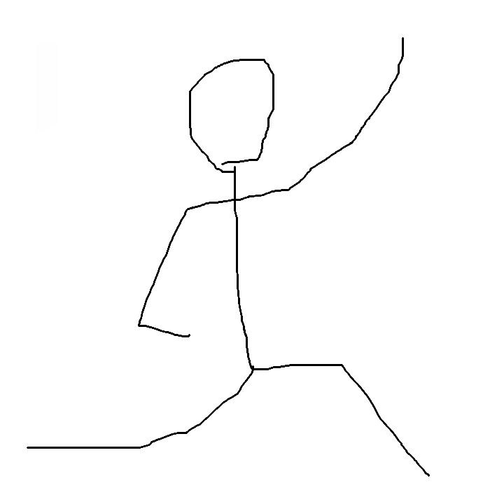{alt="棒人間で描いた決めポーズの例" style="width: 180px;"}

## 2.2 パソコンで棒人間の絵を描く

### 2.2.1 「配布資料」フォルダを開く

パソコンのデスクトップに、この体験会の「配布資料」として、
「20260801」（今日の日付：2026年8月1日）という名前のフォルダのアイコンが配置されています。
これから、このフォルダを「配布資料」フォルダと呼ぶことにします。

このアイコンをダブルクリックすると、その内容が表示されます。
体験会で主に使う、次の4つのフォルダがあります。

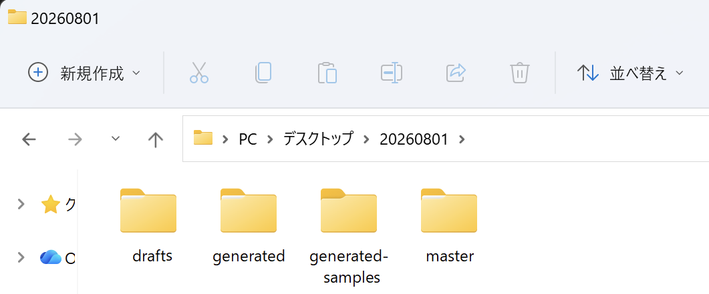{alt="配布資料フォルダ内の体験会で主に使う4つのフォルダ" style="width: 400px;"}

| フォルダ名        | 内容の説明 |
|:------------------| :---- |
| drafts            | 白紙の画像が4つ入っています。アプリで編集して「棒人間」の画像として保存します。これらは、生成AIで画像を生成するときの素材として使います。 |
| generated         | 体験会の開始時には、何も入っていません。体験会を通じて生成AIで作成した画像を保存します。 |
| generated-samples | 乙姫様のダンスポーズのサンプル画像があらかじめ入っています。体験会中に生成AIがうまく動作しない場合に使います。 |
| master            | 浦島太郎や乙姫様の立ち絵の画像です。これらは、生成AIで画像を生成するときの素材として使います。 |

フォルダの中を表示するときには、用途に応じて、表示のしかたを選べます。
フォルダ画面上部のツールバーの「表示」ボタンをクリックすると、
「特大アイコン」「大アイコン」「中アイコン」「小アイコン」「一覧」「詳細」などから
フォルダの内容の表示方法の切り替えができます。
ここでは「中アイコン」と「詳細」の2つを試して、表示方法を切り替えられるように練習してください。

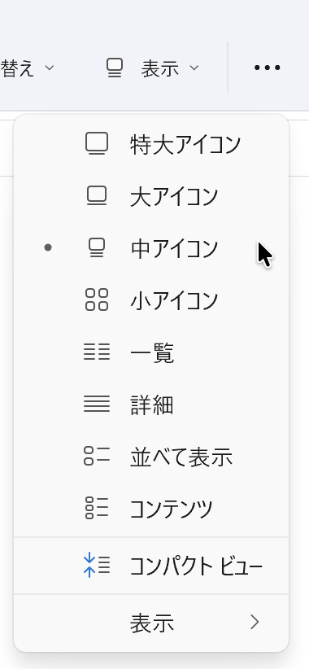{alt="エクスプローラーの表示メニュー" style="width: 140px;"}

### 2.2.2 「drafts」フォルダを開く

「配布資料」フォルダ内の、「drafts」フォルダをダブルクリックして、その内容を表示してください。
「pose1.png」「pose2.png」「pose3.png」「pose4.png」という4つのファイルが並んでいます。
これらを「棒人間記入用ファイル」として用いることとします。

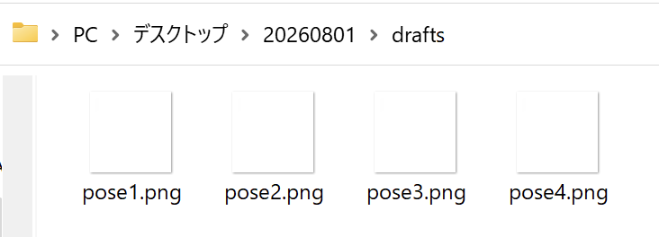{alt="draftsフォルダ内の4つの画像ファイル" style="width: 250px;"}

### 2.2.3 「ペイント」アプリで開いて「棒人間」の絵を描く

「drafts」フォルダの中の、棒人間記入用ファイルのうち、「pose1.png」のファイルの上で「右クリック」し、
表示されたメニューの中から「ペイントで編集する」をクリックする、あるいは「プログラムから開く」を選択して「ペイント」をクリックしてください。

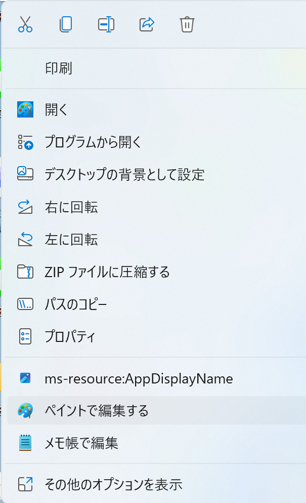{alt="画像ファイルをペイントで編集するメニュー" style="width: 200px;"}

「ペイント」アプリが起動し、この「pose1.png」ファイルが読み込まれます。

「pose1.png」は、編集前は白紙です。
ここに、さきほどメモ用紙に描いておいた「棒人間」の絵を、白黒の簡単な絵で描いてください。

* 右下の虫眼鏡の＋／－アイコン：キャンバスを拡大・縮小できる。
* 「ブラシ」アイコンと「消しゴム」アイコン：線を描いたり消したりできる。
* 画面左端のスライドコントローラー：ブラシや消しゴムの太さを変える。

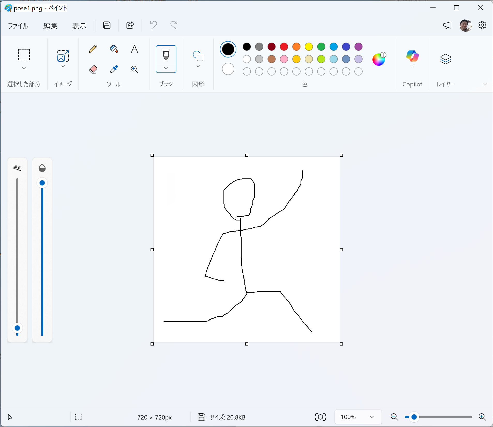{alt="ペイントで棒人間を描く画面" style="width: 599.15px;"}

### 2.2.4 棒人間の絵を保存する

棒人間の絵が描けたら、画面上部のツールバーにある保存アイコン（フロッピーディスクのアイコン）をクリックしてください。
これにより、この画面で描いた内容が「pose1.png」ファイルに保存されます。

{alt="ペイントの保存アイコン" style="width: 400.00px;"}

### 2.2.5 棒人間の絵をもっと描く

上記の手順を、「drafts」フォルダ内の「pose2.png」に対しても実施し、2枚目の棒人間の絵を描いて保存してください。
親子で交代しながら描くことをお勧めします。

3つ以上のポーズを作る場合は、「pose3.png」「pose4.png」に対しても同じ操作を行い、必要な数だけ棒人間の画像を描いて保存してください。

## 2.3 生成AIでポーズの絵を描く

ここからは、乙姫様がダンスのポーズをする絵を描きましょう。
そのために、ここでは「生成AI」と呼ばれる技術を用いて、
素材となる画像と文章による指示を与え、目的とする画像を生成します。

### 2.3.1 生成AIの画面を開く

この体験会では、生成AIの一種であるMicrosoftの「M365 Copilot」を使うこととします。

* M365 Copilotは、Microsoftの「Word」「Excel」「PowerPoint」などのアプリの中で使えるAI機能ですが、
ここでは、WebブラウザのEdgeを使って、M365 Copilotの画面を開きます。
* M365 Copilotは、Microsoftのアカウントでサインインして使う必要がありますが、
この体験会では、あらかじめサインイン済みの状態のEdgeのタブを用意しています。
* M365 Copilotは、利用対象年齢が13歳以上となっているため、小学生が使うことは認められていません。
この体験会では、M365 Copilotの操作は、保護者の方が行ってください。

Windows画面の一番下の中央付近に、次のようなアイコンが表示されています。これは、Webページを表示・操作するアプリ「Edge」を起動するためのアイコンです。

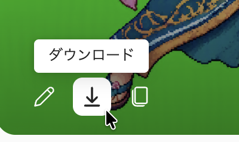{alt="Microsoft Edgeのアイコン" style="width: 82.00px;"}

このEdgeのアイコンをクリックして、Edgeのアプリを開きます。

この体験会では、M365 Copilotにサインイン済みのEdgeを事前に用意しています。
Edgeのアプリ内で、次の図のような「チャット | M365 Copilot」のタブを選択してください。

画面中央に「こんにちは。何かお手伝いできることはありますか？」と表示されていることを確認してください。

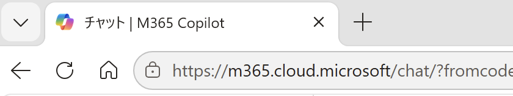{alt="EdgeでM365 Copilotのタブを選ぶ画面" style="width: 400px;"}

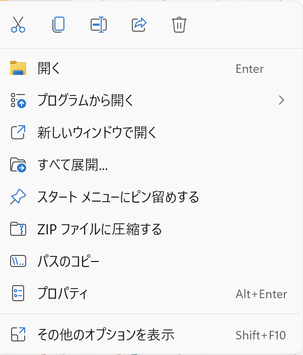{alt="M365 Copilotのチャット画面" style="width: 600px;"}

### 2.3.2 立ち絵の画像をアップロードする

M365 Copilotの画面中央に、「Copilotにメッセージを送信する」という入力欄が表示されていることを確認してください。
入力欄上の「＋」ボタンをクリック、「画像とファイルのアップロード」をクリックすることで、
画像ファイルをCopilotにアップロードできます。

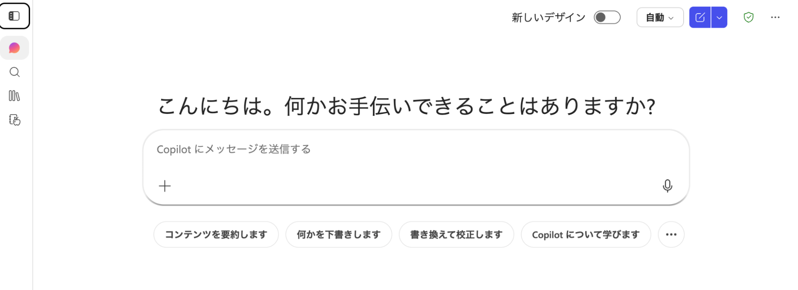{alt="Copilotの画像とファイルのアップロードメニュー" style="width: 400px;"}

配布資料の「master」フォルダ（立ち絵画像フォルダ）から、乙姫様の立ち絵の画像を選択し、Copilotにアップロードしてください。

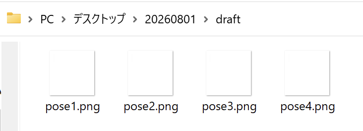{alt="masterフォルダからPrincess.pngを選ぶ画面" style="width: 300px;"}{alt="乙姫様の立ち絵" style="width: 228.50px;"}

※この乙姫様の画像は生成AI「ChatGPT Pro GPT-5.5」および「M365 Copilot」で作成しています。

### 2.3.3 棒人間の画像をアップロードする

ふたたび入力欄上の「＋」ボタンをクリック、「画像とファイルのアップロード」をクリックすることで、
画像ファイルをもう一枚Copilotにアップロードできます。
「drafts」フォルダに描いた棒人間画像のうち、いずれか1枚を選択し、アップロードしてください。

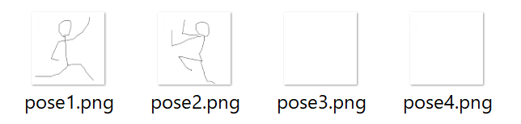{alt="draftsフォルダ内の棒人間画像" style="width: 300px;"}
{alt="アップロードする棒人間画像の例" style="width: 135.59px;"}

### 2.3.4 生成AIで立ち絵をポーズに変える

2つの画像ファイルがアップロードされていることを確認してください。
その上で、生成AIにしてもらいたい作業を日本語の文章にして、入力欄に書き込みます。
この体験会では、手順を簡単にするため、以下の「プロンプト例」の文面をコピーして、入力欄に貼り付けてください。

プロンプト例：

```text
添付した2つの画像のうち、立ち絵の画像「Princess」を、棒人間の画像「pose」で示したポーズに変えて
描き直した画像を作成してください。画像の背景は、#00FF00 の緑一色で塗りつぶしてください。
```

{alt="Copilotにプロンプトを入力した画面" style="width: 406.20px;"}

画面右下の「→」ボタンをクリックして、数分間待ってください。
次のように作業結果が表示されます。

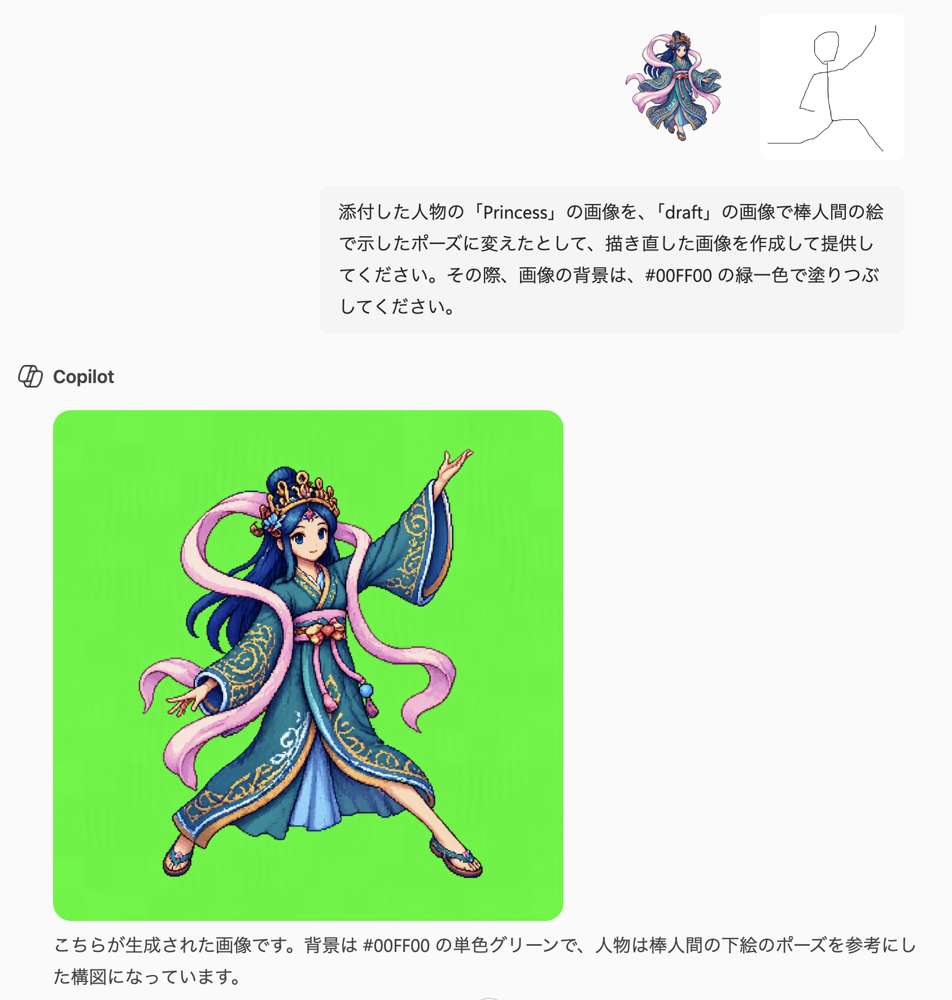{alt="Copilotが生成した乙姫様のポーズ画像" style="width: 444.60px;"}

**うまく動かないとき**

生成AIは、混雑やサービスの不具合で動かないことがあります。

その場合は、スタッフが別の方法や準備済みの画像を案内します。

失敗ではありませんので、すぐにスタッフを呼んでください。

### 2.3.5 立ち絵の背景を透明にする

生成された画像の背景は、緑色で塗りつぶされています。これを、背景が透明な画像に変換しましょう。
生成された画像をクリックすると、その右側に画像編集画面が表示されます。

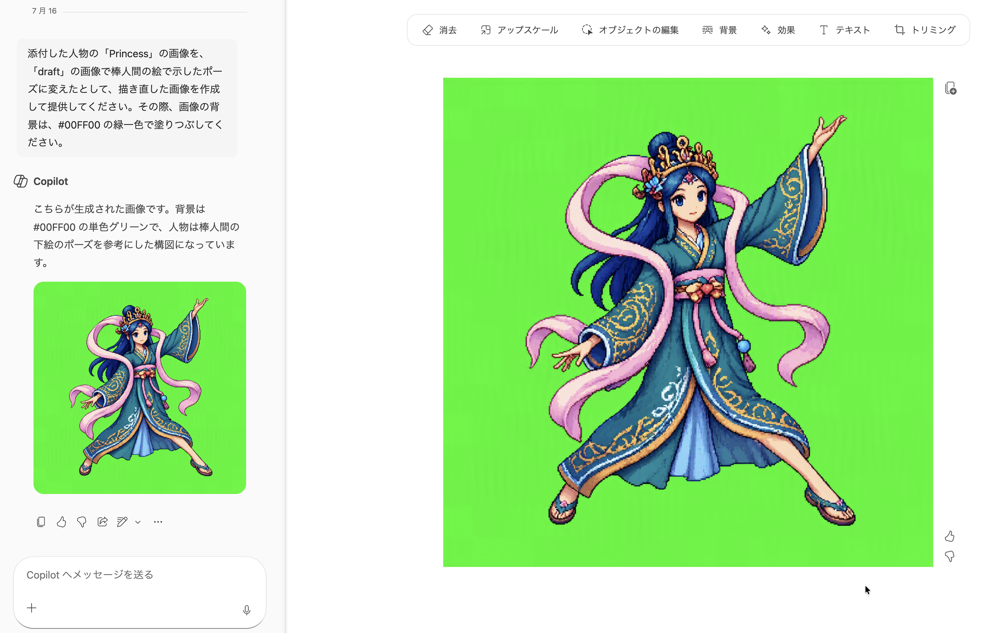{alt="Copilotの画像編集画面" style="width: 300.40px;"}

この画像編集画面の上部の「背景」ボタンをクリックすると、次のように「削除」「塗りつぶす」ボタンが表示されます。
ここでは、「削除」ボタンを押しましょう。

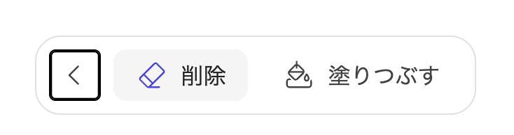{alt="画像編集画面の背景削除ボタン" style="width: 300px;"}

しばらく待つと、緑色だった背景が、白と灰色のチェック模様の背景に変化します。

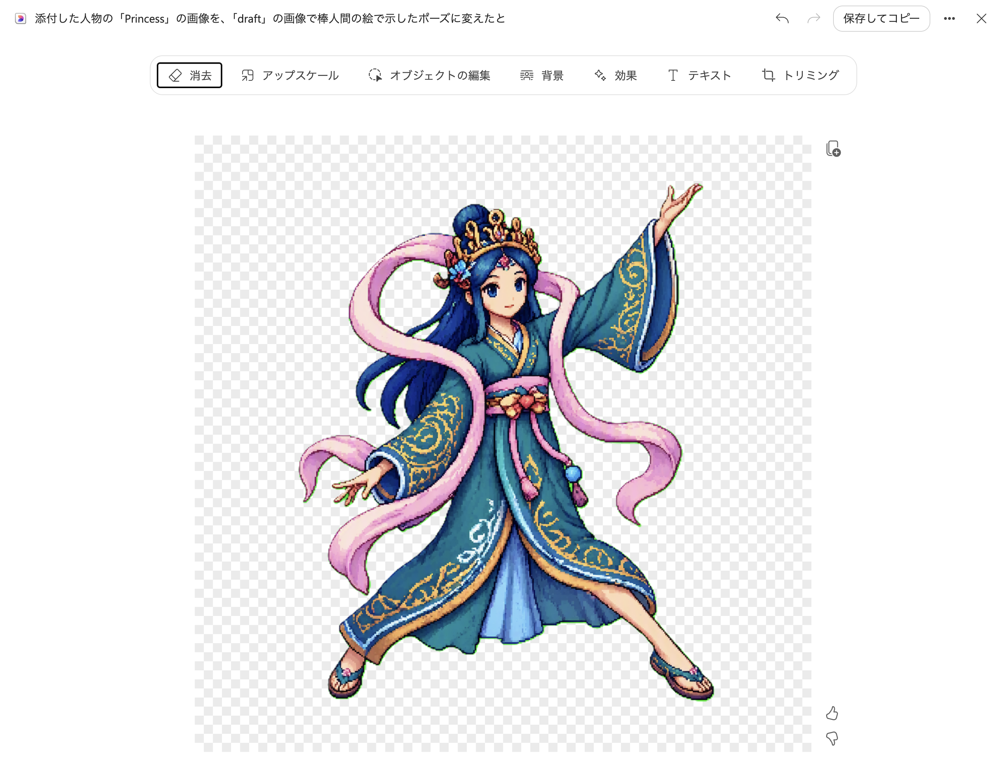{alt="背景が透明になった乙姫様の画像" style="width: 360.40px;"}

### 2.3.6 立ち絵をポーズに変えたものをダウンロードする

画面右上の「保存してコピー」ボタンをクリックしてください。

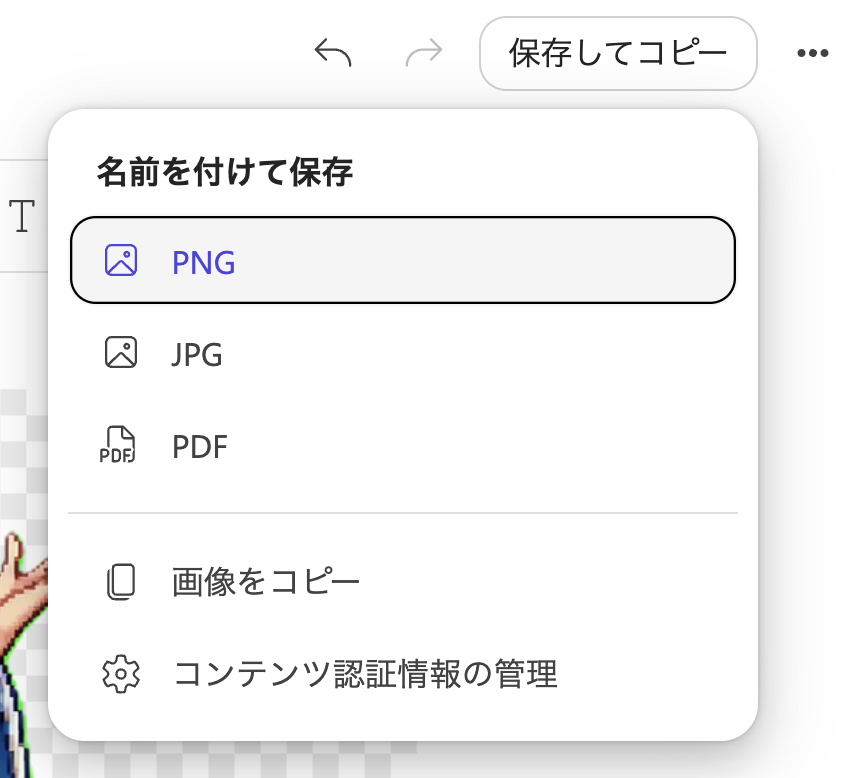{alt="画像編集画面の保存してコピーのボタン" style="width: 180.40px;"}

「名前をつけて保存」というメニューが表示されるので、その中から「PNG」をクリックしてください。

これにより、ポーズを変え、背景を透明にした乙姫様の画像が、
「ダウンロード」フォルダの中に、
「Designer.png」または「Designer(数字).png」というようなファイル名の画像ファイルとして保存されます。
「Designer(数字).png」の数字部分は、状況によって異なる値になります。

### 2.3.7 ポーズ画像ファイルをもっと作成する

ポーズ画像ファイルが作成できたことを確認したら、「2.3.2 立ち絵の画像をアップロードする」節に戻り、
あらかじめ計画していた、作成したいポーズの数だけ、作業を繰り返し行ってください。

次のポーズからは、「プロンプト例」の文面に、
「右目をウインクして」「口を大きく開けて笑った表情で」「両手でピースサインを出して」など、
細かい指定をする文を加えてみることにも、チャレンジしましょう。

## 2.4 ポーズ画像ファイルを配置する

前の節は、親子ペアのうち保護者に作業をしてもらいましたので、この節では、親子ペアのうち小学生に作業をしてもらいます。

### 2.4.1 ポーズ画像ファイルのファイル名を変更する

必要な数だけポーズを作成したら、「ダウンロード」フォルダの中を確認してみましょう。
デスクトップの一番下の中央付近に、次のようなアイコンが表示されています。
これはフォルダやファイルを表示したり操作したりする「エクスプローラー」というアプリを
起動するためのものです
（さきほど、デスクトップから「配布資料」フォルダをクリックしてもらったときなどにも、
この「エクスプローラー」が起動して使われていました）。

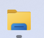{alt="エクスプローラーのアイコン" style="width: 70.00px;"}

この「エクスプローラー」のアイコンをクリックしてください。
「エクスプローラー」の画面左に表示されたフォルダの中から「ダウンロード」をクリックしてください。

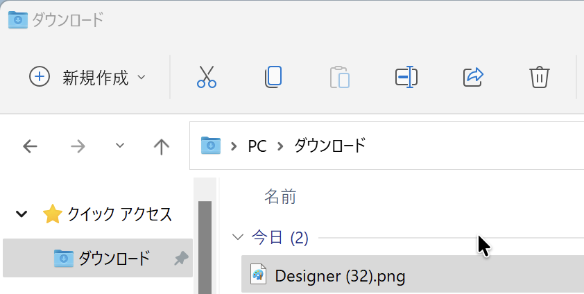{alt="エクスプローラーでダウンロードフォルダを選ぶ画面" style="width: 400.70px;"}

生成されたポーズ画像ファイルが保存されている様子が確認できます。

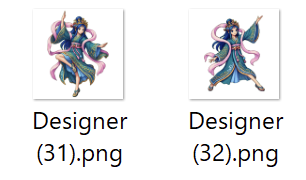{alt="ダウンロードフォルダ内の生成画像" style="width: 300.40px;"}

これらのファイルのひとつ（例：Designer(31).png）を右クリックして、表示されるメニュー下端にある「名前の変更」アイコン
（下図参照）をクリックしてください。

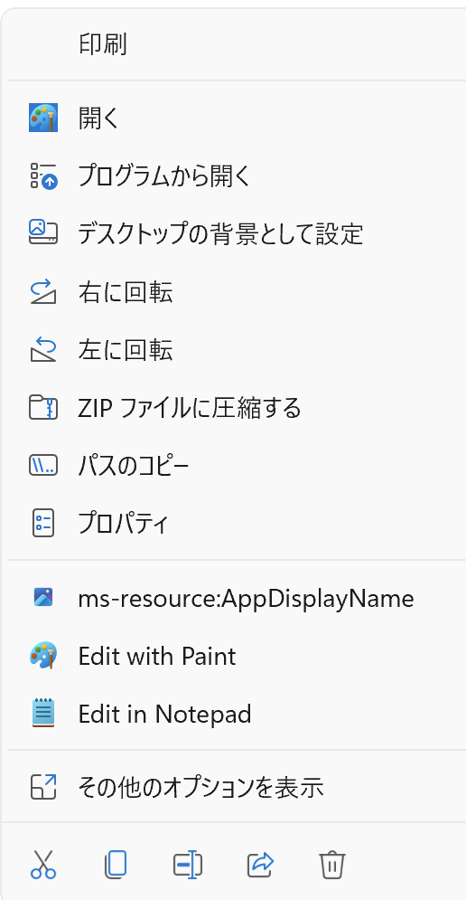{alt="画像ファイルの右クリックメニュー" style="width: 200.33px;"}
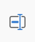{alt="名前の変更アイコン" style="width: 80.00px;"}

すると、アイコンの下に、ファイル名を入力できる状態になります。

このポーズが「1番目」であるならば、ファイル名を「p1.png」のように入力して、Enterキーを押すと、
ファイル名が変更されます。

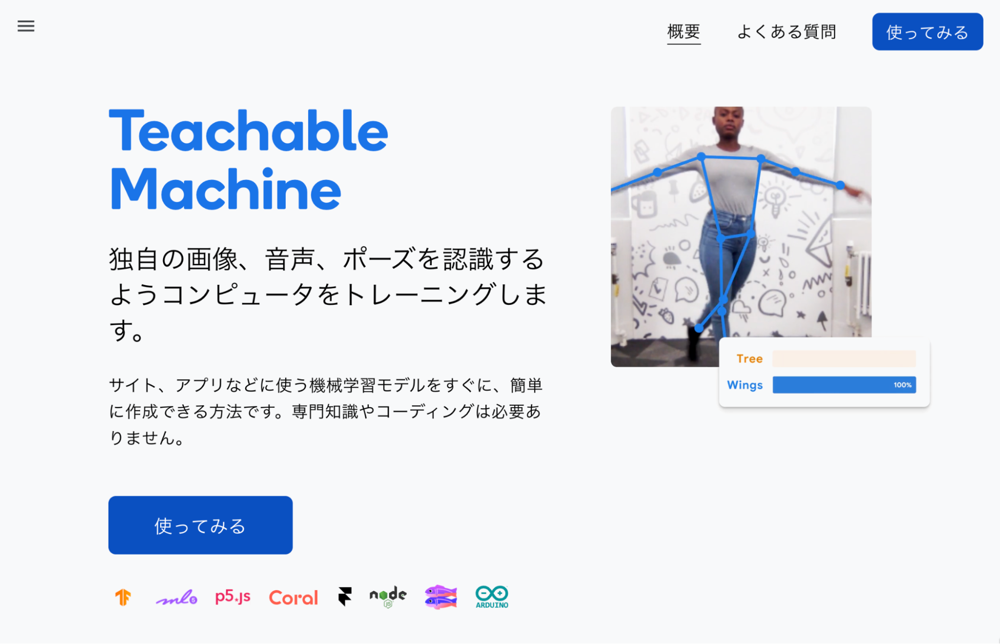{alt="変更前の画像ファイル名" style="width: 150.00px;"}
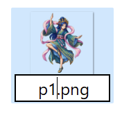{alt="p1.pngに変更した画像ファイル名" style="width: 150.00px;"}

作成したポーズの順番に応じて、さらに「p2.png」「p3.png」「p4.png」というように、
それぞれのファイルがポーズの番号を示したファイル名となるように変更してください。


> **⚠️ 注意**
>
> ファイル名は半角英数字で、「p1.png」のように設定してください。「.png」という拡張子は必ず残してください。拡張子が消えると、画像ファイルとして認識されなくなります。

これで、このポーズ画像に「正しい名前」をつけることができました。

### 2.4.2 ポーズ画像ファイルを移動させる

ファイル名を付け直した「p1.png」「p2.png」「p3.png」「p4.png」
のようなファイルは、 「ダウンロード」フォルダのような一時的な置き場所ではなく、
配布資料フォルダの中の「generated」へと移動させましょう。

1. 「ダウンロード」フォルダを開いた画面を、デスクトップの左のほうに置きます。
2. 配布資料フォルダの中の「generated」フォルダ（生成画像フォルダ）を開いて、デスクトップの右の方に置きます。
3. 「ダウンロード」のフォルダから、「generated」のフォルダへ、ファイルをドラッグ＆ドロップして移動させてください。この作業を、作成するポーズの数だけ繰り返してください（ファイルの複数選択のやり方がわかるのならば、一度に複数のファイルをドラッグ＆ドロップで移動させてもよいです）。

これにより、「generated」フォルダ内は次のようになります。

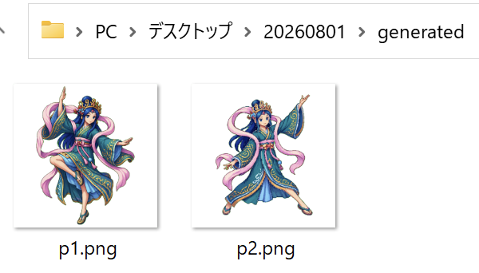{alt="generatedフォルダに移動したポーズ画像" style="width: 320px;"}

「p3.png」や「p4.png」を作成している場合には、
これらのファイルも同様に「generated」フォルダ内に移動させてください。

# 3. ポーズ画像を登録しよう

この章も、親子ペアのうち小学生に作業をしてもらいます。
ここでは、Scratchの拡張版である「TurboWarp」を使って、作成したポーズ画像を登録していきます。

## 3.1 TurboWarpでの作業を開始する

WebブラウザEdgeで、TurboWarpの編集画面として、次のリンクを開いてください。

[https://turbowarp.org/editor](https://turbowarp.org/editor)

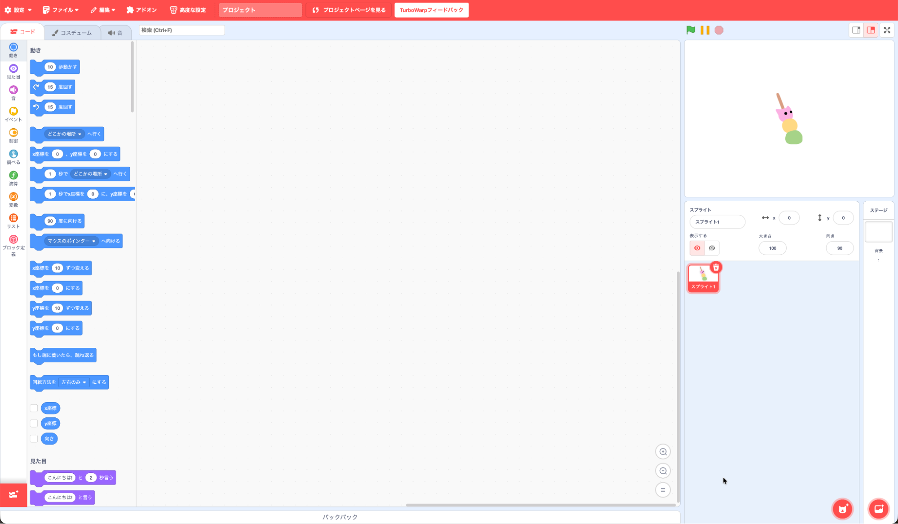{alt="TurboWarpのエディター画面" style="width: 601.70px;"}

## 3.2 TurboWarpでAI紙芝居アプリのプロジェクトを開く

画面左上の「ファイル」→「コンピュータから読み込む」をクリックして、配布資料フォルダ内の「stories」→「my-urashima」フォルダにある「my-urashima.sb3」を開きます。

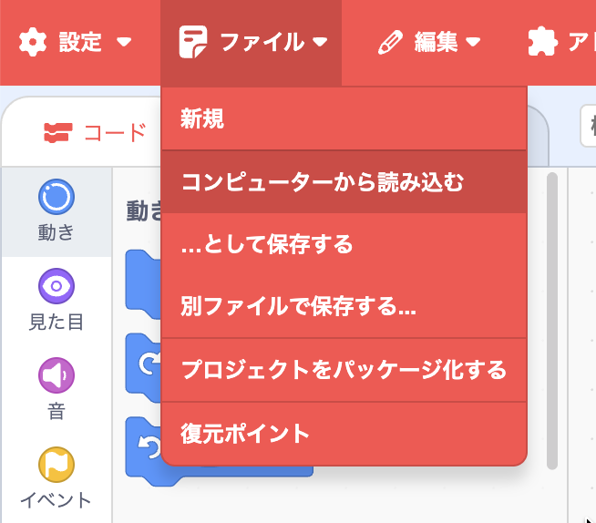{alt="TurboWarpのコンピュータから読み込むメニュー" style="width: 300px;"}

「拡張機能セキュリティ」として、
「Asset Manager」「TMPose」「Text Lines」「Runtime Expression」「Async Input」（順番は変化することがあります）
についての許可を求める画面が連続して計5回開きます。

これらの画面それぞれで次のような操作をしてください。
1. 「サンドボックスなしで実行する」にチェックを付けてください（チェック済みの場合があります）。
2. 「許可」ボタンをクリックしてください。

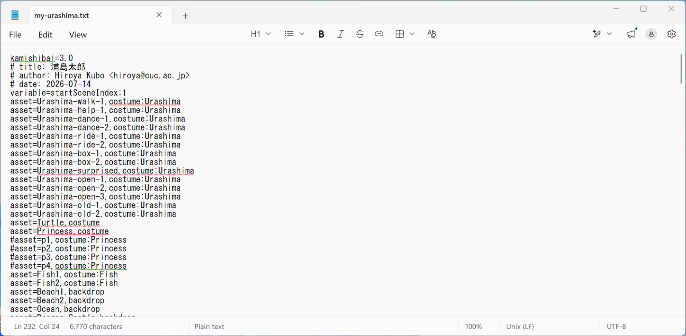{alt="TurboWarpの拡張機能セキュリティ画面" style="width: 230px;"}

> **⚠️ 注意**
>
> 「サンドボックスなしで実行する」にチェックを付けずに「許可」を押した場合は、ブラウザを再読み込みしてやり直してください。

## 3.3 ポーズ画像をコスチュームとして登録する

画面右のスプライト一覧画面から、「Princess」を選択してください。

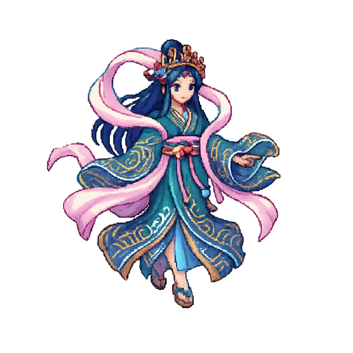{alt="TurboWarpのスプライト一覧でPrincessを選ぶ画面" style="width: 400px;"}

「Princess」を選択した後に、次に、画面左上の「コスチューム」を選んでください。

{alt="TurboWarpのコスチュームタブ" style="width: 400px;"}

次に、配布資料フォルダの「generated」フォルダ内に、2.3.9で整理して移動しておいた画像があります。これらを既存コスチューム「1 Princess 360x360」の下へドラッグ＆ドロップして読み込んでください。

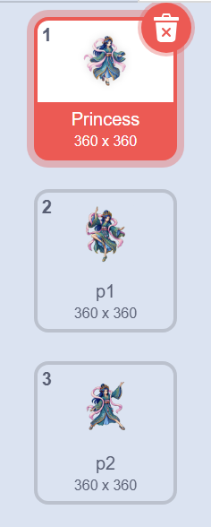{alt="Princessのコスチュームとして登録されたp1とp2" style="width: 160px;"}


ドラッグ＆ドロップ操作をうまく設定できたか確認しましょう。2番目以降に、「p1」「p2」（作成した場合は、さらに「p3」「p4」）の画像が表示されているのが確認できればOKです。

背景が緑色の画像が表示されているようならば、ドラッグ＆ドロップしたファイルを間違えていますので、間違えたファイルの右上の丸印のゴミ箱ボタンをクリックして削除してから、やり直してください。

## 3.4 描いた絵を確認する

「Princess」のスプライトの「コスチューム」として組み込まれているものをクリックすると、その絵が、TurboWarp画面上で拡大表示されるので、確認してください。

あなたの描いた乙姫様を、このタイミングで、近くの席の人たちとお互いに見せ合いましょう。

## 3.5 TurboWarpプロジェクトを保存する

TurboWarp画面上部の「ファイル」メニューから「my-urashima.sb3に保存する」をクリックして、現在までの編集内容をファイルに保存してください。

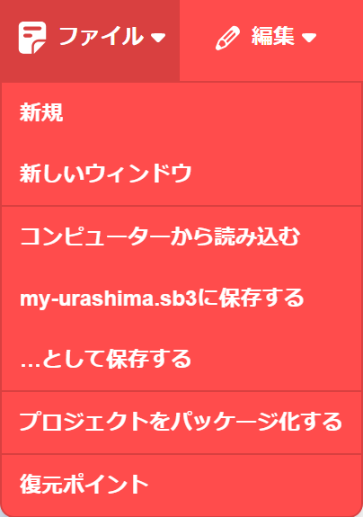{alt="TurboWarpのプロジェクト保存メニュー" style="width: 200px;"}

# 4. 休憩しよう

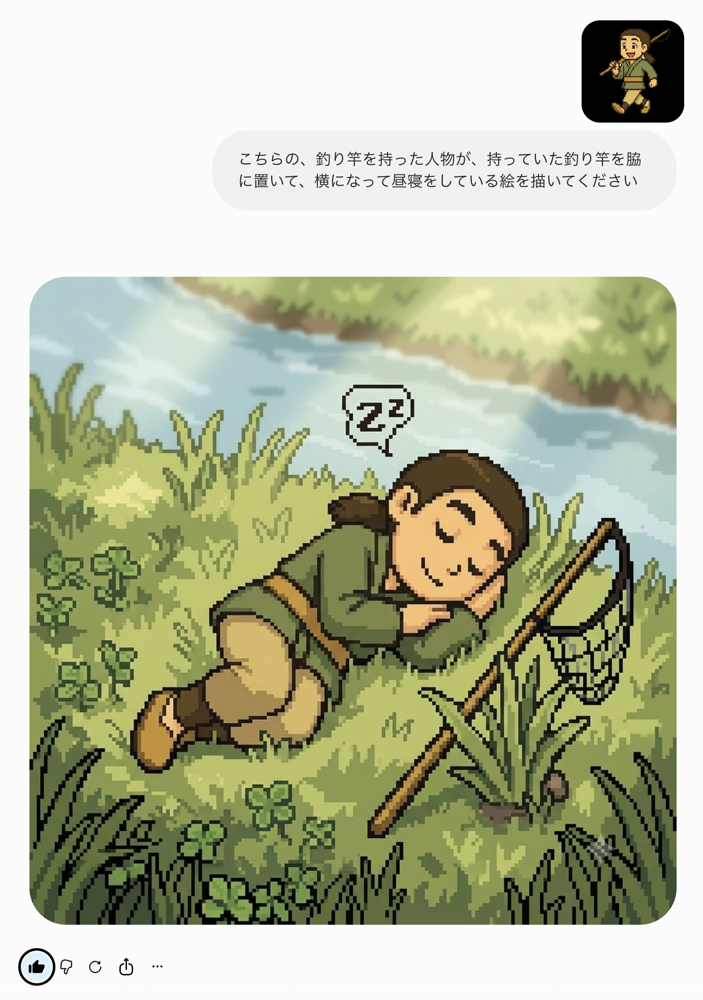{alt="休憩を案内するイラスト" style="width: 400px;"}

トイレに行っておきましょう。

水分補給をしましょう。

うまくいかないこと、わからないことがあれば、講師の先生やスタッフの人に質問をしましょう。

# 5. ポーズを認識するしくみを作ろう

ここからは、AIにポーズを覚えてもらいましょう。Googleが提供しているWebサービス「Teachable Machine」を使います。

Teachable MachineのWebサイトを開きましょう。これが、どのような仕組みで動作しているのか、どのように利用するのかを学ぶことができます。

[https://teachablemachine.withgoogle.com/](https://teachablemachine.withgoogle.com/)

{alt="Teachable Machineのトップページ" style="width: 601.70px;"}

## 5.1 Teachable Machineの「ポーズ」プロジェクトを開く

WebブラウザEdgeで、次のリンクから、Teachable Machineの「ポーズ」の画面を開いてください。
[https://teachablemachine.withgoogle.com/train/pose](https://teachablemachine.withgoogle.com/train/pose)

初回アクセス時には画面最下部に「OK, got it」が表示されるので、クリックしてください。
また「1. サンプルを収集する」の青枠での説明が表示されるので、右上にある「✖️」をクリックして閉じてください。

{alt="Teachable Machineのポーズプロジェクト画面" style="width: 593.50px;"}

## 5.2 クラスを用意する

AIに、複数のポーズを区別して覚えてもらうために、それぞれのポーズを表すための「クラス」というものを作成してください。
この体験会では、「クラス」とは、具体的な一つの「ポーズ」のことだと考えることにしましょう。

まずは、クラスのラベルとして「Class 1」と書かれているものを、ポーズ名「p1」に修正してください。

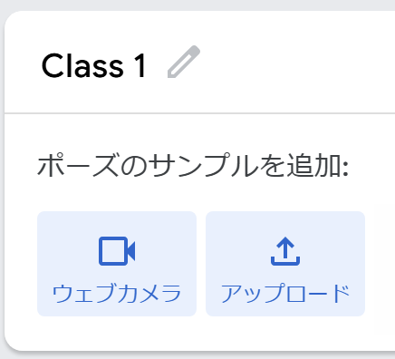{alt="Class 1という初期ラベル" style="width: 205px;"}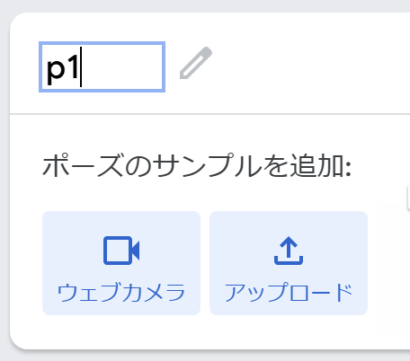{alt="p1に変更したラベル" style="width: 205px;"}

同様に、「Class 2」と書かれているものを「p2」に修正してください。

さらに、3つ以上のポーズを認識させたい場合には、画面下部の「＋ クラスを追加」をクリックしてクラスを追加してください。
それぞれのラベルを「p3」「p4」に変更してください。

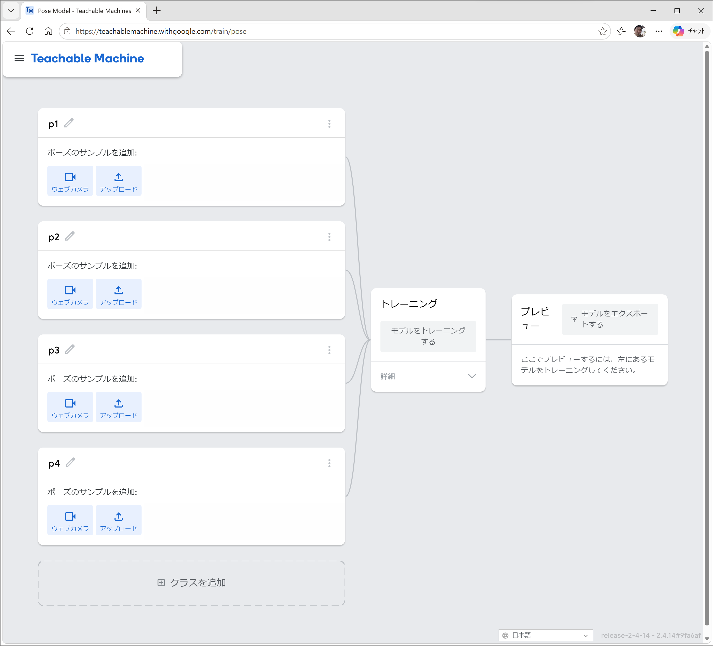{alt="p1からp4までのクラスを設定した画面" style="width: 570px;"}

> **⚠️注意**
>
> これらのラベルは半角英数字で、「p1」のように設定してください。

## 5.3 ポーズを撮影する

これから、カメラの前でポーズを取って、AIにポーズを覚えてもらうための画像を撮影しましょう。

### 5.3.1 ポーズを選んでその画像を表示する

* 先ほど作成した「棒人間の下書き」のメモ用紙と、デスクトップの配布資料フォルダの「generated」フォルダの中の「ポーズ画像」を確認しながら、どのようなポーズを取るのかを、親子で確認してください。
* そのうちひとつのポーズを選び、そのポーズ画像の名前が「p1」「p2」「p3」「p4」のうち、どの名前なのかを確認してください。
* その「ポーズ画像」のアイコンをダブルクリックして表示してください。
* そのポーズ画像の表示ウィンドウが画面の右側に配置されるようにしてください。 タイトルバーの「□」部分にマウスを重ねると、ウィンドウのレイアウトと位置を選択できます。

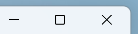{alt="タイトルバー部分での最大化の操作画面" style="width: 130px;"}
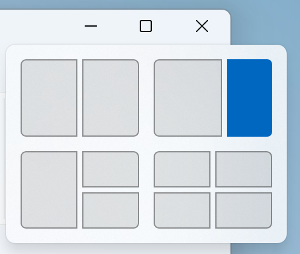{alt="ポーズ画像を右側に配置する操作画面" style="width: 130px;"}

### 5.3.2 作業用にデスクトップを整える

* Teachable Machineを表示しているEdgeのウィンドウを画面の左側に配置してください。
* デスクトップの左側に「Teachable Machine画面」が表示され、右側に「ポーズ画像」が配置されたことを確認してください。

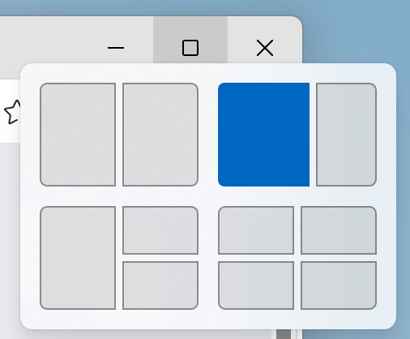{alt="ポーズ画像を左側に配置する操作画面" style="width: 130px;"}

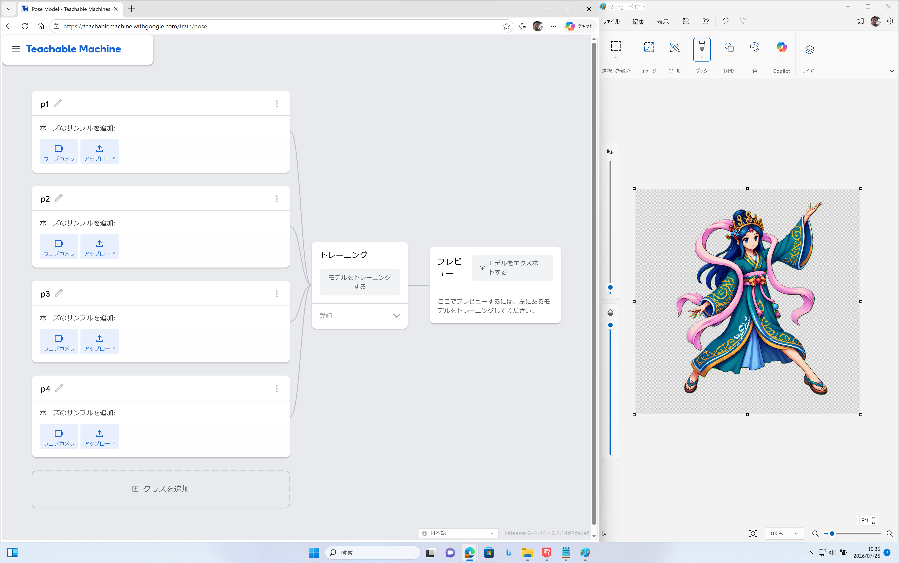{alt="左にTeachable Machine、右にポーズ画像を配置した画面" style="width: 570px;"}

### 5.3.3 ポーズの撮影を準備する

* 「5.3.1 ポーズを選んでその画像を表示する」節で選んだものと同じ名前のクラスを選んでください（例：「p1」）。
* そのクラスの「ウェブカメラ」ボタンを押してください。「Webcam」という小窓に、カメラのプレビュー中の映像が表示されるのを確認してください。
* 初回は、Edgeがカメラ利用の許可を求めてくるので「許可」ボタンをクリックしてください。

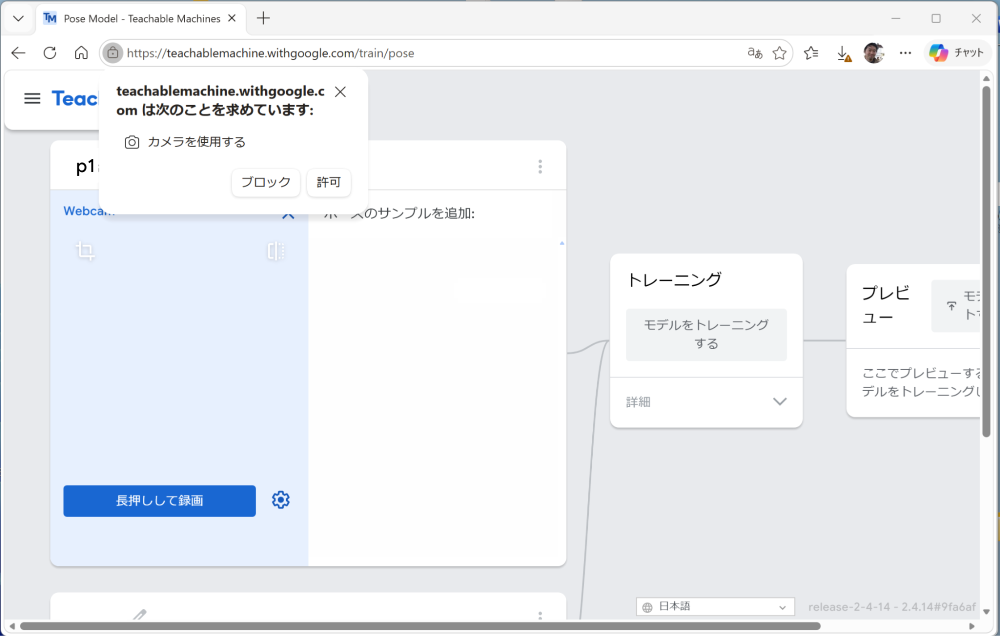{alt="Teachable Machineでウェブカメラを選ぶ画面" style="width: 578.50px;"}

「許可」の操作がうまくできなかった場合には、Edgeでこの画面を開き直し（再読み込み）をしてください。
「許可」ができた場合には、次のように、カメラのプレビュー映像が表示されます。

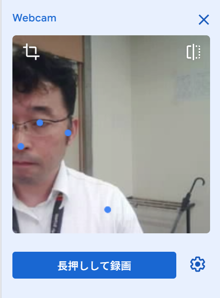{alt="Teachable Machineのウェブカメラプレビュー" style="width: 160px;"}

### 5.3.4 ポーズのサンプル画像を撮影する

1つのポーズごとに、5〜10枚の「サンプル」画像を撮影していきます。
まずは、実際にやってみましょう。

* 液晶ディスプレイとカメラを「1.1.1 教室内の座席に座るとき」節の図における「矢印」の方向に回転させてください。
* 小学生の方は、席を立ってウェブカメラの前に移動し、ポーズを取ってください。
* プレビュー画像の中では、ポーズを取っている人の姿勢をAIが認識した際に、「ボーン（骨）」と呼ばれる線が表示されます。 ボーンは人体を簡略化した関節のおおまかな位置を表す「丸」と骨を表す「線」で構成されます。
* 姿勢が正しく認識されなかった箇所については、ボーンの「丸」や「線」の表示が消えてしまっています。

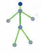{alt="Teachable Machineのボーン表示" style="width: 120px;"}

* 保護者の方は、(1) ポーズ画像とカメラのプレビュー映像とが同じ姿勢になっていること、(2) ボーンの「丸」や「線」が画像と重ね合わされて正しく表示されていることが、同時に達成されている瞬間を見計らって、声かけ・アドバイスをしながら「長押しして録画」ボタンを押し、「サンプル」の撮影をしてください。
* 撮影されたポーズの姿勢が崩れてしまっていたり、その際にボーンが認識されていなかったりしたサンプル画像は、削除してください。削除するには、サンプル画像上にマウスを重ねたときに表示される「ゴミ箱」ボタンを押してください。
* 1つのポーズごとに、微妙に姿勢を変えながら、5〜10枚を撮影して画像を用意してください。
* 他の親子が画像に写り込んでしまった場合には、その画像を削除してください。

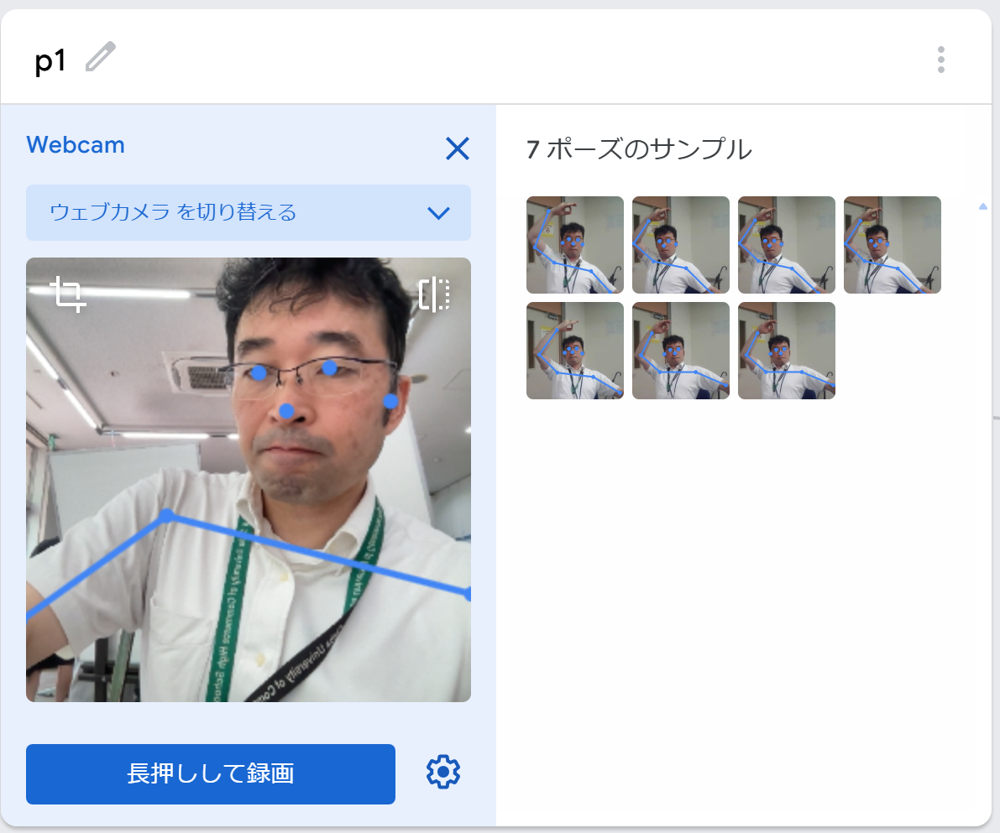{alt="撮影したポーズのサンプル画像" style="width: 350px;"}

Teachable Machineを用いて、
ポーズごとに整理された形で「サンプル」画像を撮影して保存することを、
「サンプルの収集」と呼びます。
サンプルを収集したものをもとに、あるクラスにどんな共通の特徴があるのか、
他のクラスとはどのような特徴の違いがあるのかについて、AIを「学習」させます。
このような「学習」を、ここでは「トレーニング」と呼んでいます。
そうして、AIがいろいろなものを識別できるように「トレーニング」した内容のことを、AIの「モデル」と呼びます。
この「モデル」を用いることで、AIは、いろいろなポーズを識別できるようになります。

「トレーニング」をするときに、1つのポーズについてのサンプル画像が少ない場合には、
覚える材料が不足しているため、性能の良いモデルが作れません。
サンプルの画像が、同じような画像ばかりでも、枚数を増やせたことにはなりません。
逆に、画像の枚数が多すぎると、トレーニングに時間がかかってしまいます。

どのようなサンプルを収集すれば、性能のよい「モデル」の「トレーニング」ができるでしょうか？
よりよい「学習」ができるでしょうか？　工夫しながら取り組んでください。

すべてのポーズについてサンプルの収集を終えたら、次の「5.4 モデルをトレーニングする」節に進んでください。

## 5.4 モデルをトレーニングする

サンプルを収集したものをもとに、AIにポーズを識別できるように「トレーニング」させましょう。

画面中央付近の「モデルをトレーニングする」のボタンをクリックし、しばらく待ってください（数分間かかる場合があります）。

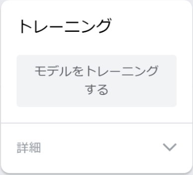{alt="モデルをトレーニングするボタン" style="width: 150px;"}
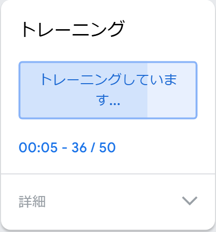{alt="モデルのトレーニング中の画面" style="width: 150px;"}

## 5.5 モデルを確認する

トレーニングが完了したら、AIによるポーズの識別がうまく動作するかどうかを確認しましょう。

小学生の方は、席を立ってウェブカメラの前に移動し、ポーズを取ってください。
「プレビュー」をクリックすると、カメラが起動し、撮影された人物のポーズに応じて、
トレーニング済みのAIが、どのポーズを認識したかを、棒グラフの長さで表示します。
棒グラフの長さが長いほど、AIがそのポーズを認識していることを意味します。

カメラの前で、わかりにくいポーズや、まぎらわしいポーズを取った場合には、AIが間違って認識することがあります。
また、もともとのポーズ画像の段階で、ポーズが区別しにくいものであった可能性もあります。
うまく認識できていない場合には「5.3 ポーズを撮影する」節に戻ってやり直してください。

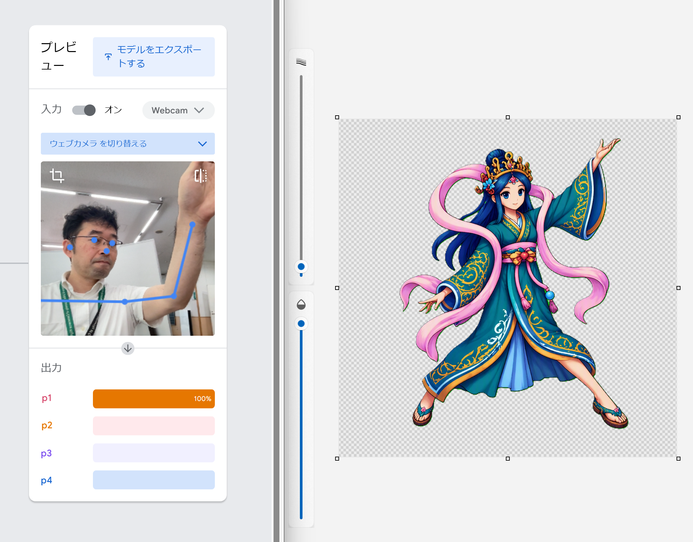{alt="トレーニングしたモデルを確認するプレビュー画面" style="width: 400px;"}

モデルのトレーニングはうまくいきましたか？
あとで、ポーズの再撮影やポーズの追加がしたくなったときのために、
プロジェクトを保存しておくことができます。

画面左上端のTeachable Machineのタイトルの左側にある「三」のアイコンをクリックして
表示されるメニューの中程の「プロジェクトをファイルとしてダウンロード」をクリックしてください。

{alt="Teachable Machineのプロジェクトダウンロードメニュー" style="width: 200.50px;"}

ダウンロードしたファイルは「ダウンロード」フォルダに「project.tm」という名前で保存されているので、
配布資料フォルダの中の「tmpose」フォルダに移動させておいてください。

このメニューの「ファイルからプロジェクトを開く」をクリックして、保存しておいた「project.tm」ファイルを選択することで、
必要な場合に、TeachableMachineでの作業を再開することができます。

## 5.6 モデルをクラウドにエクスポートする

次は、トレニーニングされたモデルを、AI紙芝居アプリで使えるようにしましょう。
ここでは、モデルをクラウドにエクスポートして共有可能にします。

* 「プレビュー」画面の「モデルをエクスポートする」のボタンをクリックしてください。

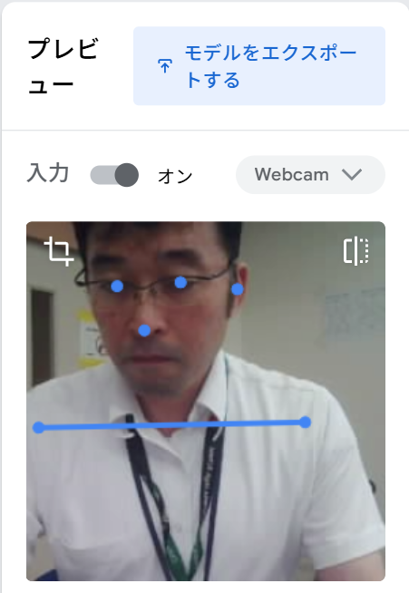{alt="モデルをエクスポートするボタン" style="width: 150.50px;"}

* 「モデルをエクスポートしてプロジェクトで使用する。」という画面が表示されます。
* この画面の「モデルをエクスポートする：」で、「アップロード（共有可能なリンク）」のラジオボタンが選択されていることを確認してください。
* 「モデルをアップロード」ボタンをクリックしてください。ここで少し待ちましょう（数十秒間）。

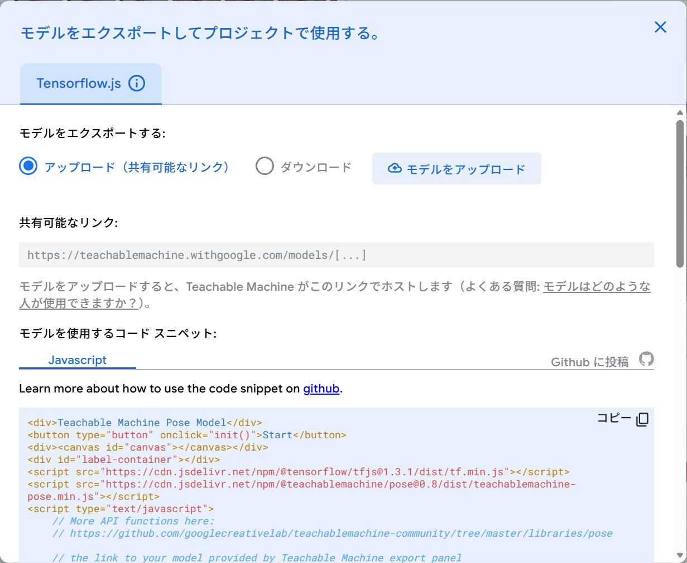{alt="モデルのアップロード設定画面" style="width: 500px;"}

それまで、「共有可能なリンク：」欄には、灰色の文字で\[...\]というようなダミーのリンク文字列が表示されていましたが、アップロードが完了すると、ここに、あなたのモデルのリンクが表示されます。
次の図のように、緑色の文字で「✔️ クラウドモデルは最新です」という表示が出たら、共有可能なリンクの作成は完了です。

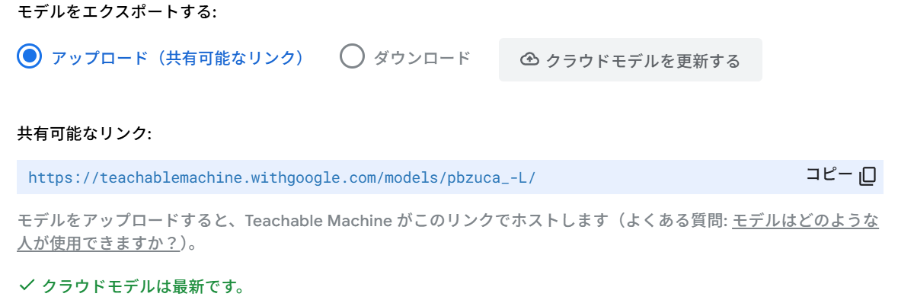{alt="モデルのアップロード完了画面" style="width: 500px;"}

* 「共有可能なリンク：」欄で、ここで作成したリンクが表示されているところの、いちばん右側の端の「コピー」を押してください。
* 「コピー」が「コピーしました」の表示に変化することを確認してください。

> **⚠️注意**
> * 保存したプロジェクトの中には、AIのトレーニングに用いるためのものとして撮影したサンプル画像が含まれています。サンプル画像には、個人情報などが含まれる場合がありますので、取り扱いには十分に注意してください。
> * エクスポートしたモデルは、サンプル画像の特徴だけを抽出したものとなっており、ここからサンプル画像を復元することはできません。そのため、エクスポートしたモデルを共有しても、サンプル画像に含まれている個人情報などが漏れることはありません。

# 6. 台本ファイルの修正をしよう

「参加型」AI紙芝居アプリは、
物語を記述した「台本ファイル」をもとに動作します。
ここでは、台本ファイルの修正方法について説明します。

## 6.1 台本ファイルの編集を開始する

配布資料フォルダ内の「stories」→「my-urashima」フォルダにある、紙芝居の台本ファイル「my-urashima.txt」
のアイコンの上で「右クリック」し、
表示されたメニューの中から「メモ帳で編集する」をクリックする、あるいは「プログラムから開く」を選択して「メモ帳」をクリックしてください。

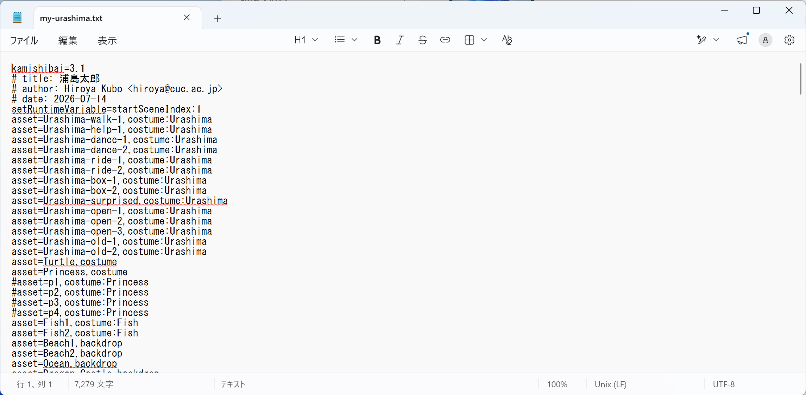{alt="メモ帳で開いたmy-urashima.txt" style="width: 601.70px;"}

台本ファイルの中では、行ごとに、台本を構成するさまざまな設定が記述されています。

行の1文字目に記号「`#`」がつけられていると、その行の設定は無効になります。

my-urashima.txtファイルでは、さまざまな状況に対応した設定候補を、行の1文字目に記号「`#`」をつけて、あらかじめ無効にした状態で並べています。

my-urashima.txtファイルを修正する際には、有効にしたい設定行の1文字目にある「`#`」を削除することで、設定をカスタマイズできます。

行が「---」という内容の場合は、物語のシーンの区切りを表しています。最初の「---」より前では、物語のすべてのシーンで共通して利用する「アセット」などを設定します。

## 6.2 モデルのURLを設定する

AI紙芝居アプリでは、それぞれのシーンで、カメラ画像から身体のポーズを認識して、
それに応じて物語を進めるという仕組みをつくることができます。
そのためには、5章で行ったように、事前にカメラの画像でポーズを撮影し、
Teachable Machineを使って、これを識別するためのAIモデルをトレーニングし、
その成果物であるモデルをクラウドにエクスポートして共有可能にしたものを使います。

ここでは、シーン3「竜宮城到着」のモデルのURLを修正します。
my-urashima.txt内の「`# scene 3`」という行を探し、その直下の「`TMPoseURL=`」で始まる行を見てください。
この台本では、もともとは、浦島太郎がダンスをするポーズを認識するモデルのURLが設定されています。

```
---
# scene 3
TMPoseURL=https://teachablemachine.withgoogle.com/models/…
```

それでは、これを、あなたが作った乙姫様のダンスのポーズを認識するように修正しましょう。
先ほどまでの流れでは、5.6節でリンクをコピーした状態となっているはずなので、
「`TMPoseURL=`」より後ろの部分にコピーした内容を貼り付け、既存の内容を
次のように書き換えてください。

```
---
# scene 3
TMPoseURL=https://teachablemachine.withgoogle.com/models/あなたのモデルのURLの末尾部分
```

> **確認**
>
> 間違った内容を貼り付けていないか、「=」などの記号を消していないかを確認してください。

## 6.3 アセットを設定する

ここでいう「アセット」とは、このAI紙芝居アプリにおける、背景画像、コスチューム画像、効果音、BGMなどの素材の総称です。
アセットを設定する行は「`asset=`」で始めます。カンマ区切りの1つ目の値がアセット名、2つ目の値がアセットのアドレスを表します。

my-urashima.txtファイルでは、「Princess」という名前のScratchスプライトにあるコスチュームを、アセットとして設定しています。

ここでは、「`asset=p1,costume:Princess`」という設定について説明します。

`asset=p1,costume:Princess`

| 設定行の部分 | 意味 |
| ----- | ----- |
| asset= | この行で「アセット」を設定することを宣言する |
| p1 | アセット名は「p1」であることを表します。 |
| , | 区切り文字「,」はアセット名には含むことができないルールとしており、アセット名の終端を表します。 |
| costume: | アセットのアクセス先は「costume:」であることを表します。 |
| Princess | コスチュームを探す際には「Princess」という名前のスプライトの中から、アセット名(p1)と同じ名前のコスチュームを探します。 |

それではここで、あなたが作成した乙姫様の画像をアセットとして設定しましょう。

アセットの設定を有効にするには、対象行の行頭にある「`#`」を削除します。これにより、「Princess」というスプライトから、アセット名と同じ名前のコスチューム画像を登録できます。

> **確認**
>
> 必要な行だけ、行頭の「`#`」を削除してください。

```
#asset=p1,costume:Princess
#asset=p2,costume:Princess
#asset=p3,costume:Princess
#asset=p4,costume:Princess
```

以下の6.3.1、6.3.2、6.3.3節は、場合ごとの設定内容を示したものです。このうち、いずれか1つの形で設定してください。

### 6.3.1 ポーズ2つを作成した場合の設定

「p1」をアセット名として、Princessというスプライト名の「p1」という名前のコスチューム画像を登録します。

「p2」をアセット名として、Princessというスプライト名の「p2」という名前のコスチューム画像を登録します。

```
asset=p1,costume:Princess
asset=p2,costume:Princess
#asset=p3,costume:Princess
#asset=p4,costume:Princess
```

### 6.3.2 ポーズ3つを作成した場合の設定

「p1」をアセット名として、Princessというスプライト名の「p1」という名前のコスチューム画像を登録します。

「p2」をアセット名として、Princessというスプライト名の「p2」という名前のコスチューム画像を登録します。

「p3」をアセット名として、Princessというスプライト名の「p3」という名前のコスチューム画像を登録します。

```
asset=p1,costume:Princess
asset=p2,costume:Princess
asset=p3,costume:Princess
#asset=p4,costume:Princess
```

### 6.3.3 ポーズ4つを作成した場合の設定

「p1」をアセット名として、Princessというスプライト名の「p1」という名前のコスチューム画像を登録します。

「p2」をアセット名として、Princessというスプライト名の「p2」という名前のコスチューム画像を登録します。

「p3」をアセット名として、Princessというスプライト名の「p3」という名前のコスチューム画像を登録します。

「p4」をアセット名として、Princessというスプライト名の「p4」という名前のコスチューム画像を登録します。

```
asset=p1,costume:Princess
asset=p2,costume:Princess
asset=p3,costume:Princess
asset=p4,costume:Princess
```

## 6.4 アクターのポーズを設定する

ここでいう「アクター」とは、このAI紙芝居に表示されるキャラクターの呼び名です。「浦島太郎」「亀」「乙姫様」などのすべてのキャラクターが「アクター」です。このAI紙芝居アプリでは、Scratchの標準的な用語・概念であるスプライトを直接使わず、「Actor」という英語名の特殊なスプライトをクローン（複製）し、スプライト変数「アクター名」で名前をつけて管理しています。

アクターは「アクション」を実行できます。台本ファイルの中で、行頭が「`action=アクター名:`」で始まる設定を「アクターアクション」と呼びます。

ここでは、「Princess」という名前のアクターに「pose」というアクションをさせる設定例を見てみましょう。

`action=Princess:pose:p1,p2,p1,p2:p1,p2,p1,p2:Drum Funky,Drum Funky,Drum Funky,...`

| 設定行の部分                               | 意味                                                                                         |
|--------------------------------------------|--------------------------------------------------------------------------------------------|
| action=                                    | この行は「アクション」を設定するものであることを宣言します                                                              |
| Princess:                                  | この行はアクター名「Princess」の「アクターアクション」であることを宣言します                                                 |
| pose:                                      | この行はアクターアクション「pose」を設定することを宣言します                                                           |
| p1,p2,p1,p2                                | スキンのアセット名をカンマ区切りで列挙します。この例では「p1」「p2」「p1」「p2」の順に、アクターの見た目を変化させます                            |
| p1,p2,p1,p2                                | Teachable Machineのポーズのクラス名（ポーズ名）をカンマ区切りで列挙します。この例ではp1,p2,p1,p2の順番でポーズを認識されます               |
| Drum Funky,Drum Funky,Drum Funky,Drum Funk | 効果音のアセット名をカンマ区切りで列挙します。この例では「Drum Funky」「Drum Funky」「Drum Funky」「Drum Funky」の順番で効果音が鳴らされます |

それでは、my-urashima.txtファイル内に並ぶ3つの「`#action=Princess:pose:`」行のうち、設定を有効にしたい行の行頭にある「`#`」を削除してください。

> **確認**
>
> 必要な行だけ、行頭の「`#`」を削除してください。

```
#action=Princess:pose:p1,p2,p1,p2:p1,p2,p1,p2:Drum Funky,Drum Funky,Drum Funky,...
#action=Princess:pose:p1,p2,p3,p1,p2,p3:p1,p2,p3,p1,p2,p3:Drum Funky,Drum Funky,...
#action=Princess:pose:p1,p2,p3,p4,p1,p2,p3,p4:p1,p2,p3,p4,p1,p2,p3,p4:Drum...
```

以下の6.4.1、6.4.2、6.4.3節は、場合ごとの設定内容を示したものです。このうち、いずれか1つの形で設定してください。

### 6.4.1 ポーズ2つを作成した場合の設定

3行のうち1行目、アセット名部分に「p1」「p2」が書かれている行の行頭の\#記号を削除してください。ここでは、p1,p2のポーズ2つが2回繰り返されます。

```
action=Princess:pose:p1,p2,p1,p2:p1,p2,p1,p2:Drum Funky,Drum Funky,Drum Funky,...
#action=Princess:pose:p1,p2,p3,p1,p2,p3:p1,p2,p3,p1,p2,p3:Drum Funky,Drum Funky,...
#action=Princess:pose:p1,p2,p3,p4,p1,p2,p3,p4:p1,p2,p3,p4,p1,p2,p3,p4:Drum...
```

### 6.4.2 ポーズ3つを作成した場合の設定

3行のうち2行目、アセット名部分に「p1」「p2」「p3」が書かれている行の行頭の\#記号を削除してください。ここでは、p1,p2,p3のポーズ3つが2回繰り返されます。

```
#action=Princess:pose:p1,p2,p1,p2:p1,p2,p1,p2:Drum Funky,Drum Funky,Drum Funky,...
action=Princess:pose:p1,p2,p3,p1,p2,p3:p1,p2,p3,p1,p2,p3:Drum Funky,Drum Funky,...
#action=Princess:pose:p1,p2,p3,p4,p1,p2,p3,p4:p1,p2,p3,p4,p1,p2,p3,p4:Drum...
```

### 6.4.3 ポーズ4つを作成した場合の設定

3行のうち3行目、アセット名部分に「p1」「p2」「p3」「p4」が書かれている行の行頭の\#記号を削除してください。ここでは、p1,p2,p3,p4のポーズ4つが2回繰り返されます。

```
#action=Princess:pose:p1,p2,p1,p2:p1,p2,p1,p2:Drum Funky,Drum Funky,Drum Funky,...
#action=Princess:pose:p1,p2,p3,p1,p2,p3:p1,p2,p3,p1,p2,p3:Drum Funky,Drum Funky,...
action=Princess:pose:p1,p2,p3,p4,p1,p2,p3,p4:p1,p2,p3,p4,p1,p2,p3,p4:Drum...
```

## 6.5 台本ファイルを保存する

メモ帳のメニューから「ファイル」→「保存」を実行し、my-urashima.txtファイルを保存してください。

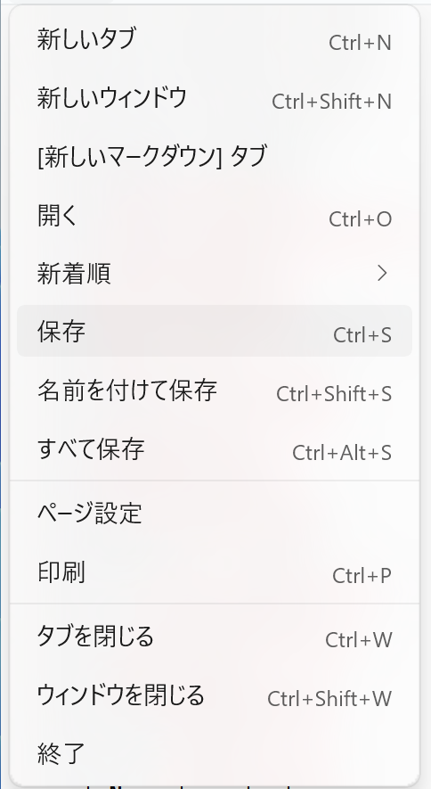{alt="メモ帳の保存メニュー" style="width: 120px;"}

## 6.6 動作に必要なファイルを確認する

1. WebブラウザEdgeを用いて、TurboWarpのエディターで、my-urashima.sb3ファイルが開かれていることを確認してください。
2. 配布資料フォルダ内の「stories」→「my-urashima」フォルダにある、紙芝居の台本ファイル「my-urashima.txt」を書き換えて存在したことを確認してください。

## 6.7 台本ファイルはプログラムだということを理解する

もし余裕があれば、この my-urashima.txt ファイルがどのような内容になっているか、 今回編集をした前後の部分などを詳しく調べてみてください。
こうした台本ファイルが、物語の流れに沿って、そのシーンごとの内容を制御する「プログラム」になっていることが読み取れるでしょう。
この「参加型」AI紙芝居アプリは、いろいろな台本ファイルを開くことで、そこに書かれたさまざまな物語を実行することができる、いわば「プログラム実行環境」なのです。

# 7. 動作確認しよう

ここまでで、AI紙芝居アプリの動作に必要なファイルの準備が整いました。実際にAI紙芝居アプリが正しく動作するかどうかを確認しましょう。

## 7.1 緑色の旗を押して開始する

1. WebブラウザEdgeで、[TurboWarpのエディター](https://turbowarp.org/editor)を開いているタブを表示してください。もし閉じてしまっている場合には、もういちど開いてください。
2. このTurboWarpにおいて、my-urashima.sb3ファイルが開かれた状態であることを確認してください。
3. 画面右上の、緑色の旗を押して、この「参加型」AI紙芝居アプリを実行してください。
4. 画面右上の「フルスクリーン」ボタン{alt="フルスクリーンボタン"}を押すと、全画面表示でアプリを実行できます。

{alt="AI紙芝居アプリのタイトル画面" style="width: 360.46px;"}

## 7.2 台本ファイルを開く

1. AI紙芝居アプリの実行が開始されたら、タイトル画面をクリックして次へ進んでください。
2. カメラの利用許可を求められた場合には「許可」をクリックしてください。
3. 「ファイルをひらく」をクリックするとファイル選択画面が開きます。
4. 配布資料フォルダ内の「stories」→「my-urashima」フォルダにある、紙芝居の台本ファイル「my-urashima.txt」を選択して読み込んでください。
5. 物語がスタートします。

## 7.3 早送りする

「スペースキー」や「右矢印キー」を押すと、物語を早送りできます。
物語を「シーン3：竜宮城到着」まで進めてください。

## 7.4 ポーズを認識させて物語を進める

ダンスのポーズに反応して乙姫様を踊らせることができるかどうかを確認してください。

## 7.5 物語の実行を停止・再開する

緑色の旗の右側にある黄色い縦棒2本は「一時停止」ボタンです。その右側にある赤い丸が「停止」ボタンです。
「停止」ボタンを押すと、アプリの実行が停止します。最初からやり直すためには、緑色の旗を押してください。

# 8. まとめ

## 8.1 みんなでプレイしよう

近くの席に座っている親子と交流して、それぞれが作った乙姫様のポーズでのダンスをプレイしてみてください。
どんなポーズを作ったのか、どんな動きになったのか、ぜひお互いに見せ合ってください。

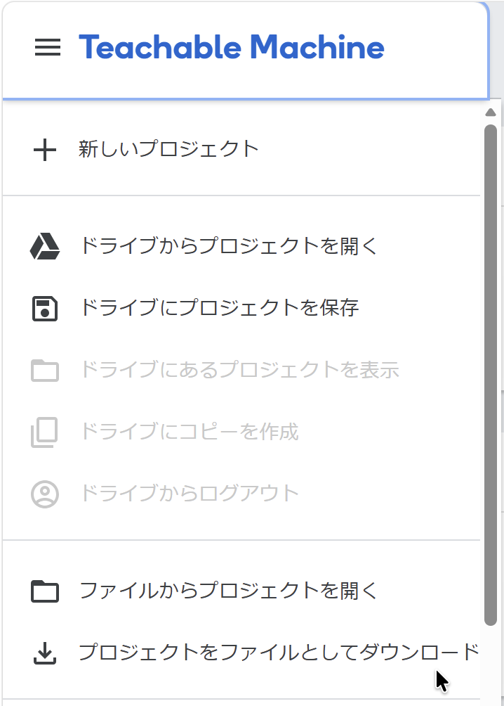{alt="親子でAI紙芝居をプレイする様子" style="width: 326.50px;"}

## 8.2 今日の体験会でみなさんが達成したこと

今日の体験会を通じて、みなさんは次のことを達成しました。

□ AIに絵を描いてもらった

□ AIにポーズを覚えさせた

□ 物語の台本（プログラム）を書き換えた

□ 自分だけの「参加型」AI紙芝居を完成させた


## 8.3 この体験会に参加してくれたみなさんへ

この体験会に参加してくれたみなさんは、
AIと人間が力を合わせて人を楽しませる作品をつくっていけるという未来が、
もう今ここまで来ているということを、感じたのではないでしょうか。

AIは日々、急激に進化をしています。 これからも新しい技術がどんどん登場してきます。
AIを使いこなすためには、みなさん自身が、AIの進化に合わせて、学び続ける必要があります。

ちなみに、この「参加型」AI紙芝居アプリには、本当は、もっと多くの機能があります。
今日の体験会で触れてもらったのは、そのうちの、ほんの一部だけなのです。
もしよかったら、家に帰ってからも、いろいろな機能を試してみてください。

そして、あなた自身で、新しい物語の台本ファイルを作り、それを他の人に渡して、あなたの物語に人々を「参加」してもらってみてください。

これからの、みなさんのチャレンジを、心から応援したいと思います。

## 8.4 お帰りになる前に

### 8.4.1 作成したファイルのお持ち帰り

今日の体験会で作成したファイルは、デスクトップの配布資料フォルダ「20260801」にまとめられています。
USBメモリを持参されている場合は、このフォルダごとコピーしてお持ち帰りください。

### 8.4.2 教室を出るとき

パソコンの中身やパソコンの周囲は、スタッフが片付けますので、そのままでOKです。

お忘れものがないか、机の上や下をよく確認してから、お帰りください。

## 8.5 アンケートのお願い

今日の体験会について、アンケートにご協力ください。

* アンケートは、保護者の方と小学生の方それぞれにご用意しています。
* アンケートは匿名で回答できます。個人情報の入力は不要です。
* 回答していただいた内容は、今後の研究、教材および体験会運営の改善のために利用させていただきます。
* それぞれのアンケートの回答の所要時間は3〜5分です。
* 2026年8月9日（日）までの回答をお願いいたします。

**保護者アンケート**

https://forms.gle/XsFyFndZs4wAreGe6

{alt="保護者アンケート" style="width: 90px;"}

**小学生用アンケート**

https://forms.gle/TDjzfb7tgDKVdYnG6

{alt="小学生用アンケート" style="width: 90px;"}
